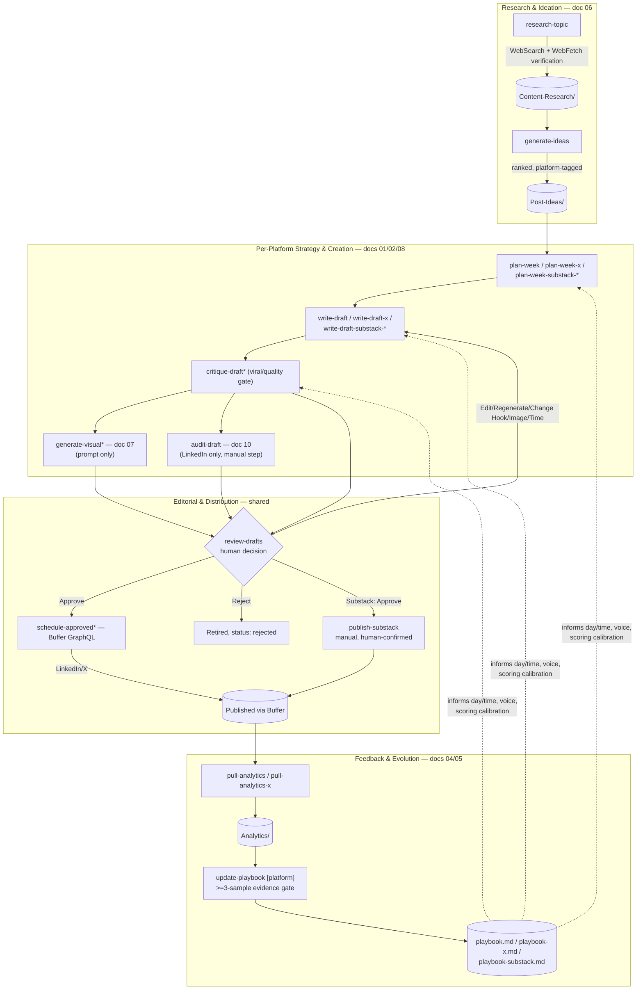

# LinkedIn Agentic AI — Workflow Documentation Index

## What this documentation set is

This is a complete, execution-order account of every feature in the LinkedIn Agentic AI system: what triggers it, which skill/agent handles each step, what tools/APIs it calls, what decisions it makes, what it reads and writes in the vault, and what happens when something fails. Each of the 13 documents below was produced by directly reading the real implementation — the `.claude/skills/*/SKILL.md` instruction files, `mcp-server/index.js`, the `_Templates/*.md` note schemas, the live `Content-Learnings/*.md` strategy files, and `REQUIREMENTS.md` — not by summarizing marketing copy. Where a document's account differs from how `README.md` or `REQUIREMENTS.md` describes something, that discrepancy is called out explicitly rather than smoothed over; see [§4](#4-known-gaps-inconsistencies--open-questions) for the consolidated list.

**The one fact that governs every document here:** there is no autonomous background execution anywhere in this system. Every stage, in every workflow, is triggered by a human typing a slash command in a Claude Code (or Antigravity) session — including the one-shot weekly orchestrators (`/generate-week`, `/generate-week-x`, `/generate-week-substack`), which are sequencing conveniences over the same skills, run within that same human-driven session, not independent agents running on their own. No content is ever published without an explicit human `Approve` action.

**How state is passed between stages:** there is no database, queue, or message bus. The vault itself is the memory. A note's `status` frontmatter field (and its folder location) is the sole handoff mechanism — a stage reads notes with a specific `status` from a specific folder, does its work, and writes a new `status`, which is what makes the note eligible for the next stage. Every document below documents this handoff explicitly, stage by stage.

## 1. Document index

| # | Document | Covers |
|---|---|---|
| 01 | [LinkedIn Post Creation and Scheduling](01-LinkedIn-Post-Creation-and-Scheduling.md) | The flagship pipeline: research → ideas → weekly plan → draft → critique/viral gate → visual → audit → human approval → Buffer scheduling → publish → analytics → playbook. Also documents `/review-drafts` (shared approval gate, canonical here) and `/generate-week`. |
| 02 | [X (Twitter) Post Creation and Scheduling](02-X-Post-Creation-and-Scheduling.md) | Same shape as 01, X-specific: single-post/thread decision, thread-cohesion scoring, `~5/week` cadence, `/generate-week-x`. |
| 03 | [LinkedIn Profile Optimization](03-LinkedIn-Profile-Optimization.md) | Standalone module: PDF + two job descriptions → evidence ledger → gap resolution → section-by-section rewrite → SEO/coherence passes → copy-ready profile + audit appendix. Not part of the posting pipeline. |
| 04 | [LinkedIn Analytics](04-LinkedIn-Analytics.md) | `/pull-analytics` (Buffer metrics pull) and `/update-playbook` (evidence-gated pattern mining into `playbook.md`). |
| 05 | [X Analytics](05-X-Analytics.md) | Same mechanism as 04, scoped to the X Buffer channel and `playbook-x.md`. |
| 06 | [Content Research](06-Content-Research.md) | `/research-topic` (Trend Scout) and `/generate-ideas` (Idea Engine) — the single shared research/idea pool feeding LinkedIn, X, and Substack. |
| 07 | [Visual Generation](07-Visual-Generation.md) | `/generate-visual` and `/generate-visual-substack-article` — prompt-only image briefs; no image-generation API exists in this repo. |
| 08 | [Substack Pipeline](08-Substack-Pipeline.md) | Articles (1/week, long-form) + Notes (~3/week, short-form), `/publish-substack`'s manual human-confirmed publish, `/generate-week-substack`. |
| 09 | [Story Bank and Hook Extraction](09-Story-Bank-and-Hook-Extraction.md) | `/interviewer` (Story Bank onboarding + Post Spines) and `/extract-hook` (hook-formula taxonomy). |
| 10 | [Quality, Safety and Originality Tools](10-Quality-Safety-and-Originality-Tools.md) | `/humanize-draft`, `/check-plagiarism`, and `/audit-draft` (the orchestrator that calls the other two via shared contracts). |
| 11 | [Repurposing](11-Repurposing.md) | `/repurpose-post` — tweet/thread, YouTube, blog, or newsletter → native LinkedIn draft. |
| 12 | [Engagement and Community Tools](12-Engagement-and-Community-Tools.md) | `/draft-comment`, `/draft-reply`, `/monitor-engagement` — manual-paste input, copy-ready output. |
| 13 | [Employee Advocacy](13-Employee-Advocacy.md) | `/plan-advocacy` — standalone team program-planning tool, self-reported metrics only. |

## 2. Shared building blocks (read once, referenced everywhere)

A small set of skills and mechanisms are reused across multiple feature docs. Each is documented in full in exactly one place and referenced by link elsewhere, to avoid 13 slightly-different retellings of the same mechanism:

- **Research/Idea pool** — one shared backlog (`/research-topic`, `/generate-ideas`) feeds every platform. Full detail: [doc 06](06-Content-Research.md). An `Idea Note`'s `platforms: []` field marks which platform(s) can draft from it; `platform_schedule: []` lets each platform carry its own assigned date independently.
- **Human approval gate** — `/review-drafts` presents every draft (LinkedIn, X, Substack Notes and Articles alike) for one of 7 decisions (Approve / Edit / Regenerate / Change Hook / Change Image / Change Time / Reject). Full detail: [doc 01, §4.8](01-LinkedIn-Post-Creation-and-Scheduling.md). This is the *only* skill allowed to set `status: approved`.
- **Visual briefs** — `/generate-visual` (single-image) and `/generate-visual-substack-article` (multi-image) produce a finished, paste-ready image-generation prompt. Full detail: [doc 07](07-Visual-Generation.md). No document in this set should describe visual generation as an automated image-rendering step — it isn't one.
- **Buffer GraphQL integration** — the only external publishing/analytics API in this system, implemented in [`mcp-server/index.js`](../../mcp-server/index.js): a `createPost` mutation (scheduling) and a `GetPostMetrics` query (analytics), each scoped by `channelId` to a specific platform. Never fabricates a post id or a metric on failure — a missing/lagging value is stored as `null`/`unavailable`, never defaulted to 0. Used by docs 01, 02, 04, 05.
- **Humanizer / Plagiarism shared contracts** — `/audit-draft` calls `/humanize-draft` and `/check-plagiarism` through a documented input/output contract rather than reimplementing their logic. Full detail: [doc 10](10-Quality-Safety-and-Originality-Tools.md).
- **Playbook feedback loop** — `/update-playbook` is one skill, parameterized per platform (`playbook.md` / `playbook-x.md` / `playbook-substack.md`), gated on ≥3 verified samples before writing any rule. Full mechanism: [doc 04](04-LinkedIn-Analytics.md); platform-specific notes in [doc 05](05-X-Analytics.md) and [doc 08](08-Substack-Pipeline.md).

## 3. System-wide architecture (from `README.md`, verified against the skills above)

Cross-cutting tools that sit outside this main loop, feeding it inputs or acting on its outputs, are documented separately: [Story Bank & Hook Extraction](09-Story-Bank-and-Hook-Extraction.md) feed voice/hook material into `write-draft`; [Repurposing](11-Repurposing.md) is an alternate entry point into the same LinkedIn drafting pipeline; [Engagement Tools](12-Engagement-and-Community-Tools.md) and [Employee Advocacy](13-Employee-Advocacy.md) are downstream of publishing but disconnected from the automated Buffer/analytics loop (manual paste in, copy-ready text or self-reported metrics out).

## 4. Known gaps, inconsistencies & open questions

These were surfaced while writing this documentation by reading the actual skill files side by side with `README.md`/`REQUIREMENTS.md` — they are real properties of the current implementation, not documentation errors being corrected here. Each is also called out inline in its source document.

**Coverage gaps in the automated path**
- `/audit-draft` (algorithm-compliance + AI-tell + plagiarism screening) is **not** invoked by `/generate-week`'s automated per-post subagent chain, which only runs `write-draft → critique-draft → generate-visual`. It's a manual step in the step-by-step path but silently skipped in the one-shot weekly path. — [doc 01](01-LinkedIn-Post-Creation-and-Scheduling.md)
- No skill re-runs `critique-draft` or `audit-draft` after `review-drafts`'s Edit / Regenerate / Change Hook actions, even though those actions change the text a prior viral score or audit annotation was based on. — [doc 01](01-LinkedIn-Post-Creation-and-Scheduling.md)
- There is no dedicated "Publishing" skill/stage. Buffer publishes autonomously at the scheduled time; the pipeline only detects the outcome retroactively, inside `pull-analytics`'s status-reconciliation step. — [doc 01](01-LinkedIn-Post-Creation-and-Scheduling.md), [doc 04](04-LinkedIn-Analytics.md)

**Unconfirmed / underspecified mechanics**
- X's Buffer thread-posting mutation was confirmed live once (2026-09-14) with a real scheduled post, but the thread array's item type was never named in Buffer's own docs — tweet objects are inlined rather than declared as a typed variable in the mutation. — [doc 02](02-X-Post-Creation-and-Scheduling.md)
- Whether `GetPostMetrics` on a threaded X post returns metrics for the first tweet only or an aggregate across the thread is not documented anywhere in the skill files or `mcp-server/index.js`. — [doc 05](05-X-Analytics.md)
- `mcp-server/index.js`'s `buffer_check_credentials` tool only checks `BUFFER_CHANNEL_ID` (LinkedIn's); X credential verification is handled purely in SKILL.md prose, not by that helper. — [doc 05](05-X-Analytics.md)
- `audit-draft/SKILL.md` never states what happens if its own WebSearch refresh of `algorithm-rules.md` fails mid-run when the file is already stale (>90 days). — [doc 10](10-Quality-Safety-and-Originality-Tools.md)

**Template/skill drift**
- `audit-draft` appends a `history: {action: audited, ...}` entry to a Draft Note, but `_Templates/Draft-Note.md`'s documented `history.action` enum doesn't list `audited`. — [doc 10](10-Quality-Safety-and-Originality-Tools.md)

**README/REQUIREMENTS vs. actual skill behavior**
- README's guardrail table attributes a 90-day dedup window and `content-index.md` usage directly to `generate-ideas`; the actual `generate-ideas/SKILL.md` text implements neither — the real two-tier duplicate split (genuine-duplicate auto-reject vs. similar-but-distinct lowered score) lives one stage downstream, inside `critique-draft`. — [doc 06](06-Content-Research.md)
- README's Skills-section cap ("~10-20 core items") is narrower than `optimize-profile/SKILL.md`'s and `Profile-Optimization-Spec.md`'s own stated range (15-25, up to ~35 for senior profiles). — [doc 03](03-LinkedIn-Profile-Optimization.md)
- The SEO rule is 2-3 mentions of a keyword **total** across its assigned sections, not 2-3 **per section**. — [doc 03](03-LinkedIn-Profile-Optimization.md)
- `hook-formulas.md` is consumed by `write-draft` (LinkedIn) and `plan-week` only — not by `write-draft-x`, `write-draft-substack-article`, or `write-draft-substack-note`, despite the taxonomy being described as shared across platforms. — [doc 09](09-Story-Bank-and-Hook-Extraction.md)
- README's Engagement & Community Tools section states none of these tools post or save anything, implying purely ephemeral chat output. `monitor-engagement` is the exception: it persists thread-watch state to `Engagement/<post-slug>--thread.md` and audience-ICP snapshots to `Engagement/<post-slug>--audience.md`, and appends confirmed classifications into `Content-Learnings/icp-map.md`. `draft-comment` and `draft-reply` are genuinely ephemeral; `monitor-engagement` is not. — [doc 12](12-Engagement-and-Community-Tools.md)
- `monitor-engagement`'s reply-watch workflow technically diffs the entire pasted thread for anything not-yet-logged, rather than being hard-scoped to "replies from the post's author" as README's summary phrases it. — [doc 12](12-Engagement-and-Community-Tools.md)

**Unhandled input edge cases**
- `optimize-profile` has no documented behavior for being given more or fewer than exactly two target job descriptions beyond the 0/1 failure cases. — [doc 03](03-LinkedIn-Profile-Optimization.md)
- `repurpose-post` has no defined recovery path if a source can't be reliably read and the user won't provide a manual paste — by the skill's own hard rules (never fabricate) the run simply stops at the input stage. — [doc 11](11-Repurposing.md)

## 5. Reading conventions used across all 13 documents

- **Trigger / Responsible skill / Input / Processing / Tools / Output / Handoff** is the recurring per-stage template — every stage in every document is broken down this way so the documents are comparable to each other.
- **LLM reasoning vs. deterministic tool call vs. live web research vs. human decision** is labeled explicitly at each step, since these have materially different failure modes and cost/latency profiles.
- Every skill file reference is a relative markdown link to the real `SKILL.md`, e.g. [`write-draft/SKILL.md`](../../.claude/skills/write-draft/SKILL.md) — these resolve from this folder.
- "Never fabricates X" statements throughout (post ids, metrics, source claims, plagiarism-clean verdicts) are direct callouts of this system's core anti-hallucination discipline, not editorializing — each traces to an explicit hard rule in the corresponding `SKILL.md` or `REQUIREMENTS.md`.
