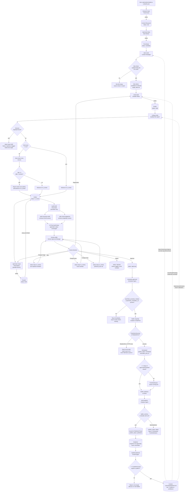

# LinkedIn Post Creation and Scheduling — End-to-End Workflow

## 1. Overview

This workflow produces a single artifact: one LinkedIn post, approved by a human and sent to Buffer for scheduled publication, with its post-publish performance eventually feeding back into how the next post is generated. It spans thirteen skills — each a prompt-driven instruction file at `.claude/skills/<name>/SKILL.md` — that a human invokes one at a time as slash commands in a Claude Code session (or as a chained sequence via the `/generate-week` orchestrator, itself still one human-driven session).

There is no autonomous background execution anywhere in this pipeline. Every stage is triggered by a human typing a slash command (or the orchestrator invoking skills/subagents on the human's behalf, within that same human-driven session). No draft reaches Buffer, and no post goes live, without an explicit human `Approve` action in [`review-drafts/SKILL.md`](.claude/skills/review-drafts/SKILL.md) — this is a hard requirement (REQUIREMENTS.md §8): "No auto-publish of newly generated content, ever, unless the user explicitly enables an autonomous mode later," and no such mode exists in this repo today.

The workflow is state-machine-driven through Obsidian markdown notes with YAML frontmatter — the vault itself is the memory. A note's `status` field (and its folder location) is the sole handoff mechanism between stages; there is no separate database, queue, or message bus. Each stage reads notes with a specific `status` value from a specific folder, does its work, and writes/updates notes with a new `status` value, which is what makes them eligible for the next stage.

## 2. Top-line flow chain

**Canonical stage chain (LinkedIn pipeline):**

```
User Request → Research (Trend Scout) → Idea Generation (Idea Ranker) →
Weekly Planning (Content Strategist) → Drafting (LinkedIn Writer) →
Critique / Viral Gate (Quality Critic) → Post Audit (algorithm+AI-tell+plagiarism screen) →
Human Approval (Approval Manager) → Scheduling (Buffer GraphQL) →
Publishing (Buffer, tracked via pull-analytics) → Analytics Pull →
Playbook Update (Growth Agent) → [feeds back into Weekly Planning / Drafting / Critique]
```

Visual generation ([`generate-visual/SKILL.md`](.claude/skills/generate-visual/SKILL.md)) is a parallel branch off the Critique stage, not strictly inline in the text chain above — it consumes the critiqued draft but produces a separate Visual-Brief-Note, which `review-drafts` surfaces alongside the draft rather than blocking on.

**Two entry points, same downstream pipeline:**

**(a) Manual step-by-step.** The human runs each skill in turn, inspecting output between steps:
```
/research-topic → /generate-ideas → /plan-week → /write-draft → /critique-draft →
/generate-visual → /audit-draft → /review-drafts → /schedule-approved →
/pull-analytics → /update-playbook
```
Any step can be re-run on a specific `draft-id`/`idea-id` in isolation, and the human can stop between any two steps to read the note in Obsidian before continuing.

**(b) One-shot `/generate-week` orchestrator.** A single invocation chains `/research-topic` → `/generate-ideas` → `/plan-week` once (to establish the week's slots), then for **each slot independently** spawns a fresh, isolated subagent that runs `/write-draft` → `/critique-draft` → `/generate-visual` end-to-end for that one post (with a built-in retry loop on duplicate detection, capped at 2 retries). Once every slot has been processed, it runs one **combined** `/review-drafts` session covering everything that reached `in_review`, then one `/schedule-approved` call for everything approved. See [§4.13](#413-generate-week-the-one-shot-weekly-orchestrator) for the full mechanics and how it differs from the manual path.

**Convergence:** both paths produce identical note shapes (Draft Notes at `status: in_review`, then `approved`, then Scheduled Notes) and both funnel through the same `/review-drafts` human gate and the same `/schedule-approved` Buffer call — `/generate-week` is a sequencing convenience over the same underlying skills, not a different pipeline. Note that `/audit-draft` is **not** wired into `/generate-week`'s automatic sequence (it's listed as a manual step in path (a) but not one of the three skills `/generate-week` step 2 tells each subagent to run) — see [§9](#9-failure-modes--recovery) for the implication.

## 3. Pipeline flowchart



## 4. Stage-by-stage breakdown

### 4.1 Trend / Research

- **Trigger:** `/research-topic [domain] [count]`, manual only. Also the first sub-step `/generate-week` runs automatically (with `count` forced to 8).
- **Responsible skill:** [`research-topic/SKILL.md`](.claude/skills/research-topic/SKILL.md)
- **Input:** No note input — starts from a live web scan. Reads existing `Content-Research/<pillar>/*.md` frontmatter (`topic`, `status`) only for the dedup check in step 2 of its process.
- **Processing:** Broad real-time scan across all 15 content pillars (AI, Career, Developer-Tools, GenAI, Machine-Learning, Deep-Learning, Interview-Preparation, Data-Analytics, Data-Engineering, Mathematics, Problem-Solving, Algorithms, Research-Papers, Psychology-AI, AI-Healthcare, plus cross-cutting Resources) unless a domain argument narrows it. For each committed topic, fetches full source pages (not just snippets), favoring primary sources. Verifies every factual claim traces to a fetched source — drops unverifiable claims rather than hedging them. Scores seven 0–10 dimensions (trend, relevance, freshness, authority, engagement_potential, originality, educational_value).
- **Tools/APIs used:** WebSearch (broad scan), WebFetch (full-page reads of primary sources), filesystem read (existing Research Notes for dedup) and write (new Research Note).
- **Classification:** Web-research call + LLM reasoning (topic discovery, scoring, verification judgment). Not a human decision, not a deterministic tool call.
- **Decision points/branches:** Dedup check — if a near-duplicate `status: new` note exists in the target pillar, either pick a substantially different angle or skip the topic. Never falls back to a generic "evergreen" topic just because one search pass found nothing — broadens search terms instead.
- **Output:** `Content-Research/<pillar>/YYYY-MM-DD--kebab-slug.md` from [`_Templates/Research-Note.md`](._Templates/Research-Note.md), `status: new`, with `sources[]` (only actually-fetched URLs, tagged `primary`/`secondary` and a confidence level).
- **Handoff:** Next stage (`/generate-ideas`) reads every `Content-Research/**/*.md` with `status: new` (explicitly excluding `placeholder` and `used`).
- **Human approval required?** No.
- **Failure/retry behavior:** If a claim can't be verified, it is dropped, never included with a hedge. If `trend_score >= 9` or a same-week time-sensitive announcement is found, sends one `PushNotification` per run (batched, not per-topic). Never invents a statistic when verification fails — this is a hard rule, not a soft preference.

### 4.2 Idea Generation

- **Trigger:** `/generate-ideas [domain-filter] [count]`, manual only, or `/generate-week` step 1.2 (default range).
- **Responsible skill:** [`generate-ideas/SKILL.md`](.claude/skills/generate-ideas/SKILL.md)
- **Input:** `Content-Research/**/*.md` frontmatter with `status: new` (excludes `placeholder`, `used`). Also scans `Post-Ideas/*.md` for dedup.
- **Processing:** For each eligible research note, generates one Idea Note (or synthesizes two closely-related notes into one comparison idea, only when clearly stronger — never forced for count). Fields: `topic`, `angle`, `why_it_matters`, `target_audience`, `format`, `hook`, `estimated_engagement`, `suggested_visual`, `category`, `content_type`, `sources`, `target_week` left blank. Scores `rank_score` as the average of 5 factors (hook strength, educational/practical value, audience fit, non-repetition/freshness, format-content fit) — explicitly noted as a static formula pending future learned weights once analytics exist.
- **Tools/APIs used:** Filesystem read (Research Notes, existing Idea Notes for dedup) and write (new Idea Notes, plus updates to source Research Notes' `used_in[]`/`status`).
- **Classification:** LLM reasoning (idea synthesis, scoring) + deterministic bookkeeping (flipping research-note status).
- **Decision points/branches:** Target range 10–20 is a ceiling, not a quota — generates fewer if the backlog doesn't support more, and says so plainly rather than padding. Dedup: near-duplicate idea → materially different angle or skip.
- **Output:** `Post-Ideas/YYYY-MM-DD--kebab-slug.md` from [`_Templates/Idea-Note.md`](._Templates/Idea-Note.md), `status: candidate`.
- **Handoff:** Every research note consumed has `status` flipped `new → used` and its `used_in[]` updated (this is what makes future `/research-topic` dedup checks work). Next stage (`/plan-week`) reads `Post-Ideas/*.md` with `status: candidate`.
- **Human approval required?** No.
- **Failure/retry behavior:** If the eligible-research pool is thin/skewed toward one category, the report says so plainly rather than papering over it — this is a signal more `/research-topic` runs are needed.

### 4.3 Weekly Planning

- **Trigger:** `/plan-week [week] [target_count]`, manual only, or `/generate-week` step 1.3.
- **Responsible skill:** [`plan-week/SKILL.md`](.claude/skills/plan-week/SKILL.md)
- **Input:** `Post-Ideas/*.md` with `status: candidate`; `Content-Learnings/content-index.md` (fast fatigue-check index, falls back to reading `Drafts/`/`Scheduled/`/`Published-Posts/` directly if absent/thin); `Content-Learnings/playbook.md` (day/time override evidence); `Content-Learnings/hook-formulas.md` (`status: canonical` rows only); `Content-Learnings/comment-targets.md`.
- **Processing:** Picks days (default heuristic **Tue/Thu/Sat**, trimmed to `target_count`, overridden by playbook evidence with ≥3 published posts). Matches ideas to slots by category/content_type fit and `rank_score`, enforcing at least 2 distinct categories/content-types across filled slots — never forces a mismatched idea into a slot. For each **filled** slot only: assigns a canonical hook formula (goal-fit + two-tier anti-repetition check against this week's own picks and recent `content-index.md` history), a posting time (§11 default table, or playbook override), and 2–3 comment targets (from `comment-targets.md`, falling back to research-cited accounts, or explicitly left blank with a stated reason).
- **Tools/APIs used:** Filesystem read/write only (no web search in this stage).
- **Classification:** LLM reasoning (slot-to-idea matching, hook-formula fit judgment) + deterministic frontmatter mutation.
- **Decision points/branches:** `target_count` default 3, ceiling not quota — genuinely unfillable slots stay empty with a stated reason, shown in the calendar table itself, never hidden or padded. Sunday excluded unless explicitly requested. Hook-formula/comment-target scarcity is never a reason to fill a slot that doesn't clear the quality bar.
- **Output:** Updates selected Idea Notes' frontmatter (`status: candidate → selected`, `target_week`, `target_date`) plus a rendered Mon–Sun calendar report (not a persisted note itself — the state lives on the Idea Notes).
- **Handoff:** Next stage (`/write-draft`) reads Idea Notes with `status: selected`.
- **Human approval required?** No (this is planning/selection, not content approval).
- **Failure/retry behavior:** Fewer than `target_count` slots filled because the pool doesn't support more distinct angles is the explicitly correct, non-apologetic outcome per REQUIREMENTS.md §5.

### 4.4 Drafting

- **Trigger:** `/write-draft [idea-id] [--spine <id>] [--goal <goal>] [--founders]`, manual only, or invoked by a `/generate-week` per-post subagent, or re-invoked by `/review-drafts`'s **Regenerate** action.
- **Responsible skill:** [`write-draft/SKILL.md`](.claude/skills/write-draft/SKILL.md)
- **Input:** Default path — one `status: selected` Idea Note plus every research note in its `sources[]`. Alternate path (`--spine`) — a Post Spine row from `Content-Learnings/story-bank.md`. Also reads `Content-Learnings/voice-guide.md` (fresh every run), `Content-Learnings/playbook.md` (evidenced length/hook/hashtag overrides), `Content-Learnings/hook-formulas.md` (`canonical` rows only), and — for Career/Interview Prep categories or `--founders` — `Content-Learnings/founders-angle-library.md`.
- **Processing:** Determines engagement goal (`--goal` > idea's own goal field > playbook-evidenced pattern > default `comments`). Selects a canonical hook formula matching the goal, preferring one not used in the last ~5 drafts. Optionally applies a founders angle only if a real Story Bank match exists (never a half-filled template). Drafts hook → body → optional closing question (or the founders-angle template structure if used), keeping opinion framed explicitly as opinion versus sourced fact stated with sourced confidence. Length target ~1,200–1,500 characters. 3–5 topic-tied hashtags.
- **Tools/APIs used:** Filesystem read (Idea Note, Research Notes, voice/playbook/hook-formula/founders-angle files) and write (new Draft Note; flips idea `status: selected → drafted` on the idea path).
- **Classification:** LLM reasoning (drafting, hook selection, fact-grounding), no web calls.
- **Decision points/branches:** Founders angle: real Story Bank fit found → used and cited; no fit → dropped silently in the text but called out explicitly in the report. Hook formula: goal-mismatch alone isn't disqualifying, but a mechanic mismatch is.
- **Output:** `Drafts/YYYY-MM-DD--kebab-slug.md` from [`_Templates/Draft-Note.md`](._Templates/Draft-Note.md), `status: draft`, `viral_score: 0`, `visual_ids: []`, `hook_formula`, `engagement_goal`, `founders_angle` fields populated as applicable, `history: [{action: created, ...}]`.
- **Handoff:** Next stage (`/critique-draft`) reads Draft Notes with `status: draft`.
- **Human approval required?** No — explicitly labeled "pre-approval content" in the skill's own report-back instructions.
- **Failure/retry behavior:** Never invents a fact/statistic/quote not present in the linked research (idea path) or cited Story Bank rows (spine path) — softens the claim instead. Never drafts an idea that isn't `status: selected`.

### 4.5 Critique / Viral Gate

- **Trigger:** `/critique-draft [draft-id]`, manual, or the per-post `/generate-week` subagent, or automatically re-run after **Regenerate** in `/review-drafts` (which re-invokes `/write-draft`, but note: `/review-drafts` itself does not automatically re-run `/critique-draft` after Regenerate — see §9).
- **Responsible skill:** [`critique-draft/SKILL.md`](.claude/skills/critique-draft/SKILL.md)
- **Input:** One or every Draft Note at `status: draft`. Re-reads the draft's `sources[]` research notes for accuracy re-verification. Reads `Content-Learnings/content-index.md` (or falls back to folders) and `Content-Learnings/playbook.md`'s Topic Fatigue Watch for duplicate/fatigue checks.
- **Processing:** (1) Re-verifies every factual claim still traces to source research, fixing drift immediately rather than just flagging it. (2) Duplicate/fatigue check across seven dimensions (topic, hook, structure, examples, conclusion, image concept, category/format) — draws a hard line between "genuine duplicate" (same underlying story/hook/example/conclusion) and "merely similar." (3) If a genuine duplicate: **stops entirely**, skips scoring, keeps `status: draft`, logs `duplicate_flagged` in history. (4) Otherwise scores Viral Potential as the average of 8 factors (hook strength, topic freshness, audience relevance, educational value, shareability, originality, credibility, historical-performance — the last one scored neutral 5 with an explicit "no data yet" note if no playbook evidence exists, never fabricated). (5) If score < 6, exactly one auto-revision pass targeting the specific weak factors, then rescore — never loops a second time. (6) Sets `status: in_review` (unless step 3 fired).
- **Tools/APIs used:** Filesystem read/write only.
- **Classification:** LLM reasoning (accuracy re-check, duplicate judgment, scoring, targeted revision).
- **Decision points/branches:** **Genuine duplicate gate** — hard stop, never advances to `in_review`. **Viral score < 6.0 gate** — triggers exactly one auto-revision, not a loop; if still <6 after that one pass, advances to `in_review` anyway but the report says so plainly (this is a soft/informational gate for the human reviewer, not a hard block — confirmed by the skill text: "if it's still below 6 after one revision, say so plainly in the report rather than repeatedly regenerating," and the note still gets `status: in_review`).
- **Output:** Draft Note updated in place: `viral_score` set, `## Critic Notes` section appended (per-factor breakdown, duplicate findings, revision notes if any), `status: draft → in_review` (or stays `draft` with `duplicate_flagged` history entry).
- **Handoff:** Next stages (`/generate-visual`, `/audit-draft`, `/review-drafts`) read Draft Notes at `status: in_review`. A duplicate-flagged draft stuck at `status: draft` is not picked up by any of them — it needs a new angle and a re-run of this skill.
- **Human approval required?** No (this stage itself; but its output is what the human sees at `/review-drafts`).
- **Failure/retry behavior:** Duplicate flag = the draft's idea needs replacing before this skill can run on it again (not fixable by rewording). After a batch run that moves drafts to `in_review`, sends one batched `PushNotification` ("N LinkedIn drafts ready for your review").

### 4.6 Visual Brief

- **Trigger:** `/generate-visual [draft-id]`, manual, the per-post `/generate-week` subagent, or `/review-drafts`'s **Change Image** action.
- **Responsible skill:** [`generate-visual/SKILL.md`](.claude/skills/generate-visual/SKILL.md)
- **Input:** The draft's full `## Post Text` and its idea's `suggested_visual` seed (if any). Checks `Content-Learnings/content-index.md`'s `visual_format`/`image_concept` columns (or recent `Visuals/` notes) to avoid repeating the last format used.
- **Processing:** Judges whether a visual is warranted at all (must support the point, not decorate — may legitimately produce nothing). Reasons freshly about what visual concept fits *this* post (comparison → two-column diagram, personal opinion → quote card, technical breakdown → architecture diagram, etc.), explicitly avoiding reuse of the prior visual's format without deliberate justification. Optionally runs WebSearch for current design/visual trends relevant to the concept, skipped when the concept is simple enough that trend research wouldn't change the outcome. Writes a full brief plus one finished, paste-ready image-generation prompt for ChatGPT Images (subject, composition, lighting, color, exact in-image text, target aspect ratio mapped to platform-appropriate dimensions).
- **Tools/APIs used:** WebSearch (conditional), filesystem read/write. **No image-generation API is called** — by explicit design (REQUIREMENTS.md §7 provider-independence); the `provider` field stays `none` and `image_path` stays empty.
- **Classification:** LLM reasoning + conditional web-research call. Never a deterministic image-generation tool call — there is none configured.
- **Decision points/branches:** Skip visual entirely if it wouldn't add anything beyond the text. Skip trend research if the concept is simple.
- **Output:** `Visuals/YYYY-MM-DD--kebab-slug.md` from [`_Templates/Visual-Brief-Note.md`](._Templates/Visual-Brief-Note.md), `status: brief`, `provider: none`, `image_path: ""`.
- **Handoff:** The visual note's id is appended to the Draft Note's `visual_ids[]`. `/review-drafts` surfaces linked visual briefs alongside the draft; there is no gate requiring a visual to exist before approval.
- **Human approval required?** No for generation; the human sees and can request a redo (**Change Image**) during `/review-drafts`.
- **Failure/retry behavior:** Never claims an image was generated when only a prompt was written; never invents a provider name. No retry logic — it's a single-pass generation, redoable manually via **Change Image**.

### 4.7 Post Audit

- **Trigger:** `/audit-draft [draft-id]`, manual only. **Not** automatically invoked by `/generate-week`'s per-post subagent sequence (see §9) and not automatically re-invoked by `/review-drafts` after an edit.
- **Responsible skill:** [`audit-draft/SKILL.md`](.claude/skills/audit-draft/SKILL.md)
- **Input:** One or every Draft Note at `status: in_review` without an existing `## Post Audit Notes` section from today. Reads `Content-Learnings/algorithm-rules.md` (checks `last_updated` freshness).
- **Processing:** Three independent checks, all annotation-only:
  1. **Algorithm-mechanics check** — length (900–1,300 char sweet spot), hook-truncation cutoffs (210/140 char), hashtag count/placement, external link in body (flags the 40–60% reach-suppression range), closing-question presence, posting-time fit against known thresholds — each cited with its confidence tier (Sourced Finding / Verified Numeric Threshold / Unconfirmed-Third-Party Claim), never blending tiers. If `algorithm-rules.md` is missing or >90 days stale, runs a `WebSearch`-based refresh first, preserving its three-tier structure and bumping `version`/`last_updated`.
  2. **AI-tell screening** — calls [`humanize-draft/SKILL.md`](.claude/skills/humanize-draft/SKILL.md)'s documented Input/Output Contract directly (`text`, `platform`, `draft_id`), surfacing its `score_report` and `caveats` verbatim — never re-implements Humanizer's detection logic itself. See §5 for what Humanizer covers.
  3. **Plagiarism/originality screening** — calls [`check-plagiarism/SKILL.md`](.claude/skills/check-plagiarism/SKILL.md)'s contract directly (`text`, `sources`, `draft_id`), surfacing `internal_overlap_report`, `external_check`, `caveats` verbatim. See §5 for what that covers.
- **Tools/APIs used:** WebSearch (conditional, rules-refresh only), filesystem read/write, plus programmatic invocation of two other skills' documented contracts (not sub-agent spawning — a direct skill-to-skill call per their shared Input/Output Contract).
- **Classification:** LLM reasoning (mechanics checks) + web-research call (conditional refresh) + delegated calls to two other LLM-reasoning skills. Not a human decision.
- **Decision points/branches:** None that change status — every check is pass/flagged, informational only.
- **Output:** Appends `## Post Audit Notes` to the existing Draft Note (algorithm findings by tier, full Humanizer output, `### Originality Check` subsection with full check-plagiarism output, rules-file freshness status) plus a `history: {action: audited, ...}` entry. **`status` is never changed.**
- **Handoff:** `/review-drafts` displays the `## Post Audit Notes` section if present, purely informational — its absence just means this optional step hasn't run yet on that note.
- **Human approval required?** No — this stage produces information for the human, it is not itself an approval gate.
- **Failure/retry behavior:** Never fabricates an algorithm rule without a cited source. Never presents an Unconfirmed claim with Verified/Sourced confidence. Never auto-revises the draft. If run on a `status: draft` note (not yet critiqued), stops and points the user at `/critique-draft` first. If run on an already `approved`/`rejected`/`scheduled` note, stops and says auditing post-approval defeats the purpose.

### 4.8 Human Approval (canonical doc — this is the flagship approval gate)

- **Trigger:** `/review-drafts [draft-id]`, manual, human-interactive only. Also the combined session `/generate-week` step 3.1 runs after all per-post subagents finish.
- **Responsible skill:** [`review-drafts/SKILL.md`](.claude/skills/review-drafts/SKILL.md)
- **Input:** Every note in `Drafts/` at `status: in_review`, regardless of `platform` (LinkedIn/X/Substack Notes/Substack Articles all loop through the same skill). For each: full post text (or all tweets in thread order, or article body), hashtags, character count, `viral_score` + factor breakdown from `## Critic Notes`, linked visual brief(s), target date, and — if present — the `## Post Audit Notes` section from `/audit-draft`.
- **Processing:** Presents the note, then collects exactly one of seven actions via `AskUserQuestion` (interactive):
  - **Approve** → `status: in_review → approved`. This is the *only* skill in the entire pipeline allowed to set `status: approved`.
  - **Edit** → human supplies replacement text (free text, not multiple choice); `## Post Text`/`## Article Body` replaced verbatim; `status` stays `in_review` (does not auto-approve an edit).
  - **Regenerate** → re-runs the platform-matched writer (`/write-draft` for LinkedIn) against the same idea, replacing content entirely; `status` stays `in_review`.
  - **Change Hook** → rewrites only the opening hook line(s); `status` stays `in_review`.
  - **Change Image** → re-runs `/generate-visual`, replacing `visual_ids`; `status` stays `in_review`.
  - **Change Time** → asks for HH:MM, sets `preferred_time`; `status` stays `in_review`. (No-op for Substack — publish timing is manual there.)
  - **Reject** → `status: in_review → rejected`, with a required one-line reason stored in history; never revisited automatically.
- Loops through every pending draft one at a time if `draft-id` is omitted; only **Approve** and **Reject** end a draft's review cycle.
- **Tools/APIs used:** Filesystem read/write; `AskUserQuestion` for the interactive decision; invokes `/write-draft`/`/generate-visual` by name when Regenerate/Change Image are chosen.
- **Classification:** **Human decision** — the only stage in the entire pipeline that is not LLM reasoning, a deterministic tool call, or a web-research call. This is the load-bearing human-in-the-loop gate for the whole system.
- **Decision points/branches:** Seven-way branch (Approve/Edit/Regenerate/Change Hook/Change Image/Change Time/Reject) per REQUIREMENTS.md §8.
- **Output:** Draft Note frontmatter updated (`status`, possibly `preferred_time`, `visual_ids`, or body text) and a `history` entry appended for every action taken.
- **Handoff:** `/schedule-approved` reads every Draft Note at `status: approved` with an empty `scheduled_id`.
- **Human approval required?** This entire stage *is* the human approval gate.
- **Failure/retry behavior:** No automatic retry — every non-terminal action (Edit/Regenerate/Change Hook/Change Image/Change Time) simply leaves the note `in_review` for another look, in the same or a later session. At the end of a run, reports approved/rejected/still-in-review counts and checks the rolling-2-day-buffer requirement (REQUIREMENTS.md §10) for LinkedIn/X, surfacing a shortfall honestly (though sending the actual low-buffer notification is `/schedule-approved`'s job, not this skill's).

### 4.9 Scheduling (Buffer)

- **Trigger:** `/schedule-approved`, manual only, or `/generate-week` step 3.2 (run once after the combined review).
- **Responsible skill:** [`schedule-approved/SKILL.md`](.claude/skills/schedule-approved/SKILL.md)
- **Input:** Every Draft Note at `status: approved` with an empty `scheduled_id`. Requires `BUFFER_ACCESS_TOKEN` and `BUFFER_CHANNEL_ID` from the environment (a git-ignored `.env`, per [`mcp-server/index.js`](mcp-server/index.js)'s `loadVaultEnv()`).
- **Processing:** (1) Counts approved-or-scheduled content within the next 2 days (REQUIREMENTS.md §10's rolling buffer); flags a shortfall up front. (2) For each eligible draft, determines `dueAt`: the note's `preferred_time` if set via Change Time, else the REQUIREMENTS.md §11 default for that weekday (Tue 16:00 / Thu 17:00 / Sat 09:00 IST, etc.), explicitly labeled as an unvalidated heuristic unless playbook evidence overrides it. (3) Calls Buffer's `mutation CreatePost`. (4) On success, writes a Scheduled Note and links it back to the Draft Note. (5) Re-checks the rolling buffer after scheduling.
- **Tools/APIs used:** Buffer GraphQL API directly (`POST https://api.buffer.com`, bearer-token auth) via the exact mutation below (verified live against Buffer's real API on 2026-09-09 per the skill file's own note — one live correction was needed: `channelId` is the scalar `ChannelId!`, not `String!`). The same mutation is also exposed as the `buffer_create_post` MCP tool in [`mcp-server/index.js`](mcp-server/index.js):

```graphql
mutation CreatePost($text: String!, $channelId: ChannelId!, $dueAt: DateTime!) {
  createPost(input: {
    text: $text
    channelId: $channelId
    schedulingType: automatic
    mode: customScheduled
    dueAt: $dueAt
  }) {
    ... on PostActionSuccess { post { id text dueAt } }
    ... on MutationError { message }
  }
}
```

- **Classification:** Deterministic tool call (the Buffer API call itself and timing lookup) preceded by minimal LLM reasoning (which draft, which time to apply). Not a human decision (the human already decided at `/review-drafts`) and not web research.
- **Decision points/branches:** Missing/placeholder env vars → hard stop before any call is attempted (`looksPlaceholder()` in the MCP server checks for `your_`, `<`, `placeholder`, `changeme`). Buffer response is a discriminated union (`PostActionSuccess` vs `MutationError`) — only success produces a Scheduled Note.
- **Output:** `Scheduled/YYYY-MM-DD--kebab-slug.md` from [`_Templates/Scheduled-Published-Note.md`](._Templates/Scheduled-Published-Note.md): `draft_id`, `final_text`, real `buffer_post_id` (from `post.id`), `scheduled_date`/`scheduled_time`, `publish_status: scheduled`. Draft Note's `scheduled_id` set; the draft itself **stays `status: approved`** as the historical record — the Scheduled Note becomes the live one.
- **Handoff:** `/pull-analytics` reads every note in `Scheduled/`/`Published-Posts/` with a real `buffer_post_id` and a `scheduled_date` ≥1 day in the past.
- **Human approval required?** No (approval already happened upstream) — but this is the first stage with a real external side effect.
- **Failure/retry behavior:** On `MutationError` or HTTP/GraphQL error: **stops for that draft, reports the exact error, writes no Scheduled Note, never fabricates a `buffer_post_id`.** Never retries a failed call silently more than once. Sends a `PushNotification` on failure and on a sub-2-day rolling buffer (not on ordinary success).

### 4.10 Publishing

Publishing itself happens inside Buffer, not inside this pipeline — no skill "publishes." Buffer executes the scheduled post at `dueAt` autonomously once `schedule-approved` has handed it off; the vault-side pipeline only learns the outcome later, when `/pull-analytics` polls Buffer and either confirms the post went out (moving the note to `Published-Posts/`, `publish_status: published`) or that it failed/was deleted (`publish_status: failed`, stays in `Scheduled/`). There is no separate "Publishing" skill or note-writing event distinct from that check — treat 4.9 (scheduling) and 4.11 (analytics pull, which also performs the publish-confirmation) as the two skills that jointly cover this stage.

### 4.11 Analytics Pull

- **Trigger:** `/pull-analytics`, manual only.
- **Responsible skill:** [`pull-analytics/SKILL.md`](.claude/skills/pull-analytics/SKILL.md)
- **Input:** Every note in `Scheduled/` or `Published-Posts/` with a real `buffer_post_id` and `scheduled_date` at least 1 day in the past. Requires `BUFFER_ACCESS_TOKEN`.
- **Processing:** Queries Buffer's post-metrics API per post. Maps returned `type`s to `impressions`, `reach`, `reactions`, `comments`, `shares`, `clicks`, `engagementRate`. Metrics are explicitly labeled experimental in Buffer's own API, refresh once daily, and can lag up to ~24h — a `null` metric is reported as "not yet available," **never** treated as zero (to avoid corrupting the learning loop). If Buffer confirms the post actually went out and the local note is still `Scheduled/`, moves the file to `Published-Posts/` and flips `publish_status: published`; a Buffer-reported failure/deletion sets `publish_status: failed` and leaves it in `Scheduled/`. Appends one row to the linked `Analytics/<id>.md` Snapshots table — **never overwrites** prior rows. Flags standout performance (meaningfully above the post's own or peers' prior average) only once enough data exists for a real baseline (~3-5 published posts).
- **Tools/APIs used:** Buffer GraphQL `query GetPostMetrics` directly, also exposed as the `buffer_get_post_metrics` MCP tool in [`mcp-server/index.js`](mcp-server/index.js):

```graphql
query GetPostMetrics($id: PostId!) {
  post(input: { id: $id }) { id metrics { type name value unit } }
}
```

- **Classification:** Deterministic tool call (the Buffer query) with light LLM reasoning for mapping metrics and judging outperformance flags.
- **Decision points/branches:** `null` metric → reported unavailable, never 0. Outperformance flag only with a real, multi-point baseline.
- **Output:** Updated `Scheduled/`/`Published-Posts/` note (`publish_status`), and an appended row in `Analytics/<id>.md` from [`_Templates/Analytics-Record.md`](._Templates/Analytics-Record.md) (`captured_date | impressions | reach | reactions | comments | shares | clicks | engagement_rate | follower_delta`).
- **Handoff:** `/update-playbook` reads every `Published-Posts/` note (filtered by `platform`) and its linked `Analytics/` snapshot history.
- **Human approval required?** No.
- **Failure/retry behavior:** Never writes a fabricated metric value. On a publish failure detected here, sends a `PushNotification`; on genuine outperformance against a real baseline, sends a separate `PushNotification`. No notification for routine, in-line results.

### 4.12 Playbook Update

- **Trigger:** `/update-playbook [platform]` (default `linkedin`), manual only.
- **Responsible skill:** [`update-playbook/SKILL.md`](.claude/skills/update-playbook/SKILL.md)
- **Input:** Every `Published-Posts/` note matching the `platform` argument, plus its linked `Analytics/` snapshot history.
- **Processing:** Compares average `engagementRate` (and other metrics) across groupings — category, content_type, hook_style, length bucket, posting weekday, hashtag set. A pattern is only reportable if **at least 3 posts** sit on each side of the comparison and the difference is large enough to plausibly not be noise. Adds/updates rows in the Best-Performing Patterns or Anti-Patterns tables, each with plain-language rule text, cited post ids, a confidence level (`low` n=3-4, `medium` n=5-9, `high` n=10+), and today's date. Contradicted prior rules are updated/removed with the reversal noted explicitly, never silently deleted. Also runs a Topic Fatigue Watch (categories posted 3+ times in ~4 weeks with flat/declining engagement).
- **Tools/APIs used:** Filesystem read/write only.
- **Classification:** LLM reasoning (pattern detection, judgment on "plausibly not noise") + deterministic evidence-bar enforcement.
- **Decision points/branches:** Hard evidence bar — never adds a rule backed by fewer than 3 published posts. With fewer than 3 published posts total, runs the report step only and says so, never lowering the bar.
- **Output:** Updates `Content-Learnings/playbook.md` (or `playbook-x.md`/`playbook-substack.md` for other platforms) from [`_Templates/Playbook-Note.md`](._Templates/Playbook-Note.md) — `Best-Performing Patterns`, `Anti-Patterns`, `Topic Fatigue Watch` tables; bumps `version`/`last_updated`.
- **Handoff:** See §10 — `plan-week`, `write-draft`, `critique-draft`, and `schedule-approved` all read this file back on their next run.
- **Human approval required?** No.
- **Failure/retry behavior:** Never treats a missing/null metric as zero when computing averages (excludes it). Never silently overwrites a rule's evidence trail.

### 4.13 `/generate-week` — the one-shot weekly orchestrator

- **Trigger:** `/generate-week [week] [target_count]`, manual, human-invoked once per week.
- **Responsible skill:** [`generate-week/SKILL.md`](.claude/skills/generate-week/SKILL.md)
- **How it differs from running each skill manually:**
  1. **Sequencing, not new logic.** Step 1 runs `/research-topic` (count forced to 8, not the skill's own default of 3, for week-scale diversity) → `/generate-ideas` → `/plan-week` once, exactly as a human would, with up to 2 extra targeted rounds (`research-topic <pillar> 2` → `generate-ideas` → `plan-week` retry) if any slot comes back unfilled.
  2. **Per-post isolation via real subagents.** For each `status: selected` idea, in day order (sequential, not parallel, so each subagent can see what earlier posts in the week already covered), it spawns a **fresh subagent** (`Agent` tool, `general-purpose`, foreground/`run_in_background: false`) with a self-contained prompt: the slot's own idea details in full, only the topic+pillar (not full text) of every other slot's idea, the current `content-index.md` contents, and an instruction to **read and follow, directly**, `write-draft/SKILL.md` → `critique-draft/SKILL.md` → `generate-visual/SKILL.md` — pointed at the real files, never paraphrased into the subagent prompt.
  3. **Built-in duplicate retry loop** (logic that does not exist in the manual path at all): if `/critique-draft`'s hard-duplicate gate fires, the subagent itself finds another unused candidate idea in the same pillar (or runs a fresh `/research-topic <pillar> 2` → `/generate-ideas` if none exists), reassigns it to the slot, and retries from `/write-draft` — capped at **2 retries total**, after which the slot is reported genuinely unfillable rather than forced.
  4. **`content-index.md` maintenance** — each subagent is responsible for adding/updating its own row in `Content-Learnings/content-index.md` after each of the three skills it runs (draft creation, critique results, visual concept) — this bookkeeping is not part of `write-draft`/`critique-draft`/`generate-visual` themselves.
  5. **One combined review + one combined schedule call**, not per-post — after all subagents finish, runs `/review-drafts` once (which naturally loops every `in_review` note produced) and `/schedule-approved` once for whatever ended up `approved`.
  6. **`/audit-draft` is not part of the automated chain.** The subagent instruction in step 2 only names `write-draft` → `critique-draft` → `generate-visual` — `/audit-draft` is never invoked automatically by `/generate-week`; if the human wants the algorithm/AI-tell/plagiarism audit annotation, they must run `/audit-draft` manually before or during the combined `/review-drafts` session.
- **Output:** Same note types as the manual path (Draft Notes, Visual Notes, Scheduled Notes), plus a maintained `content-index.md`, plus a final report: a date/day/topic/category/viral_score/visual_format table, a one-clause-per-post "week-shape" line, a variety check (distinct pillars/formats/hook styles actually achieved), and final counts (scheduled / approved-not-yet-scheduled / rejected / unfillable).
- **Human approval required?** Yes — identical gate to the manual path; `/generate-week` never approves or schedules anything itself, it only sequences the skills that do (its own explicit hard rule).
- **Failure/retry behavior:** Same duplicate-retry cap (2) as described above; never pads the week's count; never attaches an image to a scheduled post (no provider configured, scheduling stays text-only — Buffer's mutation has no media field); if any required credential (e.g. Buffer env vars) is missing at the scheduling step, stops there and reports exactly what's missing rather than continuing or skipping silently.

## 5. Agents & Skills Involved

| Skill (agent role) | File | Primary responsibility |
|---|---|---|
| Trend Scout / Research Agent | [`research-topic/SKILL.md`](.claude/skills/research-topic/SKILL.md) | Live web research → scored Research Notes |
| Idea Ranker / Idea Engine | [`generate-ideas/SKILL.md`](.claude/skills/generate-ideas/SKILL.md) | Research → ranked candidate Idea Notes |
| Content Strategist / Content Planner | [`plan-week/SKILL.md`](.claude/skills/plan-week/SKILL.md) | Idea-to-day assignment, hook formula, posting time, comment targets |
| LinkedIn Writer / Post Writer | [`write-draft/SKILL.md`](.claude/skills/write-draft/SKILL.md) | Idea/Spine → post draft |
| Quality / Critic Agent | [`critique-draft/SKILL.md`](.claude/skills/critique-draft/SKILL.md) | Accuracy re-check, duplicate gate, Viral Potential scoring, one auto-revision |
| Visual Agent | [`generate-visual/SKILL.md`](.claude/skills/generate-visual/SKILL.md) | Paste-ready image-generation prompt (no rendering) |
| Post Audit | [`audit-draft/SKILL.md`](.claude/skills/audit-draft/SKILL.md) | Algorithm-mechanics + delegated AI-tell + delegated plagiarism annotation |
| Humanizer (called by Post Audit) | [`humanize-draft/SKILL.md`](.claude/skills/humanize-draft/SKILL.md) | AI-writing-tell scoring/rewrite; detector-spread reporting (manual-only) |
| Plagiarism/Originality Check (called by Post Audit) | [`check-plagiarism/SKILL.md`](.claude/skills/check-plagiarism/SKILL.md) | Internal-overlap check + honest manual external-check instruction |
| Approval Manager | [`review-drafts/SKILL.md`](.claude/skills/review-drafts/SKILL.md) | The human-in-the-loop gate — only skill that can set `status: approved` |
| Scheduler Agent | [`schedule-approved/SKILL.md`](.claude/skills/schedule-approved/SKILL.md) | Buffer `createPost` mutation, rolling 2-day buffer, Scheduled Notes |
| Analytics Agent | [`pull-analytics/SKILL.md`](.claude/skills/pull-analytics/SKILL.md) | Buffer post-metrics query, publish confirmation, Analytics snapshots |
| Growth Agent | [`update-playbook/SKILL.md`](.claude/skills/update-playbook/SKILL.md) | Evidence-gated pattern derivation into `playbook.md` |
| Weekly Orchestrator | [`generate-week/SKILL.md`](.claude/skills/generate-week/SKILL.md) | Sequences the above through isolated per-post subagents + one combined review/schedule pass |

## 6. MCP Tools / Connectors / APIs Used

Source: [`mcp-server/index.js`](mcp-server/index.js) — a Node MCP server (`linkedin-vault`) exposing vault filesystem access and Buffer's GraphQL API. Requires `VAULT_ROOT` env var; Buffer credentials are read from the vault's own git-ignored `.env` (`BUFFER_ACCESS_TOKEN`, `BUFFER_CHANNEL_ID`), never duplicated into a separate config.

| Tool | Purpose | Requires | Notes |
|---|---|---|---|
| `list_notes` | List markdown notes under a vault folder, parsed frontmatter, optional `status` filter | `folder` | Filesystem only |
| `read_note` | Read full raw content of one note | `path` | Filesystem only |
| `write_note` | Create/overwrite a note (whole-file write) | `path`, `content` | Filesystem only |
| `buffer_check_credentials` | Check presence/non-placeholder-ness of Buffer env vars | — | Never returns actual secret values |
| `buffer_discover_channels` | One-time setup: list Buffer orgs → channels to find the LinkedIn channel id | Real `BUFFER_ACCESS_TOKEN` | `query GetOrganizations` then `query GetChannels(organizationId)` |
| `buffer_create_post` | Schedule a real LinkedIn post via Buffer | `BUFFER_CHANNEL_ID`, `text`, `dueAt` (ISO 8601) | Runs `mutation CreatePost` (see §4.9). Real, live call — "only use it for a draft that is actually status:approved." Returns real post id/dueAt on success or the exact error on failure; **never fabricates a post id on failure** |
| `buffer_get_post_metrics` | Query real performance metrics for a scheduled/published post | `postId` (real `buffer_post_id`) | Runs `query GetPostMetrics` (see §4.11). Metrics refresh once daily, can be `null` up to ~24h — reported as "not yet available," never zero |

`buffer_create_post`'s mutation requires `channelId` typed as the GraphQL custom scalar `ChannelId!` (not `String!` — a live-verified correction, per `schedule-approved/SKILL.md`'s own note about its first real call on 2026-09-09), `text: String!`, `dueAt: DateTime!`, with `schedulingType: automatic` and `mode: customScheduled` fixed. The mutation's response is a union (`PostActionSuccess` with `post { id text dueAt }`, or `MutationError` with `message`) — the calling skill branches on which variant came back and never invents a result for the failure case.

## 7. Validation & Quality Gates

**Viral Potential Score (`/critique-draft`).** Average of 8 factors (hook strength, topic freshness, audience relevance, educational value, shareability/discussion potential, originality, credibility, historical performance of similar posts — the last scored neutral 5 with an explicit "no data" note if no playbook evidence exists). **Below 6.0** triggers exactly one targeted auto-revision pass and a rescore; the draft still advances to `in_review` even if it remains below 6 after that single revision — the score is a soft/informational gate for the human reviewer at `/review-drafts`, not a hard block that can leave a draft permanently stuck.

**Duplicate/fatigue detection — two-tier.** First pass scans `Content-Learnings/content-index.md` across seven dimensions (topic, hook, storytelling structure, examples, conclusion type, image concept, category/format); flagged hits are confirmed against the actual full note before acting. **Genuine duplicate** (same underlying story/hook/example/conclusion) is a hard stop — skips scoring/revision entirely, the draft stays `status: draft`, never reaches human review. **Merely similar but substantively distinct** only pulls the Originality sub-score down and still reaches human review, where the human makes the final call.

**Post Audit's three checks (`/audit-draft`), annotation-only, never gating `status`:**
1. **Algorithm-mechanics compliance** — length, hook-truncation, hashtag count/placement, in-body links, closing question, posting-time fit — checked against `Content-Learnings/algorithm-rules.md`'s three-tier structure (Sourced Findings / Verified Numeric Thresholds / Unconfirmed-Third-Party Claims), self-refreshed via `WebSearch` if the rules file is >90 days stale.
2. **AI-tell screening** — delegated verbatim to `/humanize-draft`'s contract (vocabulary density, em-dash cap ~1/100 words, reveal bridges, fragment stacks, stacked triads, performed sincerity, Flesch readability >55); never claims detector-proof status, multi-detector spread check is permanently manual-only (no API keys for GPTZero/Originality.ai/ZeroGPT/Sapling/Copyleaks exist).
3. **Plagiarism/originality screening** — delegated verbatim to `/check-plagiarism`'s contract: an automated internal-overlap layer (invoking `plagiarism-remover` against draft spans that summarize a specific cited Research Note, catching patchwriting) plus a permanently manual external-check layer (no Copyscape/Originality.ai/Turnitin/Grammarly API configured — `external_check.status` stays `not_run` until a human supplies a real result).

**Human review's seven decision paths (`/review-drafts`):** Approve, Edit, Regenerate, Change Hook, Change Image, Change Time, Reject — see §4.8. Only Approve and Reject terminate a draft's review cycle; only this skill can set `status: approved`.

## 8. Data stored in memory/vault at each stage

Per `_Templates/*.md` (paths relative to vault root):

| Template | Key frontmatter fields | Written by | Read by |
|---|---|---|---|
| [`Research-Note.md`](._Templates/Research-Note.md) | `id`, `topic`, `category`, `status` (new\|used\|placeholder), 7 scores (`trend_score`…`educational_value`), `sources[]` (title/url/type/date/confidence), `related[]`, `used_in[]` | `research-topic` | `generate-ideas`, `write-draft`, `critique-draft`, `check-plagiarism` |
| [`Idea-Note.md`](._Templates/Idea-Note.md) | `id`, `topic`, `angle`, `why_it_matters`, `target_audience`, `format`, `hook`, `category`, `content_type`, `estimated_engagement`, `suggested_visual`, `sources[]`, `platforms[]`, `status` (candidate\|selected\|drafted\|rejected\|placeholder), `target_week`, `target_date`, `platform_schedule[]`, `rank_score` | `generate-ideas` (creates), `plan-week` (status/target_week/target_date), `write-draft` (status→drafted) | `plan-week`, `write-draft` |
| [`Draft-Note.md`](._Templates/Draft-Note.md) | `id`, `idea_id`/`spine_id`, `platform`, `category`, `format`, `hook_style`, `hook_formula`, `engagement_goal`, `founders_angle`, `source_type`/`source_link`, `hashtags[]`, `thread[]`, `visual_ids[]`, `sources[]`, `viral_score`, `status` (draft\|in_review\|approved\|rejected\|placeholder), `preferred_time`, `scheduled_id`, `history[]` | `write-draft` (creates), `critique-draft` (viral_score/status/Critic Notes), `audit-draft` (Post Audit Notes, history only), `review-drafts` (status/preferred_time/visual_ids/body), `generate-visual` (visual_ids) | `critique-draft`, `generate-visual`, `audit-draft`, `review-drafts`, `schedule-approved` |
| [`Visual-Brief-Note.md`](._Templates/Visual-Brief-Note.md) | `id`, `draft_id`, `platform`, `format`, `provider` (none until wired), `image_path` (empty), `status` (brief\|generated\|placeholder) | `generate-visual` | `review-drafts` (informational) |
| [`Scheduled-Published-Note.md`](._Templates/Scheduled-Published-Note.md) | `id`, `draft_id`, `platform`, `final_text`, `buffer_post_id`, `scheduled_date`, `scheduled_time`, `publish_status` (scheduled\|published\|failed\|placeholder), category/format/length/hook_style/hashtags/visual_ids/sources | `schedule-approved` (creates), `pull-analytics` (publish_status, moves file to `Published-Posts/`) | `pull-analytics`, `update-playbook` |
| [`Analytics-Record.md`](._Templates/Analytics-Record.md) | `id`, `post_id`, `platform`, `status` (active\|placeholder), Snapshots table (`captured_date`, `impressions`, `reach`, `reactions`, `comments`, `shares`, `clicks`, `engagement_rate`, `follower_delta`) | `pull-analytics` (creates + appends rows, never overwrites) | `update-playbook` |
| [`Playbook-Note.md`](._Templates/Playbook-Note.md) | `id`, `version`, `Best-Performing Patterns` table (rule/evidence/confidence/date), `Anti-Patterns` table, `Topic Fatigue Watch` list | `update-playbook` (only skill allowed to write it) | `plan-week`, `write-draft`, `critique-draft`, `schedule-approved` |

Additional living files consulted throughout but not templated per-post: `Content-Learnings/voice-guide.md`, `Content-Learnings/hook-formulas.md`, `Content-Learnings/founders-angle-library.md`, `Content-Learnings/algorithm-rules.md`, `Content-Learnings/humanizer-rules.md`, `Content-Learnings/content-index.md`, `Content-Learnings/comment-targets.md`, `Content-Learnings/story-bank.md`.

## 9. Failure Modes & Recovery

| Failure mode | Where | Documented behavior |
|---|---|---|
| Buffer `createPost` call fails (`MutationError` or HTTP/GraphQL error) | `schedule-approved` | Stops for that draft, reports the exact error message, writes no Scheduled Note, **never fabricates a `buffer_post_id`**. Sends a `PushNotification`. Never silently retries more than once. |
| `BUFFER_ACCESS_TOKEN` / `BUFFER_CHANNEL_ID` missing or placeholder | `schedule-approved`, `pull-analytics` | Stops immediately before any call, states exactly which credential is missing and how to obtain it. `mcp-server/index.js`'s `looksPlaceholder()` also guards the MCP-tool path. |
| Week's research only supports 1–2 genuinely distinct angles | `plan-week`, `generate-week` | Ships that many, states it plainly in the calendar table/report — this is the correct, expected outcome per REQUIREMENTS.md §5, not a shortfall. |
| Draft flagged as a genuine duplicate | `critique-draft` | Hard stop — skips scoring/revision, stays `status: draft`, logs `duplicate_flagged`, never reaches `in_review`. In `/generate-week`, the per-post subagent attempts up to 2 re-angling retries (new candidate idea, or fresh `research-topic`+`generate-ideas`) before reporting the slot genuinely unfillable. |
| Draft still scores <6.0 after its one allowed auto-revision | `critique-draft` | Does **not** loop again — advances to `in_review` anyway with the low score and a plain statement in the report; the human reviewer sees and weighs it at `/review-drafts`. |
| `algorithm-rules.md` missing or >90 days stale | `audit-draft` | Self-refreshes via `WebSearch` against official/reputable sources before applying the audit, preserving the three-tier structure, bumping `version`/`last_updated`. |
| Metric value is `null`/missing from Buffer | `pull-analytics` | Reported as "not yet available" — **never** defaulted to zero (would corrupt the learning loop). |
| Fewer than 3 published posts support a proposed pattern | `update-playbook` | Refuses to add/change the rule; reports plainly that there isn't enough data yet rather than lowering the bar. |
| `check-plagiarism`'s external checker never actually run | `check-plagiarism`, surfaced via `audit-draft` | `external_check.status` stays `"not_run"` indefinitely — never silently assumed clean regardless of how much time passes or how clean the internal-overlap result looked. |
| Humanizer's 5-detector spread never supplied by the user | `humanize-draft`, surfaced via `audit-draft` | `detector_spread` stays `{status: "not_run"}` indefinitely — never a fabricated placeholder score. |
| `/audit-draft` not run before `/review-drafts` (true by default under `/generate-week`, since its automated subagent chain only runs write-draft→critique-draft→generate-visual) | `generate-week` | Not treated as an error by any skill — `/review-drafts` explicitly treats the `## Post Audit Notes` section as optional/informational and proceeds without it. This is a gap the human should be aware of: the algorithm-mechanics/AI-tell/plagiarism annotation is not automatic in the one-shot weekly path unless run manually. |
| `/review-drafts` Regenerate/Change Hook/Change Image/Change Time actions | `review-drafts` | None of these auto-advance status or auto-re-run `/critique-draft` or `/audit-draft` — the note simply stays `in_review` for another explicit look; nothing in the read skill files re-triggers critique or audit automatically after a Regenerate, which is a second under-specified handoff worth flagging (see closing note below). |
| Rolling 2-day approved/scheduled buffer drops below threshold | `schedule-approved` (and reported, not notified, by `review-drafts`) | `PushNotification` sent; the stated remedy is running more `/plan-week`→`/write-draft`→`/critique-draft`→`/review-drafts` cycles, not any automatic backfill. |

## 10. How analytics feed back into future generation

The learning loop closes strictly through `Content-Learnings/playbook.md`, and only `/update-playbook` is allowed to write it:

```
/pull-analytics (Buffer metrics → Analytics/ snapshots, never overwritten)
        ↓
/update-playbook (≥3-post evidence bar → Best-Performing Patterns / Anti-Patterns / Topic Fatigue Watch)
        ↓
   ┌────┴─────────────────────────┬─────────────────────────────┐
   ↓                              ↓                              ↓
plan-week step 3 & 7          write-draft step 4              critique-draft step 3
(day + posting-time            (evidenced length/hook/         (historical-performance
 override, if evidenced        hashtag override, preferred      factor — uses the
 pattern beats the §11         over voice-guide generic         matching evidenced rule
 default; ≥3 posts, real        default for that dimension)     if one exists, else
 post ids attached)                                              scores neutral 5)
```

Specifically:
- **`plan-week`** (§3 "Pick the days") reads `playbook.md` first for a `Best-Performing Patterns` rule about which days perform better; only falls back to the Tue/Thu/Sat starting heuristic if no evidenced rule exists. Step 7 (posting time) applies the same override logic to the time attached to whichever day gets picked.
- **`write-draft`** (step 4) checks `playbook.md` for an evidenced rule about length, hook style, or hashtags for the draft's category/content_type, preferring it over the voice guide's generic defaults when one exists. Step 3 (engagement-goal determination) also falls back to a playbook-evidenced pattern for the category, ranked below an explicit `--goal` argument or the idea's own goal field.
- **`critique-draft`** (step 3, "Historical performance of similar posts" factor) checks `playbook.md` for a rule matching the draft's category/format/hook_style with real evidence attached; uses it if present, otherwise scores that one factor neutral (5) and states plainly that no data exists yet — never fabricating a trend either way.
- **`schedule-approved`** (step 2) also reads the same §11 default-time table that `plan-week` surfaces at planning time, applying the same playbook-override logic if `preferred_time` wasn't already set via Change Time.

Until `playbook.md` accumulates ≥3 published posts' worth of evidence for a given dimension, every one of these stages explicitly falls back to its documented static default (Tue/Thu/Sat + §11's generic time table for scheduling; the static 5-factor `rank_score`/8-factor viral-score formulas for scoring; the voice guide's generic length/hook defaults for drafting) — the system is honest in every skill file about which numbers are learned versus assumed.

## Inconsistencies / under-specified points found while reading the source files

1. **`/audit-draft` is not part of `/generate-week`'s automated chain.** `generate-week/SKILL.md` step 2 explicitly instructs each per-post subagent to run only `write-draft` → `critique-draft` → `generate-visual`; `/audit-draft` (algorithm-mechanics + AI-tell + plagiarism annotation) is listed as a standalone manual step in the pipeline-position note inside `audit-draft/SKILL.md` itself ("`/write-draft` → `/critique-draft` → `/audit-draft` → `/review-drafts`") but is never invoked by the orchestrator. A human running `/generate-week` end-to-end will reach `/review-drafts` with no `## Post Audit Notes` section on any note unless they separately remember to run `/audit-draft` first. `review-drafts/SKILL.md` treats this gracefully (the section is optional/informational), but it means the audit gate is effectively opt-in under the one-shot path, not a real part of "the" pipeline everyone assumes runs.
2. **No skill automatically re-runs `/critique-draft` or `/audit-draft` after `/review-drafts`'s Regenerate/Edit/Change Hook actions.** `Regenerate` re-runs `/write-draft` (producing new post text) but the note's `viral_score`/`## Critic Notes` are not stated to be recomputed, and any prior `## Post Audit Notes` would go stale against the new text — none of the read skill files mention invalidating or re-running either check after a content-changing review action. This looks like an implicit expectation that the human would manually re-run `/critique-draft`/`/audit-draft`, but it isn't stated anywhere.
3. **Publishing has no dedicated skill/stage.** The DOCUMENT STRUCTURE's stage list implies a distinct "Publishing" step between Scheduling and Analytics Pull, but in the actual implementation Buffer performs publication autonomously and the pipeline only detects the outcome retroactively inside `/pull-analytics` (step 3, publish-status check). I've documented this explicitly in §4.10 rather than inventing a separate skill that doesn't exist.
4. **Visual generation is not strictly inline in the linear text chain.** It's a branch off the critiqued/in-review draft that `review-drafts` surfaces informationally, not a hard gate the draft must pass before reaching human review — the top-line arrow chain in the task prompt implies "Visual Generation" sits linearly before "Final Validation," but the actual skill files show it as parallel/optional, which is what the flowchart and mermaid diagram reflect.

Everything else above is grounded directly in the fifteen SKILL.md files, `mcp-server/index.js`, the seven `_Templates/*.md` files, the cited REQUIREMENTS.md sections, and the README excerpts read for this task.
