# X (Twitter) Post Creation and Scheduling — End-to-End Workflow

## 1. Overview

This document traces the complete X (Twitter) content pipeline of the
LinkedIn Agentic AI system, in exact chronological execution order: from a
research/idea request through drafting, critique, human approval, Buffer
scheduling, publishing, analytics collection, and playbook learning. The
system is a set of Claude Code "skills" — prompt-driven instruction files at
`.claude/skills/<name>/SKILL.md` — each invoked one at a time by a human via
a slash command in a terminal/IDE session. There is no autonomous background
execution anywhere in this pipeline; every stage either runs because a human
typed a command or, in the one-shot orchestrator case, because a human typed
one command that runs several skills in sequence within that same session.

X shares its **research and idea pool** with LinkedIn and Substack — one
`/research-topic` → `/generate-ideas` backlog feeds all three platforms, and
the **human approval gate** (`/review-drafts`) is likewise shared across every
platform's drafts. Everything downstream of idea generation — drafting,
critique/viral scoring, Buffer scheduling, analytics, and the learned
playbook — is **independent per platform**: an idea eligible for both
`linkedin` and `x` produces two separately written drafts, scored against two
separate rubrics, scheduled to two separate Buffer channels, and eventually
governed by two separate evidence-backed playbooks (`playbook.md` vs
`playbook-x.md`). Nothing about LinkedIn's voice, cadence, or performance
history is assumed to transfer to X.

Full documentation of the shared research/idea-generation stage lives in
[06-Content-Research.md](06-Content-Research.md). Full documentation of the
shared human-approval gate lives in
[01-LinkedIn-Post-Creation-and-Scheduling.md](01-LinkedIn-Post-Creation-and-Scheduling.md).
This document covers only what's needed to understand those stages'
X-specific inputs/outputs, and documents everything X-specific (planning,
drafting, critique, scheduling, analytics, playbook) in full.

---

## 2. Top-Line Flow Chain

### Manual, step-by-step path (one skill invoked at a time)

```
User Request
  → /research-topic (shared pool, broad scan across 15 pillars)
  → /generate-ideas (shared pool; idea gains platforms: [x, ...] tag)
  → Idea Claimed for X (platform_schedule[] entry set)
  → /plan-week-x (X-specific day assignment, ~5/week cadence)
  → /write-draft-x (single-post vs. thread decision from idea depth)
  → /critique-draft-x (Viral Potential Score + thread-cohesion factor)
  → /generate-visual (shared Visual Agent, platform: x aspect-ratio branch)
  → /review-drafts (shared Approval Manager — Approve/Edit/Regenerate/
      Change Hook/Change Image/Change Time/Reject)
  → /schedule-approved-x (Buffer GraphQL, X channel; thread mutation shape
      confirmed live on first real use)
  → Publishing (Buffer, asynchronous — outside this pipeline's control)
  → /pull-analytics-x (Buffer metrics pull, scoped to X channel)
  → /update-playbook x (Growth Agent, evidence-gated, writes playbook-x.md)
  → next /plan-week-x / /write-draft-x runs read playbook-x.md
```

### One-shot orchestrator path

```
/generate-week-x [week] [target_count]
  → Step 1: /research-topic (~10, sized for X's cadence) → /generate-ideas
      → /plan-week-x [week] [target_count]  (retries up to 2 rounds if slots
        unfilled)
  → Step 2: for each idea now carrying an `x` platform_schedule entry, in
      day order, spawn ONE fresh subagent per post that reads and follows
      write-draft-x/SKILL.md → critique-draft-x/SKILL.md →
      generate-visual/SKILL.md (platform: x) directly, then updates
      content-index.md
  → Step 3: ONE combined /review-drafts pass (covers X + LinkedIn +
      Substack in-review notes together if generate-week also ran this
      session) → /schedule-approved-x once, for whatever is platform: x,
      status: approved
  → Step 4: final report (date | day | topic | category | viral_score |
      format table, variety check, counts)
```

`/generate-week-x` never itself calls `/pull-analytics-x` or
`/update-playbook` — those remain separately invoked, later-cadence skills
(daily/weekly and weekly/monthly respectively), not part of the one-shot
weekly generation run.

---

## 3. Flowchart

```mermaid
flowchart TD
    A[User Request] --> B["/research-topic (shared, 15 pillars)"]
    B --> C["/generate-ideas (shared pool, Post-Ideas/)"]
    C --> D{"Idea tagged<br/>platforms: [x, ...]?"}
    D -- no --> C
    D -- yes --> E["/plan-week-x<br/>assigns day, ~5/week cadence"]
    E --> F{"≥2 distinct<br/>category/content_type<br/>+ pool supports target_count?"}
    F -- "pool thinner" --> E2["Fewer slots filled honestly<br/>(never padded)"]
    F -- yes --> G["/write-draft-x"]
    E2 --> G
    G --> H{"Idea depth:<br/>single tight point<br/>or multi-beat?"}
    H -- single --> I["Single post<br/>thread: [] empty"]
    H -- multi-beat --> J["Thread<br/>tweet 1 = standalone hook<br/>+ ordered thread[] sequence"]
    I --> K["/critique-draft-x"]
    J --> K
    K --> L{"Genuine duplicate<br/>vs content-index.md?"}
    L -- yes --> M["Stop: status stays draft<br/>duplicate_flagged, report only"]
    L -- no --> N["Score Viral Potential 0-10<br/>(+ thread cohesion factor)"]
    N --> O{"Score < 6?"}
    O -- yes --> P["One targeted auto-revision<br/>pass, recompute once"]
    P --> Q["status: in_review"]
    O -- no --> Q
    Q --> R["/generate-visual (platform: x)<br/>shared Visual Agent"]
    R --> S["/review-drafts (shared gate)"]
    S --> T{"Human decision"}
    T -- Approve --> U["status: approved"]
    T -- "Edit/Regenerate/Change Hook/<br/>Change Image/Change Time" --> S
    T -- Reject --> V["status: rejected<br/>never auto-revisited"]
    U --> W["/schedule-approved-x"]
    W --> X{"Draft is thread?"}
    X -- no --> Y["createPost mutation<br/>(proven single-post shape)"]
    X -- yes --> Z{"Thread mutation shape<br/>confirmed live yet?"}
    Z -- "first use" --> Z2["Confirm against Buffer's live<br/>GraphQL schema/error responses<br/>before scheduling"]
    Z -- "confirmed 2026-09-14" --> Z3["createPost + metadata.twitter.thread[]"]
    Z2 --> Z3
    Y --> AA["Buffer: scheduled<br/>Scheduled-Published-Note.md written"]
    Z3 --> AA
    AA --> AB["Publishing (Buffer, async)"]
    AB --> AC["/pull-analytics-x<br/>scoped to X channel"]
    AC --> AD["Analytics-Record.md snapshot appended"]
    AD --> AE["/update-playbook x<br/>(≥3 posts evidence bar)"]
    AE --> AF["playbook-x.md updated"]
    AF -.->|"read by"| E
    AF -.->|"read by"| G
    AF -.->|"read by"| K
    AF -.->|"read by"| W
```



---

## 4. Stage-by-Stage Breakdown

### Stage 0 — Shared Research and Idea Claiming

- **Trigger:** `/research-topic` then `/generate-ideas`, invoked directly by
  the user or as step 1 of `/generate-week-x`.
- **Responsible skills:** [research-topic/SKILL.md](../../.claude/skills/research-topic/SKILL.md),
  [generate-ideas/SKILL.md](../../.claude/skills/generate-ideas/SKILL.md).
- **Input:** live WebSearch/WebFetch results across the 15 fixed content
  pillars (no domain is ever chosen from a hardcoded topic list); unused
  (`status: new`) Research Notes in `Content-Research/`.
- **Processing:** `/research-topic` discovers, verifies (drops any claim not
  traceable to a fetched source), and scores (7-factor 0–10 rubric) topics
  into Research Notes. `/generate-ideas` turns eligible research into scored
  Idea Notes (`Post-Ideas/`) with a 5-factor `rank_score` average. Neither
  skill is platform-specific — the resulting Idea Note carries a
  `platforms: []` field (e.g. `[linkedin, x]`) naming every platform it's
  eligible for, and a `platform_schedule: []` list (distinct from
  LinkedIn's own `target_week`/`target_date` fields) where each non-LinkedIn
  platform later records its own `{platform, week, date}` claim.
- **Tools/APIs used:** WebSearch, WebFetch.
- **LLM vs deterministic vs human:** LLM judgment (search interpretation,
  scoring, angle selection) with deterministic hard rules (verify-or-drop,
  dedup check, no fabrication).
- **Decision points:** which pillar a topic is filed under; dedup against
  existing `status: new` research/ideas; whether to synthesize two research
  notes into one comparison idea.
- **Output:** Research Notes (`Content-Research/<pillar>/`), Idea Notes
  (`Post-Ideas/`, `status: candidate`).
- **Handoff to next stage:** an Idea Note with `x` present in `platforms: []`
  is eligible for `/plan-week-x` to claim.
- **Human approval required?** No — this stage is upstream of the approval
  gate entirely.
- **Failure/retry behavior:** if the backlog can't support the requested
  idea count, fewer ideas are generated and the shortfall is reported, never
  padded. Full detail: [06-Content-Research.md](06-Content-Research.md).

### Stage 1 — Weekly Planning (X)

- **Trigger:** `/plan-week-x [week] [target_count]`, invoked directly or as
  step 1.3 of `/generate-week-x`.
- **Responsible skill:** [plan-week-x/SKILL.md](../../.claude/skills/plan-week-x/SKILL.md).
- **Input:** `Post-Ideas/` filtered to `status: candidate` AND `x` in
  `platforms`; `Content-Learnings/content-index.md` filtered to
  `platform: x` rows (fallback: `Drafts/`/`Scheduled/`/`Published-Posts/`
  directly); `Content-Learnings/playbook-x.md`.
- **Processing:** same selection algorithm as `/plan-week` (LinkedIn), with
  three X-specific differences: (1) default cadence is **~5/week**, not
  LinkedIn's ~3/week; (2) day/time heuristic is **not** assumed to match
  LinkedIn's Tue/Thu/Sat IST table — it is sourced live via WebSearch the
  first time this skill runs, recorded back into the skill file, and
  reused thereafter. **Sourced 2026-09-14** from Buffer's and SocialPilot's
  2026 studies: Tuesday 9:00 AM is the single strongest slot, Wednesday
  9–10 AM a close second, Tue–Thu outperforms other weekdays overall; the
  skill file records a starting default of **Tue/Wed/Thu 09:00 local**,
  explicitly flagged as an unvalidated heuristic until `playbook-x.md`
  accumulates ≥3 published posts' worth of real evidence; (3) content-type
  variety rule additionally checks that slots don't all default to the same
  single-vs-thread shape (though the writer, not the planner, makes that
  final call per idea).
- **Tools/APIs used:** WebSearch (only on first run, to source the X-time
  heuristic; skipped once recorded).
- **LLM vs deterministic vs human:** LLM judgment for slot-fit/tie-breaking;
  deterministic hard cap at `target_count` (default 5, never exceeded, never
  padded).
- **Decision points:** which days to fill; which idea fills each slot
  (best category/content_type fit, `rank_score` tiebreak); whether the day
  heuristic needs sourcing this run.
- **Output:** for each assigned idea, a `platform_schedule` entry
  `{platform: x, week, date}` appended (never touching `target_week`/
  `target_date`, which are LinkedIn-exclusive); idea `status` advances
  `candidate → selected` (unless another platform already advanced it).
- **Handoff to next stage:** ideas now carrying an `x` `platform_schedule`
  entry are ready for `/write-draft-x`.
- **Human approval required?** No — day assignment is not a content
  approval action.
- **Failure/retry behavior:** unfilled slots are reported honestly, never
  forced; never more than `target_count` X posts assigned in one week.

### Stage 2 — Draft Generation (Single-Post vs. Thread Decision)

- **Trigger:** `/write-draft-x [idea-id]`, invoked directly or inside a
  per-post subagent spawned by `/generate-week-x` step 2.
- **Responsible skill:** [write-draft-x/SKILL.md](../../.claude/skills/write-draft-x/SKILL.md).
- **Input:** the Idea Note and every research note in its `sources[]`;
  `Content-Learnings/voice-guide-x.md` (read fresh every run); optionally
  `Content-Learnings/playbook-x.md` for an evidenced length/hook/format rule
  that overrides the voice guide's generic defaults.
- **Processing:** verify-or-drop discipline identical to `/write-draft`
  (nothing in the post beyond what the linked research's Summary/Key
  Findings support). The core X-specific step: **judge from the idea's
  actual depth**, not a coin flip — a point that lands in one tight
  statement becomes a single post; a point needing several connected beats
  (numbered breakdown, before/after, multi-step argument) becomes a thread.
  Explicitly forbidden: padding a single-post idea into a thread, or
  cramming a multi-beat idea into one over-stuffed post. Single posts:
  hook-as-the-whole-post, written into `## Post Text`, `thread: []` stays
  empty. Threads: first tweet is a standalone hook (written into `## Post
  Text` for at-a-glance parity with singles), the full ordered sequence
  including that first tweet goes into the `thread: []` frontmatter list,
  and the closing tweet lands the point rather than just recapping.
  Hashtags: 0–2, only if genuinely useful (not LinkedIn's 3–5 default).
  Opinion/fact framing rule matches LinkedIn's ("I think"/"my read" for
  subjective takes, never blended into declarative voice).
- **Tools/APIs used:** none beyond file reads (voice guide, playbook,
  research notes).
- **LLM vs deterministic vs human:** LLM judgment throughout (depth
  assessment, hook writing, hashtag selection); deterministic rule that
  facts must trace to linked research.
- **Decision points:** single post vs. thread; whether to apply a
  playbook-x.md evidenced override over the generic voice guide.
- **Output:** a Draft Note in `Drafts/` (`_Templates/Draft-Note.md` schema),
  `platform: x`, `status: draft`, `thread: []` populated only for threads,
  `viral_score: 0`, `visual_ids: []` empty, `history: [{action: created,
  ...}]`.
- **Handoff to next stage:** idea `status` advances `selected → drafted` if
  this was its last unclaimed platform, otherwise stays `selected` for other
  platforms still to draft.
- **Human approval required?** No.
- **Failure/retry behavior:** refuses to draft an idea without an `x` entry
  in `platform_schedule` (run `/plan-week-x` first); never copies another
  platform's draft text — every X draft is written fresh from the research.

### Stage 3 — Critique & Viral Gate (+ Thread Cohesion)

- **Trigger:** `/critique-draft-x [draft-id]`, invoked directly or inside the
  same per-post subagent as Stage 2.
- **Responsible skill:** [critique-draft-x/SKILL.md](../../.claude/skills/critique-draft-x/SKILL.md).
- **Input:** the `status: draft`, `platform: x` Draft Note; its linked
  research; `Content-Learnings/content-index.md` filtered to `platform: x`
  (plus a cross-platform spot-check against LinkedIn/Substack rows for the
  same underlying story); `Content-Learnings/playbook-x.md`.
- **Processing:** (1) re-verify every claim still traces to linked research,
  fixing drift rather than merely flagging it; (2) duplicate check with a
  two-tier severity split — a **genuine duplicate** (same story/example/
  hook/conclusion as an existing X post) stops the pipeline for that draft
  entirely (`status` stays `draft`, a `duplicate_flagged` history entry is
  appended, no score computed); a **merely similar but distinct** draft
  proceeds but its Originality sub-score is pulled down; (3) score **Viral
  Potential (0–10)** as an average of eight factors — the X-specific
  addition versus LinkedIn's rubric is **Thread cohesion** (threads only;
  scored 10 automatically for a single post): does each tweet stand alone
  reasonably well while the sequence still reads as one throughline, with no
  filler tweets added just to extend the thread? The other seven factors
  (Hook strength, Scannability, Novelty/insight, Discussion catalysis,
  Technical accuracy, Originality, Historical playbook alignment) mirror
  LinkedIn's critic shape, with "Historical playbook alignment" checked
  against `playbook-x.md` specifically (neutral score of 5, stated plainly,
  if no matching evidenced rule exists yet); (4) if the score is below 6, one
  targeted revision pass re-reading `voice-guide-x.md`, then recompute once
  and stop regardless of the new score.
- **Tools/APIs used:** none beyond file reads.
- **LLM vs deterministic vs human:** LLM judgment for scoring/duplicate
  classification; deterministic hard stop on genuine duplicates and the
  single-revision-pass cap.
- **Decision points:** genuine duplicate vs. merely similar; score <6
  triggers exactly one auto-revision.
- **Output:** on non-duplicate drafts, `viral_score` set, `## Critic Notes`
  section written, `history` appended, `status: draft → in_review`. On a
  genuine duplicate, no score, `status` unchanged, `duplicate_flagged`
  entry appended.
- **Handoff to next stage:** `status: in_review` drafts proceed to visual
  generation and then `/review-drafts`; duplicate-flagged drafts stop here
  and are reported, not silently discarded.
- **Human approval required?** No — this is the automated quality gate
  upstream of human review, not the approval action itself.
- **Failure/retry behavior:** exactly one auto-revision pass on a low score,
  never more; a genuine duplicate is never scored or auto-revised.

### Stage 4 — Visual Brief (Shared)

- **Trigger:** `/generate-visual [draft-id]`, invoked directly or inside the
  same per-post subagent, with `platform: x` read from the draft.
- **Responsible skill:** [generate-visual/SKILL.md](../../.claude/skills/generate-visual/SKILL.md)
  (platform-agnostic; covers LinkedIn, X singles/threads, and Substack
  Notes — Substack Articles are out of scope, handled by a separate
  multi-image skill).
- **Input:** the draft's full text (for a thread, the hook tweet's concept
  unless another tweet is clearly the visual anchor); the idea's
  `suggested_visual` seed; `Content-Learnings/content-index.md`'s recent
  `visual_format`/`image_concept` history to avoid repeating a format.
- **Processing:** decides whether a visual is warranted at all (must support
  the point, never purely decorative); researches current design trends via
  WebSearch when it would actually change the outcome; writes a brief plus a
  finished, paste-ready ChatGPT Images prompt. The one X-specific branch is
  aspect-ratio guidance: X images work well at 1200×675 (landscape) or
  1080×1080 (square) — the same two shapes as LinkedIn, verified as current
  platform guidance rather than assumed permanent.
- **Tools/APIs used:** WebSearch (trend research only, skipped for simple
  concepts). No image-generation provider is configured or called — the
  deliverable is a prompt, never a rendered image.
- **LLM vs deterministic vs human:** LLM judgment (concept, prompt
  wording); deterministic hard rule against reusing another post's prompt
  structure.
- **Decision points:** whether a visual is warranted; whether the concept
  would repeat a recent format (must be justified explicitly if so).
- **Output:** a Visual-Brief-Note in `Visuals/`; the Draft Note's
  `visual_ids[]` updated with its id.
- **Handoff to next stage:** the draft (now with a linked visual, still
  `status: in_review`) proceeds to `/review-drafts`.
- **Human approval required?** No — the prompt itself still requires a human
  to actually run it through an image generator; that manual step is outside
  this pipeline.
- **Failure/retry behavior:** none specified beyond "don't generate a visual
  that wouldn't add anything beyond the text."

### Stage 5 — Human Approval (Shared Gate)

- **Trigger:** `/review-drafts [draft-id]`, invoked directly or as step 3.1
  of `/generate-week-x` (one shared pass covering every `status: in_review`
  note across all platforms in that session).
- **Responsible skill:** [review-drafts/SKILL.md](../../.claude/skills/review-drafts/SKILL.md)
  — genuinely platform-agnostic, the single gate every platform's drafts
  pass through. Full documentation of this stage is in
  [01-LinkedIn-Post-Creation-and-Scheduling.md](01-LinkedIn-Post-Creation-and-Scheduling.md);
  only what's X-specific is noted here.
- **X-specific presentation:** for a `platform: x` draft, the presented
  content is the full post text — **all tweets in order if `thread` is
  non-empty**, i.e. a full thread preview, not just the first tweet — plus
  hashtags and character count per tweet, the `viral_score` and its
  factor breakdown from `## Critic Notes` (including the thread-cohesion
  factor for threads), any linked visual brief, and the assigned date (the
  matching `platform_schedule` entry, not `target_date`, which is
  LinkedIn-only). If `## Post Audit Notes` exists (from the optional
  `/audit-draft` step), it's shown alongside, informational only.
- **Input:** every `status: in_review` note in `Drafts/`.
- **Processing:** exactly one of seven actions per note — Approve, Edit,
  Regenerate (re-runs `/write-draft-x` for an X note), Change Hook, Change
  Image (re-runs `/generate-visual`), Change Time (sets `preferred_time`;
  meaningful for X since it's Buffer-scheduled, unlike Substack), Reject.
- **Tools/APIs used:** none — pure human decision collection (AskUserQuestion
  when interactive).
- **LLM vs deterministic vs human:** **human decision** — this is the
  explicit human-in-the-loop control point; the skill only presents and
  records, never decides.
- **Decision points:** the human's choice of action per draft.
- **Output:** `status: approved` (only action that can set this) or
  `status: rejected`, or the note stays `in_review` for Edit/Regenerate/
  Change Hook/Change Image/Change Time pending a later explicit Approve.
- **Handoff to next stage:** `status: approved`, `platform: x` drafts are
  eligible for `/schedule-approved-x`.
- **Human approval required?** Yes — this stage **is** the approval
  requirement (REQUIREMENTS.md §8).
- **Failure/retry behavior:** a Reject is never auto-revisited; every other
  action requires an explicit subsequent Approve — nothing auto-approves
  itself after being edited/regenerated.

### Stage 6 — Buffer Scheduling (X Channel)

- **Trigger:** `/schedule-approved-x [draft-id]`, invoked directly or as
  step 3.2 of `/generate-week-x`.
- **Responsible skill:** [schedule-approved-x/SKILL.md](../../.claude/skills/schedule-approved-x/SKILL.md).
- **Input:** `status: approved`, `platform: x` Draft Notes with an empty
  `scheduled_id`; `BUFFER_ACCESS_TOKEN` and `BUFFER_CHANNEL_ID_X` from the
  vault's `.env`.
- **Processing:** (1) checks the rolling 2-day-ahead buffer scoped to
  `platform: x` content, reporting a shortfall before doing anything else
  (REQUIREMENTS.md §10, same rule as LinkedIn); (2) selects drafts, using
  `preferred_time` if set via Change Time, otherwise the day's default from
  whatever X-specific heuristic `/plan-week-x` sourced; (3) for a single
  post, calls the same proven `createPost` GraphQL mutation as LinkedIn's
  scheduler, with `channelId: <BUFFER_CHANNEL_ID_X>` swapped in for the
  LinkedIn channel — otherwise identical shape:

  ```graphql
  mutation CreatePost($text: String!, $channelId: ChannelId!, $dueAt: DateTime!) {
    createPost(input: {
      text: $text, channelId: $channelId,
      schedulingType: automatic, mode: customScheduled, dueAt: $dueAt
    }) {
      ... on PostActionSuccess { post { id text dueAt } }
      ... on MutationError { message }
    }
  }
  ```

  (4) for a **thread**, uses the same `createPost` mutation with an added
  service-specific `metadata: { twitter: { thread: [...] } }` field, an
  array of `{ text: "..." }` objects **one per tweet including the first**
  (the top-level `text` argument duplicates the first thread entry per
  Buffer's docs). **This shape is documented as confirmed live on
  2026-09-14** (via `developers.buffer.com/examples/create-threaded-post.html`,
  then verified with a real scheduled call, post id
  `6aa7685295d6303fe830531d`, `status: scheduled`) — the skill file states
  this was the same verify-don't-guess discipline that caught the original
  LinkedIn scheduler's `channelId` type correction, i.e. the shape is not
  assumed correct by inference from the single-post mutation alone; it was
  checked against Buffer's actual docs and a real call before being written
  down as confirmed. The skill also notes the thread array's item type was
  never named in Buffer's docs, so tweet objects are inlined directly in the
  mutation body rather than declared as a typed GraphQL variable, to avoid
  guessing an input type name.
- **Tools/APIs used:** Buffer GraphQL API (`https://api.buffer.com`,
  `mutation CreatePost`, single endpoint, Bearer token auth).
- **LLM vs deterministic vs human:** deterministic — fixed mutation shape,
  fixed field mapping; no LLM judgment in the call itself.
- **Decision points:** single-post vs. thread mutation branch; whether env
  vars are present (hard stop if not).
- **Output:** on success, a Scheduled Note in `Scheduled/`
  (`_Templates/Scheduled-Published-Note.md`), `platform: x`, `final_text`
  (first tweet, or the whole thread joined with a readable separator),
  `buffer_post_id`, `scheduled_date`/`scheduled_time`, `publish_status:
  scheduled`; the Draft Note's `scheduled_id` is set.
- **Handoff to next stage:** the Scheduled Note awaits Buffer's own
  asynchronous publish, then becomes eligible for `/pull-analytics-x`.
- **Human approval required?** No further approval — this stage only acts on
  already-`approved` drafts.
- **Failure/retry behavior:** a `MutationError` or HTTP/GraphQL error stops
  processing for that draft, reports the exact message, and never writes a
  Scheduled Note or fabricates a `buffer_post_id`; never retries a failed
  call silently more than once; never calls Buffer at all if either env var
  is missing or a placeholder.

### Stage 7 — Publishing

- **Trigger:** Buffer's own internal scheduler, asynchronous, outside this
  pipeline's control — occurs at `dueAt`/`scheduled_time`.
- **Responsible component:** Buffer (external service), not a skill in this
  repo.
- **Input:** the scheduled post payload already sent in Stage 6.
- **Processing:** Buffer publishes to the connected X channel at the
  scheduled time.
- **Tools/APIs used:** Buffer's own publishing infrastructure — no
  pipeline skill calls anything at this stage.
- **LLM vs deterministic vs human:** none — external system.
- **Decision points:** none in this pipeline.
- **Output:** a live X post/thread; Buffer's own metrics endpoint begins
  accumulating data (refreshed once daily, can lag up to ~24h).
- **Handoff to next stage:** `/pull-analytics-x` can query this post once
  `scheduled_date` is at least 1 day in the past.
- **Human approval required?** No.
- **Failure/retry behavior:** not modeled in this pipeline; `publish_status`
  is only updated to `published`/`failed` by `/pull-analytics-x`'s own
  status-move logic, never assumed based on elapsed time.

### Stage 8 — Analytics Pull

- **Trigger:** `/pull-analytics-x`, invoked directly (daily/weekly cadence,
  not part of `/generate-week-x`).
- **Responsible skill:** [pull-analytics-x/SKILL.md](../../.claude/skills/pull-analytics-x/SKILL.md).
- **Input:** every `platform: x` note in `Scheduled/` or `Published-Posts/`
  with a real `buffer_post_id` and `scheduled_date` ≥1 day in the past;
  `BUFFER_ACCESS_TOKEN`.
- **Processing:** queries Buffer's `post(input: { id })` for `metrics { type
  name value unit }`; maps to Analytics table columns
  (`impressions`/`reach`/`reactions` [X likes]/`comments` [X replies]/
  `shares` [X reposts]/`clicks`/`engagementRate`); any X metric that doesn't
  map cleanly is reported raw in `## Publishing Notes` rather than forced
  into the wrong column; moves notes from `Scheduled/` to `Published-Posts/`
  once publication is confirmed; flags standout performance only against
  this post's own prior snapshots or **other X posts specifically** — never
  against LinkedIn's baseline, since the platforms don't share one.
- **Tools/APIs used:** Buffer GraphQL API (`query { post(input:...) {
  metrics {...} } }`), scoped to `BUFFER_CHANNEL_ID_X`.
- **LLM vs deterministic vs human:** deterministic data pull and mapping;
  LLM judgment only for the standout-performance narrative flag.
- **Decision points:** null/missing metric handling (never treated as
  zero); whether performance is genuinely standout given X-specific history.
- **Output:** an Analytics-Record.md snapshot row appended (never
  overwritten) per post; `Published-Posts/` note updated.
- **Handoff to next stage:** accumulated Analytics-Record.md history feeds
  `/update-playbook x`.
- **Human approval required?** No.
- **Failure/retry behavior:** stops and states plainly if
  `BUFFER_ACCESS_TOKEN` is missing; a `null` metric is reported as
  not-yet-available, never as a zero.

### Stage 9 — Playbook Update (X)

- **Trigger:** `/update-playbook x`, invoked directly (weekly/monthly
  cadence).
- **Responsible skill:** [update-playbook/SKILL.md](../../.claude/skills/update-playbook/SKILL.md)
  — platform-scoped via its `platform` argument (`linkedin` default, `x`,
  `substack`); the `[platform]` argument selects which Analytics/
  Published-Posts notes to gather (filtered by their `platform` field) and
  which single file gets written: `playbook.md` (linkedin), `playbook-x.md`
  (x), or `playbook-substack.md` (substack). This is the **only** skill
  allowed to write to any playbook file, and it never mixes one platform's
  evidence into another platform's file.
- **Input:** every `Published-Posts/` note with `platform: x` and its linked
  `Analytics/` snapshot history.
- **Processing:** compares average `engagementRate` (and other metrics)
  across groupings (category, content_type, hook_style, length bucket,
  posting weekday, hashtag set); a pattern is only reportable with **≥3
  posts on each side of the comparison** and a difference large enough to
  plausibly not be noise; adds/updates rows in `playbook-x.md`'s
  Best-Performing Patterns / Anti-Patterns tables with plain-language rule,
  evidence (post ids), confidence (`low` n=3-4, `medium` n=5-9, `high`
  n=10+), and date; flags Topic Fatigue Watch entries for categories posted
  3+ times in ~4 weeks with flat/declining engagement; contradicted rules
  are updated/removed with the reversal noted explicitly, never silently
  deleted.
- **Tools/APIs used:** none beyond file reads/writes.
- **LLM vs deterministic vs human:** LLM judgment for pattern plausibility;
  deterministic hard floor of 3 posts per comparison side (never lowered).
- **Decision points:** which comparisons clear the evidence bar; whether a
  prior rule is contradicted by new data.
- **Output:** updated `Content-Learnings/playbook-x.md` (Best-Performing
  Patterns, Anti-Patterns, Topic Fatigue Watch tables; `version`/
  `last_updated` bumped).
- **Handoff to next stage:** `playbook-x.md` is read by `/plan-week-x`
  (day heuristic override), `/write-draft-x` (length/hook/format override),
  `/critique-draft-x` (Historical playbook alignment factor), and
  `/schedule-approved-x` (posting-time default) on their next runs, closing
  the loop.
- **Human approval required?** No.
- **Failure/retry behavior:** with fewer than 3 total published X posts, the
  report step still runs but states plainly there isn't enough data yet —
  never lowers the bar to produce a rule anyway.

---

## 5. Agents & Skills Involved

| Agent role | Skill file | Shared or X-specific |
|---|---|---|
| Trend Scout / Research Agent | [research-topic/SKILL.md](../../.claude/skills/research-topic/SKILL.md) | Shared (all platforms) |
| Idea Ranker / Idea Engine | [generate-ideas/SKILL.md](../../.claude/skills/generate-ideas/SKILL.md) | Shared (all platforms) |
| Content Strategist (X) | [plan-week-x/SKILL.md](../../.claude/skills/plan-week-x/SKILL.md) | X-specific |
| X Writer | [write-draft-x/SKILL.md](../../.claude/skills/write-draft-x/SKILL.md) | X-specific |
| Critic Agent / Viral Gate (X) | [critique-draft-x/SKILL.md](../../.claude/skills/critique-draft-x/SKILL.md) | X-specific |
| Visual Agent | [generate-visual/SKILL.md](../../.claude/skills/generate-visual/SKILL.md) | Shared (LinkedIn, X, Substack Notes) |
| Approval Manager | [review-drafts/SKILL.md](../../.claude/skills/review-drafts/SKILL.md) | Shared (all platforms) |
| Scheduler Agent (X) | [schedule-approved-x/SKILL.md](../../.claude/skills/schedule-approved-x/SKILL.md) | X-specific |
| Analytics Agent (X) | [pull-analytics-x/SKILL.md](../../.claude/skills/pull-analytics-x/SKILL.md) | X-specific |
| Growth Agent | [update-playbook/SKILL.md](../../.claude/skills/update-playbook/SKILL.md) | Shared skill, platform-scoped output file |
| Weekly Orchestrator (X) | [generate-week-x/SKILL.md](../../.claude/skills/generate-week-x/SKILL.md) | X-specific (one-shot) |
| Optional pre-approval audit | `/audit-draft` (not X-specific, applies to any `status: in_review` note) | Shared, optional |

---

## 6. MCP Tools / Connectors / APIs Used

| Tool / call | Defined in | Purpose | Notes |
|---|---|---|---|
| `buffer_discover_channels` | [mcp-server/index.js](../../mcp-server/index.js) | One-time query of Buffer organizations/channels to find the X channel id | Query: `account { organizations { id } }` then `channels(input: { organizationId }) { id name displayName service }` — used to discover `BUFFER_CHANNEL_ID_X` if unknown |
| `buffer_create_post` (`mutation CreatePost`) | [mcp-server/index.js](../../mcp-server/index.js) lines ~198-220 (as documented in this file's `buffer_create_post` tool) | Schedules a single post via Buffer | The MCP server tool itself is written generically (`channelId` passed as a parameter) — the LinkedIn/X split is enforced by which env-var-sourced channel id the calling skill supplies, not by separate MCP tools |
| `buffer_get_post_metrics` (`query GetPostMetrics`) | [mcp-server/index.js](../../mcp-server/index.js) around lines 198-253 | Pulls `metrics { type name value unit }` for a given `postId` | Refreshes once daily per Buffer; a `null` value must be reported as "not yet available," never coerced to zero |
| `mutation CreatePost` with `metadata: { twitter: { thread: [...] } }` | Documented in [schedule-approved-x/SKILL.md](../../.claude/skills/schedule-approved-x/SKILL.md), not in the MCP server file read for this task | Schedules an X thread (multiple tweets) in one call | **Confirmed live 2026-09-14** against Buffer's real GraphQL schema and a real scheduled call (post id `6aa7685295d6303fe830531d`); the skill explicitly states the thread array's item type was never named in Buffer's docs, so tweet objects are inlined rather than declared as a typed variable — this is the same "verify against live schema, don't assume" discipline that caught the original LinkedIn `channelId` type correction |
| `BUFFER_ACCESS_TOKEN` / `BUFFER_CHANNEL_ID_X` | Vault `.env` (git-ignored) | Auth token (shared across LinkedIn/X) and X-specific channel id | Skills refuse to call Buffer at all if either is missing/placeholder — no result is ever invented |
| WebSearch | Built-in tool | Live research (Stage 0), X-specific posting-time heuristic sourcing (Stage 1, first run only), visual-trend research (Stage 4) | Fetched/returned content is always treated as data, never as instructions |

The MCP server (`mcp-server/index.js`) as read for this task exposes generic
`buffer_create_post`/`buffer_get_post_metrics` tools that take `channelId`/
`postId` as parameters — it does not hardcode a LinkedIn-only vs X-only
tool split. The X/LinkedIn channel distinction lives one layer up, in which
env var (`BUFFER_CHANNEL_ID` vs `BUFFER_CHANNEL_ID_X`) each platform's own
skill (`schedule-approved` vs `schedule-approved-x`) reads before calling
Buffer. The thread-specific `metadata.twitter.thread` mutation extension is
documented only in `schedule-approved-x/SKILL.md`, not as a separate MCP
server tool in the file read for this task.

---

## 7. Validation & Quality Gates

- **Viral Potential Score (0–10, 8-factor average):** Hook strength,
  Scannability, Novelty/insight, Discussion catalysis, Technical accuracy,
  **Thread cohesion** (X-specific addition vs. LinkedIn's rubric — scored
  10 automatically for a single post; for a thread, whether each tweet
  stands alone while the sequence still reads as one throughline with no
  filler tweets), Originality, Historical playbook alignment (checked
  against `playbook-x.md`, neutral 5 if no evidenced rule exists).
- **Auto-revision:** exactly one targeted revision pass if the score is
  below 6, re-reading `voice-guide-x.md`; recomputed once and stopped
  regardless of the new score.
- **Duplicate/fatigue check:** two-tier — a genuine duplicate (same
  story/example/hook/conclusion as an existing X post in
  `content-index.md`) hard-stops before scoring; a merely-similar draft
  proceeds with a lowered Originality sub-score. The check also
  spot-checks LinkedIn/Substack rows for the same underlying story
  published cross-platform in the same week without differentiation.
- **Quality-gates-the-count rule:** `/plan-week-x` targets ~5/week as a
  ceiling, never a quota — fewer slots are filled, explicitly, rather than
  padding with a weaker or duplicate idea. Same discipline in
  `/generate-week-x`, capped at 2 retry rounds per unfilled slot before
  accepting the honest gap.
- **Content-type/format variety:** at least 2 distinct `category`/
  `content_type` values per week's filled slots; `/plan-week-x` also flags
  (though does not enforce) a pool that would produce an all-thread or
  all-single week.
- **Rolling 2-day buffer:** `/schedule-approved-x` checks, scoped to
  `platform: x`, that ≥2 days of approved/scheduled content exist ahead at
  all times, reporting a shortfall before scheduling anything.

---

## 8. Data Stored in Memory/Vault at Each Stage

| Stage | Location | Key fields |
|---|---|---|
| Research | `Content-Research/<pillar>/*.md` | 7 scores, `sources[]` (url/title/type/confidence), `status`, `used_in[]` |
| Idea | `Post-Ideas/*.md` | `platforms: []` (includes `x`), `platform_schedule: []`, `rank_score`, `status` |
| Weekly plan (X) | Idea Note's `platform_schedule` entry `{platform: x, week, date}` | no separate plan file — the assignment lives on the idea itself |
| Draft | `Drafts/*.md` (`Draft-Note.md` schema) | `platform: x`, `thread: []` (populated for threads only), `viral_score`, `visual_ids[]`, `status`, `history[]`, `hashtags[]` |
| Visual brief | `Visuals/*.md` | `format`, `draft_id`, image-generation prompt text, `provider: none` |
| Approval | Draft Note's `status`/`history[]` | `approved`/`rejected`/etc., `preferred_time` if Change Time used |
| Scheduled | `Scheduled/*.md` (`Scheduled-Published-Note.md` schema) | `platform: x`, `buffer_post_id`, `scheduled_date`/`scheduled_time`, `publish_status` |
| Published | `Published-Posts/` (moved from `Scheduled/` by `/pull-analytics-x`) | same schema, `publish_status: published` |
| Analytics | `Analytics/*.md` (`Analytics-Record.md` schema) | append-only `Snapshots` table: `impressions`, `reach`, `reactions`, `comments`, `shares`, `clicks`, `engagement_rate`, `follower_delta` |
| Learning | `Content-Learnings/playbook-x.md` | Best-Performing Patterns / Anti-Patterns tables (rule, evidence post ids, confidence, date), Topic Fatigue Watch |
| Cross-cutting index | `Content-Learnings/content-index.md` | `platform` column for shared dedup/fatigue lookups across all platforms |
| Voice | `Content-Learnings/voice-guide-x.md` | terser hook/tone/hashtag/emoji rules, currently `seeded_from: default` (not yet personalized from approved/edited posts) |

---

## 9. Failure Modes & Recovery

| Failure mode | Where it surfaces | Recovery behavior |
|---|---|---|
| Buffer thread mutation shape mismatch on first live use | `/schedule-approved-x` Stage 6, threads only | Documented as confirmed live 2026-09-14 with a real post id, but the skill still treats the item type as unnamed by Buffer's docs and inlines tweet objects rather than trusting a guessed typed variable; any future schema drift would surface as a `MutationError`, which stops that draft, reports the exact message, and never writes a Scheduled Note or fabricates a `buffer_post_id` |
| Missing/placeholder `BUFFER_ACCESS_TOKEN` or `BUFFER_CHANNEL_ID_X` | `/schedule-approved-x`, `/pull-analytics-x` | Stops immediately before any call, states exactly which var is missing and how to get it (channel id via `buffer_discover_channels`/one-time discovery query) |
| Week supports fewer than 5 genuinely distinct angles | `/plan-week-x` Stage 1, `/generate-week-x` Stage "Plan the week's X angles" | Fewer slots filled, explicitly reported; `/generate-week-x` allows up to 2 extra research→ideas→plan retry rounds before accepting the honest gap — never fills with a duplicate or mismatched idea |
| Genuine duplicate detected | `/critique-draft-x` Stage 3 | Draft stays `status: draft`, `duplicate_flagged` history entry appended, not scored, reported plainly — never silently dropped or auto-rejected without a trace |
| Viral score stays low after one revision | `/critique-draft-x` Stage 3 | Proceeds to `in_review` anyway after exactly one revision attempt — no infinite revision loop; low score is visible to the human reviewer at `/review-drafts` |
| Buffer metrics null/lagging (~24h) | `/pull-analytics-x` Stage 8 | Reported as "not yet available," never coerced to zero; excluded (not counted against the post) when `/update-playbook` computes averages |
| Fewer than 3 published X posts for a comparison | `/update-playbook x` Stage 9 | Report step runs, states plainly there isn't enough data yet; bar is never lowered to force a rule |
| X posting-time heuristic not yet evidenced | `/plan-week-x` Stage 1, `/schedule-approved-x` Stage 6 | Both skills explicitly say when they're still using the unvalidated WebSearch-sourced starting default rather than presenting it as optimized |
| Idea claimed by X but not yet by other eligible platforms | Idea Note `status` field | `status` reflects "claimed by at least one platform," not all — left `selected` so other platforms in `platforms[]` can still claim it independently |
| Approval action other than Approve/Reject | `/review-drafts` Stage 5 | Note stays `in_review` indefinitely until an explicit Approve or Reject — never auto-approved by an Edit/Regenerate/Change Hook/Change Image/Change Time action |

---

## 10. Analytics Feedback Loop (X)

`/pull-analytics-x` (Stage 8) queries Buffer's `post(input: { id })`
`metrics` for every `platform: x` note in `Scheduled/`/`Published-Posts/`
with a `buffer_post_id` and a `scheduled_date` ≥1 day old, appends a
snapshot row to that post's `Analytics/<id>.md`, and moves the note into
`Published-Posts/` once confirmed. This is the only stage that writes
Analytics snapshots.

`/update-playbook x` (Stage 9) is the only stage that reads those
accumulated snapshots to derive rules, and the only skill allowed to write
`Content-Learnings/playbook-x.md`. It requires ≥3 published X posts on each
side of any comparison before recording a pattern; below that, it reports
"not enough data yet" rather than inventing a weak rule.

`playbook-x.md`, once populated, is read back in by:
- **`/plan-week-x`** (Stage 1) — for a day-performance rule with ≥3
  published-post evidence, overriding the WebSearch-sourced generic
  starting heuristic (Tue/Wed/Thu 09:00).
- **`/write-draft-x`** (Stage 2) — for an evidenced length/hook-style/
  single-vs-thread performance rule for the draft's category, preferred
  over `voice-guide-x.md`'s generic defaults where one exists.
- **`/critique-draft-x`** (Stage 3) — as the "Historical playbook
  alignment" scoring factor, explicitly neutral (5) and labeled as "no
  data exists yet" until a matching evidenced rule is present.
- **`/schedule-approved-x`** (Stage 6) — indirectly, since the day's
  default posting time comes from whatever heuristic `/plan-week-x`
  sourced/recorded (which `playbook-x.md` evidence can override).

At the time of the files read for this document (2026-09-14/2026-09-18),
`playbook-x.md` is empty (no X posts published yet) and `voice-guide-x.md`
is explicitly labeled `seeded_from: default` — the personalization loop is
wired end-to-end but has not yet accumulated any real evidence to act on.

---

## 11. How This Differs from the LinkedIn Pipeline

| Dimension | LinkedIn | X |
|---|---|---|
| Default cadence | ~3/week (Tue/Thu/Sat starting heuristic) | ~5/week, mix of singles and threads |
| Content unit | Single post only | Single post **or** thread — decided per-idea by the writer from the idea's depth, never a fixed split |
| Character discipline | Long-form sweet spot (900–1,300 chars per §30) | Well under ~280 chars per tweet for singles; no fixed cap on thread tweet count |
| Hashtags | 3–5 convention | 0–2, omitted by default |
| Voice | `voice-guide.md` — professional, hedged where appropriate | `voice-guide-x.md` — terser, more opinionated, less hedged; same AI-tell avoidance list plus thread-numbering-as-hook-substitute and generic "Thoughts?" closers called out specifically |
| Posting-time heuristic | Research-backed IST table: Tue 16:00/Thu 17:00/Sat 09:00 (REQUIREMENTS.md §11) | Separately sourced via live WebSearch, not assumed to match LinkedIn's table: Tue/Wed/Thu 09:00 starting default (sourced 2026-09-14) |
| Critique rubric | 7-factor Viral Potential Score | 8-factor, adds **Thread cohesion** (neutral/10 for singles) |
| Playbook / voice guide | `playbook.md` / `voice-guide.md` | `playbook-x.md` / `voice-guide-x.md` — separate files, evidence never assumed to transfer between platforms |
| Buffer channel | `BUFFER_CHANNEL_ID` | `BUFFER_CHANNEL_ID_X` (same account/token, separate channel) |
| Scheduling mutation | `createPost`, proven single-post shape | Same `createPost` for singles; threads add `metadata: { twitter: { thread: [...] } }`, confirmed live only as of 2026-09-14, tweet objects inlined rather than typed due to an undocumented item type |
| Research / idea pool | Shared | Shared (same `Post-Ideas/`, `platforms: []`/`platform_schedule: []` fields) |
| Visual generation | Shared skill (`/generate-visual`) | Shared skill, same aspect-ratio guidance as LinkedIn (1200×675 or 1080×1080) |
| Approval gate | Shared skill (`/review-drafts`) | Shared skill; presents full thread preview (all tweets in order) for thread drafts specifically |
