# 03 — LinkedIn Profile Optimization Workflow

## 1. Overview

`optimize-profile` (invoked as `/optimize-profile [pdf-path]`) is a **standalone module**, not part of the recurring content-posting pipeline (`research-topic` → `generate-ideas` → `plan-week` → `write-draft` → `critique-draft` → `audit-draft` → `review-drafts` → `schedule-approved`). It has no weekly cadence, no Buffer/scheduling integration, and no recurring trigger — it is a one-off or periodic (e.g., quarterly, or when targeting a new role) profile rewrite run by a human on demand.

**Hard input contract:** exactly one LinkedIn Profile PDF export, plus **exactly two** target job descriptions (pasted text or file path; each must contain at least a title and responsibilities/requirements, not a bare title). The skill will not proceed with zero, one, or an under-specified JD — it stops and asks (source: [`.claude/skills/optimize-profile/SKILL.md`](../../.claude/skills/optimize-profile/SKILL.md) "Hard input contract" and step 1; [`Profile-Optimization-Spec.md`](../../Profile-Optimization-Spec.md) §2.1).

The whole pipeline runs inside a single skill invocation — there is no subagent fan-out and no other skill is called mid-run (confirmed in [`DECISIONS.md`](../../DECISIONS.md#profile-optimization-agent-decisions), 2026-09-10: "condensed it into a single skill... runs all 13 internal steps per invocation," explicitly not split the way the multi-skill content pipeline was).

Full authoritative source: [`Profile-Optimization-Spec.md`](../../Profile-Optimization-Spec.md) (987 lines) — the skill file is the condensed operational version; the spec is the source of truth for anything ambiguous in the skill file.

## 2. Top-Line Flow Chain

The task brief's proposed chain does not match execution order in two places — corrected below, with the mismatch called out explicitly (see note after the chain).

```
User Request (PDF + exactly 2 JDs)
  → Ingest & Extract (PDF parsed in full + both JDs parsed; every applicable field pulled)
  → Evidence Ledger Construction (every extracted fact gets a claim ID, source, evidence type, confidence)
  → Target Role/JD Analysis (both JDs analyzed for title, seniority, skills, domain, leadership, keywords)
  → Overlap Resolution / Primary Position Selection (one coherent market identity chosen)
  → Keyword Map Construction (classified, scored, assigned to placement sections)
  → Profile Analysis (current 100-point score + Gap Matrix: missing evidence + empty sections)
  → Gap Resolution (user choices logged — BEFORE any rewrite text is written)
  → Section-by-Section Optimization (seniority calibrated first, then Headline → About → Experience → Skills → Projects/Featured)
  → SEO Rule + Coherence Pass (both applied INSIDE the rewrite step, not as separate stages after it)
  → Re-Score (projected profile score, evidence actually present only)
  → Final Validation / QA (13-point checklist)
  → Output (copy-ready profile leads the note + Gap Resolution Log + collapsed diagnostic appendix)
```

**Corrections against the source material:**

1. **Evidence Ledger Construction happens before Target Role/JD Analysis**, not after Keyword Extraction. SKILL.md step order is: Ingest (1) → Extract (2) → Build evidence ledger (3) → Analyze each target role (4) → Resolve overlap (5) → Build keyword map (6). The ledger is built from the profile alone first; role analysis and keyword extraction come afterward and are checked against it.
2. **Gap Resolution happens before the rewrite, not after the SEO/coherence pass.** SKILL.md step 8.5 is a hard gate between building the gap matrix (step 8) and rewriting (step 9): "Only move to the rewrite once this pass is done." SEO application and the coherence pass are not independent pipeline stages that come after gap resolution — they are rules applied *within* step 9 (Rewrite) itself, checked again in step 11 (QA).
3. **Keyword Extraction is really "Keyword Map Construction"** — it classifies keywords into 7 classes (primary role / specialization / technology / architecture / domain / leadership / outcome; spec §4.2) and assigns each to specific sections per a placement table (spec §4.4), it is not a flat extraction step.

## 3. Flowchart

```mermaid
flowchart TD
    A["User invokes /optimize-profile [pdf-path]"] --> B{"PDF present AND exactly 2 substantive JDs?"}
    B -->|"No, or a JD is title-only"| B1["Stop. Ask user for the missing PDF or full JD text"] --> B
    B -->|Yes| C["Step 1 Ingest: read PDF in full + both JDs"]
    C --> D["Step 2 Extract: every applicable field (25+ section types)"]
    D --> E["Step 3 Build Evidence Ledger: F-xxx facts / M-xxx gaps / I-xxx inferences"]
    E --> F["Step 4 Analyze Role 1 and Role 2 JDs: title, seniority, skills, domain, leadership, recruiter terms"]
    F --> G["Step 5 Resolve overlap: choose ONE primary market position"]
    G --> H["Step 6 Build keyword map: classify + assign section placement (70/30 specific/broad mix)"]
    H --> I["Step 7 Score current profile: 100-pt rubric"]
    I --> J["Step 8 Build gap matrix: missing evidence + every empty applicable section"]
    J --> K{"Step 8.5: for each gap/empty section, resolve with user (batched, not one-at-a-time)"}
    K -->|"1. User supplies real content"| L1["Becomes a normal ledger fact F-xxx"]
    K -->|"2. Agent drafts suggestions"| L2["2-4 concrete options, labeled [SUGGESTED — NOT YET TRUE]"]
    L2 --> L2Q{"User confirms it's true of them right now?"}
    L2Q -->|"Yes (held, or explicitly in-progress)"| L1
    L2Q -->|"No / not yet"| L2N["Stays a suggestion; goes to 30-90 day maintenance plan, never the copy-ready block"]
    K -->|"3. User explicitly skips"| L3["Logged as a real decision, not silence"]
    L1 --> M["One row per item in the Gap Resolution Log"]
    L2N --> M
    L3 --> M
    M --> N{"All open items resolved, or user says proceed with what's resolved?"}
    N -->|No| J
    N -->|Yes| O["Compute total years of relevant experience from Evidence Ledger dates"]
    O --> P{"Place on seniority ladder: Fresher / Junior / Mid / Senior / Staff / Principal / Manager / Director / VP / CTO"}
    P --> Q["Step 9 Rewrite — Headline (seniority-calibrated language register)"]
    Q --> R["Rewrite — About"]
    R --> S["Rewrite — Experience bullets"]
    S --> T["Rewrite — Skills (curated core list, not maxed toward the 100 cap)"]
    T --> U["Rewrite — Projects / Featured"]
    U --> V["Apply SEO rule: 2-3 TOTAL natural mentions per primary keyword across its assigned sections"]
    V --> W["Coherence pass: read Headline through Projects in sequence, confirm one identity/keyword thread"]
    W --> X["Step 10 Re-score projected profile — credit only evidence actually present or confirmed this run"]
    X --> Y["Step 11 Run QA: 13-point checklist incl. truthfulness, no stuffing, seniority fit, copy-readiness"]
    Y --> Z{"QA pass?"}
    Z -->|No| Q
    Z -->|Yes| AA["Step 12 Write output note to Profile-Optimization/"]
    AA --> AB["Step 13 Report back in chat: file path, position, score delta, up to 5 items needing attention"]
```



## 4. Stage-by-Stage Breakdown

Step numbers below reference [`SKILL.md`](../../.claude/skills/optimize-profile/SKILL.md)'s "Process" section; spec section numbers reference [`Profile-Optimization-Spec.md`](../../Profile-Optimization-Spec.md).

### Stage 0 — Invocation & Input Validation
- **Trigger:** user runs `/optimize-profile [pdf-path]`, or asks in natural language for a profile rewrite/audit.
- **Responsible skill:** `optimize-profile` (sole skill for this module).
- **Input:** optional PDF path argument; if absent, the skill asks for it. Two JDs (pasted or file path) are always required regardless of argument.
- **Processing:** checks that a PDF is available and that exactly two JDs are present and each is substantive (title + responsibilities/requirements minimum).
- **Tools used:** none yet — pure gate check before any Read call.
- **LLM vs deterministic vs human-decision:** deterministic gate (presence/substantiveness check) with an LLM judgment call on "is this JD thin."
- **Decision points:** proceed vs. stop-and-ask.
- **Output:** either the run proceeds to Stage 1, or the skill halts and asks the user for the missing input.
- **Human input points:** supplying the PDF path and both JDs.
- **Empty/thin section handling:** n/a at this stage — this gate is about *inputs*, not profile sections. Confirmed live: a real run halted here when the user supplied two bare job titles with no requirements ([`DECISIONS.md`](../../DECISIONS.md#profile-optimization-agent-decisions), 2026-09-10 "hard input contract caught a real thin-input case").

### Stage 1 — Ingest (SKILL step 1 / spec §3.1)
- **Trigger:** Stage 0 passes.
- **Input:** the PDF file, both JDs.
- **Processing:** reads the PDF in full (no truncation of career history) and both JDs in full.
- **Tools used:** `Read` tool — handles PDF parsing natively; no external API call.
- **LLM vs deterministic:** deterministic file read; LLM begins forming an initial read of content during ingestion.
- **Decision points:** if either input is missing or a JD proves too thin once actually read, stop and ask rather than guess.
- **Output:** raw parsed text of the profile PDF and both JDs held in context.
- **Human input points:** none beyond Stage 0's inputs.
- **Empty/thin handling:** same stop-and-ask rule as Stage 0, re-checked against the real parsed content.

### Stage 2 — Extract (SKILL step 2 / spec §3.2, §6)
- **Input:** parsed PDF text.
- **Processing:** extracts every applicable field per spec §6's full section table: name, headline, About, experience (title/company/dates/description per role), education, skills, projects, Featured, credentials, recommendations, publications, patents, awards, languages, organizations, volunteer work, causes, services, career break, public URL, contact details, location, industry, Open to Work status/preferences, and any other visible field.
- **Tools used:** none beyond the LLM's own reasoning over the already-read text.
- **LLM vs deterministic:** LLM-driven extraction/classification into the fixed field taxonomy.
- **Decision points:** none structural — this is coverage, not judgment.
- **Output:** a structured field-by-field extraction of the current profile.
- **Human input points:** none.
- **Empty/thin handling:** an empty field is *recorded* as empty here, not skipped — it becomes a gap-matrix candidate in Stage 8, never silently omitted from the extraction pass.

### Stage 3 — Build the Evidence Ledger (SKILL step 3 / spec §5.1–§5.2)
- **Input:** the Stage 2 extraction.
- **Processing:** every extracted fact gets a claim ID (`F-001`, `F-002`, ...), a source (which PDF section it came from), an evidence type (Direct / Contextualized / Quantified / Inference per the evidence ladder, spec §5.2), and a confidence level. Gaps — valuable-but-missing evidence — get their own IDs (`M-001`, ...) rather than being dropped.
- **Tools used:** none beyond LLM reasoning.
- **LLM vs deterministic:** LLM classification against a fixed schema (claim ID / source / type / confidence / allowed use).
- **Decision points:** Direct vs. Contextualized vs. Quantified vs. Inference classification per claim.
- **Output:** the Evidence Ledger — the single source every later claim in the rewrite must trace back to (anti-hallucination discipline, spec §5.4).
- **Human input points:** none yet.
- **Empty/thin handling:** missing evidence becomes an `M-xxx` gap row, feeding directly into Stage 8's gap matrix — nothing is quietly left out of the ledger.

### Stage 4 — Analyze Each Target Role (SKILL step 4 / spec §3.4, §4.1)
- **Input:** both JDs.
- **Processing:** for each JD, extracts per the role-ontology table (spec §4.1): title + variants, seniority, core specialization, technical skills, architecture concepts, domain, leadership requirements, business-impact signals, credentials, operating model (location/remote/hybrid), and likely recruiter search terms.
- **Tools used:** none beyond LLM reasoning over already-ingested JD text.
- **LLM vs deterministic:** LLM extraction into a fixed 10-bucket ontology, run twice (once per JD).
- **Decision points:** none structural yet — comparison happens in Stage 5.
- **Output:** two structured role-ontology profiles (Role 1, Role 2).
- **Human input points:** none.
- **Empty/thin handling:** n/a — JD substantiveness was already gated in Stage 0/1.

### Stage 5 — Resolve Overlap / Choose Primary Market Position (SKILL step 5 / spec §3.5)
- **Input:** the two role ontologies from Stage 4, plus the Evidence Ledger from Stage 3.
- **Processing:** identifies the shared identity core between the two roles. If they meaningfully conflict (e.g., IC-track vs. people-management, or two unrelated specializations), states the trade-off plainly and chooses the position the evidence ledger best supports — never defaults to whichever JD was listed first.
- **Tools used:** none — pure LLM reasoning/comparison.
- **LLM vs deterministic:** LLM judgment call, evidence-anchored (not free choice — must be justified against Stage 3's ledger).
- **Decision points:** the single most consequential decision point in the pipeline — this choice drives every downstream rewrite decision. Reported back to the user with the one-sentence trade-off reasoning if the roles conflicted (SKILL step 13).
- **Output:** one stated primary market position (plus secondary capabilities that support it).
- **Human input points:** the user sees the chosen position and trade-off reasoning in the final chat report-back, but this stage itself does not block on a live human decision — the agent commits to the best-evidenced position and states its reasoning for the user to accept or push back on.
- **Empty/thin handling:** n/a.

### Stage 6 — Build the Keyword Map (SKILL step 6 / spec §4.2–§4.4, §4.2a)
- **Input:** both role ontologies, the chosen primary position, the Evidence Ledger.
- **Processing:** classifies keywords into 7 classes (primary role / specialization / technology / architecture / domain / leadership / outcome; spec §4.2) and assigns each to the section(s) it belongs in per the placement table (spec §4.4). Every keyword placed must be backed by an Evidence Ledger claim — a JD-desired keyword with no ledger support becomes an evidence request instead of a placed keyword. Optionally asks once whether the user has additional real job postings beyond the two required JDs to widen keyword coverage (never blocks the run). Targets roughly a 70% specific/exact-match to 30% broader-category keyword mix.
- **Tools used:** none beyond LLM reasoning; optional single user question (not a tool call, a chat question).
- **LLM vs deterministic:** LLM scoring against the internal `keyword_score` formula (spec §4.3: weighted sum of role_frequency, role_importance, evidence_strength, placement_fit, differentiation, minus stuffing/irrelevance penalties) — explicitly labeled an internal decision framework, not a claimed LinkedIn ranking formula.
- **Decision points:** which keywords qualify as evidence-backed vs. become evidence requests.
- **Output:** the keyword map with class, priority score, and section placement per keyword.
- **Human input points:** optional — "do you have other real postings to widen this?"
- **Empty/thin handling:** a keyword with no evidence support is not placed; it is logged as a gap (feeds Stage 8).

### Stage 7 — Score the Current Profile (SKILL step 7 / spec §3.7, §9)
- **Input:** the Stage 2 extraction and Stage 3 ledger, as-is (before any rewrite).
- **Processing:** applies the fixed 100-point rubric — Discoverability 25 / Credibility 20 / Technical-professional Authority 20 / Leadership-Business Impact 15 / Conversion 10 / Professionalism 10 — scoring the profile exactly as it exists on the PDF right now.
- **Tools used:** none.
- **LLM vs deterministic:** LLM scoring against fixed point weights (deterministic point *allocations*, subjective per-dimension *scoring*).
- **Decision points:** none structural.
- **Output:** `current_score` and a per-dimension breakdown, explicitly labeled an internal diagnostic, never a claimed LinkedIn-published ranking (spec §9, critical constraint in §1.2).
- **Human input points:** none.
- **Empty/thin handling:** n/a — scoring reflects reality including whatever is empty.

### Stage 8 — Build the Gap Matrix (SKILL step 8 / spec §3.10)
- **Input:** Stage 6's keyword map, Stage 4's role analyses, Stage 3's `M-xxx` gap rows.
- **Processing:** for each target role, identifies what it needs that the ledger doesn't support, ranked by how much filling it would move the role-alignment score (spec §9.2). Also walks every applicable LinkedIn section from spec §6 that is currently empty (Certifications, Featured, Publications, Patents, Awards, Recommendations, Projects, Languages, etc.) — an empty section is itself a gap-matrix entry, never silently passed over.
- **Tools used:** none.
- **LLM vs deterministic:** LLM ranking/prioritization.
- **Decision points:** none blocking yet — this stage produces the list Stage 9 will put to the user.
- **Output:** the full gap matrix (missing evidence + empty sections), unranked-but-prioritized list feeding directly into Stage 9.
- **Human input points:** none yet.
- **Empty/thin handling:** this is the stage that formally catches every empty/thin section — see Stage 9 for resolution.

### Stage 9 — Gap Resolution (SKILL step 8.5 / spec §5.5, §10.1a) — hard gate, human-in-the-loop
- **Trigger:** Stage 8's gap matrix is non-empty (in practice, almost always true).
- **Input:** the full gap matrix.
- **Processing:** every gap and every applicable-but-empty section is put to the user in **one batched pass** (using `AskUserQuestion` when available, otherwise a single clearly-formatted chat list — never scattered one-question-at-a-time interruptions), offering exactly three choices per item:
  1. **User provides the real answer** — becomes a normal ledger fact (`F-xxx`).
  2. **Agent suggests options** — proposes 2-4 concrete, realistic, role-relevant options (a named certification worth pursuing, a metric-shaped sentence template with the number blank, a recommendation-request theme, a project-framing template), each labeled `[SUGGESTED — NOT YET TRUE]`. Becomes copy-ready content only once the user explicitly confirms it's true of them right now — "good idea" alone is not confirmation; "add it as something I'm pursuing" writes as in-progress, never as already held.
  3. **User explicitly skips it** — a real, logged decision, distinct from the PDF simply never having mentioned it.
- **Tools used:** `AskUserQuestion` (preferred) or plain chat.
- **LLM vs deterministic vs human-decision:** this is the pipeline's core **human-decision** stage — the agent proposes, the human decides. Every resolution is logged regardless of path taken.
- **Decision points:** per-item, three-way branch (provide / suggest-and-confirm / skip); the pipeline does not proceed to Stage 10 until this pass is done or the user explicitly says to proceed with what's already resolved.
- **Output:** the Gap Resolution Log (spec §10.1a) — one row per item: section/gap, resolution path, what was used.
- **Human input points:** this entire stage is a human input point.
- **Empty/thin handling:** this *is* the empty/thin-section handling mechanism for the whole module. Nothing empty on the PDF reaches the rewrite without first passing through this three-way choice.

### Stage 10 — Section-by-Section Rewrite (SKILL step 9 / spec §3.8, §7, §8) — includes seniority calibration, anti-clutter, SEO rule, coherence pass
- **Input:** Evidence Ledger (updated with Stage 9 resolutions), keyword map, chosen primary position.
- **Processing, in order:**
  1. **Seniority calibration (sub-step, "Voice, polish & anti-clutter rules"):** before writing a single sentence, computes total relevant years of experience from the Evidence Ledger's dates and places the candidate on the spec §8.4 seniority ladder (Fresher / Junior / Mid-level / Senior / Staff / Principal / Manager / Director / VP / CTO). Every section's scope and word choice must match that rung.
  2. **Headline** — per spec §7.1 template `[TARGET ROLE] | [SPECIALIZATION] | [2-4 CORE SKILLS] | [DOMAIN/IMPACT]`; prefer 3 segments over 4+; target role + top keyword must land inside the ~70-character visible window (spec §16.1).
  3. **About** — per spec §7.2's HOOK → WHO I AM → SPECIALIZE → PROOF → IMPACT → CURRENT FOCUS → WHAT TO BE KNOWN FOR → CTA structure; primary keyword + strongest proof point must land inside ~300 characters (desktop truncation) / ~200 (mobile).
  4. **Experience bullets** — per spec §7.3 template `ACTION + TECHNOLOGY/METHOD + SYSTEM/SCOPE + SCALE + MEASURABLE RESULT`, varied by positioning logic (Technical IC / Manager / Director-VP / Principal-Staff, spec §8.1–8.3).
  5. **Skills** — curated core list (roughly 15-25 items for early/mid-career, up to ~35 for genuinely senior technical profiles; LinkedIn's actual ceiling is 100 but stuffing toward it dilutes relevance).
  6. **Projects / Featured** — per spec §7.4 template `PROBLEM → SOLUTION → ARCHITECTURE → TECHNOLOGY → SCALE → RESULT → EVIDENCE LINK`.
  7. **SEO rule, applied here, not as a separate pass:** every primary keyword from the keyword map should appear naturally **2-3 times total across the distinct sections the placement table assigns it to** — not per individual section. Under-optimized is once; stuffed is every sentence.
  8. **Coherence pass, the closing sub-step:** reads Headline → About → Experience → Skills → Projects in sequence as a recruiter would; the same primary position and core keyword set must visibly run through all of them; a section introducing an identity/keyword thread the others don't reinforce gets cut or the other sections get brought into alignment.
  9. **Human-voice pass:** checks against the same anti-AI-tell list this repo's `Content-Learnings/voice-guide.md` uses for post content (buzzword adjectives, uniform templated bullets, em-dash overuse, throat-clearing openers, hedging language), adapted to profile writing.
- **Tools used:** none — pure LLM generation against the fixed generator templates and rule set.
- **LLM vs deterministic:** LLM generation, structurally constrained by fixed templates (per-section) and fixed numeric caps (segment counts, character windows, skill-list size, keyword mention counts).
- **Decision points:** every sentence climbs the evidence ladder (spec §5.2) as far as real evidence allows; anything still genuinely unresolved after Stage 9 becomes `[CONFIRM]`/`[ADD EVIDENCE]` inline in the diagnostic sections only — never fabricated into the copy-ready profile, and never the default for a gap the user was never asked about.
- **Output:** the fully rewritten profile (all applicable sections).
- **Human input points:** none live in this stage (all human decisions were front-loaded into Stage 9); fields that shouldn't change (name, photo) or that the user chose to leave empty are stated explicitly rather than silently omitted.
- **Empty/thin handling:** by this stage nothing should still be silently thin — everything either has real content, a confirmed suggestion, or an explicit user-approved skip from Stage 9.

### Stage 11 — Re-Score (SKILL step 10 / spec §3.10)
- **Input:** the rewritten profile from Stage 10.
- **Processing:** recomputes the same 100-point rubric using only evidence actually present in the rewrite or explicitly confirmed by the user during this run — never credits points for a `[CONFIRM]`/`[ADD EVIDENCE]` item that wasn't actually filled in.
- **Tools used:** none.
- **LLM vs deterministic:** LLM scoring, same rubric as Stage 7, same discipline against inflating the number.
- **Decision points:** none structural.
- **Output:** `projected_score`.
- **Human input points:** none.
- **Empty/thin handling:** n/a — a section left explicitly skipped per Stage 9 earns no credit here.

### Stage 12 — QA / Final Validation (SKILL step 11 / spec §3.11, §13)
- **Input:** the rewritten profile, the Gap Resolution Log, both scores.
- **Processing:** checks every item in spec §13's QA table — truthfulness, role relevance, searchability, no stuffing, seniority fit, proof density, consistency (dates/titles/companies), completeness (every applicable section reviewed/rewritten/recommended/intentionally-unchanged), copy readiness (no internal tokens/markup), ranking-claim safety. Re-checks the voice/anti-clutter rules from Stage 10 explicitly (headline reads as one clean line? Skills list core-only? does the coherence pass hold? would this pass as human-written?). Also runs the §13.1 "final recruiter simulation" (search by title → filter skills → filter seniority/location → read headline → read About → scan Experience → check proof → check Featured/Projects → check social proof → decide) to identify the first point a candidate might lose relevance or trust.
- **Tools used:** none.
- **LLM vs deterministic:** LLM self-check against a fixed checklist; not fully deterministic (relies on LLM judgment for "reads as human-written," "seniority fit").
- **Decision points:** pass/fail per item; failing items require revision before proceeding (SKILL step 11: "If any answer is no, revise before writing the output note").
- **Output:** a QA-passed rewritten profile, or a revision loop back into Stage 10.
- **Human input points:** none — this is an internal self-check, not a human review gate (human review happens after delivery, when the user reads the note).
- **Empty/thin handling:** the completeness check specifically re-verifies against the Gap Resolution Log that nothing was silently dropped.

### Stage 13 — Output Note Generation (SKILL step 12 / spec §10)
- **Input:** everything produced by Stages 1-12.
- **Processing:** copies [`_Templates/Profile-Optimization-Note.md`](../../_Templates/Profile-Optimization-Note.md) into `Profile-Optimization/` as `YYYY-MM-DD--<slug-of-primary-position>.md` and fills every section in the template's fixed order (see §10 below for why that order is deliberate). Sets frontmatter: `status: draft`, `current_score`, `projected_score`, `primary_position`, `role_1_title`, `role_2_title`, `source_pdf`, and a `history` entry.
- **Tools used:** file write (no external API).
- **LLM vs deterministic:** deterministic template population from already-generated content.
- **Decision points:** none.
- **Output:** the finished note file.
- **Human input points:** none at write time; the user reviews the resulting file afterward.
- **Empty/thin handling:** n/a — resolved earlier.

### Stage 14 — Report Back (SKILL step 13 / spec §10.0)
- **Input:** the finished note.
- **Processing:** reports in chat, deliberately leaner than the note itself — the file path (pointing at the profile section specifically), the chosen primary position (with one-sentence trade-off reasoning if the roles conflicted), the score delta in one line, and at most 3-5 items that genuinely need the user's attention right now (an unresolved gap, a positioning trade-off to confirm). Never restates the full diagnostic in chat. States explicitly this is a copy-ready draft for manual review/paste — the skill never touches LinkedIn or any external account.
- **Tools used:** none.
- **LLM vs deterministic:** LLM summarization under a strict length/content constraint.
- **Decision points:** which 3-5 items are genuinely attention-worthy.
- **Output:** the chat message the user actually reads first.
- **Human input points:** this is the handoff back to the human — they take it from here.
- **Empty/thin handling:** any `[CONFIRM]`/`[ADD EVIDENCE]` item left in the note is called out explicitly as needing input before that part of the rewrite is fully trustworthy.

## 5. Agents & Skills Involved

| Skill | Role | Invoked by | Calls other skills? |
|---|---|---|---|
| `optimize-profile` | Sole agent for the entire pipeline — ingest through output, all 13 internal steps in one invocation | User, via `/optimize-profile [pdf-path]` | None. Confirmed standalone: unlike the content-posting pipeline (research/idea/draft/critique/audit/review/schedule are separate, reusable skills), this module's steps are "one indivisible unit for one PDF at a time" ([`DECISIONS.md`](../../DECISIONS.md#profile-optimization-agent-decisions), 2026-09-10) and no other skill file references or is referenced by `optimize-profile/SKILL.md`. |

No subagents are spawned (contrast with `generate-week`, which spawns one subagent per post) — the entire run is a single session/context.

## 6. Tools / APIs Used

- **`Read` tool** — the only tool the skill relies on at runtime. Handles native PDF parsing of the profile export and reads the JD text (file or pasted). No OCR pipeline, no external PDF-parsing API.
- **`AskUserQuestion`** (or a plain chat list if unavailable) — used exactly once, in Stage 9 (Gap Resolution), to put the full batched list of gaps/empty sections to the user.
- **No external API integration of any kind.** Unlike `schedule-approved` (real Buffer GraphQL API) or `pull-analytics` (Buffer metrics API), this module never calls LinkedIn, Buffer, or any third-party service. It produces a local, copy-ready text artifact the user pastes into LinkedIn by hand — confirmed in SKILL.md's closing "Report back" instruction: "this skill never touches LinkedIn or any external account."
- **Live web research (`WebSearch`/`WebFetch`) — not a per-run tool call.** The platform-fact constants baked into the spec (LinkedIn's 100-skill cap, the headline's 220-character field limit with ~70-character visible window, About's 2,600-character limit with ~300/200-character desktop/mobile truncation) were confirmed via a one-time research pass during spec authoring on 2026-09-13 (`WebSearch` + one `WebFetch` against a LinkedIn Help page directly), not something the skill re-invokes on every `/optimize-profile` run. Those confirmed numbers are now hardcoded into [`Profile-Optimization-Spec.md`](../../Profile-Optimization-Spec.md) §7.1, §7.2, §16.1 and [`.claude/skills/optimize-profile/SKILL.md`](../../.claude/skills/optimize-profile/SKILL.md)'s anti-clutter rules. **This is worth flagging as under-specified:** neither the skill nor the spec defines an automatic staleness check that re-triggers this research (contrast with `audit-draft`, which explicitly refreshes `algorithm-rules.md` via live research "if >90 days stale"). If LinkedIn changes these limits, nothing in this module currently detects that and re-verifies automatically.

**Provenance-tracked separation ([Profile-Optimization-Spec.md §16.1](../../Profile-Optimization-Spec.md)):**

| Provenance | Examples | Treatment |
|---|---|---|
| **Confirmed directly from LinkedIn Help** | 100-skills-per-profile cap (`linkedin.com/help/linkedin/answer/a549047`, direct quote: "You can add up to 100 skills to your profile"); headline 220-char field limit / ~70-char visible window; About 2,600-char field limit / ~300-char (desktop) / ~200-char (mobile) truncation | Treated as hard platform mechanics — cited as fact, used to justify the front-loading and curation rules mechanically, not just stylistically. |
| **Industry-aggregated (not LinkedIn-disclosed)** | Recruiter search weighing exact/near-exact phrase matches in headline/current-title heavily; profiles with 5+ relevant skills seeing materially higher recruiter contact; recent activity influencing search surfacing; the public "Open to Work" photo frame's InMail-rate correlation and its hiring-manager-perception trade-off | Labeled "directional" — treated the same way the spec already treats its own internal `keyword_score` formula (§4.3) and 100-point scoring rubric (§9): an internal decision framework informed by best-available evidence, never claimed as LinkedIn's actual disclosed algorithm. |

Both categories are cited with their source URLs in spec §16.1, kept in a separate subsection from the original supplied research (§16) specifically so the two provenance tiers stay traceable rather than merged into one undifferentiated claim set.

## 7. Validation & Quality Gates

- **Anti-clutter caps** (added 2026-09-11 after user feedback that early output was cluttered):
  - Headline: prefer 3 pipe-separated segments over 4+; never stack more than 3-4 items in a single segment.
  - Skills: lead with roughly **15-25** core, well-evidenced items for early/mid-career profiles, up to **~35** for genuinely senior technical profiles — not the spec's original 30-50 senior-profile ceiling, and *not* LinkedIn's actual 100-item cap (stuffing toward the cap dilutes relevance). **Note:** [`README.md`](../../README.md#-personalization--user-preferences) states this cap as "~10-20 core items," which is narrower than SKILL.md's and the spec's own "15-25 (up to ~35 for senior)" — SKILL.md and the spec are the operative source of truth per SKILL.md's own header instruction ("this skill file is the condensed operational version; the spec is the source of truth for anything ambiguous here"); the README line appears to be an imprecise restatement, worth reconciling.
- **`[CONFIRM]`/`[ADD EVIDENCE]` bracket minimization:** kept inline only where the section would otherwise be actively misleading if posted as-is (e.g., a title with zero description). The extended "what to add and why" explanation moves to the Gaps & Evidence Requests section of the appendix instead of scattering inline caveats through About/Experience prose — this keeps the copy-ready block as close to immediately-postable as the real evidence allows.
- **SEO rule, precisely stated:** every primary keyword from the keyword map appears naturally **2-3 times total across the distinct sections the placement table assigns it to** — not 2-3 times *per* section (which would compound into stuffing across the 2-4 sections a typical keyword is assigned to). If a keyword only fits naturally once, that's acceptable; a second mention is never forced.
- **Coherence-pass requirement:** an explicit, separate read-through after drafting Headline, About, Experience, Skills, and Projects individually — reading them in sequence as a recruiter would, confirming the same primary position and core keyword set visibly runs through all five. A section that introduces an identity/keyword thread the others don't reinforce must be cut or the other sections brought into alignment.
- **Anti-hallucination discipline:** every claim in the copy-ready profile must trace to an Evidence Ledger row (`F-xxx`) or be flagged `[CONFIRM]`/`[ADD EVIDENCE]`. Agent-drafted suggestions from Stage 9 stay labeled `[SUGGESTED — NOT YET TRUE]` and never enter the copy-ready block as fact unless the user explicitly confirms truth. New numbers, companies, technologies, titles, credentials, awards, publications, and responsibilities are all checked against the ledger; chronology changes and title inflation are explicitly flagged, never silently resolved.
- **Ranking-claim safety:** no "#1," "always top," or "guaranteed placement" language — LinkedIn People Search is personalized, so the product optimizes relevance/discoverability, never promises rank (spec §1.2 critical constraint).
- **13-point QA checklist** (spec §13, re-verified in Stage 12 above): truthfulness, role relevance, searchability, no stuffing, seniority fit, proof density, consistency, completeness, copy readiness, ranking-claim safety, plus the voice/anti-clutter re-check.

## 8. Data Stored in Memory / Vault

**Output location:** `Profile-Optimization/YYYY-MM-DD--<slug-of-primary-position>.md` (e.g., the real validated run produced `Profile-Optimization/2026-09-10--data-engineer-genai-specialization.md`).

**Frontmatter fields** (per [`_Templates/Profile-Optimization-Note.md`](../../_Templates/Profile-Optimization-Note.md)):

| Field | Meaning |
|---|---|
| `id` | `YYYY-MM-DD--kebab-slug` — matches the filename. |
| `type` | Always `profile-optimization`. |
| `source_pdf` | Path/name of the input PDF export used for this run. |
| `role_1_title` / `role_2_title` | The two target JDs' titles. |
| `primary_position` | The chosen single market identity from Stage 5. |
| `current_score` / `projected_score` | The Stage 7 and Stage 11 100-point scores. |
| `status` | `draft` \| `delivered` \| `placeholder` — `placeholder` marks hand-written examples never treated as real input by any skill. |
| `history` | Array of `{action: created\|rescored\|delivered, date, note}` entries — an audit trail of the note's own lifecycle. |

**Note body**, in the template's deliberate fixed order (see §10 below): copy-ready profile → ≤10-line summary → Gap Resolution Log → collapsed "Appendix: Full Diagnostic Report" containing the executive diagnosis, both role analyses, the two-role overlap/conflict report, the 100-point score table with rationale, role-alignment scores, the full Evidence Ledger, the before/after table, the keyword strategy and placement matrix, recruiter-search configuration recommendations, personal-brand/Featured recommendations, the Critical/High/Medium/Low priority action plan, the 30-90 day maintenance plan, and the QA checklist.

This module writes to its own vault area, separate from `Drafts/`, `Content-Research/`, `Post-Ideas/`, `Analytics/`, etc. used by the posting pipeline — it does not read from or write to those areas.

## 9. Failure Modes & Recovery

| Failure | What happens | Source |
|---|---|---|
| **PDF can't be parsed / unreadable** | Stop and ask for what's missing rather than guessing — same discipline as the thin-JD case; the skill never proceeds on a partial or failed extraction. | SKILL.md step 1: "If either input is missing... stop and ask for what's missing rather than guessing." |
| **Fewer than 2 JDs supplied** | Hard-blocked at Stage 0 — the skill will not proceed with zero or one JD; asks for both before starting. | SKILL.md "Hard input contract." |
| **A JD is present but too thin** (just a title, no responsibilities/requirements) | Stop and ask for the missing detail. Confirmed in a real run: user supplied two bare job titles ("Data Engineer," "Gen AI Engineer") with no requirements — the run halted before any extraction and asked for full JD text. | SKILL.md step 1; [`DECISIONS.md`](../../DECISIONS.md#profile-optimization-agent-decisions) 2026-09-10 live validation entry. |
| **More than 2 JDs supplied** | **Not explicitly specified** in SKILL.md or the spec — both only state the contract requires "exactly two." No documented behavior for a user supplying three or more (e.g., ask the user to pick two, or reject and re-request). Flagged as a genuine gap in the current documentation, not an inference this document should paper over. |
| **A profile section is completely empty** | Never silently dropped. Every applicable-but-empty section is caught in Stage 8's gap matrix and resolved with the user in Stage 9's three-way choice (provide / agent-suggests-and-user-confirms / explicit skip), with the resolution recorded in the Gap Resolution Log regardless of which path was taken. | Spec §5.5, §10.1a; SKILL.md step 8.5. |
| **PDF is internally inconsistent** (e.g., conflicting dates, two titles for the same role/dates) | Flagged as `[CONFIRM]`, never silently resolved by picking one side. Confirmed in the 2026-09-10 real run: one Experience entry listed two titles ("Python Developer" / "Python Automation Engineer") for the same dates at the same company — flagged rather than arbitrarily chosen. | SKILL.md hard rules; [`DECISIONS.md`](../../DECISIONS.md#profile-optimization-agent-decisions) 2026-09-10. |
| **The two target roles materially conflict** (e.g., IC-track vs. management-track) | Stage 5 states the trade-off plainly and chooses the position the Evidence Ledger best supports, never defaulting to whichever JD came first; the trade-off reasoning is surfaced to the user in the final report-back. Confirmed in the same real run: the two roles didn't cleanly point to one title, and the agent compared ledger support to choose "Data Engineer" as primary with GenAI as a stated specialization layer. | Spec §3.5; SKILL.md step 5 and step 13. |
| **A gap-fill suggestion is only "liked," not confirmed true** | Stays labeled `[SUGGESTED — NOT YET TRUE]` and is excluded from the copy-ready block; routed to the 30-90 day maintenance plan instead. "Good idea, add it as something I'm pursuing" is written as in-progress, never as already-held. | Spec §5.5. |
| **QA fails a check** (e.g., seniority mismatch, residual stuffing) | Revise before writing the output note — the run loops back into the rewrite step rather than shipping a technically-truthful-but-still-cluttered draft. | SKILL.md step 11. |

## 10. Output Format: Why Profile-First

The note leads with the complete copy-ready profile immediately after the frontmatter, followed by a ≤10-line summary and the Gap Resolution Log — the full diagnostic audit (executive diagnosis, both role analyses, scores, evidence ledger, keyword matrix, priority plan, maintenance plan, QA checklist) is produced in full every run but collapsed under one **"Appendix: Full Diagnostic Report"** heading at the bottom, explicitly reference material rather than something the user has to scroll past.

**This was not the original design — it evolved through two rounds of direct user feedback**, per [`DECISIONS.md`](../../DECISIONS.md#profile-optimization-agent-decisions):

- **Round 1 (2026-09-11):** after the first live run, feedback was that the output was too cluttered, needed seniority calibration, and needed every section to consistently reinforce one identity. This round fixed clutter *within* sections — headline segment count, Skills list size, bracket density, a coherence pass, a precise SEO rule, and a human-voice bar — but explicitly left the note's overall *shape* unchanged: a 17-section audit-style document with the copy-ready profile buried at position #9.
- **Round 2 (2026-09-13):** after a second live run, feedback was sharper — the skill "is not working good enough," explicitly does not want "too much report," wants "a perfect LinkedIn profile detailed one," and introduced the new instruction "don't ignore anything if not present, ask the user how to fill it and give option to create and generate by your own." This round produced the three permanent changes now baked into the skill: (1) the profile-first output shape described above, (2) the hard gap-resolution gate (Stage 9 / SKILL step 8.5), and (3) the live-research refresh of the keyword/SEO numeric constants (spec §16.1).

Both rounds followed this project's "fix the skill, not the existing report" rule — neither of the two already-delivered notes in `Profile-Optimization/` was retroactively edited; only future runs reflect the new default behavior. As of the last recorded decision, the profile-first shape and the gap-resolution pass had not yet been re-validated against a fresh live run since Round 2's changes landed.

---

*Sources: [`.claude/skills/optimize-profile/SKILL.md`](../../.claude/skills/optimize-profile/SKILL.md), [`Profile-Optimization-Spec.md`](../../Profile-Optimization-Spec.md), [`_Templates/Profile-Optimization-Note.md`](../../_Templates/Profile-Optimization-Note.md), [`README.md`](../../README.md#-personalization--user-preferences), [`DECISIONS.md`](../../DECISIONS.md#profile-optimization-agent-decisions).*
