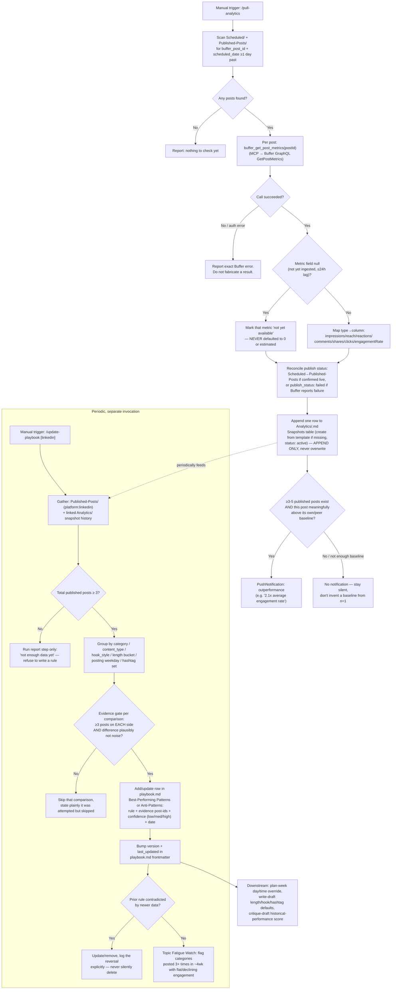

# 04 — LinkedIn Analytics & Learning Loop

## 1. Overview

This workflow covers two skills that together close the feedback loop
described in [`REQUIREMENTS.md`](../../REQUIREMENTS.md) §12 ("Analytics")
and §13 ("Performance Analysis & Learning Loop"):

- [`/pull-analytics`](../../.claude/skills/pull-analytics/SKILL.md) —
  queries Buffer's post-metrics API for every LinkedIn post that has gone
  through `/schedule-approved`, and appends a performance snapshot to that
  post's `Analytics/` record. Never overwrites prior snapshots.
- [`/update-playbook`](../../.claude/skills/update-playbook/SKILL.md) —
  reads accumulated `Analytics/` history across `Published-Posts/`, looks
  for statistically defensible patterns, and writes evidence-cited rules
  into [`Content-Learnings/playbook.md`](../../Content-Learnings/playbook.md).

Both are **manual-trigger only** — there is no cron/daemon in this repo.
`/pull-analytics` is meant to be run periodically (daily/weekly, at the
user's discretion) once posts have had time to accumulate metrics;
`/update-playbook` is meant to be run periodically once enough
`Published-Posts/` + `Analytics/` history exists to clear its evidence
bar. Both are platform-scoped: this document covers the `linkedin`
default; `/pull-analytics-x` and the `x`/`substack` arguments to
`/update-playbook` run the identical algorithm against other platforms'
files and are out of scope here.

What this feeds: `playbook.md` is read back by `/plan-week` (day/time
selection), `/write-draft` (length/hook-style/hashtag defaults and
engagement-goal selection), and `/critique-draft` (historical-performance
scoring input) — see §10 below. Nothing downstream re-derives patterns
itself; `/update-playbook` is the only skill in the repo that writes to a
playbook file.

## 2. Top-line flow chain

```
Trigger (manual /pull-analytics)
  → Scheduled/Published Post Discovery (Scheduled/ + Published-Posts/ notes with a real buffer_post_id, scheduled_date ≥1 day past)
  → Buffer GetPostMetrics Query (per post, via MCP tool buffer_get_post_metrics)
  → Metric Normalization (map Buffer `type`s to impressions/reach/reactions/comments/shares/clicks/engagementRate; null stays null, never 0)
  → Publish-status reconciliation (Scheduled/ → Published-Posts/ if Buffer confirms it went out; → failed if Buffer reports failure)
  → Append-Only Analytics Record Write (Analytics/<id>.md Snapshots table, one new row, status: active)
  → Standout-performance check (flag if ≥3-5 published posts exist and this one is meaningfully above baseline) → PushNotification
  ⋯ [periodic, separate invocation] ⋯
  → Trigger (manual /update-playbook [linkedin])
  → Gather Data (Published-Posts/ notes filtered platform:linkedin + their linked Analytics/ snapshot history)
  → Cross-Post Pattern Comparison (category, content_type, hook_style, length bucket, posting weekday, hashtag set — average engagementRate and other metrics per grouping)
  → Evidence Threshold Check (≥3 posts on each side of a comparison, difference large enough to plausibly not be noise; else skip and say so)
  → Playbook Rule Update (Best-Performing Patterns / Anti-Patterns / Topic Fatigue Watch tables in playbook.md, with post-id evidence, confidence level, date; version + last_updated bumped)
  → Downstream Consumption (plan-week day/time override, write-draft length/hook/hashtag + engagement-goal default, critique-draft historical-performance score input)
```

This matches the SKILL.md files with one correction to the originally
assumed chain: `/pull-analytics` also reconciles publish status
(`Scheduled/` → `Published-Posts/`, or → `failed`) as an explicit step
between the API call and the Analytics write — it is not purely a
metrics-append operation.

## 3. Flowchart



## 4. Stage-by-stage breakdown

### 4a. `/pull-analytics`

**Trigger:** manual (`/pull-analytics`), no scheduler in this repo. Run
periodically at the user's discretion (daily/weekly is a reasonable
cadence, but nothing enforces one).

**Required environment:** `BUFFER_ACCESS_TOKEN` (same credential as
`/schedule-approved`). The skill stops and says so plainly if it's
missing — no partial run.

**Input / post discovery:** every note in `Scheduled/` or
`Published-Posts/` that has a real `buffer_post_id` and a
`scheduled_date` at least 1 day in the past. Same-day posts are skipped —
"nothing will have ingested yet."

**Processing / API call:** for each qualifying post, calls the MCP tool
`buffer_get_post_metrics` (wired to Buffer's `GetPostMetrics` GraphQL
query — see §6) with that post's `buffer_post_id`. Returned `type`s are
mapped to the Analytics table's columns: `impressions`, `reach`,
`reactions`, `comments`, `shares`, `clicks`, `engagementRate`. Follower
growth is explicitly *not* a per-post metric in this implementation —
the SKILL.md flags it as a gap requiring a separate channel-level query,
not built in this phase.

**Publish-status reconciliation:** if Buffer's response shows the post
actually went out and the local note is still `Scheduled/` with
`publish_status: scheduled`, the note is moved to `Published-Posts/` and
`publish_status` set to `published`. If Buffer reports a failure or
deletion, `publish_status: failed` is set and the note stays in
`Scheduled/` (this is a documented Phase 11 notification trigger — "a
post fails to publish").

**Output:** one appended row in `Analytics/<id>.md`'s Snapshots table
(created from [`_Templates/Analytics-Record.md`](../../_Templates/Analytics-Record.md)
with `status: active` if it doesn't exist yet — `status: placeholder` is
reserved exclusively for the hand-written schema example and is never
treated as real input by any skill). Existing rows are never modified —
this is the accumulating history `/update-playbook` depends on.

**If the Buffer call fails or metrics aren't ready:**
- Auth/API failure → the exact Buffer error is reported; nothing is
  fabricated, no row is appended for that post.
- Metric field is `null` because ingestion hasn't run yet (up to ~24h
  lag, since Buffer's post-metrics API is explicitly *experimental* and
  refreshes only once daily) → that field is written/reported as "not
  yet available," never defaulted to 0. The SKILL.md is explicit about
  why: "a false zero would corrupt Phase 10's learning." One field
  missing does not hard-fail the whole run for that post — whatever came
  back is reported.

**Outperformance flag:** if a post's latest `engagement_rate` is
meaningfully above the average of its own prior snapshots or of other
published posts, and there are enough published posts (roughly 3-5) to
form a real baseline, this triggers a `PushNotification` (status:
proactive). With fewer posts, the skill says plainly there isn't enough
data for a meaningful baseline yet rather than inventing one from a
single data point.

### 4b. `/update-playbook`

**Trigger:** manual (`/update-playbook`, optionally `/update-playbook x`
or `/update-playbook substack`; `linkedin` is the default with no
argument). This is the only skill in the repo permitted to write to any
playbook file.

**Input:** every note in `Published-Posts/` whose `platform` field
matches the run's argument (default `linkedin`) — reading its metadata
(`category`, `format`, `length`, `hook_style`, `hashtags`, posting
day/time) plus its linked `Analytics/` snapshot history (latest values
and, where several snapshots exist, the trend across them).

**Processing — pattern detection method:** the SKILL.md specifies
comparing average `engagementRate` (and other metrics where meaningful)
across these exact groupings:
- by `category`
- by `content_type`
- by `hook_style`
- by length bucket (`<1000` / `1000-2000` / `>2000` chars)
- by posting weekday
- by hashtag set

A pattern is reportable only if both hold: at least 3 posts sit on
*each side* of the comparison, and the difference is large enough to
plausibly not be noise (explicitly judgment-based — the SKILL.md gives
the example that "a marginal 5% difference on n=3 is not a rule").

**Decision gate (evidence threshold):** **no rule is added or changed
with fewer than 3 published posts supporting it**, and every rule cites
the supporting post ids plus the sample size (e.g. "n=4") next to it.
With fewer than 3 published posts total across the whole platform, the
run does the report step only and states plainly there isn't enough
data yet — it does not lower the bar to produce output.

**Output — playbook.md diff:** for each pattern that clears the bar, a
row is added/updated in the target playbook file's Best-Performing
Patterns or Anti-Patterns table (or, for `substack`, the separate
Articles/Notes variant of those tables): rule in plain language,
evidence (post ids), a confidence level (`low` for n=3-4, `medium` for
n=5-9, `high` for n=10+), and today's date. A previously-recorded rule
contradicted by newer data is updated or removed rather than left
stale — the reversal is noted explicitly, never silently deleted.

**Versioning:** `version` is bumped and `last_updated` is set in that
one file's frontmatter only — never another platform's file. Because
`playbook.md` is a git-tracked file (see §8), each `/update-playbook`
run that changes it produces an ordinary, diffable git history in
addition to the in-file version counter.

**Topic Fatigue Watch:** independent of the evidence-gated rule tables —
flags categories/topics posted 3+ times in the last ~4 weeks with flat
or declining engagement across those posts.

**Report back:** the skill states plainly how many published posts
exist, how many met the evidence bar for any comparison, which rules
were added/updated/removed, and — equally emphasized — which
comparisons were attempted but skipped for insufficient data.

## 5. Agents & Skills Involved

| Skill | Role | Trigger | Reads | Writes |
|---|---|---|---|---|
| [`pull-analytics`](../../.claude/skills/pull-analytics/SKILL.md) | Analytics Agent (Phase 9) | Manual `/pull-analytics` | `Scheduled/`, `Published-Posts/` (for `buffer_post_id`) | `Analytics/<id>.md` (append), `Scheduled/`↔`Published-Posts/` status moves, `PushNotification` |
| [`update-playbook`](../../.claude/skills/update-playbook/SKILL.md) | Growth Agent (Phase 10) | Manual `/update-playbook [linkedin\|x\|substack]` | `Published-Posts/` + linked `Analytics/` history | `Content-Learnings/playbook.md` (or `playbook-x.md` / `playbook-substack.md`) |
| `plan-week` | consumer | Manual `/plan-week` | `Content-Learnings/playbook.md` | Idea Notes (day/time assignment) |
| `write-draft` | consumer | Manual `/write-draft` | `Content-Learnings/playbook.md` | Draft Notes (length/hook/hashtag defaults, engagement goal) |
| `critique-draft` | consumer | Manual `/critique-draft` | `Content-Learnings/playbook.md` | Draft Note (historical-performance score component) |

## 6. MCP Tools / APIs used

Real MCP server: [`mcp-server/index.js`](../../mcp-server/index.js).

**Auth/connection check** (lines ~134-148): `buffer_check_credentials`
reads the vault's `.env` and reports whether `BUFFER_ACCESS_TOKEN` and
`BUFFER_CHANNEL_ID` are present and non-placeholder — never returns the
actual secret values.

**GraphQL transport** (`bufferGraphQL`, lines ~150-169): every Buffer
call POSTs to `https://api.buffer.com` with
`Authorization: Bearer <BUFFER_ACCESS_TOKEN>`. If the token is missing
or looks like a placeholder, it throws before making the network call
("BUFFER_ACCESS_TOKEN is missing or a placeholder in the vault's
.env."). If Buffer's response contains a GraphQL `errors` array, that is
thrown verbatim as a `Buffer GraphQL error`.

**`buffer_get_post_metrics`** (lines 237-250) — the tool `/pull-analytics`
calls per post:

```graphql
query GetPostMetrics($id: PostId!) {
  post(input: { id: $id }) {
    id
    metrics { type name value unit }
  }
}
```

- Parameter: `postId` (the real Buffer post id — either the id returned
  by `buffer_create_post` when the post was originally scheduled via
  `/schedule-approved`, or an existing note's `buffer_post_id` field).
  There is no fabricated/synthetic id path — this always requires a real
  prior scheduling call to have happened.
- Returns: `post.id` plus a `metrics` array, each entry shaped
  `{ type, name, value, unit }` — a generic key/value/unit schema rather
  than fixed named fields, which is why `/pull-analytics` does its own
  mapping step from `type` to the Analytics table's fixed columns
  (`impressions`, `reach`, `reactions`, `comments`, `shares`, `clicks`,
  `engagementRate`).
- The tool's own description states the same lag/null behavior as the
  SKILL.md: "Metrics refresh once daily and can be null for up to ~24h
  after scheduling — report null as 'not yet available', never as
  zero."
- On a thrown error, the tool returns `{ isError: true, content: [...] }`
  with the raw error text — surfaced to the user as-is, not swallowed or
  guessed around.

For contrast, `buffer_create_post` (lines 196-235, the `createPost`
mutation `/schedule-approved` uses) is the only way a real
`buffer_post_id` gets into a note in the first place — `GetPostMetrics`
is strictly read-only against ids that already exist from that prior
step.

## 7. Validation & Quality Gates

**"No Spurious Metrics"** — per the guardrail table in
[`README.md`](../../README.md) (Quality, Safety & Anti-Hallucination
Guardrails section): missing or lagging Buffer analytics are marked
`null`/`unavailable`, never defaulted to 0 or estimated, enforced by
`pull-analytics`. This is stated identically in the skill's Hard Rules
("Never write a fabricated metric value. A missing/null metric is
reported as unavailable, never defaulted to 0.") and carried through
into `/update-playbook`'s own hard rule: null metrics are excluded from
average calculations, never counted as a zero against the post.

**Evidence-Based Playbook (≥3-sample rule)** — same guardrail table:
requires ≥3 verified post samples before writing any performance rule to
`playbook.md`, enforced by `update-playbook`. This applies at two levels
simultaneously: (1) at least 3 published posts must exist platform-wide
before any comparison is attempted at all, and (2) within a comparison,
at least 3 posts must sit on *each side* being compared. Both are hard
rules, not soft guidance — the skill explicitly refuses to "lower the
bar to produce something to write."

**No overwriting history** — both skills separately guarantee
append-only/non-destructive behavior: `pull-analytics` never overwrites
a prior Snapshots row; `update-playbook` never silently overwrites a
rule's evidence trail (corrections are logged as explicit reversals, not
erased).

**No invented baselines** — `pull-analytics` never claims
"outperformance" without an actual multi-post baseline to compare
against (roughly 3-5 published posts minimum, per its own text).

## 8. Data stored in memory/vault

**Analytics Record** — [`_Templates/Analytics-Record.md`](../../_Templates/Analytics-Record.md).
Frontmatter:

```yaml
id: YYYY-MM-DD--kebab-slug
type: analytics
post_id: ""     # id of the Published-Posts note this tracks
platform: linkedin # linkedin | x | substack-article | substack-note
status: active  # active | placeholder (placeholder = hand-written example, never treated as real input by any skill)
```

Body: a single `## Snapshots` markdown table with columns
`captured_date | impressions | reach | reactions | comments | shares |
clicks | engagement_rate | follower_delta` — one row appended per
`/pull-analytics` run for that post, never overwritten. A real example
observed in the vault (`Analytics/2026-09-14--ai-layoffs-redeploy-pattern.md`)
shows the `null`-handling contract in practice: `shares`/`clicks` recorded
as `n/a (not returned)` rather than `0`.

**Playbook Note** — [`_Templates/Playbook-Note.md`](../../_Templates/Playbook-Note.md).
Frontmatter: `id`, `type: playbook`, `version` (integer, bumped by
`update-playbook`). Body: `## Best-Performing Patterns` and
`## Anti-Patterns` tables (`rule | evidence (post ids) | confidence |
date_added`), plus a `## Topic Fatigue Watch` bulleted list.

**Current real state of `Content-Learnings/playbook.md`** (read
directly, not the template): frontmatter is `id: playbook`,
`type: playbook`, `version: 1`, `last_updated: 2026-09-09`. It is still
in its **seed/default state** — both the Best-Performing Patterns and
Anti-Patterns tables are empty (header rows only), and the body text
says explicitly: "This starts empty: no posts have been published yet.
The Growth Agent (Phase 10) will populate this from real Analytics data.
Nothing here should be treated as a rule until it has evidence
attached." No `/update-playbook` run has yet produced a rule that
cleared the ≥3-sample bar, despite at least one `Analytics/` record
already showing real pulled data (the 2026-09-14 example above) —
consistent with the evidence gate, since one published post cannot
support any 3-sample comparison.

**Storage split:**
- `Analytics/` is listed in [`.gitignore`](../../.gitignore) (line 15) —
  append-only personal performance data, never committed. This matches
  the pattern of treating raw personal/engagement data as local-only.
- `Content-Learnings/playbook.md` is **not** gitignored — it is a
  tracked, versioned codebase artifact (last touched in commit
  `23f7598`, "Add Phases 1-12..."). This is a deliberate split: the raw
  metrics that back a rule stay private/local, but the *derived strategy
  document* is treated as part of the system's shipped, reviewable
  logic — consistent with `voice-guide.md`, `hook-formulas.md`, and the
  other `Content-Learnings/` files it sits alongside.

## 9. Failure Modes & Recovery

| Failure | Behavior | Recovery |
|---|---|---|
| `BUFFER_ACCESS_TOKEN` missing/placeholder | `/pull-analytics` stops immediately and says so plainly before attempting any call (mirrors `bufferGraphQL`'s own guard in `mcp-server/index.js`, which throws before the network request) | Set real credentials in the vault `.env`, then rerun |
| Buffer GraphQL error (auth rejected, malformed id, etc.) | `buffer_get_post_metrics` returns `isError: true` with Buffer's raw error text; that post is skipped for this run, no row appended, no value fabricated | Investigate the reported error (e.g. re-check `buffer_post_id`, token scope); rerun `/pull-analytics` once fixed |
| Post too recently published (ingestion lag, ≤~24h) | Metric field(s) come back `null`; recorded/reported as "not yet available," never as 0 or estimated | Rerun `/pull-analytics` later (e.g. next day) once Buffer's daily ingestion has run |
| Same-day post (`scheduled_date` is today) | Skipped entirely at the discovery step — not even queried | Rerun on a later day |
| Buffer confirms the post failed/was deleted | `publish_status: failed` set, note stays in `Scheduled/`; flagged as a Phase 11 notification trigger | Investigate in Buffer directly; this is a human-facing alert, not auto-retried |
| Fewer than 3 published posts total | `/update-playbook` runs its report step only, states plainly there isn't enough data, writes no rule | Accumulate more published posts + analytics pulls, rerun later |
| A comparison has <3 posts on one side, or the effect size looks like noise | That specific comparison is skipped (not the whole run); explicitly reported as "attempted but skipped for insufficient data" | Accumulate more posts in that category/bucket, rerun later |
| Newer data contradicts an existing playbook rule | Rule is updated/removed with the reversal logged explicitly, not silently deleted | No manual recovery needed — this is normal self-correction behavior |

## 10. Closing the loop — downstream consumption

Three skills read `Content-Learnings/playbook.md`, each for a different
decision, each requiring the same thing before trusting it: a rule with
real post-id evidence attached, not a bare table row.

- **`plan-week`** — step 3 ("Pick the days") reads `playbook.md` first:
  if a `Best-Performing Patterns` rule about which days perform better
  has real evidence (post ids, ≥3 published posts) attached, those days
  override the default Tue/Thu/Sat heuristic (REQUIREMENTS.md §5). Step
  7 ("Assign a posting time") applies the same override to the specific
  time attached to a day, ahead of the §11 default table (Tue 16:00 /
  Thu 17:00 / Sat 09:00). Step 6 (hook formula assignment) also consults
  `playbook.md` as one input to inferring an idea's engagement goal when
  the idea has no explicit goal set, ahead of the `comments` default.
- **`write-draft`** — step 3 (engagement-goal determination) checks for
  a `playbook.md`-evidenced pattern for the draft's category as one tier
  of its precedence chain (explicit `--goal` > idea's own goal field >
  playbook-evidenced pattern > default `comments`). Step 4 explicitly
  checks `playbook.md` for any evidenced rule about length, hook style,
  or hashtags for the category/content_type, and — if one exists with
  real post ids attached — prefers it over `voice-guide.md`'s generic
  defaults for that specific dimension.
- **`critique-draft`** — its Historical Performance scoring input
  (viral-potential rubric, REQUIREMENTS.md §14) checks `playbook.md` for
  a rule matching the draft's category/format/hook_style with real
  evidence attached, and uses it if present; otherwise it scores neutral
  (5) and says plainly no data exists yet, rather than fabricating a
  trend either way.

In every case the consuming skill treats an *unevidenced* playbook row
(or, at the moment, the entirely empty seed-state table) as no signal at
all, falling back to its own documented default — the loop only actually
changes downstream behavior once `/update-playbook` has written a rule
that cleared the ≥3-sample bar.
