# X (Twitter) Analytics Pull and Learning-Loop — End-to-End Workflow

## 1. Overview

This document traces the complete X (Twitter) analytics-collection and
playbook-learning workflow of the LinkedIn Agentic AI system, in exact
execution order: from a published/scheduled X post through Buffer metrics
retrieval, Analytics-record accumulation, and evidence-gated updates to
`Content-Learnings/playbook-x.md`. Both stages are Claude Code "skills" —
prompt-driven instruction files at `.claude/skills/<name>/SKILL.md` —
invoked one at a time by a human via a slash command
(`/pull-analytics-x`, then later `/update-playbook x`). Neither runs
automatically or on a schedule; both require an explicit human invocation,
and both require real `BUFFER_ACCESS_TOKEN` credentials to do anything.

`/pull-analytics-x` is X's sibling to `/pull-analytics`
([`.claude/skills/pull-analytics-x/SKILL.md`](../../.claude/skills/pull-analytics-x/SKILL.md)):
same process, same hard rules, scoped to `platform: x` notes and a separate
Buffer channel id. `/update-playbook`
([`.claude/skills/update-playbook/SKILL.md`](../../.claude/skills/update-playbook/SKILL.md))
is the **same skill file** as LinkedIn's — not a fork — parameterized by a
`platform` argument (`linkedin` default, `x`, or `substack`) that selects
which `Published-Posts/`/`Analytics/` notes it reads and which playbook
file it writes. Calling it as `/update-playbook x` scopes every step to
`platform: x` evidence and writes only to `playbook-x.md`. The generic
evidence-gating mechanism (≥3-post minimum, confidence tiers, topic-fatigue
watch) is documented in full in `04-LinkedIn-Analytics.md`; this document
focuses on what is genuinely X-specific: channel scoping, X's own
independent evidence trail, and how X's thread format interacts (or
doesn't, per what the source files actually show) with metrics pulled at
the individual-post level.

Full documentation of the X drafting/scheduling stages that produce the
posts this workflow measures lives in
[02-X-Post-Creation-and-Scheduling.md](02-X-Post-Creation-and-Scheduling.md).

---

## 2. Top-Line Flow Chain

```
Published X Post (Buffer, asynchronous — outside this pipeline's control)
  → /pull-analytics-x
      → find platform: x notes in Scheduled/ or Published-Posts/ with a
        real buffer_post_id and scheduled_date ≥1 day in the past
      → Buffer GraphQL: query GetPostMetrics(postId)
      → null/missing metric reported as "not yet available", never as 0
      → move Scheduled/ → Published-Posts/ if Buffer confirms it went out
      → append one Snapshots row to Analytics/<id>.md (platform: x,
        append-only, never overwrite)
      → flag standout performance only against this post's own prior
        snapshots or other X posts specifically (no cross-platform
        baseline)
  → /update-playbook x
      → gather every Published-Posts/ note with platform: x + its linked
        Analytics/ snapshot history
      → require ≥3 published X posts total before attempting any pattern;
        below that, report-only
      → per grouping (category, content_type, hook_style, length bucket,
        posting weekday, hashtag set): require ≥3 posts on each side of a
        comparison before writing a rule
      → write/update rows in playbook-x.md's Best-Performing Patterns /
        Anti-Patterns tables, cite post ids + confidence (low n=3-4,
        medium n=5-9, high n=10+), bump version/last_updated
      → Topic Fatigue Watch: flag X categories posted 3+ times in ~4 weeks
        with flat/declining engagement
  → playbook-x.md read back by /plan-week-x, /write-draft-x,
    /critique-draft-x, /schedule-approved-x on subsequent runs
```

There is no one-shot orchestrator that chains `/pull-analytics-x` and
`/update-playbook x` together — `/generate-week-x` explicitly never calls
either (per [02-X-Post-Creation-and-Scheduling.md](02-X-Post-Creation-and-Scheduling.md)
§2); both remain separately invoked, later-cadence skills (daily/weekly for
the pull, weekly/monthly for the playbook update).

---

## 3. Flowchart

```mermaid
flowchart TD
    A["Published/Scheduled X post<br/>(platform: x note with buffer_post_id)"] --> B{"scheduled_date<br/>≥1 day in the past?"}
    B -- no --> B2["Skip — nothing ingested yet"]
    B -- yes --> C["Buffer GraphQL:<br/>query GetPostMetrics(postId)"]
    C --> D{"BUFFER_ACCESS_TOKEN<br/>present?"}
    D -- no --> D2["Stop, say so plainly —<br/>no call attempted"]
    D -- yes --> E["post { id, metrics { type name value unit } }"]
    E --> F{"metric value<br/>null/missing?"}
    F -- yes --> F2["Report 'not yet available'<br/>— NEVER treated as 0"]
    F -- no --> G["Map to Analytics columns:<br/>impressions/reach/reactions(likes)/<br/>comments(replies)/shares(reposts)/<br/>clicks/engagementRate"]
    F2 --> H
    G --> H{"Metric doesn't map<br/>to a LinkedIn-shaped column?"}
    H -- yes --> H2["Report raw metric name/value<br/>in Publishing Notes instead of<br/>forcing a wrong column"]
    H -- no --> I["Did post actually go out<br/>per Buffer's response?"]
    H2 --> I
    I -- "yes, still in Scheduled/" --> J["Move note to Published-Posts/<br/>publish_status: published"]
    I -- "failure/deletion" --> J2["publish_status: failed<br/>stays in Scheduled/ — notification trigger"]
    J --> K["Append Snapshots row to<br/>Analytics/&lt;id&gt;.md (platform: x)<br/>— append only, never overwrite"]
    K --> L{"Meaningfully above avg of<br/>this post's own history OR<br/>other X posts specifically?"}
    L -- "not enough X data yet" --> L2["Say so plainly —<br/>no invented baseline"]
    L -- yes --> L3["Notification: outperformance<br/>vs a real X-specific baseline<br/>(never compared to playbook.md's<br/>LinkedIn baseline)"]

    L2 --> M["/update-playbook x invoked separately"]
    L3 --> M
    J2 --> M
    M --> N["Gather every Published-Posts/<br/>platform: x note + linked<br/>Analytics/ snapshot history"]
    N --> O{"Total published<br/>X posts ≥3?"}
    O -- no --> O2["Report-only: state count,<br/>say plainly not enough data —<br/>do NOT lower the bar"]
    O -- yes --> P["Per grouping (category,<br/>content_type, hook_style,<br/>length bucket, weekday,<br/>hashtag set):<br/>≥3 posts each side + difference<br/>large enough to not be noise"]
    P --> Q{"Bar met for<br/>this grouping?"}
    Q -- no --> Q2["Skip — report as<br/>'attempted but insufficient data'"]
    Q -- yes --> R["Add/update row in<br/>playbook-x.md:<br/>Best-Performing Patterns or<br/>Anti-Patterns, cite post ids,<br/>confidence tier, date"]
    R --> S{"Contradicts a<br/>prior playbook-x.md rule?"}
    S -- yes --> S2["Update/remove with explicit<br/>reversal note — never silently<br/>delete evidence trail"]
    S -- no --> T
    S2 --> T["Topic Fatigue Watch:<br/>categories posted 3+ times in<br/>~4 weeks, flat/declining<br/>engagement"]
    O2 --> U["Bump version / last_updated<br/>only if something changed"]
    T --> U
    U --> V["playbook-x.md updated"]
    V -.->|"read by"| W1["/plan-week-x (day-performance rule)"]
    V -.->|"read by"| W2["/write-draft-x (length/hook/\nsingle-vs-thread rule)"]
    V -.->|"read by"| W3["/critique-draft-x (rubric weighting)"]
    V -.->|"read by"| W4["/schedule-approved-x (timing heuristic)"]
```



**Thread-level metric handling — what the source actually shows:**
`pull-analytics-x/SKILL.md` contains no thread-specific aggregation logic
at all. It queries Buffer by a single `buffer_post_id` per note, exactly
like `/pull-analytics` does for LinkedIn, and maps whatever `metrics`
array Buffer returns for that one post id straight into the Analytics
table's columns. Per `schedule-approved-x/SKILL.md`, a scheduled thread is
still a *single* Buffer `createPost` call returning one post id (confirmed
live 2026-09-14, id `6aa7685295d6303fe830531d`) — the multiple tweets ride
inside that one mutation's `metadata.twitter.thread[]` array, not as
separate Buffer posts. Consequently `/pull-analytics-x` necessarily pulls
one metrics snapshot per thread (keyed to that single post id), not one
per constituent tweet — but neither `pull-analytics-x/SKILL.md` nor
`mcp-server/index.js`'s `buffer_get_post_metrics` tool documents or
confirms *what Buffer's metrics response actually represents* for a
threaded post (e.g., first-tweet-only metrics vs. some thread-wide
aggregate). This is left unconfirmed in the source, the same
"don't guess, confirm live" posture the thread-scheduling mutation shape
was explicitly given — it just hasn't yet been exercised for metrics the
way it was for scheduling.

---

## 4. Stage-by-Stage Breakdown

### 4.1 `/pull-analytics-x` (Analytics Agent — X pipeline)

Source: [`.claude/skills/pull-analytics-x/SKILL.md`](../../.claude/skills/pull-analytics-x/SKILL.md).

1. **Find posts to check.** Every `platform: x` note in `Scheduled/` or
   `Published-Posts/` with a real `buffer_post_id` and a `scheduled_date`
   at least 1 day in the past (no point querying same-day — Buffer's daily
   ingestion job won't have run yet).
2. **Query Buffer** with the same shape `/pull-analytics` uses:
   ```graphql
   query {
     post(input: { id: "<buffer_post_id>" }) {
       id
       metrics { type name value unit }
     }
   }
   ```
   Map returned types to Analytics columns: `impressions`, `reach`,
   `reactions` (X's likes), `comments` (X's replies), `shares` (X's
   reposts), `clicks`, `engagementRate`. If a metric Buffer reports for X
   doesn't map cleanly to these LinkedIn-shaped columns, it's reported
   as a raw name/value pair in `## Publishing Notes` instead of being
   forced into the wrong column.
3. **Update publish status** — same move-to-`Published-Posts/` logic as
   `/pull-analytics`, keyed off `platform: x` notes; a Buffer-reported
   failure sets `publish_status: failed` and leaves the note in
   `Scheduled/`.
4. **Append the snapshot** to `Analytics/<id>.md` (built from
   `_Templates/Analytics-Record.md` if it doesn't exist, `status: active`)
   with `platform: x` — append, never overwrite.
5. **Flag standout performance** by comparing against this post's own
   prior snapshots or **other X posts specifically** — explicitly not
   LinkedIn's baseline, "the platforms don't share a baseline." Says
   plainly if there isn't yet enough X data for a meaningful comparison.

**Required environment:** `BUFFER_ACCESS_TOKEN` (shared with the
LinkedIn/X scheduler). The skill stops and says so plainly if missing —
never attempts a call with a blank token.

**Hard rules** (identical to `/pull-analytics`'s, platform-scoped): never
write a fabricated metric value; a null/missing metric is reported as
unavailable, never defaulted to 0; never overwrite a prior snapshot row;
never claim outperformance without an actual X-specific baseline.

### 4.2 `/update-playbook x` (Growth Agent, X scope)

Source: [`.claude/skills/update-playbook/SKILL.md`](../../.claude/skills/update-playbook/SKILL.md),
invoked with the `x` platform argument. This is the same file LinkedIn and
Substack use — "the algorithm below is identical regardless of platform —
only which files it reads/writes changes." With `platform: x`:

1. **Gather data** — every `Published-Posts/` note whose `platform` field
   equals `x`, plus each one's linked `Analytics/` snapshot history
   (latest values and trend across snapshots).
2. **Look for patterns, only where the evidence bar is met** — compare
   average `engagementRate` (and other metrics where meaningful) across
   groupings: category, content_type, hook_style, length bucket, posting
   weekday, hashtag set. A pattern is reportable only if at least 3 X
   posts sit on each side of the comparison and the difference is large
   enough to plausibly not be noise (a marginal 5% gap on n=3 is not a
   rule).
3. **Update the Playbook** — for each pattern meeting the bar, add/update
   a row in `Content-Learnings/playbook-x.md`'s Best-Performing Patterns
   or Anti-Patterns table: the rule in plain language, evidence (post
   ids), confidence (`low` n=3-4, `medium` n=5-9, `high` n=10+), and
   today's date. Bumps `version`/`last_updated` in `playbook-x.md`'s
   frontmatter only — never `playbook.md` or `playbook-substack.md`. A
   contradicted prior rule is updated/removed with an explicit reversal
   note, not silently deleted.
4. **Topic Fatigue Watch** — flags X categories/topics posted 3+ times in
   the last ~4 weeks with flat or declining engagement across those posts.

**Minimum evidence bar (global, applies to X the same as every other
platform):** do not add or change a rule with fewer than 3 published X
posts supporting it. With fewer than 3 published X posts total, the skill
runs the report step only and says plainly there isn't enough data yet —
it does not lower the bar to produce something to write. As of this read,
`playbook-x.md`'s own header states "no X posts have been published yet,"
so every table in it is currently empty pending real evidence (§8 below).

**What is genuinely X-specific here (per §25.2/25.4 of REQUIREMENTS.md and
the skill file's own text):** the `platform` argument selects `x` as the
filter for step 1's data-gathering and pins step 3's writes to
`playbook-x.md` exclusively — "never mix platforms' evidence into one
rule... not assumed to transfer to X." No X-only grouping dimension (e.g.
thread-vs-single-post performance, tweet count per thread) is named in
`update-playbook/SKILL.md`'s process text; the grouping list it defines
(category, content_type, hook_style, length bucket, posting weekday,
hashtag set) is the same list used for every platform. A single-post vs.
thread comparison, if ever added, would fall under the existing
`content_type` grouping rather than a dedicated mechanism — but the skill
file does not currently name that grouping explicitly for X, so this is
noted as an inference from the generic mechanism rather than a confirmed
X-specific feature.

---

## 5. Agents & Skills Involved

| Skill / Command | Agent Role | Responsibility | Platform Scope |
|---|---|---|---|
| `/pull-analytics-x` | Analytics Agent (X) | Queries Buffer for every scheduled/published X post's metrics; appends Analytics snapshots; reconciles publish status. | `platform: x` only |
| `/update-playbook x` | Growth Agent (X-scoped run of the shared skill) | Derives evidence-gated rules from X Analytics/Published-Posts data; writes `playbook-x.md`. | `platform: x` only |
| `/plan-week-x` (downstream consumer, documented in [02-X-Post-Creation-and-Scheduling.md](02-X-Post-Creation-and-Scheduling.md)) | Content Strategist (X) | Reads `playbook-x.md` for an evidenced day-performance rule before falling back to the sourced starting heuristic. | `platform: x` only |
| `/write-draft-x` (downstream consumer) | X Writer | Checks `playbook-x.md` for an evidenced rule on length/hook style/single-vs-thread performance for the idea's category, preferring it over the voice guide's generic defaults. | `platform: x` only |
| `/critique-draft-x` (downstream consumer, per README) | Critic & Viral Gate (X) | Same rubric shape as LinkedIn's critic plus a thread-cohesion factor; implicitly weighted by playbook evidence where present. | `platform: x` only |
| `/schedule-approved-x` (downstream consumer) | Scheduler Agent (X) | Uses the X-specific posting-time heuristic recorded by `/plan-week-x`/`playbook-x.md`. | `platform: x` only |

---

## 6. MCP Tools / APIs Used

Source: [`mcp-server/index.js`](../../mcp-server/index.js). There is **one
shared Buffer GraphQL integration** in this server — no X-specific MCP
tool exists. X-scoping happens entirely at the SKILL.md process level (via
which `buffer_post_id`/env var the skill passes in), not via a separate
tool implementation.

- **`bufferGraphQL(query, variables)`** (~lines 140-159) — the shared
  low-level helper every Buffer tool calls through. Loads
  `BUFFER_ACCESS_TOKEN` from the vault's own `.env` (not the Desktop MCP
  config, "so secrets aren't duplicated into a second file"), POSTs to
  `https://api.buffer.com` with `Authorization: Bearer <token>`, and
  throws on any `errors` in the GraphQL response.
- **`buffer_get_post_metrics`** tool (~lines 236-247) — takes a single
  `postId` string (no channel parameter at all) and runs:
  ```graphql
  query GetPostMetrics($id: PostId!) { post(input: { id: $id }) { id metrics { type name value unit } } }
  ```
  This is the exact query `/pull-analytics-x` (and `/pull-analytics`)
  describe in their SKILL.md process text. Because the tool takes only a
  post id and not a channel id, X-scoping is implicit: it only ever
  returns metrics for whichever post that id belongs to, which is X or
  LinkedIn depending on which channel it was originally created against
  by `buffer_create_post`/`schedule-approved-x`'s mutation. The tool's own
  docstring reiterates the null-guardrail: "Metrics refresh once daily and
  can be null for up to ~24h after scheduling — report null as 'not yet
  available', never as zero."
- **`buffer_check_credentials`** tool (~lines 137-151, immediately above
  `bufferGraphQL`) — checks `BUFFER_ACCESS_TOKEN` and `BUFFER_CHANNEL_ID`
  presence/non-placeholder status. Notably, this helper only inspects
  `BUFFER_CHANNEL_ID` (LinkedIn's channel var) — it does not check
  `BUFFER_CHANNEL_ID_X` at all. X-specific credential verification is
  therefore handled entirely by the `pull-analytics-x`/`schedule-approved-x`
  SKILL.md process text ("stop and say so plainly if missing"), not by
  this MCP helper tool.
- **`buffer_discover_channels`** tool (~lines 178-197) — one-time setup
  helper listing all connected Buffer channels (`id name displayName
  service`) across the account's organizations; used once to find the X
  channel id and save it as `BUFFER_CHANNEL_ID_X`, per
  `schedule-approved-x/SKILL.md`'s step 4 documentation of that lookup.
- **`read_note` / `write_note` / `list_notes`** tools (~lines 78-130) —
  generic vault file I/O used to find `platform: x` notes in
  `Scheduled/`/`Published-Posts/`, read their frontmatter/`buffer_post_id`,
  read/write `Analytics/<id>.md` snapshots, and read/write
  `playbook-x.md`. Not X-specific; the same tools LinkedIn's pipeline uses.

No separate X analytics endpoint, X API credential, or X-specific GraphQL
query exists anywhere in `mcp-server/index.js` — the entire "X analytics"
capability is the same Buffer post-metrics query, scoped by which post id
was captured at schedule time.

---

## 7. Validation & Quality Gates

- **Null-is-not-zero guardrail** (both skills, both platforms): a
  `null`/missing Buffer metric is reported as "not yet available," never
  defaulted to 0 — protects `/update-playbook`'s averages from being
  silently corrupted by unfetched data.
- **≥1-day-post-scheduled gate**: `/pull-analytics-x` only queries posts
  with `scheduled_date` at least 1 day in the past — Buffer's daily
  ingestion job won't have populated same-day metrics.
- **≥3-published-X-posts evidence gate**: `/update-playbook x` refuses to
  write or change any playbook-x.md rule below 3 supporting posts; below 3
  total published X posts, it runs report-only.
- **Per-grouping ≥3-on-each-side gate**: even once the global floor is
  met, each individual comparison (e.g. Tuesday vs. Thursday posts) still
  needs ≥3 posts on each side, plus a difference judged large enough to
  not be noise.
- **Platform-isolation gate**: `/update-playbook x` reads only
  `platform: x` notes and writes only `playbook-x.md`'s frontmatter/tables
  — "never mix platforms' evidence into one rule." `/pull-analytics-x`
  compares standout performance only against other X posts, never
  LinkedIn's baseline.
- **Append-only history gate**: Analytics snapshot rows are appended,
  never overwritten, for both platforms — full trend history is required
  for Growth Agent analysis.
- **Evidence-trail preservation gate**: a contradicted playbook-x.md rule
  is updated/removed with an explicit reversal note in `/update-playbook`,
  never silently deleted.
- **Credential gate**: `BUFFER_ACCESS_TOKEN` must be present and
  non-placeholder before any Buffer call is attempted; `/pull-analytics-x`
  stops and states this plainly if missing, same as `/schedule-approved-x`.

---

## 8. Data Stored in Memory / Vault

### `Analytics/<id>.md` (X posts) — from [`_Templates/Analytics-Record.md`](../../_Templates/Analytics-Record.md)

Frontmatter: `id`, `post_id` (the Published-Posts note it tracks),
`platform: x`, `status: active` (never `placeholder`, which is reserved
for the hand-written schema example and never treated as real input).
Body: one `## Snapshots` table, columns `captured_date | impressions |
reach | reactions | comments | shares | clicks | engagement_rate |
follower_delta` — one row appended per `/pull-analytics-x` run, history
accumulates, never overwritten.

### `Content-Learnings/playbook-x.md` — actual current state read directly

```yaml
id: playbook-x
type: playbook
platform: x
version: 1
last_updated: 2026-09-14
```
Structurally identical to `playbook.md`
([`_Templates/Playbook-Note.md`](../../_Templates/Playbook-Note.md)'s
schema): a `## Best-Performing Patterns` table (`rule | evidence (post
ids) | confidence | date_added`), an `## Anti-Patterns` table (same
columns), and a `## Topic Fatigue Watch` free-text section. As of this
read, **all three sections are empty** — the file's own header text states
plainly: "This starts empty: no X posts have been published yet.
`update-playbook x` will populate this from real Analytics data. Nothing
here should be treated as a rule until it has evidence attached." It
explicitly disclaims inheriting `playbook.md`'s rows: "Patterns that work
on LinkedIn are not assumed to transfer here — X's audience and format
reward different things, so this file earns its own evidence
independently."

---

## 9. Failure Modes & Recovery

- **Missing/placeholder `BUFFER_ACCESS_TOKEN`** — `/pull-analytics-x`
  stops immediately and states plainly which credential is missing; no
  call is attempted, no metric is fabricated.
- **Buffer reports the post failed/was deleted** — `publish_status: failed`
  is set, the note stays in `Scheduled/` rather than moving to
  `Published-Posts/`; this is a documented notification trigger ("a post
  failed to go out").
- **Metric still `null` (within Buffer's ~24h ingestion lag)** — reported
  as "not yet available" in the snapshot row rather than as 0; not treated
  as a failure, just an incomplete data point that gets filled on a
  subsequent pull.
- **A metric type Buffer returns for X doesn't map to the LinkedIn-shaped
  columns** — recorded as a raw name/value pair under `## Publishing
  Notes` rather than forced into the wrong column or silently dropped.
- **Fewer than 3 published X posts (or fewer than 3 on one side of a
  grouping)** — `/update-playbook x` runs its report step, states the
  actual count, and explicitly lists which comparisons were "attempted but
  skipped for insufficient data." No rule is written; the bar is never
  lowered to produce output.
- **A previously-recorded playbook-x.md rule is contradicted by new
  evidence** — updated or removed with an explicit reversal note logged,
  not silently erased, preserving the evidence trail.
- **Uncertain thread-metrics semantics** (per §3 above) — since neither
  the skill file nor the MCP server documents what Buffer's metrics
  response represents for a threaded post specifically, any snapshot
  pulled for a thread note should be treated with the same "confirm
  live, don't guess" posture given to the thread-scheduling mutation
  shape — this is a gap in the current source, not a resolved mechanic,
  and is flagged here rather than assumed.

---

## 10. Closing the Loop Back Into X Generation

`playbook-x.md` is read by (per each skill's own SKILL.md text, confirmed
by direct grep):

- **`/plan-week-x`** — "read `Content-Learnings/playbook-x.md` first — if
  it has a day-performance rule with real evidence (≥3 published X posts)
  attached, use those days." Only falls back to the live-researched
  starting heuristic (currently Tue/Wed/Thu 09:00 local, sourced
  2026-09-14 from Buffer/SocialPilot studies) when playbook-x.md has no
  evidenced rule yet.
- **`/write-draft-x`** — "check `Content-Learnings/playbook-x.md` for an
  evidenced rule (real X post ids attached) about length, hook style, or
  single-vs-thread performance for this category; prefer it over the
  voice guide's generic defaults where one exists."

`/critique-draft-x` and `/schedule-approved-x` are named as playbook-x.md
consumers in the flowchart above and in README's pipeline table, but full
documentation of exactly how each uses it belongs to
[02-X-Post-Creation-and-Scheduling.md](02-X-Post-Creation-and-Scheduling.md),
which owns the drafting/scheduling stages themselves.

Because `playbook-x.md` currently has zero evidenced rows (§8), every one
of these downstream reads is presently falling through to each skill's own
generic/researched default — the loop is wired end to end, but has not yet
had real X publishing volume to close on.

---

## 11. Comparison Note: X Analytics vs. LinkedIn Analytics

Grounded strictly in what the source files show, not assumed:

- **Same Buffer mechanism.** Both pulls use the identical
  `GetPostMetrics(postId)` GraphQL query, through the identical
  `bufferGraphQL` helper and `buffer_get_post_metrics` MCP tool. There is
  no separate X analytics API or X-specific query anywhere in
  `mcp-server/index.js` — scoping is entirely which `buffer_post_id` was
  captured at schedule time, itself a function of which channel
  (`BUFFER_CHANNEL_ID` vs. `BUFFER_CHANNEL_ID_X`) `schedule-approved`/
  `schedule-approved-x` used.
- **Same guardrails, restated per-platform, not weakened.**
  Null-is-not-zero, append-only snapshots, ≥3-post evidence floor,
  ≥3-per-side grouping floor, and never-silently-delete-a-reversed-rule
  are byte-for-byte the same rules in `pull-analytics-x/SKILL.md` and
  `update-playbook/SKILL.md`'s platform-generic text as in the LinkedIn
  path — X does not get a looser bar.
- **Separate, non-transferable evidence trail — by explicit design.**
  `playbook-x.md`'s own header and `update-playbook/SKILL.md`'s platform
  argument description both state this directly: "a pattern proven on
  LinkedIn is not assumed to transfer to X" / "Patterns that work on
  LinkedIn are not assumed to transfer here — X's audience and format
  reward different things." README states the same rationale verbatim at
  the pipeline level: "a pattern proven on LinkedIn is never assumed to
  transfer to X or Substack's different audiences and formats." This is
  the one deliberate, confirmed difference — everything else is the same
  mechanism scoped by a `platform` filter.
- **The one open, unconfirmed difference:** thread-level metrics
  semantics (§3, §9). LinkedIn has no equivalent multi-post-in-one-thread
  construct, so this gap is specific to X, but it is a documented gap in
  the source rather than a described mechanic — no file in this repo
  states what Buffer returns for a threaded post's `metrics` field, only
  that the *scheduling* mutation shape for threads was separately
  confirmed live.
- **No other X-specific analytics mechanics exist in the source.** Beyond
  channel scoping and the playbook-file target, `pull-analytics-x/SKILL.md`
  states outright it is "same process" as `/pull-analytics`, and
  `update-playbook/SKILL.md` states "the algorithm below is identical
  regardless of platform — only which files it reads/writes changes." No
  invented X-specific scoring, weighting, or aggregation logic exists
  beyond what these two sentences describe.
