# Content Research and Idea Generation — Shared Foundation Workflow

## 1. Overview

This document traces the complete content-research and idea-generation layer
of the LinkedIn Agentic AI system: `/research-topic` (Trend Scout / Research
Agent) followed by `/generate-ideas` (Idea Ranker / Idea Engine). This is the
**single shared foundation** that feeds every platform's content pipeline —
LinkedIn, X (Twitter), and Substack (articles and Notes) all draw from one
research pool (`Content-Research/`) and one idea pool (`Post-Ideas/`). No
platform runs its own separate research or ideation step; platform identity
only enters the pipeline downstream, as a tag (`platforms: []`) on an Idea
Note, and later as a per-platform planner/writer/critic chain.

Both skills are Claude Code "skills" — prompt-driven instruction files at
[`.claude/skills/research-topic/SKILL.md`](../../.claude/skills/research-topic/SKILL.md)
and
[`.claude/skills/generate-ideas/SKILL.md`](../../.claude/skills/generate-ideas/SKILL.md)
— each invoked manually by a human via a slash command (or, inside
`/generate-week*` orchestrators, invoked as an explicit first step within the
same session). Nothing in this layer runs autonomously or on a schedule.
Neither skill drafts post text, assigns a posting day, or touches Buffer —
this is research and ranking only.

---

## 2. Top-Line Flow Chain

```
Trigger: /research-topic [domain] [count]
  → Pillar Scan (broad real-time scan across all 15 closed-set content
      pillars by default; narrowed to one pillar only if a domain arg is
      explicitly given)
  → Live Trend Discovery (WebSearch — real, live web calls)
  → Per-Topic Near-Duplicate Check (vs existing Content-Research/<pillar>/
      notes with status: new — different angle or skip, before committing)
  → Primary Source Fetch (WebFetch against docs, repos, papers, official
      blogs/changelogs — full pages, not snippets)
  → Claim Verification (every fact/stat/quote must trace to a fetched
      source; unverifiable claims are dropped, never hedged-in)
  → Research Scoring (0-10 x 7 criteria rubric)
  → Research Note Write (Content-Research/<pillar>/YYYY-MM-DD--slug.md,
      status: new)
  → [Idea Engine trigger] /generate-ideas [domain-filter] [count]
  → Unused-Research Scan (Content-Research/**/*.md, eligible = status: new,
      excludes placeholder/used)
  → Idea-Level Dedup (vs existing Post-Ideas/*.md — different angle or skip
      that research note this run)
  → Angle/Hook Generation (per idea, grounded only in the source note's
      Summary/Key Findings)
  → Idea Ranking (rank_score — average of 5 factors)
  → Platform Tagging (platforms: [] — eligible platform(s) for this idea)
  → Idea Note Write (Post-Ideas/YYYY-MM-DD--slug.md, status: candidate)
  → Close-the-Loop (source Research Note(s): status new → used,
      used_in[] appended)
  → Ready for /plan-week, /plan-week-x, /plan-week-substack-article, or
      /plan-week-substack-note (candidate → selected, per-platform claim)
```

This differs from a naive reading of "research feeds drafting directly" in
one important way confirmed by both `SKILL.md` files: the two skills are
separately triggered — `/generate-ideas` does not run automatically after
`/research-topic` unless a human (or a `/generate-week*` orchestrator script)
explicitly chains them in the same session. Each is also independently
re-runnable against whatever backlog currently exists.

---

## 3. Flow Diagram — Verification Gate and Duplicate Detection

The two hard gates in this layer are (1) claim verification inside
`/research-topic`, and (2) duplicate detection, which is **two separate,
single-tier checks inside this layer** (research-vs-research,
idea-vs-idea) plus a **fuller two-tier check performed downstream** in
`/critique-draft` (and its per-platform variants) against
`Content-Learnings/content-index.md`. The diagram below shows both,
correctly scoped to where each actually runs — see §7 for why the two-tier
split is not implemented inside `/research-topic` or `/generate-ideas`
themselves.

```mermaid
flowchart TD
    A["/research-topic [domain] [count]"] --> B["Pillar scan (15 closed-set\npillars, or 1 if domain given)"]
    B --> C["WebSearch: live trend discovery"]
    C --> D["Candidate topic + pillar assignment"]
    D --> E{"Near-duplicate topic already\nstatus: new in this pillar folder?"}
    E -->|yes, same ground| E1["Pick a substantially different\nangle, or skip this topic"]
    E -->|no| F["WebFetch: fetch full primary source\npage(s) for this topic"]
    E1 --> C
    F --> G{"Is this specific claim/stat/quote\ntraceable to a page actually fetched?"}
    G -->|no| G1["Claim stripped.\nNever included, never hedged."]
    G -->|yes| H["Research Scoring:\n7 criteria, 0-10 each"]
    G1 --> H
    H --> I["Write Research Note\nContent-Research/pillar/, status: new"]
    I --> J["/generate-ideas [domain-filter] [count]"]
    J --> K["Scan Content-Research/**,\neligible = status: new"]
    K --> L{"Near-duplicate idea already\nin Post-Ideas/*.md?"}
    L -->|yes| L1["Materially different angle,\nor skip this research note"]
    L -->|no| M["Generate idea: angle, hook,\naudience, format"]
    L1 --> M
    M --> N["Score rank_score:\navg of 5 factors"]
    N --> O["Write Idea Note\nPost-Ideas/, status: candidate"]
    O --> P["Flip source Research Note(s):\nstatus new -> used; append used_in[]"]
    P --> Q["/plan-week* claims idea for a platform\nstatus: candidate -> selected"]
    Q --> R["/write-draft* drafts the post"]
    R --> S["/critique-draft* — Originality /\nduplicate check vs content-index.md"]
    S --> T{"Severity"}
    T -->|"Genuine duplicate\n(same story/hook/example/conclusion)"| T1["Auto-reject: stays status draft,\nnever advances to in_review"]
    T -->|"Similar but substantively\ndistinct angle"| T2["Originality sub-score lowered;\nstill advances to human /review-drafts"]
```



---

## 4. Stage-by-Stage Breakdown

### 4a. `/research-topic` — Trend Scout + Research Agent

**Trigger:** manual slash command, e.g. `/research-topic` or
`/research-topic AI 3`. Also invoked as the first explicit step inside
`/generate-week`, `/generate-week-x`, and `/generate-week-substack`
orchestrators, in the same session.

**Input:**
- `domain` (optional) — narrows the scan to one of the 15 pillar folders.
  **Default (and preferred) mode omits this** and runs the broad scan across
  all 15 pillars, letting what's actually trending decide which pillar(s)
  get covered rather than the caller pre-selecting one.
- `count` (optional, default **3**) — number of topics to research this run.
  Kept intentionally small (3–5 recommended) — output quality over volume.

**The 15 closed-set pillars** (fixed set — organizational buckets for where
a discovered topic gets filed, never a menu of specific topics to choose
from; no 16th pillar may be invented):

| Pillar | `Content-Research/` folder |
|---|---|
| AI | `AI` |
| Tech Career | `Career` |
| Developer Tools | `Developer-Tools` |
| GenAI | `GenAI` |
| Machine Learning | `Machine-Learning` |
| Deep Learning | `Deep-Learning` |
| Interview Prep | `Interview-Preparation` |
| Data Analytics | `Data-Analytics` |
| Data Engineering | `Data-Engineering` |
| Maths Related to Data | `Mathematics` |
| Problem Solving | `Problem-Solving` |
| Algorithms | `Algorithms` |
| Research | `Research-Papers` |
| Psychology + AI | `Psychology-AI` |
| AI in Healthcare | `AI-Healthcare` |
| Learning Resources (cross-cutting) | `Resources` |

**Processing, sub-step by sub-step:**

1. **Search (web-research call).** `WebSearch` is used to survey what is
   actually happening right now, within scope of the 15 pillars: recent
   news, industry updates, major technology/model announcements, new
   research/papers, product developments, market trends, active discussion.
   This is a real, live web call — not a simulated or cached lookup. The
   scan is broad by default; it is only pillar-scoped when a `domain` arg
   was explicitly passed. A run must never fall back to a generic
   "evergreen" topic just because nothing obviously trending turned up on
   one pass — the skill is required to broaden search terms and retry
   within the pillars before settling, since evergreen content is a
   deliberate later mix decision (`/plan-week`, per REQUIREMENTS.md §16),
   not a shortcut for skipping live research here.
2. **Pillar assignment + near-duplicate check (LLM judgment + file read).**
   Each candidate topic is filed under its best-fit pillar folder. Before
   committing to a topic + angle, the skill reads filenames and
   `topic`/`status` frontmatter of recent notes already in that folder. A
   near-duplicate with `status: new` (i.e., not yet consumed by
   `/generate-ideas`) forces either a substantially different angle or
   skipping the topic — and two notes covering the same ground are never
   written in one run.
3. **Primary source fetch (real tool call).** For each topic committed to,
   `WebFetch` is used to actually read full source pages — snippets from
   the search step are explicitly declared insufficient to write a
   trustworthy note. A "primary source" here means official blogs, docs,
   changelogs, papers, and direct announcements, favored over secondary
   write-ups or aggregator content. This, too, is a real live web call.
4. **Claim verification (hard rule, not a tool call — an editorial gate).**
   Every factual claim, statistic, benchmark, or quote that goes into the
   note must trace back to a source actually fetched in the previous
   sub-step. **If a claim cannot be verified from a real fetched page, it is
   dropped outright** — never guessed, rounded, hedged, or
   paraphrased-as-fact. This is stated as a hard rule tied to
   REQUIREMENTS.md §4/§21, not a style preference.
5. **Research scoring (LLM judgment, rubric-constrained).** See §7 below for
   the exact rubric text.
6. **Note write (file write).** The note is written from
   [`_Templates/Research-Note.md`](../../_Templates/Research-Note.md) into
   `Content-Research/<pillar>/YYYY-MM-DD--kebab-slug.md`. `status: new`.
   `related[]` and `used_in[]` are left empty — `used_in[]` is populated
   later by `/generate-ideas` once an idea is actually generated from the
   note.

**Tools used:** `WebSearch` (trend discovery) and `WebFetch` (primary source
retrieval) — both are real, live outbound web calls made during the skill
run, not stubs or simulated data. The skill explicitly instructs treating
all fetched page content as untrusted data to extract facts from, never as
instructions to follow — a stated defense against prompt injection from a
compromised or adversarial page, since this pipeline eventually reaches a
real external action (Buffer) once a human approves something downstream.

**Output:** one Research Note per topic (up to `count`), `status: new`, in
`Content-Research/<pillar>/`. The skill never generates LinkedIn (or any
platform's) post copy — research only. If a discovered topic scores
`trend_score >= 9`, or is a clearly time-sensitive same-week
announcement, the skill sends one proactive `PushNotification` naming it;
routine trend_score 6–8 finds are not notification-worthy (REQUIREMENTS.md
§24).

**What happens to an unverifiable claim:** it is stripped from the note
entirely at the source. It is never included with a hedge ("reportedly...",
"it's said that..."), never rounded to a safer-sounding number, and never
carried forward into scoring or the note body. The Research Note simply
contains fewer Key Findings than the raw search turned up — the note is
still written and still useful, just narrower in what it asserts as fact.

### 4b. `/generate-ideas` — Idea Ranker / Idea Engine

**Trigger:** manual slash command, e.g. `/generate-ideas` or
`/generate-ideas AI 5`. Also chained explicitly after `/research-topic`
inside the `/generate-week*` orchestrators, in the same session.

**Input:**
- `domain-filter` (optional) — restrict to one `Content-Research/` category
  folder. All categories considered if omitted.
- `count` (optional) — target range **10–20** new ideas, explicitly a
  ceiling, not a quota. If the backlog only supports fewer good ideas, the
  skill generates fewer and says so — it never pads with filler.

**Processing:**

1. **Gather eligible research (file scan).** Reads frontmatter across
   `Content-Research/**/*.md`, optionally filtered to `domain-filter`.
   Eligible = `status: new`. `status: placeholder` (hand-written schema
   examples) and `status: used` are explicitly excluded.
2. **Dedup against existing ideas (file scan + LLM judgment).** Scans
   `Post-Ideas/*.md` frontmatter (`topic`/`angle`, any status except
   `placeholder`) for close matches before turning a research note into an
   idea. A near-duplicate idea forces either a materially different angle
   or skipping that research note this run.
3. **Generate one idea per eligible research note (LLM synthesis).** Fields
   per REQUIREMENTS.md §6/§4: `topic`, `angle`, `why_it_matters`,
   `target_audience`, `format`, `hook`, `estimated_engagement` (0-10),
   `suggested_visual`, `category`, `content_type`, `sources` (the research
   note id(s) actually used), `target_week` (left blank for
   `/plan-week` to fill). Two closely related research notes may be
   synthesized into one comparison-style idea ("X vs Y") when that is
   clearly stronger than two separate ideas — never forced just to hit the
   count target. `why_it_matters` and `hook` must be grounded in the source
   note's Summary/Key Findings only — never embellished beyond what the
   research actually supports.
4. **Rank scoring (LLM judgment, rubric-constrained).** See §7 below for the
   exact 5-factor rubric. This is explicitly documented as a static formula
   expected to be replaced by learned weights once Phase 10 (Growth Agent)
   has real published-post performance data.
5. **Note write (file write).** From
   [`_Templates/Idea-Note.md`](../../_Templates/Idea-Note.md) into
   `Post-Ideas/YYYY-MM-DD--kebab-slug.md`. `status: candidate`.
6. **Close the loop on used research (file update).** For every research
   note actually used as a source: append the new idea's id to that
   research note's `used_in[]`, and flip its `status` from `new` to `used`.
   This is what makes the near-duplicate check in `/research-topic` §4a
   step 2 actually work over time — a topic already turned into an idea no
   longer shows up as `status: new` competing for a fresh angle.

**Output:** one Idea Note per generated idea in `Post-Ideas/`, `status:
candidate`, carrying a `rank_score`, a `platforms: []` tag (the eligible
platform(s) this idea can run on — LinkedIn, X, Substack article, Substack
Note; one idea may target several, each producing its own independently
drafted post, never a copy-paste), and `sources: []` pointing back to the
originating Research Note id(s). The skill never assigns a specific posting
day/date and never writes LinkedIn (or any platform's) post copy — ranking
only.

**Handoff to platform-specific weekly planners:** `Post-Ideas/` `status:
candidate` notes are the shared pool read by `/plan-week` (LinkedIn),
`/plan-week-x`, `/plan-week-substack-article`, and `/plan-week-substack-note`
— each filters by whether its platform appears in the idea's `platforms: []`
list, assigns it to a day, and flips its status (`candidate → selected`
for the platform doing the claiming; LinkedIn's own claim uses
`target_week`/`target_date`, every other platform's claim is a
`platform_schedule[]` entry, since one idea can run on multiple platforms
on different days).

---

## 5. Agents & Skills Involved

| Skill (slash command) | Role | Phase | Reads | Writes |
|---|---|---|---|---|
| `/research-topic` | Trend Scout / Research Agent | Phase 2 | live web (`WebSearch`/`WebFetch`), existing `Content-Research/<pillar>/` notes (dedup check) | `Content-Research/<pillar>/*.md` (`status: new`) |
| `/generate-ideas` | Idea Ranker / Idea Engine | Phase 3 | `Content-Research/**/*.md` (`status: new`), existing `Post-Ideas/*.md` (dedup check) | `Post-Ideas/*.md` (`status: candidate`); updates `used_in[]`/`status` on consumed Research Notes |

Neither skill is an autonomous background agent — both are prompt-driven
instruction files executed synchronously in a human-triggered Claude Code
session (directly, or as an explicit early step inside a `/generate-week*`
orchestrator).

---

## 6. Tools / APIs Used

- **`WebSearch`** — real, live web search calls used by `/research-topic`'s
  Search sub-step to discover what is genuinely trending across the 15
  pillars right now. Not a stub, not simulated, not drawn from training-data
  memory of "what's usually relevant."
- **`WebFetch`** — real, live page-fetch calls used by `/research-topic`'s
  Primary Source Fetch sub-step to read full source pages (docs, repos,
  changelogs, papers, official announcements) before any claim from that
  page can be written into a note. Search-result snippets alone are
  explicitly insufficient.
- No image/visual-generation tool is used anywhere in this layer. Visual
  prompts are out of scope until a downstream platform-specific draft
  exists (`/generate-visual`, `/generate-visual-substack-article`) — this
  document's layer produces only `suggested_visual` free text on the Idea
  Note, not a rendered prompt.
- No Buffer/scheduling API call occurs anywhere in this layer — both skills
  are explicitly barred from scheduling, publishing, or touching Buffer.

---

## 7. Validation & Quality Gates

### 0–10 Research Scoring Rubric (7 criteria, `research-topic/SKILL.md` step 4)

| Field | How it's set |
|---|---|
| `trend_score` | How many independent recent sources are actively discussing this right now. 0 = nothing found beyond one mention, 10 = dominating multiple feeds/outlets this week. |
| `relevance_score` | Fit with the pillar table and the intended LinkedIn/AI-dev/data/career audience. |
| `freshness_score` | Recency of the underlying event/publication. 10 = days old, lower as it ages. |
| `authority_score` | Source quality: primary/official = high (8–10), reputable outlet/publication = medium (5–7), blog/forum/social = low (1–4). |
| `engagement_potential` | Judgment call: does this lend itself to a strong hook and real discussion, not just information? |
| `originality_score` | Inverse of the dedup check — a topic with no close match in the vault or recent memory scores high. |
| `educational_value` | Judgment call: will a reader walk away knowing something concrete and useful, not just "aware of a headline"? |

README.md's summarized version of this rubric (Trend Velocity, Relevance,
Freshness, Authority, Engagement Potential, Originality, Educational Value)
names the same seven criteria under slightly condensed labels — both
describe the same seven frontmatter fields.

### 5-Factor Idea Rank Rubric (`generate-ideas/SKILL.md` step 4)

`rank_score` (0–10) is the average of five factors, each scored 0–10: Hook
Strength, Educational/Practical Value, Audience Fit, Non-repetition/
Freshness (vs. existing ideas/published posts per the dedup check), and
Format-Content Fit. Documented as a static formula pending replacement by
learned weights once real performance data exists (Growth Agent, Phase 10).

### Hallucination-rejection rule

Stated as a hard rule in `research-topic/SKILL.md` ("do not violate"
section) and cross-referenced to REQUIREMENTS.md §4/§21: never fabricate a
statistic, quote, benchmark, or finding; never write a note without at
least one real, fetched source; if verification fails, drop the specific
claim rather than include it hedged. README.md's guardrail table names this
the same way: "Compulsory `WebFetch` verification against primary sources
... Unverifiable claims are stripped," enforced by `research-topic` (and,
downstream, re-enforced by `critique-draft`'s re-verification pass).

### Research-Papers pillar-specific rule

Per REQUIREMENTS.md §2 and README.md (content pillars section): a Research
post must be built from a paper actually read (arXiv, ACM/IEEE, company/lab
publication) — **not just its press summary** — then explained as the
author's own plain-language take (what the paper found, why it matters, a
simple explanation with a real-life example or practical usage), not an
academic abstract restated. Linking the source paper is optional per post
(used sometimes, not every time); a paper, finding, or citation is never
fabricated. This is a stricter version of the general primary-source rule
above, scoped specifically to the `Research-Papers` pillar folder.

### Two-tier duplicate detection — where each tier actually lives

Inside this layer, both `/research-topic` and `/generate-ideas` implement a
**single-tier** dedup check each: a near-duplicate found (same topic in the
pillar folder / same angle already an idea) forces "different angle or
skip" — there is no scoring split between "genuine duplicate" and
"similar-but-distinct" at this stage; SKILL.md text for both skills treats
any near-duplicate the same way (avoid it).

The **true two-tier split** — genuine duplicate auto-rejected vs.
merely-similar-but-distinct flowing through to human review with a lowered
sub-score — is implemented one stage downstream, in `/critique-draft` (and
its `-x`/`-substack-*` variants), against
[`Content-Learnings/content-index.md`](../../Content-Learnings/content-index.md):
a **genuine duplicate** (same underlying story/news item, example, hook, or
conclusion as an existing note from the same or a recent week) stops the
draft outright — it stays `status: draft`, is flagged
`duplicate_flagged` in history, and is deliberately never advanced to
`status: in_review`, so a known duplicate never reaches human review looking
novel. A **merely similar but substantively distinct** draft (same general
topic/style, different angle/argument/example) is noted in the critique,
pulls the draft's Originality sub-score down, and still goes to human
`/review-drafts` — the human approver makes the final call. This document
names that mechanism here because it is the terminal enforcement point for
duplicate/fatigue risk that originates in this research/idea layer, but its
full mechanics belong to the drafting/critique workflow documents.

---

## 8. Data Stored in Memory / Vault

**Research-Note frontmatter**
([`_Templates/Research-Note.md`](../../_Templates/Research-Note.md)): `id`,
`type: research`, `topic`, `category` (one of the 15 pillars),
`date_discovered`, `status` (`new` | `used` | `placeholder`), the seven 0–10
scores (`trend_score`, `relevance_score`, `freshness_score`,
`authority_score`, `engagement_potential`, `originality_score`,
`educational_value`), `sources` (list of `{title, url, type: primary|
secondary, date, confidence: high|medium|low}` — only URLs actually fetched),
`related[]` (ids of related research notes), `used_in[]` (ids of idea notes
generated from this research — populated by `/generate-ideas`). Body:
Summary, Key Findings, Content Ideas, Potential Hooks, Related.

**Idea-Note frontmatter**
([`_Templates/Idea-Note.md`](../../_Templates/Idea-Note.md)): `id`, `type:
idea`, `topic`, `angle`, `why_it_matters`, `target_audience`, `format`,
`hook`, `category`, `content_type`, `estimated_engagement` (0–10),
`suggested_visual`, `sources[]` (research note ids), `platforms: []`
(one or more of `linkedin`, `x`, `substack-article`, `substack-note`),
`status` (`candidate` | `selected` | `drafted` | `rejected` |
`placeholder`), `target_week`/`target_date` (LinkedIn's own assignment, set
only by `/plan-week`), `platform_schedule[]` (other platforms' own
week+date assignments — block entries `{platform, week, date}` — set by
`/plan-week-x`/`/plan-week-substack-article`/`/plan-week-substack-note`,
never by `/plan-week`), `rank_score`. Body: Notes (angle nuance, why it
beats similar backlog ideas, risks), Related.

**`Content-Learnings/content-index.md`'s role:** a compact, append/
update-only index of every post that has entered the pipeline (drafted or
further) — LinkedIn, X, and Substack rows share one table (a `platform`
column, added in schema v2, 2026-09-14). It exists so downstream
duplicate/context checks (`/plan-week`, `/critique-draft`, `/generate-visual`,
`/generate-week`) can scan one compact table instead of re-reading every
note in `Drafts/`, `Visuals/`, `Scheduled/`, and `Published-Posts/` in full.
It is explicitly documented as **a fast lookup, not the source of truth** —
the real notes always win if they disagree with a row, and a matching row
should be read in full before anything is decided from it alone. A
post's subagent (spawned by `/generate-week`) adds its row right after
`/write-draft` creates the Draft Note, then updates the row after
`/critique-draft` and `/generate-visual` fill in more columns; `placeholder`
rows are never treated as real history. This document's own layer
(`/research-topic`, `/generate-ideas`) does not read or write
`content-index.md` directly — its dedup checks work off live frontmatter
scans of `Content-Research/` and `Post-Ideas/` themselves; `content-index.md`
is consumed one stage downstream, by `/critique-draft`'s originality check
(§7 above).

---

## 9. Failure Modes & Recovery

- **A claim can't be verified.** It is stripped from the Research Note
  entirely at write time — never published as fact, never hedged in with
  softening language. The note is written with fewer Key Findings rather
  than skipped altogether, provided at least one claim in the note is
  actually verified; a note with zero fetched, verified sources is never
  written at all (hard rule).
- **No genuinely new angle exists for a topic that keeps recurring.**
  `/research-topic` step 2 requires either a substantially different angle
  or skipping the topic outright rather than writing a near-duplicate note;
  `/generate-ideas` step 2 applies the same logic at the idea level. Per the
  quality-gates-the-count philosophy stated for `/generate-ideas`'s `count`
  argument (10–20 is a ceiling, not a quota) and echoed at
  `/research-topic`'s `count` argument (3–5 recommended, quality over
  volume): the honest outcome is fewer notes/ideas than requested, reported
  plainly, never padded with filler to hit a number.
- **A "trend" turns out to be low-quality or thin.** The rubric is the
  filter, not a hard reject inside `/research-topic` itself: a thin topic
  simply scores low across `trend_score`/`authority_score`/
  `educational_value`/etc. and is still written as a Research Note with
  `status: new` (SKILL.md does not instruct discarding low-scoring topics
  outright — every committed topic gets a note). The actual filtering
  happens one stage later, implicitly: `/generate-ideas` reads all
  `status: new` notes and, per its own step 3/4, turns each into an idea and
  ranks it — a low-scoring, thin research note produces a correspondingly
  low-`rank_score` idea, which is then less likely to be picked by
  `/plan-week*`'s selection into `status: selected` (the planners select
  from the ranked pool; a low-ranked idea can simply sit unselected in
  `Post-Ideas/` rather than being explicitly discarded anywhere in this
  layer). Neither skill's SKILL.md documents an automatic-discard step for
  low scores — low scores are a **downstream de-prioritization signal**,
  not an in-layer rejection.
- **The idea/research backlog is thin or skewed toward one category.**
  `/generate-ideas`'s report step explicitly requires a diversity breakdown
  of the *full* candidate pool (`Post-Ideas/`, all `status: candidate`,
  excluding `placeholder`) by `category` and `content_type` — if thin or
  skewed, the skill is required to say so plainly as a signal that more
  `/research-topic` runs are needed before `/plan-week` can build a
  genuinely diverse week, rather than papering over the gap.

---

## 10. Downstream Consumption — Handoff Contract

Skills that read Research Notes and/or Idea Notes downstream of this layer
(documented in full elsewhere — listed here only for the handoff contract):

| Skill | Reads | Contract |
|---|---|---|
| `/plan-week` | `Post-Ideas/*.md`, `status: candidate`, `platforms` includes `linkedin` | Assigns `target_week`/`target_date`, flips `status: candidate → selected`. Does not draft. |
| `/plan-week-x` | Same pool, `platforms` includes `x` | Sets a `platform_schedule[]` entry for `x`; does not touch `target_week`/`target_date`. |
| `/plan-week-substack-article` | Same pool, `platforms` includes `substack-article` | Sets a `platform_schedule[]` entry for `substack-article`. |
| `/plan-week-substack-note` | Same pool, `platforms` includes `substack-note` | Sets a `platform_schedule[]` entry for `substack-note`. |
| `/write-draft` | The `status: selected` Idea Note plus every Research Note in its `sources[]` | All factual claims in the draft must trace back to the linked research; flips Idea Note `status: selected → drafted`. |
| `/write-draft-x` | Idea Note claimed for `x`, plus linked research | Same grounding contract, X-specific voice/format (single post vs. thread). |
| `/write-draft-substack-article` | Idea Note claimed for `substack-article`, plus linked research | Same grounding contract, long-form Substack voice. |
| `/write-draft-substack-note` | Idea Note claimed for `substack-note`, plus linked research | Same grounding contract, Substack Notes voice. |
| `/critique-draft` (and `-x`/`-substack-article`/`-substack-note` variants) | The Draft Note's `sources[]` research notes (re-verification), plus `Content-Learnings/content-index.md` and `playbook.md`'s Topic Fatigue Watch (duplicate check) | Re-confirms every claim still traces to the linked research; runs the two-tier duplicate check described in §7; never itself reads `Content-Research/` or `Post-Ideas/` directly beyond the linked `sources[]`. |

No skill outside this document's two (`/research-topic`, `/generate-ideas`)
writes to `Content-Research/` or `Post-Ideas/` — every downstream skill only
reads from them (or, in `/write-draft*`'s case, flips a status field on the
Idea Note it consumed).
