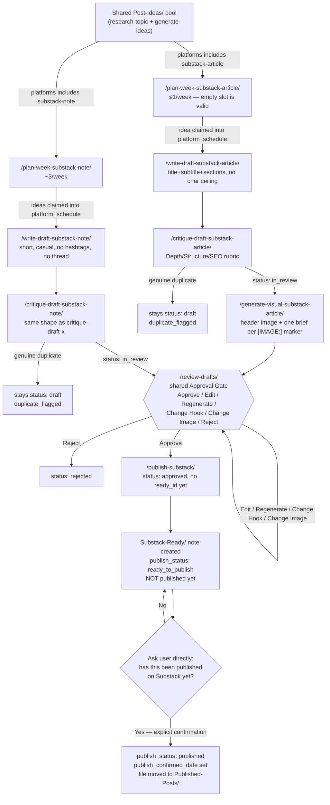

# Substack Content Pipeline (Articles + Notes) — End-to-End Workflow

## 1. Overview

This document traces the complete Substack content pipeline of the LinkedIn
Agentic AI system, in exact chronological execution order, for both of
Substack's two formats: long-form **Articles** (1/week default, only for
ideas that genuinely earn full-length treatment) and short-form **Notes**
(~3/week default, casual/conversational). The system is a set of Claude Code
"skills" — prompt-driven instruction files at `.claude/skills/<name>/SKILL.md`
— each invoked one at a time by a human via a slash command. There is no
autonomous background execution anywhere in this pipeline; every stage runs
because a human typed a command, or, in the one-shot orchestrator case,
because a human typed one command that sequences several skills within that
same session.

Both sub-pipelines share the **research and idea pool** with LinkedIn and X
(one `/research-topic` → `/generate-ideas` backlog feeds all platforms — full
detail in [06-Content-Research.md](06-Content-Research.md)) and the **human
approval gate**, `/review-drafts` (shared across every platform's drafts —
full detail in
[01-LinkedIn-Post-Creation-and-Scheduling.md](01-LinkedIn-Post-Creation-and-Scheduling.md)).
Everything downstream of idea generation — planning, drafting, critique, and
(for Articles) visual briefing — is independent per format, using two
separate rubrics and two separate sections of one shared
[`playbook-substack.md`](../../Content-Learnings/playbook-substack.md) and one
shared [`voice-guide-substack.md`](../../Content-Learnings/voice-guide-substack.md)
(Articles and Notes get their own sections within each file, tracked as
separate populations, never averaged together).

The one respect in which Substack differs from both LinkedIn and X: **there
is no scheduling/publishing API stage at all.** Buffer has no Substack
channel, and Substack has no supported public posting API. Both sub-pipelines
converge not just at the shared approval gate but again at a shared terminal
skill, `/publish-substack`, which hands off a copy-ready deliverable and ends
the automated part of the pipeline there — a human pastes the content into
Substack's own editor and publishes it themselves, and the system only marks
anything `published` after that human explicitly confirms it happened.

Multi-image visual generation for Articles (`/generate-visual-substack-article`)
is covered here only at the depth needed to place it correctly in the
pipeline; its full prompt-construction detail lives in
[07-Visual-Generation.md](07-Visual-Generation.md).

---

## 2. Top-Line Flow Chains

### 2.1 Articles (manual, step-by-step path)

```
User Request
  → /research-topic (shared pool, broad scan across 15 pillars)
  → /generate-ideas (shared pool; idea gains platforms: [substack-article, ...] tag)
  → /plan-week-substack-article (claims one idea into platform_schedule[],
      ≤1/week; an honest "nothing qualifies this week" is a valid, correct
      outcome — never a forced fill)
  → /write-draft-substack-article (title/subtitle/sectioned body, no
      character ceiling; [IMAGE: <label>] markers placed inline where a
      visual would genuinely help; fixed standing sign-off block appended)
  → /critique-draft-substack-article (Depth/Structure/SEO-weighted Viral
      Potential Score — not a scroll-stopping-hook gate; one auto-revision
      pass if the score is below 6)
  → /generate-visual-substack-article (one mandatory header/hero image brief
      every article gets, plus one brief per in-body [IMAGE:] marker — all
      written into a single Visual-Brief-Note)
  → /review-drafts (shared Approval Manager — Approve / Edit / Regenerate /
      Change Hook / Change Image / Reject; "Change Time" is told plainly not
      to apply — Substack timing is manual)
  → /publish-substack (produces a copy-ready Substack-Ready/ note; header
      image called out separately for Substack's dedicated header-image slot)
  → Manual Copy-Paste Publish by Human (outside this pipeline's control)
  → User-Confirmed Published Status (explicit yes/no question asked this
      run; file moves Substack-Ready/ → Published-Posts/ only on "yes")
```

### 2.2 Notes (manual, step-by-step path)

```
User Request
  → /research-topic (shared pool)
  → /generate-ideas (shared pool; idea gains platforms: [substack-note, ...] tag)
  → /plan-week-substack-note (claims up to target_count [default 3] ideas
      into platform_schedule[], spread across the week; fewer filled slots
      is the correct outcome when the pool doesn't support more)
  → /write-draft-substack-note (short, casual, single-post shape — reuses
      X's short-post shape via Draft-Note.md; no hashtags; no thread concept
      — an idea that needs more room belongs to /write-draft-x as a thread
      or to /write-draft-substack-article instead)
  → /critique-draft-substack-note (same rubric shape as /critique-draft-x,
      minus the thread-cohesion factor; one auto-revision pass if below 6)
  → /review-drafts (same shared Approval Manager as Articles)
  → /publish-substack (produces a copy-ready Substack-Ready/ note)
  → Manual Publish by Human
  → User-Confirmed Published Status
```

### 2.3 One-shot orchestrator path — `/generate-week-substack`

```
/generate-week-substack [week] [article_count=1] [note_count=3]
  → Step 1: plan the week's Substack angles
      1. /research-topic (reuse this week's pool if /generate-week or
         /generate-week-x already ran; otherwise scan sized at 6, one deep
         article + a few lighter Notes)
      2. /generate-ideas
      3. /plan-week-substack-article [week] — no forced retry if empty;
         an empty Article slot is reported honestly, not chased
      4. /plan-week-substack-note [week] [note_count] — up to 2 extra
         targeted /research-topic <pillar> 2 → /generate-ideas →
         /plan-week-substack-note rounds if Notes slots come up short
  → Step 2: one subagent (general-purpose, foreground) drafts the Article,
      if one was assigned, reading write-draft-substack-article/SKILL.md →
      critique-draft-substack-article/SKILL.md →
      generate-visual-substack-article/SKILL.md directly; up to 2 retries
      on a genuine duplicate; updates content-index.md
  → Step 3: one subagent per Note, in day order, reading
      write-draft-substack-note/SKILL.md → critique-draft-substack-note/
      SKILL.md → generate-visual/SKILL.md (platform: substack-note)
      directly; same 2-retry cap; updates content-index.md
  → Step 4: ONE combined /review-drafts pass (covers Substack + LinkedIn +
      X in-review notes together if other orchestrators ran this session)
      → /publish-substack once, for whatever ended status: approved with
      platform in {substack-article, substack-note}
  → Step 5: final report — date | platform | topic | category | viral_score
      | visual format table, variety check, ready_to_publish vs.
      confirmed-published counts (no Buffer "scheduled" concept applies here)
```

---

## 3. Flowchart



---

## 4. Stage-by-Stage Breakdown

### 4.1 Planning

| Attribute | Articles — `/plan-week-substack-article` | Notes — `/plan-week-substack-note` |
|---|---|---|
| Trigger | User invokes the command, or `/generate-week-substack` step 1.3 | User invokes the command, or `/generate-week-substack` step 1.4 |
| Responsible skill | [`plan-week-substack-article`](../../.claude/skills/plan-week-substack-article/SKILL.md) | [`plan-week-substack-note`](../../.claude/skills/plan-week-substack-note/SKILL.md) |
| Input | `Post-Ideas/` notes, `status: candidate` (or `selected` but unclaimed), `substack-article` in `platforms`; `content-index.md` filtered to `platform: substack-article` for ~4-week fatigue scan; `playbook-substack.md` Articles section | `Post-Ideas/` notes with `substack-note` in `platforms`; `content-index.md` filtered `platform: substack-note` for ~2-week fatigue scan; `playbook-substack.md` Notes section |
| Processing | Filters to ideas whose depth genuinely supports 800+ words — a thin idea that works as one LinkedIn post doesn't automatically earn a full article. Picks the day from playbook evidence (≥3 published articles) or, since this is a new format, sources a starting heuristic via WebSearch on Substack publishing-day norms and records it back into the file | Spreads `target_count` (default 3) slots across the week with gaps (not clustered), day rule from playbook evidence if present, otherwise plain even spacing with no "optimized" claim made; requires ≥2 distinct categories across the week's Notes; best-fit matching with `rank_score` as tiebreaker |
| Tools | WebSearch (only if no evidenced day rule exists yet in the playbook) | None beyond vault reads — no external research call for day selection |
| LLM vs. deterministic vs. human | LLM judgment call on which idea "earns the depth"; day/count logic is rule-based; no human decision here | LLM idea-to-slot matching; count cap, spacing, and category-variety check are rule-based; no human decision here |
| Output | At most one idea's `platform_schedule` gains `{platform: substack-article, week, date}`; idea `status` advances `candidate → selected` if first claim — or, honestly, no assignment at all this week | Up to `target_count` ideas' `platform_schedule` gains `{platform: substack-note, week, date}` entries; unfilled slots reported plainly |
| Handoff | To `/write-draft-substack-article` | To `/write-draft-substack-note` |
| Human approval required | No — approval happens later at `/review-drafts` | No |
| Failure/retry | No forced retry loop for an empty Article slot — reported honestly, not chased | `/generate-week-substack` allows one capped round (max 2) of targeted `/research-topic <pillar> 2` → `/generate-ideas` → retry if slots come up short; never forces the count |

### 4.2 Drafting

| Attribute | Articles — `/write-draft-substack-article` | Notes — `/write-draft-substack-note` |
|---|---|---|
| Trigger | Idea carries a `substack-article` entry in `platform_schedule` with no article draft linked yet | Idea carries a `substack-note` entry in `platform_schedule` with no Note draft linked yet |
| Responsible skill | [`write-draft-substack-article`](../../.claude/skills/write-draft-substack-article/SKILL.md) | [`write-draft-substack-note`](../../.claude/skills/write-draft-substack-note/SKILL.md) |
| Input | Idea Note + every research note in `sources[]` (full body, not just Summary — this format has room for real depth); `voice-guide-substack.md` Articles section; `playbook-substack.md` Articles tables | Idea Note + `sources[]`; `voice-guide-substack.md` Notes section; `playbook-substack.md` Notes tables |
| Processing | Writes a specific, concrete title; a sharpening subtitle; a sectioned body (opening states the stake, middle develops real depth, closing lands an actual point of view — not a summary); marks `[IMAGE: <label>]` spots inline where a diagram/chart genuinely helps (never for the header image, which is automatic); appends the fixed standing sign-off block verbatim; writes `seo_description`/`seo_tags` reflecting actual content | Writes short, casual, off-the-cuff text — no hashtags, no thread (`thread: []` always empty); if the idea needs more room than one Note holds, that's a signal it belongs elsewhere, not a reason to force it |
| Tools | None external — file read/write only | None external |
| LLM vs. deterministic vs. human | LLM composition under a hard verify-or-drop rule (nothing not grounded in linked research); the sign-off block itself is fixed, not generated; no human decision here | LLM composition under the same verify-or-drop rule; no human decision here |
| Output | `Drafts/YYYY-MM-DD--kebab-slug.md` from [`Substack-Article-Note.md`](../../_Templates/Substack-Article-Note.md): `type`/`platform: substack-article`, `status: draft`, `viral_score: 0`, `visual_ids: []` | `Drafts/YYYY-MM-DD--kebab-slug.md` from `Draft-Note.md`: `platform: substack-note`, `hashtags: []`, `thread: []`, `status: draft` |
| Handoff | Idea `status` flips `selected → drafted` only if this was its last unclaimed platform; draft moves to `/critique-draft-substack-article` | Same idea-status rule; draft moves to `/critique-draft-substack-note` |
| Human approval required | No | No |
| Failure/retry | Orchestrator subagent retries up to 2 times on a genuine duplicate found at critique | Same 2-retry cap |

### 4.3 Critique

| Attribute | Articles — `/critique-draft-substack-article` | Notes — `/critique-draft-substack-note` |
|---|---|---|
| Trigger | Note is `type: substack-article`, `status: draft` | Note is `platform: substack-note`, `status: draft` |
| Responsible skill | [`critique-draft-substack-article`](../../.claude/skills/critique-draft-substack-article/SKILL.md) | [`critique-draft-substack-note`](../../.claude/skills/critique-draft-substack-note/SKILL.md) — reuses `/critique-draft-x`'s short-form rubric shape, minus thread-cohesion |
| Input | `sources[]` (re-verified), `content-index.md` filtered `platform: substack-article`, `voice-guide-substack.md` Articles section (if a revision pass runs), `playbook-substack.md` Articles section | `sources[]`, `content-index.md` filtered `platform: substack-note`, `voice-guide-substack.md` Notes section, `playbook-substack.md` Notes section |
| Processing | Re-verifies every claim still traces to linked research, fixing drift now (soften/remove, don't just flag); duplicate scan against `content-index.md` (genuine duplicate stops here; similar-but-distinct only lowers the Originality sub-score); scores Viral Potential 0–10, averaging 7 factors: Structure/flow, Depth, SEO/discoverability fit, Technical accuracy, Originality, Reader payoff, Historical playbook alignment — **no hook-strength factor**, since a subscriber already opted in | Same re-verify and duplicate-scan steps, scoped to Notes; scores 0–10 averaging: Hook strength, Scannability, Novelty/insight, Discussion catalysis, Technical accuracy, Originality, Historical playbook alignment |
| Tools | None external | None external |
| LLM vs. deterministic vs. human | LLM scoring/judgment; auto-revision capped deterministically at exactly one pass if score < 6; no human decision here | Same |
| Output | `viral_score`, `## Critic Notes`, `status: draft → in_review` (skipped if a genuine duplicate was found — stays `draft`, gets `duplicate_flagged`) | Same field updates, same duplicate handling |
| Handoff | To `/generate-visual-substack-article`, then `/review-drafts` | Directly to `/review-drafts` (Notes have no separate visual stage requirement, though `/generate-week-substack` still routes each Note through `/generate-visual` for platform `substack-note`) |
| Human approval required | No — human review happens at `/review-drafts` | No |
| Failure/retry | Never revises more than once per run; a genuine duplicate never advances past `draft` | Same |

### 4.4 Visual (Articles only)

| Attribute | `/generate-visual-substack-article` |
|---|---|
| Trigger | Article has no linked Visual-Brief-Note yet — a header image alone is sufficient reason to run; in-body markers are additive, not a prerequisite |
| Responsible skill | [`generate-visual-substack-article`](../../.claude/skills/generate-visual-substack-article/SKILL.md) — full prompt-construction methodology cross-referenced in [07-Visual-Generation.md](07-Visual-Generation.md) |
| Input | Article `title`, `subtitle`, and overall thesis; full body for `[IMAGE: <label>]` markers (zero markers is a valid state); `content-index.md`'s `visual_format`/`image_concept` columns, to avoid repeating a visual concept within the same article or across the archive |
| Processing | (1) Designs one mandatory header/hero image representing the piece as a whole — added 2026-09-14 per direct user feedback, since Substack's editor has a dedicated header-image slot every published article should fill; this is exempt from the "no purely decorative visuals" rule, since representing the whole piece is a legitimate purpose on its own. (2) Collects every `[IMAGE:]` marker in the body. (3) For each marker, reads the surrounding section's actual content (not just the label) and designs a visual that supports that specific point — varying format per need (mechanism diagram, comparison graphic, chart), never defaulting every marker to the same shape. (4) Optional WebSearch on visual/design trends, same judgment gate as `/generate-visual` (skipped when the concept is simple enough that research wouldn't change the outcome). (5) Writes ONE Visual-Brief-Note covering the whole set — `## Header Image` block first, then one `## Section Image: <label>` block per marker — at a wider landscape aspect ratio typical for Substack's header/in-body slots (e.g. 1456×816), verified rather than assumed |
| Tools | WebSearch (optional, design-trend research only); **no image-generation provider call** |
| LLM vs. deterministic vs. human | LLM prompt composition; the hard rule that no provider is ever called is deterministic/enforced, not a judgment call | 
| Output | One `Visuals/YYYY-MM-DD--kebab-slug.md` Visual-Brief-Note, `platform: substack-article`, `draft_id` set; article's `visual_ids[]` updated with this single id (covering header + every marker) |
| Handoff | To `/review-drafts`, where the brief is shown alongside the draft | 
| Human approval required | No at this stage — the brief is reviewed as part of the draft at `/review-drafts`; "Change Image" there re-runs this skill | 
| Failure/retry | No retry logic specified; a full re-run happens only via the "Change Image" review action | 

### 4.5 Approval (shared — Articles and Notes alike)

Full mechanics documented in
[01-LinkedIn-Post-Creation-and-Scheduling.md](01-LinkedIn-Post-Creation-and-Scheduling.md).
Substack-specific behavior in [`review-drafts`](../../.claude/skills/review-drafts/SKILL.md):

- **Presentation shape differs by type.** A `substack-article` note is shown
  as title, subtitle, and the full `## Article Body`; a `substack-note` (like
  LinkedIn/X drafts) is shown as full post text, hashtags, and character
  count. Both then show `viral_score` with its factor breakdown from
  `## Critic Notes`, any linked visual brief(s), and the assigned
  `platform_schedule` date.
- **"Change Time" does not apply.** For `substack-article`/`substack-note`,
  this action tells the reviewer plainly that publish timing is manual and
  the action doesn't apply — it's only meaningful for Buffer-scheduled
  linkedin/x drafts.
- **Regenerate/Change Image route to the platform-correct skill:**
  `/write-draft-substack-article` or `/write-draft-substack-note` for
  Regenerate; `/generate-visual-substack-article` (articles) or
  `/generate-visual` (notes) for Change Image.
- **End-of-run reporting is different for Substack.** There's no Buffer
  rolling-2-day-ahead queue to check — the report just states the approved
  count, since `/publish-substack` is what those approvals feed into next,
  not a scheduler.
- This remains the only skill in the entire pipeline allowed to set
  `status: approved`.

### 4.6 Publish (shared skill, per-note branching)

| Attribute | `/publish-substack` |
|---|---|
| Trigger | User invokes the command, or `/generate-week-substack` step 4.2, after `/review-drafts` |
| Responsible skill | [`publish-substack`](../../.claude/skills/publish-substack/SKILL.md) |
| Input | Every `status: approved` note with `platform` in `{substack-article, substack-note}` and no `ready_id` yet |
| Processing | See full deep-dive in §5 below |
| Tools | None — no external API of any kind |
| LLM vs. deterministic vs. human | Content assembly (copying final text into the Ready note) is deterministic; the publish-confirmation step is a genuine **human decision**, not inferred |
| Output | `Substack-Ready/YYYY-MM-DD--kebab-slug.md`, then either stays `ready_to_publish` or moves to `Published-Posts/` at `published` |
| Handoff | Terminal stage of the pipeline — nothing downstream except manual analytics entry into `playbook-substack.md` via `/update-playbook substack` |
| Human approval required | Yes — explicit, this-run confirmation before anything is marked `published` (§5) |
| Failure/retry | Not applicable — "not yet published" is a normal waiting state, not a failure; the skill never guesses |

---

## 5. Deep Dive: `/publish-substack`

This is the pipeline's one genuinely different terminal stage compared to
LinkedIn/X's `/schedule-approved`/`/schedule-approved-x`: there is no Buffer
channel and no supported API call to make, so the skill's entire job is
producing a clean, human-actionable deliverable and then honestly recording
what actually happened.

### 5.1 Producing the copy-ready `Substack-Ready/` note

Per-note process (from the SKILL.md):

1. Copies [`_Templates/Substack-Ready-Note.md`](../../_Templates/Substack-Ready-Note.md)
   into `Substack-Ready/` as `YYYY-MM-DD--kebab-slug.md`, filling `draft_id`
   and `platform`, then branching by format:
   - **`substack-article`:** fills `title`, and copies the full article body
     verbatim into `## Final Content`. Any in-body images already generated
     are noted as `insert image: <label>` at their marker positions — this
     handoff step never embeds actual image files. The header/hero image is
     called out **separately** in `## Publishing Notes`, explicitly flagged
     as going into Substack's dedicated header-image slot in the editor, not
     inline in the body — so it can't be mistaken for just another in-body
     marker.
   - **`substack-note`:** fills `final_text`, mirrored into `## Final
     Content` as well.
2. Sets `publish_status: ready_to_publish`; copies `category`/`format`/
   `hashtags`/`visual_ids`/`sources` from the source note; computes `length`
   from the final text/body; sets the source Draft/Article note's `ready_id`
   to the new note's id.

### 5.2 Presenting the deliverable

The skill shows the full final content exactly as it should be pasted into
Substack's editor, plus a reminder of any images still needing manual
insertion at their marked spots, and states plainly: **this is not published
yet — nothing external has happened.** This is described in the SKILL.md as
the same "prompt not a picture" honesty `/generate-visual` already applies,
now for the whole piece.

### 5.3 The confirmation mechanism (the critical check)

The skill asks the user **directly** (via `AskUserQuestion` when
interactive): *"has this actually been published on Substack yet?"* The
SKILL.md is explicit that the skill must **not assume yes because time has
passed or because the user moved on to another task** — there is no timeout,
no polling, and no inference from context. This is a real human
decision-point, not a heuristic.

- **If confirmed published:** `publish_confirmed_date` is set to today,
  `publish_status: published`, and the file moves from `Substack-Ready/` to
  `Published-Posts/`. The source Draft/Article note's `status` is left
  unchanged at `approved` (it stays the historical record, same pattern
  `/schedule-approved` uses for its Draft Notes), but its `history` gains
  `{action: scheduled, date, note: "published manually via
  publish-substack"}` — deliberately reusing the existing `scheduled`
  history action name, since semantically it means the same thing here: the
  note left the approval stage for real, external distribution.
- **If not yet published:** the note simply stays in `Substack-Ready/` at
  `publish_status: ready_to_publish`. The SKILL.md states this is "a normal,
  expected state — not an error — for however long it takes the user to
  actually paste it in."

Hard rules enforced by the skill: never call any Substack API, official or
unofficial; never set `publish_status: published` or
`publish_confirmed_date` without an explicit user confirmation *this run*;
never invent or guess a publish date from context; never process a note that
isn't `status: approved`.

---

## 6. Agents & Skills Involved

| # | Skill | Role | Format |
|---|---|---|---|
| 1 | [`plan-week-substack-article`](../../.claude/skills/plan-week-substack-article/SKILL.md) | Content Strategist (Articles) | Articles |
| 2 | [`write-draft-substack-article`](../../.claude/skills/write-draft-substack-article/SKILL.md) | Substack Writer (long-form) | Articles |
| 3 | [`critique-draft-substack-article`](../../.claude/skills/critique-draft-substack-article/SKILL.md) | Critic Agent (Depth/Structure/SEO) | Articles |
| 4 | [`generate-visual-substack-article`](../../.claude/skills/generate-visual-substack-article/SKILL.md) | Visual Agent (multi-image) | Articles |
| 5 | [`plan-week-substack-note`](../../.claude/skills/plan-week-substack-note/SKILL.md) | Content Strategist (Notes) | Notes |
| 6 | [`write-draft-substack-note`](../../.claude/skills/write-draft-substack-note/SKILL.md) | Substack Notes Writer | Notes |
| 7 | [`critique-draft-substack-note`](../../.claude/skills/critique-draft-substack-note/SKILL.md) | Critic Agent (short-form rubric) | Notes |
| 8 | [`publish-substack`](../../.claude/skills/publish-substack/SKILL.md) | Manual Publish Handoff | Both |
| 9 | [`generate-week-substack`](../../.claude/skills/generate-week-substack/SKILL.md) | Weekly Orchestrator | Both |

Two more skills participate but are documented in full elsewhere because
they're shared across every platform, not Substack-specific: `/review-drafts`
(§4.5 above; full detail in
[01-LinkedIn-Post-Creation-and-Scheduling.md](01-LinkedIn-Post-Creation-and-Scheduling.md))
and `/research-topic` + `/generate-ideas` (full detail in
[06-Content-Research.md](06-Content-Research.md)).

---

## 7. Tools / APIs Used

- **No Buffer.** Buffer has no Substack channel at all — this is stated
  directly in the pipeline table
  ([README.md](../../README.md) lines 253–257) and in
  [REQUIREMENTS.md §25.3](../../REQUIREMENTS.md#25-multi-platform-expansion-x-twitter-and-substack).
  Every other platform (LinkedIn, X) has a scheduling stage that calls
  Buffer's GraphQL API; Substack has none.
- **No Substack API, official or unofficial, anywhere in this pipeline.**
  `/publish-substack`'s hard rules explicitly forbid calling any Substack
  API. An unofficial, session-cookie-based API was considered and
  deliberately rejected — see §11.
- **WebSearch** is used in exactly two places: `/plan-week-substack-article`
  (sourcing a starting day-of-week heuristic when the playbook has no
  evidenced rule yet) and `/generate-visual-substack-article` (optional
  design/visual-trend research, same judgment gate as `/generate-visual` —
  skipped when it wouldn't change a simple concept).
- **Visual generation is prompt-only.** `/generate-visual-substack-article`
  never calls an image-generation provider — its entire deliverable is a
  finished, paste-ready prompt. Full rationale and prompt methodology:
  [07-Visual-Generation.md](07-Visual-Generation.md).
- **No Substack analytics API.** Per REQUIREMENTS §25.3, Substack metrics
  have no automated pull; numbers are entered manually from the user's own
  dashboard when available, feeding `/update-playbook substack`. This sits
  downstream of the pipeline this document covers, not inside it.

---

## 8. Validation & Quality Gates

### Articles: Depth/Structure/SEO-weighted rubric

`/critique-draft-substack-article` averages 7 factors, each 0–10: Structure/
flow, Depth, SEO/discoverability fit, Technical accuracy, Originality,
Reader payoff, and Historical playbook alignment. There is **no
hook-strength factor** in the feed-post sense — the title/subtitle/opening
paragraph are judged under Structure and Reader payoff instead, since a
Substack subscriber has already opted in (a fundamentally different reading
context than a scroll-stopping LinkedIn/X hook has to win).

### Notes: same rubric shape as X, no thread concept

`/critique-draft-substack-note` reuses `/critique-draft-x`'s short-form
rubric shape exactly, minus the thread-cohesion factor (Notes have no thread
concept at all): Hook strength, Scannability, Novelty/insight, Discussion
catalysis, Technical accuracy, Originality, Historical playbook alignment.

### Shared mechanics (both formats)

- **Auto-revision:** a score below 6 triggers exactly one targeted revision
  pass (re-reading the relevant `voice-guide-substack.md` section), then
  recomputes and stops — never more than one pass per run.
- **Duplicate handling is two-tier**, same as every other platform's
  critique skill: a genuine duplicate (same underlying story/argument/
  structure) stops the note at `status: draft` with `duplicate_flagged`
  appended, never reaching review; a similar-but-distinct angle only lowers
  the Originality sub-score and still proceeds to `in_review`.

### The "earns the depth" gate for Articles

`/plan-week-substack-article` filters candidates to ideas whose depth
genuinely supports 800+ words of real substance — "a thin idea that works
fine as a single LinkedIn post doesn't automatically deserve a full
article." Its hard rules state: "Never force a shallow idea into article
form just to fill the slot — an honest 'nothing qualifies this week' is the
correct outcome." README.md confirms this at the pipeline level (line 261):
picks "at most one idea/week deep enough to earn full long-form treatment —
an honest 'nothing qualifies' is a valid outcome," and REQUIREMENTS §25.3
states directly: "an empty slot in a given week is a correct, honest
outcome." `/generate-week-substack` reinforces this asymmetrically against
Notes: the Article slot gets **no forced retry loop** ("reported honestly,
not chased"), while Notes slots get a capped 2-round targeted retry before
also settling for fewer-than-target as the correct outcome.

---

## 9. Data Stored in Memory / Vault

### `Substack-Article-Note` frontmatter
([`_Templates/Substack-Article-Note.md`](../../_Templates/Substack-Article-Note.md))

`id`, `type: substack-article`, `platform: substack-article`, `idea_id`,
`category`, `title`, `subtitle`, `seo_description` (1–2 sentence meta
description for search/share previews), `seo_tags[]`, `hashtags[]` (unused
for articles), `visual_ids[]` (a single id covering the header image plus
any in-body section images), `sources[]` (research notes backing factual
claims), `viral_score` (0–10, the depth/structure/SEO rubric), `status`
(`draft | in_review | approved | rejected | placeholder`), `ready_id` (set
once `/publish-substack` hands the note off), `history[]` (`created |
edited | regenerated | image_changed | approved | rejected |
ready_for_publish`). Body: `## Article Body` with `[IMAGE: <label>]`
markers, the fixed standing sign-off block, `## Sources (internal)`, `##
Reviewer Notes`.

### `Substack-Ready-Note` frontmatter
([`_Templates/Substack-Ready-Note.md`](../../_Templates/Substack-Ready-Note.md))

`id`, `type: substack-ready` (used for the note both while awaiting manual
publish and after — the file itself moves folders on confirmed publish),
`draft_id`, `platform` (`substack-article | substack-note`), `title`
(articles only), `final_text` (notes only — articles keep content in `##
Final Content` instead), `publish_confirmed_date` (left blank until
explicit confirmation — "never fill this in speculatively"),
`publish_status` (`ready_to_publish | published | placeholder`), `category`,
`format`, `length` (character count), `hashtags[]`, `visual_ids[]`,
`sources[]`. Body: `## Final Content` (copy-ready mirror of the approved
content) and `## Publishing Notes`.

### `playbook-substack.md` structure
([Content-Learnings/playbook-substack.md](../../Content-Learnings/playbook-substack.md))

Header (`id`, `type: playbook`, `platform: substack`, `version`,
`last_updated`), then four evidence tables — **Articles: Best-Performing
Patterns**, **Articles: Anti-Patterns**, **Notes: Best-Performing
Patterns**, **Notes: Anti-Patterns** — each with columns `rule | evidence
(post ids) | confidence | date_added`, plus a **Topic Fatigue Watch** list.
As read, the file is currently **empty**: nothing has been published yet,
and Substack has no Buffer-style automated metrics pull, so evidence depends
entirely on the user manually entering numbers from their own Substack
dashboard. Same evidence bar as `playbook.md`: nothing is written on fewer
than 3 published posts' worth of evidence, and Articles/Notes are tracked as
separate populations rather than averaged (different formats, different
audience-in-the-moment).

`voice-guide-substack.md` is currently a default, unseeded guide
(`seeded_from: default`) — its Articles and Notes sections are documented in
§1's tone/structure description above and will be updated once real
approved/edited Substack content exists to learn from.

`content-index.md` carries a shared `platform` column across LinkedIn, X,
and Substack for cross-platform dedup/fatigue checks, per REQUIREMENTS
§25.4 — one index, not three.

---

## 10. Failure Modes & Recovery

| Scenario | What happens |
|---|---|
| No idea in the pool clears the Article depth bar | `/plan-week-substack-article` reports plainly that nothing qualifies this week, plus what topic area would need more research; no idea is stretched to fill the slot. `/generate-week-substack` does not force a retry for this specific slot — an empty Article slot is a correct, honest outcome, not a shortfall (README/REQUIREMENTS §25.3 both confirm this explicitly). |
| Genuine duplicate found at critique | Note stays `status: draft`, gets `duplicate_flagged` appended, and is reported plainly — it never reaches `in_review` or the approval gate. Applies identically to Articles and Notes. |
| Viral score stays weak after the one allowed auto-revision pass | The critique skills recompute once and stop — no second revision loop. The note still advances to `in_review` (unless it was a duplicate) so a human can weigh it directly at `/review-drafts`, rather than looping indefinitely trying to hit a threshold. |
| Notes slots come up short of `target_count` | `/generate-week-substack` allows one capped round (max 2 extra rounds) of a targeted `/research-topic <pillar> 2` → `/generate-ideas` → `/plan-week-substack-note` retry. If still short, fewer filled slots is the correct, reported outcome — `/plan-week-substack-note`'s hard rules forbid forcing the count. |
| User says they have **not** published yet, when `/publish-substack` asks | The note stays in `Substack-Ready/` at `publish_status: ready_to_publish`. The SKILL.md is explicit this is "a normal, expected state — not an error." `publish_status: published` and `publish_confirmed_date` are never set without that run's explicit "yes." |
| User is unreachable / doesn't answer the confirmation question | The skill does not proceed to mark anything published on a timeout or by inferring from elapsed time — the hard rule is "never invent or guess a publish date from context." The note simply remains `ready_to_publish` until asked again. |
| `/review-drafts` action other than Approve/Reject (Edit, Regenerate, Change Hook, Change Image) | Status stays `in_review` — never auto-approved. A fresh, explicit Approve is required afterward, same as every other platform. |
| Attempting `/publish-substack` on a note that isn't `status: approved` | Hard rule forbids it — the skill only processes `status: approved` notes with no `ready_id` yet. |

---

## 11. Why Manual Publish

Per [REQUIREMENTS.md §25.3](../../REQUIREMENTS.md#25-multi-platform-expansion-x-twitter-and-substack):

> **Publishing is manual by design, not a missing feature.** Buffer has no
> Substack channel, and Substack has no supported public posting API. An
> unofficial, session-cookie-based API was explicitly considered and
> rejected (ToS risk, undocumented, could break silently) in favor of the
> same deliberate-manual precedent this pipeline already uses for image
> generation (§7): the system produces a finished, copy-ready deliverable,
> and a human performs the actual publish action. The system never marks
> something `published` without the user's explicit confirmation that
> run — no assuming publication happened just because time passed.

[README.md](../../README.md) (line 391) states the same decision in the
personalization section: *"Substack publishing is manual by design, not a
missing feature. Buffer has no Substack channel and Substack has no
supported public posting API — an unofficial, session-cookie-based API was
explicitly considered and rejected for the ToS/reliability risk."*

This makes `/publish-substack` architecturally consistent with
`/generate-visual`/`/generate-visual-substack-article` rather than an
exception: both stages could technically be automated by reaching for an
unofficial or unsupported integration, and both deliberately choose instead
to produce a finished, human-actionable deliverable and stop there. The
[`publish-substack` SKILL.md](../../.claude/skills/publish-substack/SKILL.md)
frames it directly: "Rather than reach for an unofficial, session-cookie-
based API... this skill does what the pipeline already does for image
generation — hand off a finished, ready-to-paste deliverable and let the
human do the actual publish action, then record that confirmation honestly
rather than assuming it happened."

Full architecture rationale (the four resolved questions behind the whole
multi-platform expansion, not just this decision) is linked from both
REQUIREMENTS §25 and README: [DECISIONS.md — Multi-Platform Expansion (X +
Substack) decisions](../../DECISIONS.md#multi-platform-expansion-x--substack-decisions).
