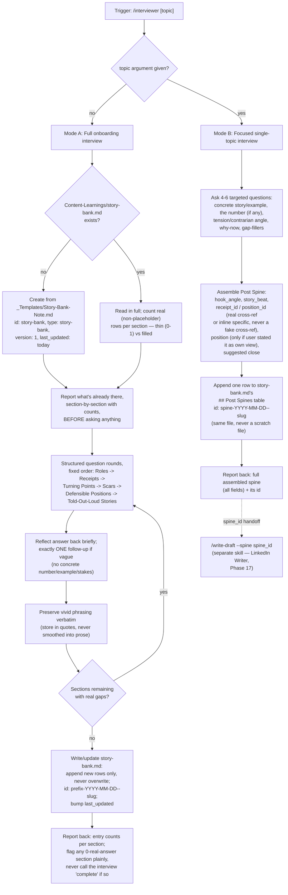
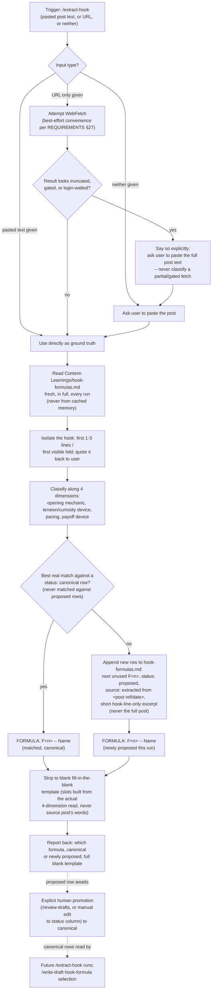

# Story Bank Interviewer and Hook Extractor — Voice-Grounding Tools

## 0. Scope

This document covers two related but independent voice-grounding tools in
the LinkedIn Agentic AI system, both implemented as Claude Code "skills" —
prompt-driven instruction files at `.claude/skills/<name>/SKILL.md`, each
invoked one at a time by a human via a slash command:

- **Part A — Story Bank Interviewer** (`/interviewer`,
  [`.claude/skills/interviewer/SKILL.md`](../../.claude/skills/interviewer/SKILL.md),
  Phase 15,
  [REQUIREMENTS.md §26](../../REQUIREMENTS.md)) — builds and maintains
  `Content-Learnings/story-bank.md`, the system's only source of real,
  user-supplied career material.
- **Part B — Hook Extractor** (`/extract-hook`,
  [`.claude/skills/extract-hook/SKILL.md`](../../.claude/skills/extract-hook/SKILL.md),
  Phase 16,
  [REQUIREMENTS.md §27](../../REQUIREMENTS.md) and
  [§28](../../REQUIREMENTS.md)) — reverse-engineers the hook formula behind
  a pasted post against `Content-Learnings/hook-formulas.md`'s shared
  taxonomy.

Both are on-demand, manually triggered tools that feed later drafting
skills rather than producing finished posts themselves. Neither drafts,
critiques, schedules, or publishes anything.

---

## Part A: Story Bank Interviewer

### A.1 Overview

The Interviewer is the system's onboarding tool. Every other content-
generation skill (`/write-draft` and its X/Substack variants, `/plan-week`,
`/generate-week`) grounds a draft in either a research note or a prior post
archive — neither of which exists for a user who hasn't posted yet, and
neither of which carries the kind of specific, personal material (a real
number, a war story, a position the user would actually defend) that
separates a generic post from one only this person could have written. The
Story Bank is where that material lives, and `/interviewer` is the only
skill that populates it — and the only content-generation-adjacent skill
that works for a brand-new account with zero post archive, since it draws
directly on the user's career history rather than prior content
([REQUIREMENTS.md §26](../../REQUIREMENTS.md)).

The skill's single governing discipline: **it never invents an answer on
the user's behalf.** Every row in `Content-Learnings/story-bank.md` is
recorded only from what the user actually said — never inferred,
estimated, rounded, or "smoothed over" — and when the user's own phrasing
is specific or memorable, it is preserved verbatim rather than paraphrased
into generic prose. This is the same never-fabricate discipline the rest
of the vault applies to web research (REQUIREMENTS.md §21), extended to a
new kind of source: the user themselves, interviewed directly, not a
search result.

`/interviewer` runs in one of two modes, selected by whether a topic
argument is given:

- **Mode A (no argument, default)** — a full/onboarding interview across
  six fixed categories, populating `story-bank.md` from scratch or
  resuming it, skipping whatever's already filled.
- **Mode B (`/interviewer <topic>`)** — a focused, single-topic interview
  that assembles a reusable **Post Spine**, a compact handoff packet for
  `/write-draft --spine <id>`.

This skill never drafts, critiques, schedules, or publishes anything — it
only produces or updates the Story Bank.

### A.2 Top-Line Flow Chain

**Mode A — full onboarding:**

```
Trigger (/interviewer, no args)
  → Existing story-bank.md Check (resume vs fresh)
  → Section-by-Section Guided Interview
      (Roles → Receipts → Turning Points → Scars →
       Defensible Positions → Told-Out-Loud Stories)
  → Verbatim Capture (no paraphrasing away vivid phrasing)
  → story-bank.md Write/Update (append-only rows, last_updated bumped)
```

**Mode B — focused topic:**

```
Trigger (/interviewer <topic>)
  → Focused Single-Topic Interview (4-6 targeted questions)
  → Post Spine Construction (hook_angle, story_beat, cross-refs, close)
  → Post Spine Note Write (appended to story-bank.md's ## Post Spines table)
  → Handoff to /write-draft --spine <id>
```

### A.3 Flowchart



### A.4 Stage-by-Stage Breakdown

#### Mode A — Full Onboarding

| Stage | Detail |
| :--- | :--- |
| **Trigger** | Human runs `/interviewer` with no arguments. |
| **Input** | None from disk required to start; the human's spoken/typed answers during the interview are the actual input. |
| **Processing** | 1) Check whether `Content-Learnings/story-bank.md` exists. If yes, read it in full and, per one of the six category sections, count real (non-`placeholder`-status) rows and judge each thin (0-1 real rows) or filled — tell the user this breakdown, section by section, **before** asking anything, so a question is never re-asked for material already recorded. If no, create the file from [`_Templates/Story-Bank-Note.md`](../../_Templates/Story-Bank-Note.md) with `id: story-bank`, `type: story-bank`, `version: 1`, `last_updated:` today. 2) Run structured question rounds in fixed order — Roles, Receipts, Turning Points, Scars, Defensible Positions, Told-Out-Loud Stories — conversationally, reacting to what the user says rather than dumping a form. Receipts questioning specifically presses for a real number with a named referent (what/when/cost/scale), never accepting "a lot" or "significantly" as final. 3) After each answer, reflect it back briefly to confirm correct capture; if the answer is vague, ask exactly one follow-up for specificity, then move on regardless of whether it lands — never loop indefinitely on one question. 4) Preserve vivid, specific phrasing verbatim (quoted) rather than smoothing it into generic prose — this is the texture other skills lose if it's paraphrased away here. |
| **LLM vs. human-input** | Predominantly **human-answers-questions**: every fact, number, and story originates from the user. The LLM's role is structuring and organizing — asking in the fixed order, reflecting answers back, judging an answer thin vs. sufficient, and formatting captured material into the table schema. The LLM never supplies content of its own. |
| **Output** | Updated `Content-Learnings/story-bank.md`: new rows appended (never silently overwritten or deleted) under the relevant category table(s), each with a stable `id` in `<category-prefix>-YYYY-MM-DD--kebab-slug` format (e.g. `receipt-2026-09-16--cut-onboarding-time`); `last_updated` bumped to today. A correction to a previously recorded row is an explicit, user-requested, logged edit — never an automatic rewrite. |
| **Handoff** | None automatic — the skill reports back entry counts per section and explicitly flags any section left thin or empty (e.g. "0 receipts recorded — other skills will have nothing to cite for numbers until you add some"), and never describes the interview as "complete" if any category got zero real answers. `story-bank.md` then sits available for `/write-draft --spine`, `/plan-week`, `/generate-week`, and any future repurposing skill to read from directly — this skill does not push data to them. |

#### Mode B — Focused Topic

| Stage | Detail |
| :--- | :--- |
| **Trigger** | Human runs `/interviewer <topic>` with a topic argument. |
| **Input** | The topic string plus the user's answers to 4-6 targeted questions asked during the interview. |
| **Processing** | Asks 4-6 questions specific to the topic only (not the six-category sweep): the concrete story/example, the number if any (same never-accept-"a lot" discipline as Mode A), the tension or contrarian angle (what would most people in this space say, and why does the user disagree), why this matters *now*, and 1-2 more as needed to fill topic-specific gaps. Assembles a **Post Spine** — a compact, reusable handoff packet, not prose — from the answers. |
| **LLM vs. human-input** | Same split as Mode A: human supplies the story, number, and stance; LLM asks the targeted question set, and structures the answers into the spine's fixed fields, including cross-referencing an existing Roles/Receipts/Turning Points/Scars/Defensible Positions row by `id` when the topic genuinely matches one already recorded (never inventing a fake cross-reference if it doesn't). |
| **Output** | A Post Spine row appended to `Content-Learnings/story-bank.md`'s `## Post Spines` table (same living file, never a separate scratch file), `id: spine-YYYY-MM-DD--kebab-slug`, with fields `hook_angle` (sharpest one-line framing), `story_beat` (concrete narrative arc in a sentence or two), `receipt_id`/`position_id` (real cross-reference or an inline specific — never fabricated), `position` (only if the user actually stated it as their own opinion — distinguishing stated opinion from stated fact, the same discipline REQUIREMENTS §21 applies to sourced claims), and `suggested close` (a plausible ending beat for whoever drafts the post). |
| **Handoff** | The skill shows the full assembled spine and its `id`, and tells the user it's ready for `/write-draft --spine <spine_id>` — while noting explicitly that, as of this skill's own build, the `--spine` argument's wiring into `/write-draft` is separate, incremental work tracked per REQUIREMENTS.md §28 (Phase 17), not something `/interviewer` itself implements. |

### A.5 Data Stored in Memory/Vault

`Content-Learnings/story-bank.md` (schema:
[`_Templates/Story-Bank-Note.md`](../../_Templates/Story-Bank-Note.md)) is
a single living document — the same pattern as `Content-Learnings/
playbook.md` — not one note per item. Frontmatter: `id: story-bank`,
`type: story-bank`, `version`, `last_updated`. Rows accumulate under a
stable `id` per row across repeated `/interviewer` runs; other notes and
Post Spine rows reference rows by `id`, never by table position, since
rows are appended and never reordered. Rows shipped with `status:
placeholder` in the template are hand-written schema examples, not real
data, and are filtered out by any reading skill the same way every other
placeholder-status note in the vault is.

Six category tables, each with its own column schema:

| Section | Columns |
| :--- | :--- |
| `## Roles` | `id`, `title`, `scope`, `period`, `notes` |
| `## Receipts` | `id`, `claim`, `real_number`, `context`, `date_added`, `status` |
| `## Turning Points` | `id`, `story`, `what_changed`, `date_added`, `status` |
| `## Scars` | `id`, `what_happened`, `what_it_taught`, `date_added`, `status` |
| `## Defensible Positions` | `id`, `position`, `why_i_hold_it`, `date_added`, `status` |
| `## Told-Out-Loud Stories` | `id`, `story`, `when_i_tell_it`, `date_added`, `status` |

Plus one cross-cutting section:

| Section | Columns |
| :--- | :--- |
| `## Post Spines` | `id`, `topic`, `hook_angle`, `story_beat`, `receipt_id`, `position_id`, `date_added` |

Row `id` prefixes match category: `role-`, `receipt-`, `turning-`,
`scar-`, `position-`, `story-`, `spine-`, each followed by
`YYYY-MM-DD--kebab-slug` — the vault's standard id convention.

---

## Part B: Hook Extractor

### B.1 Overview

The Hook Extractor is a pattern-matching tool only. Given the pasted text
of an existing post — ideally someone else's viral post, but any post
works — it reverse-engineers the **hook formula** behind it (the opening
mechanic that grabs attention in the first 1-3 lines, before "…see more")
and classifies it against the shared taxonomy in `Content-Learnings/
hook-formulas.md`, the same file `/write-draft` (Post Writer) reads from
when picking a hook formula to draft new posts against. Output is always a
blank, fill-in-the-blank template of the matched formula's structure —
never the source post's actual words, and never a finished ghostwritten
post; turning a template into an actual new post is `/write-draft`'s job,
not this skill's.

The skill's governing discipline: **it never claims a match guarantees
virality.** Matching a formula is descriptive pattern-matching against
past structure, not a scoring or prediction tool — that distinction
belongs to `/critique-draft`'s Viral Potential Score, a different
mechanism entirely.

### B.2 Top-Line Flow Chain

```
Trigger (/extract-hook, pasted post text)
  → Input Validation (pasted text primary, URL best-effort only per §27)
  → Hook Classification Against Taxonomy (Content-Learnings/hook-formulas.md)
  → Match Found? [decision]
      Match:    Blank Fill-in-the-Blank Template Output
      No Match: Propose New Taxonomy Entry (citing source post, status: proposed)
```

### B.3 Flowchart



### B.4 Stage-by-Stage Breakdown

| Stage | Detail |
| :--- | :--- |
| **Trigger** | Human runs `/extract-hook` and supplies either pasted post text, a URL, or nothing yet. |
| **Input** | **Pasted post text is the primary, reliable input** ([REQUIREMENTS.md §27](../../REQUIREMENTS.md), the shared convention this skill cross-references rather than restating). A URL is accepted as optional, best-effort metadata only: if only a URL is given, the skill attempts a WebFetch, then looks hard at what came back — a login wall, a truncated/partial extract, or a missing post body are treated as common outcomes, not edge cases. §27's reasoning: **no official API exists anywhere in this repo for reading an arbitrary third-party post's content from just a URL**, on LinkedIn or any other platform — Buffer, the system's only platform integration, covers only the user's own scheduling/publishing/analytics, never someone else's content, and no skill in this repo scrapes or uses session cookies to bypass login/ToS to read third-party content (the same precedent as §25.3's rejection of an unofficial Substack API for this system's own publishing). If the WebFetch result looks truncated, gated, or otherwise unreliable, the skill says so explicitly and asks the user to paste the full text instead of silently proceeding to classify a partial fetch as if it were the whole post. If neither pasted text nor a URL is given, it asks the user to paste the post. |
| **Processing** | Reads `Content-Learnings/hook-formulas.md` fresh, in full, on every run (never from cached memory, since the taxonomy grows over time). Isolates the hook — the first 1-3 lines / the first visible fold, what a reader sees before "…see more" — and quotes it back to the user so there's no ambiguity about what's being classified. Classifies it along four dimensions: **opening mechanic** (claim, confession, number, contrarian statement, etc.), **tension/curiosity device** (the gap, contradiction, or unresolved stakes that pulls a reader to line 2), **pacing** (line-break rhythm, short punchy fragments vs. a longer developing sentence), and **payoff device** (how, or whether, the tension starts to resolve within the hook itself). Compares this four-dimension read against every `status: canonical` row in the taxonomy — `proposed` rows are never used as a match target, since they aren't trusted yet — and picks the best real match. |
| **Output** | If a real match exists: a blank fill-in-the-blank template of that formula's structure, with slots built from the actual four-dimension read of the source hook (never the source post's actual words). If nothing fits well, the skill **never forces a bad match and never refuses to classify** — instead it appends a new row to `hook-formulas.md` live (a real edit to the shared file, not just a described one): next unused `F<n>`, `status: proposed`, `source: extracted from <short post reference/date>`, and a short illustrative excerpt of the hook line only (never a full reproduction of the source post) — then produces the blank template from that newly proposed formula the same way. The report back always states which formula matched (or was newly proposed) and whether it's `canonical` or `proposed`. |
| **Handoff** | A `proposed` row is visible in `hook-formulas.md` immediately but not yet trusted for drafting: both `/extract-hook` and `/write-draft` only ever read `canonical` rows. Promotion to `canonical` happens only by explicit human confirmation — e.g. during `/review-drafts`, or a manual edit to the file's `status` column — never automatically and never just because the formula was used once. This skill does not promote its own proposals. |

### B.5 Data Stored in Memory/Vault

`Content-Learnings/hook-formulas.md` is a single living document — same
pattern as `playbook.md` and `story-bank.md` — with frontmatter `id:
hook-formulas`, `type: hook-formulas`, `version`, `last_updated`, under one
`## Formulas` table:

| Column | Meaning |
| :--- | :--- |
| `formula_id` | `F<n>`, sequential, never reused |
| `name` | Short formula name (e.g. "Contrarian + Historical Receipts") |
| `mechanic` | One-line description of the structural pattern |
| `engagement_goals` | Zero or more of the closed 5-value list (likes, comments, shares/reposts, saves, profile-visits); blank = general-purpose, eligible for any goal |
| `status` | `canonical` (trusted, selectable for drafting/matching) or `proposed` (visible, not yet trusted) |
| `source` | Provenance — the seed set's rows all read `adapted from sergebulaev/linkedin-skills (MIT)`; a row `/extract-hook` appends reads `extracted from <short post reference/date>` |

As read on 2026-09-17, the table holds 20 seed rows (`F1`–`F20`), all
`status: canonical`, `source: adapted from sergebulaev/linkedin-skills
(MIT)` — e.g. `F10` Contrarian + Historical Receipts (comments), `F11`
Emotional Cold-Open (likes), `F7` Odd-Precision Money Ledger (saves), `F20`
Diverging-Curves Close (reposts). A trailing `## Adding a new formula`
section documents the append rule and the canonical/proposed lifecycle
described above; `/extract-hook` is the only skill that appends new rows,
always as `status: proposed`, and promotion out of `proposed` is a human,
not automated, action.

---

## Closing Section

### Agents & Skills Involved

| Command / Skill | Role | Description | Trigger |
| :--- | :--- | :--- | :--- |
| `/interviewer` | Story Bank Interviewer | Full onboarding interview populating `Content-Learnings/story-bank.md` from scratch or resuming it (Mode A); given a topic argument, a focused single-topic interview producing a reusable Post Spine handed to `/write-draft --spine <id>` (Mode B). Never invents an answer on the user's behalf. | Manual / on demand — recommended before first post, and whenever a new topic needs its own Post Spine |
| `/extract-hook` | Hook Extractor | Reverse-engineers the opening-hook formula behind a pasted post (URL best-effort only) against `Content-Learnings/hook-formulas.md`'s shared taxonomy; returns a blank fill-in-the-blank template; proposes a new taxonomy entry rather than forcing a bad match. | Manual / on demand |

Both entries also appear in the "Story Bank & Voice Grounding" section of
[`README.md`](../../README.md) (lines 296-301).

### Tools/APIs Used

Both skills are primarily **LLM-reasoning tools operating on user-supplied
text** — there is no external API call intrinsic to either one's core
function:

- `/interviewer` reads/writes only local vault files
  (`Content-Learnings/story-bank.md`,
  `_Templates/Story-Bank-Note.md`) and conducts the interview through
  ordinary conversational turns; it calls no external service at all.
- `/extract-hook` reads/writes only `Content-Learnings/hook-formulas.md`
  locally; its one external-facing capability is an optional, best-effort
  WebFetch attempt when a user supplies a URL instead of pasted text — and
  per REQUIREMENTS.md §27, that result is never treated as ground truth on
  its own. Neither skill performs a live fetch of arbitrary third-party
  URLs as a reliable data path, because **no official API exists in this
  repo for reading an arbitrary third-party post's content from just a
  URL** — the same limitation documented for Comment Drafter, Reply
  Handler, and Engagement Monitor, all of which cross-reference the same
  §27 convention rather than each re-deriving it.

### Validation & Quality Gates

- **Verbatim-preservation rule (Interviewer).** When the user's phrasing is
  specific or memorable, it is stored verbatim (quoted) rather than
  smoothed into generic prose — texture other skills would otherwise lose.
- **Never-invents-an-answer rule (Interviewer).** No number, story detail,
  or quote is ever invented, rounded, estimated, or "smoothed over" —
  ambiguity is resolved with exactly one follow-up question, never a
  plausible-sounding fill-in. A "position" is recorded only if the user
  actually stated it as their own view, distinguishing stated opinion from
  stated fact. An interview is never reported "complete" if any category
  got zero real answers.
- **Never-guarantees-virality rule (Hook Extractor).** A formula match is
  descriptive pattern-matching against past structure only — never framed
  as a prediction or a guarantee of engagement, which stays the separate
  responsibility of `/critique-draft`'s Viral Potential Score.
- **New-taxonomy-entry-over-forced-bad-match rule (Hook Extractor).** A
  hook that doesn't fit the taxonomy well is never forced into a canonical
  formula just to avoid proposing a new one, and never dropped/refused
  either — the skill always produces either a real match or a new
  `proposed` row, live-appended to `hook-formulas.md`.

### Failure Modes & Recovery

- **Interviewer — user has nothing to say for a section.** The skill does
  not stall: it asks its one follow-up if the initial answer was vague,
  then moves on regardless of whether it lands. A section that ends with
  zero real rows is recorded honestly as thin/empty in the report-back
  ("0 receipts recorded — other skills will have nothing to cite for
  numbers until you add some") rather than padded with generic placeholder
  content or silently glossed over.
- **Interviewer — resuming an existing story-bank.md.** On a later run,
  already-filled sections (judged filled at >1 real row) are not re-asked;
  the skill tells the user what's already recorded, section by section,
  before asking anything new, and any correction to an existing row is an
  explicit, user-requested, logged edit rather than a silent overwrite.
- **Hook Extractor — pasted post doesn't match any existing hook
  pattern.** The skill proposes a new `status: proposed` taxonomy entry
  citing the source post (short hook-line excerpt only), rather than
  forcing a classification into a poorly-fitting canonical row or refusing
  to classify at all. The proposed row is visible immediately but excluded
  from both future `/extract-hook` matching and `/write-draft` selection
  until a human explicitly promotes it to `canonical`.
- **Hook Extractor — only a URL is given and the fetch is unreliable.** A
  login wall, paywall, or obviously partial/stripped WebFetch result is
  never treated as if it were the full post; the skill states this
  plainly and asks for a pasted copy instead of inferring "the rest of the
  post" from a gated fetch.

### Downstream Consumption

- **`Content-Learnings/story-bank.md`** — Post Spine rows (Mode B output)
  are the direct input to `/write-draft --spine <id>`, per
  [REQUIREMENTS.md §28](../../REQUIREMENTS.md): the spine's
  `receipt_id`/`position_id` cross-references, when set, become that
  path's grounding, held to the same rigor as an idea's linked research
  notes. REQUIREMENTS §26 also frames the six category tables (Roles,
  Receipts, Turning Points, Scars, Defensible Positions, Told-Out-Loud
  Stories) as material every content-generation skill *should* read
  before prompting the user mid-draft for a specific it doesn't have — but
  as of this document, `/write-draft` is the only skill with that reading
  actually wired in (via `--spine`); wiring `/plan-week`, `/generate-week`,
  or a future repurposing skill to read the category tables directly is
  called out in REQUIREMENTS §26 as separate, incremental, per-skill work,
  not yet built.
- **`Content-Learnings/hook-formulas.md`** — `canonical` rows are read
  fresh, every run, by:
  - `/write-draft` — selects a `canonical` row tagged for the draft's
    engagement goal (or a goal-agnostic blank-tag row), preferring a
    formula not used in the last ~5 drafts (checked via the Draft Note's
    `hook_formula` field) when goal-fit allows, per
    [REQUIREMENTS.md §28](../../REQUIREMENTS.md).
  - `/plan-week` — assigns a hook formula from the same file to each
    filled calendar day as part of the weekly plan (topic, format, hook
    formula, posting time, comment targets).
  - Future `/extract-hook` runs — every run re-reads the table fresh to
    classify against, including any rows a prior run appended.

  Note on scope: as read against the current skill files, `/write-draft-x`,
  `/write-draft-substack-article`, and `/write-draft-substack-note` do
  **not** currently reference `hook-formulas.md` — REQUIREMENTS §28's hook-
  formula-selection rework (Phase 17) is scoped to `/write-draft`
  (LinkedIn) and `/plan-week` only. If a future phase extends hook-formula
  selection to the X/Substack writers, this document's downstream-
  consumption list should be updated accordingly.
