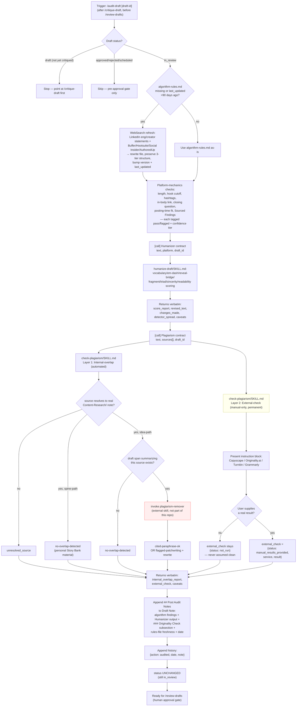

# 10 — Quality, Safety & Originality Tools: Humanizer, Plagiarism Check, and Post Audit

## 1. Overview

This document covers three skills that together form the pre-publish
quality/safety/originality layer of the LinkedIn Agentic AI pipeline:

- [`/humanize-draft`](../../.claude/skills/humanize-draft/SKILL.md)
  (**Humanizer**, Phase 18) — rewrites a draft's **surface style** (AI
  vocabulary, em dashes, reveal bridges, fragment stacks, triads,
  performed sincerity, readability) against the scored, numeric rule set
  in [`Content-Learnings/humanizer-rules.md`](../../Content-Learnings/humanizer-rules.md),
  and produces a before/after report. It never touches a claim, source,
  or number.
- [`/check-plagiarism`](../../.claude/skills/check-plagiarism/SKILL.md)
  (**Plagiarism / Originality Check**, Phase 25) — screens a draft for
  two distinct kinds of originality risk: internal patchwriting against
  the vault's own `Content-Research/` sources (automated), and external
  overlap with the wider internet (permanently manual, since no
  plagiarism-detection API is configured).
- [`/audit-draft`](../../.claude/skills/audit-draft/SKILL.md) (**Post
  Audit**, Phase 19) — the **orchestrator** of this layer. Runs on a
  `status: in_review` Draft Note, after `/critique-draft` and before
  `/review-drafts`. It performs its own platform-mechanics check against
  [`Content-Learnings/algorithm-rules.md`](../../Content-Learnings/algorithm-rules.md),
  and then calls Humanizer's and Plagiarism Check's own documented
  Input/Output Contracts as sub-steps — never re-implementing either
  skill's detection logic itself — and writes everything it collects
  into one `## Post Audit Notes` annotation on the Draft Note.

**The composition is layered, not nested-only.** Each of the three
skills is independently invocable by a human at any time
(`/humanize-draft [draft-id]`, `/check-plagiarism [draft-id]`,
`/audit-draft [draft-id]`). `/audit-draft` additionally calls the other
two programmatically, mid-run, as sub-steps — but it calls them through
the exact same stable Input/Output Contract a human-typed slash command
would exercise, not a separate internal code path. There is no
Humanizer-specific or Plagiarism-Check-specific logic duplicated inside
`audit-draft/SKILL.md`; every finding it surfaces from those two skills
is their real output, verbatim, never re-derived or re-scored by
`/audit-draft` itself. `/check-plagiarism` in turn calls a fourth,
**pre-existing, globally-available Claude Code skill not part of this
repo** — `plagiarism-remover` — for its own patchwriting-detection logic,
the same non-duplication discipline one level down. No equivalent
external skill is called by Humanizer; its detection logic is native to
`humanize-draft/SKILL.md` itself.

Full requirements text: [`REQUIREMENTS.md`](../../REQUIREMENTS.md) §29
(Humanizer), §30 (Post Audit), §37 (Plagiarism/Originality Check).
Cross-check: [`README.md`](../../README.md)'s "Quality, Safety &
Originality Tools" table (lines 303-310).

---

## 2. Top-Line Flow Chain

### Composed path — `/audit-draft` as orchestrator

```
Trigger (/audit-draft [draft-id], after /critique-draft sets status:in_review, before /review-drafts)
  → Load status:in_review Draft Note (refuse/redirect if status:draft — point at /critique-draft first; skip if approved/rejected/scheduled)
  → Algorithm-Rules Freshness Check (Content-Learnings/algorithm-rules.md last_updated vs. 90-day cap)
      → if missing or >90 days stale: WebSearch refresh (official LinkedIn engineering/creator statements + Buffer/Hootsuite/Social Insider/AuthoredUp), rewrite file preserving 3-tier structure, bump version + last_updated
      → if ≤90 days: use as-is
  → Platform-Mechanics Compliance Check (length, hook-truncation, hashtag count/placement, in-body link, closing question, posting-time fit, format-level Sourced Findings — each tagged pass/flagged with its confidence tier)
  → [call] Humanizer Shared Contract — text/platform/draft_id in, score_report/revised_text/detector_spread/changes_made/caveats back, surfaced verbatim
  → [call] Plagiarism Shared Contract — text/sources/draft_id in, internal_overlap_report/external_check/caveats back, surfaced verbatim (which itself internally calls plagiarism-remover per resolved source span)
  → Annotate Draft Note: append ## Post Audit Notes (algorithm findings + Humanizer output + ### Originality Check subsection + rules-file freshness status + date), append history: {action: audited, ...}
  → Status Unchanged — note stays status:in_review
  → Ready for /review-drafts (human approval gate)
```

### Standalone path — `/humanize-draft` run directly

```
Trigger (/humanize-draft [draft-id], any status, any time — user-invoked, not pipeline-gated)
  → Load text (raw pasted text, or a real Draft Note's ## Post Text body if draft_id resolves)
  → Read Content-Learnings/humanizer-rules.md fresh (never cached)
  → Score + rewrite: AI-vocabulary density → em-dash cap → reveal bridges → fragment stacks → stacked triads → performed sincerity → readability → odd-precision numbers (note-only)
  → Multi-detector spread instruction block (GPTZero/Originality.ai/ZeroGPT/Sapling/Copyleaks — manual paste-and-report, detector_spread stays {status:"not_run"} unless the user supplies real scores)
  → Output: revised_text, score_report, changes_made, detector_spread, caveats (always present)
  → If draft_id resolves to a real Draft Note: append history entry. Otherwise report the mismatch and proceed anyway.
```

### Standalone path — `/check-plagiarism` run directly

```
Trigger (/check-plagiarism [draft-id], any status, any time — user-invoked, not pipeline-gated)
  → Load text + sources[] (raw input, or a real Draft Note's ## Post Text + sources frontmatter if draft_id resolves)
  → Resolve each source id (Content-Research/ note for idea-path drafts; Story Bank row → auto no-overlap-detected for spine-path drafts; unresolved → unresolved_source)
  → For each resolved source: locate the draft span that summarizes it → if none, no-overlap-detected
  → Invoke plagiarism-remover (external skill) per span found, against that source's Summary/Key Findings text → verdict: cited-paraphrase-ok | flagged-patchwriting (+ rewrite)
  → Assemble internal_overlap_report
  → Present external-check instruction block (Copyscape/Originality.ai/Turnitin/Grammarly — manual paste-and-report; external_check stays {status:"not_run"} unless the user supplies a real result)
  → Output: internal_overlap_report, unresolved_source entries, external_check, caveats (always present)
  → If draft_id resolves to a real Draft Note: append history entry. Otherwise report the mismatch and proceed anyway.
```

---

## 3. Flowchart



---

## 4. Stage-by-Stage Breakdown

### 4a. `/humanize-draft` (Humanizer, Phase 18)

**Trigger:** standalone `/humanize-draft [draft-id]` (any draft status,
user-invoked at any time) **or** called by `/audit-draft` step 4, or by
`/repurpose-post`, via the shared contract (§5 below).

**Input:** `text` (required), `platform` (required, one of
`linkedin | x | substack-note | substack-article` — used only to
sanity-check length/format norms, not to change which rules apply, since
the rule set is platform-agnostic), `draft_id` (optional).

**Processing:** reads `Content-Learnings/humanizer-rules.md` fresh every
run (never a cached copy, since it is a human-editable living document).
Applies, per paragraph and then document-wide where the rule is a
per-post cap:
- AI-vocabulary density (durable + decaying markers; 3+ in one paragraph
  triggers rewrite).
- Em-dash cap (~1/100 words document-wide; excess converts to commas/
  colons/parentheses, never periods; never reduced to zero).
- Reveal bridges (4 specific phrases, every hit flagged, no allowance).
- Staccato fragment stacks (5 patterns banned outright; separate 2-per-
  document cap on other legitimate fragments).
- Stacked triads (1 allowed per post, scrub the rest).
- Performed sincerity (4 phrase patterns + inserted hedges).
- Readability (Flesch reading ease target >55, fixed via sentence
  restructuring, not vocabulary substitution).
- Odd-precision numbers (note-only — never rewritten, since that would
  risk altering a claim).

**Tools:** none beyond reading the rules file and, for the multi-detector
sub-tool, presenting an instruction block for the user to act on outside
the tool (no WebSearch/WebFetch, no detector API calls — permanently).

**LLM vs. tool-call vs. human-step:** the scoring/rewriting pass is
**LLM reasoning** against a static reference document; the multi-detector
spread check is a **human step** (the user pastes the revised draft into
5 external services themselves and reports back).

**Decision points:** per-rule thresholds listed above (3+ markers,
~1/100-words em-dash cap, 2-fragment cap, 1-triad allowance) — each is a
hard numeric gate, not a judgment call.

**Output:** `revised_text`, `score_report` (one entry per rule category),
`changes_made` (`{rule, before, after}` per actual edit), `detector_spread`
(`{status:"not_run"}` unless the user supplied real scores), `caveats`
(always present, every call).

**What it changes / does not change:** rewrites surface style only —
vocabulary, punctuation, sentence structure, framing phrases. **Never**
changes a claim, source, or number (that discipline belongs to
`/critique-draft`). Never applies `revised_text` to a Draft Note itself
when called by `/audit-draft` — that's a downstream edit decision left to
`/critique-draft`, a direct `/humanize-draft` run with intent to revise,
or a manual edit during `/review-drafts`.

**Handoff:** standalone — reports directly to the user. As a sub-call —
returns its full output object to the calling skill (`/audit-draft`,
`/repurpose-post`), which surfaces it verbatim rather than re-deriving it.

### 4b. `/check-plagiarism` (Plagiarism / Originality Check, Phase 25)

**Trigger:** standalone `/check-plagiarism [draft-id]` (any draft status,
user-invoked at any time) **or** called by `/audit-draft` step 5, via the
shared contract (§5 below).

**Input:** `text` (required), `sources[]` (required, may be empty — a
draft's cited `Content-Research/` note ids, or Story Bank row ids on a
`--spine`-path draft), `draft_id` (optional).

**Processing — Layer 1 (internal-overlap, automated):** for each id in
`sources[]`: idea-path ids resolve against real `Content-Research/`
notes (reading their `## Summary` and `## Key Findings` sections, the two
most likely to themselves closely paraphrase the original source);
spine-path ids (Story Bank rows) are recorded `no-overlap-detected`
automatically, since that's the user's own material, not third-party
research; ids that resolve to nothing become `unresolved_source`. For
each resolved source, the draft span discussing it is located; if none
exists, `no-overlap-detected`. For each span found, **`plagiarism-remover`
— a pre-existing, globally-available Claude Code skill not part of this
repo — is invoked** against that span and the source's Summary/Key
Findings text; `check-plagiarism` does not reimplement its clause-order/
structural-closeness comparison logic, only calls it and records the
returned verdict (`cited-paraphrase-ok` or `flagged-patchwriting` +
rewrite).

**Processing — Layer 2 (external-check, manual-only, permanent):**
regardless of Layer 1's findings, presents an instruction block asking
the user to paste the finished draft into Copyscape, Originality.ai,
Turnitin, or Grammarly themselves and report back whatever comes back.

**Tools:** no plagiarism-detection API is called (none configured, by
permanent design). Internal comparison work is LLM reasoning delegated to
the external `plagiarism-remover` skill; no WebSearch/WebFetch is used in
this skill's own process (unlike `/audit-draft`'s algorithm-rules refresh
step).

**LLM vs. tool-call vs. human-step:** Layer 1 is an **LLM-driven
tool-call** (this skill's own reasoning to locate spans, plus a delegated
call to `plagiarism-remover`'s reasoning for the closeness verdict).
Layer 2 is a **human step** end to end — running a real checker and
reporting the result back is entirely outside this skill's control.

**Decision points:** does each `sources[]` id resolve; is it idea-path or
spine-path; does a corresponding draft span exist; what verdict does
`plagiarism-remover` return.

**Output:** `internal_overlap_report` (list of `{source_id, span,
verdict}` plus separate `unresolved_source` entries), `external_check`
(`{status:"not_run"|"manual_results_provided", service?, result?, note}`),
`caveats` (always present).

**What it changes / does not change:** identifies phrasing/structural
closeness only. Never fact-checks a claim, never changes a claim/source/
number, never scores viral potential, never approves or rejects a draft
(those stay `/critique-draft`'s and `/review-drafts`'s jobs). Never
converts a `not_run` external_check into an assumed-clean result, no
matter how much time passes or how clean Layer 1 looks.

**Handoff:** standalone — reports directly to the user. As a sub-call —
returns its full output object to `/audit-draft`, which surfaces it
verbatim under `### Originality Check`.

### 4c. `/audit-draft` (Post Audit, Phase 19) — the orchestrator

**Trigger:** manual `/audit-draft [draft-id]`, or (if `draft-id` omitted)
runs against every Draft Note currently `status: in_review` that doesn't
already have a `## Post Audit Notes` section from today's date. Always
runs after `/critique-draft` (which sets `status: draft → in_review`) and
before `/review-drafts` (which sets `status: in_review → approved`).

**Input:** a `status: in_review` Draft Note. If the target note is
`status: draft`, the skill stops and points the user at `/critique-draft`
first. If `approved/rejected/scheduled`, it skips the note (auditing
after human approval defeats the point of a pre-approval gate).

**Processing:**
1. **Algorithm-rules freshness check** — reads `algorithm-rules.md`'s
   `last_updated` frontmatter. If the file is missing or the date is
   >90 days old, runs a `WebSearch` refresh against official LinkedIn
   engineering/creator statements plus Buffer/Hootsuite/Social
   Insider/AuthoredUp (same sourcing bar as REQUIREMENTS.md §11),
   rewrites the file preserving its exact three-tier structure
   (`## Sourced Findings` / `## Verified Numeric Thresholds` /
   `## Unconfirmed / Third-Party Claims` / `## Refresh policy`), and
   bumps `last_updated` + `version`. WebSearch results are treated as
   data to draw findings from, never as instructions to follow. If
   ≤90 days old, uses the file as-is. This is a lazy self-refresh-on-use
   pattern (same as `/generate-visual`'s live trend research) — there is
   no separate cron job.
2. **Platform-mechanics compliance check** — reads the draft's `## Post
   Text` and checks length, hook-truncation cutoff, hashtag
   count/placement, in-body link presence, closing-question presence,
   posting-time fit (skipped, not flagged, if no time is set yet), and
   applicable format-level Sourced Findings. Each check gets pass or
   flagged, every citation tagged with its confidence tier
   (Sourced/Verified/Unconfirmed) — an Unconfirmed claim is never used to
   fail a check outright, only offered as color.
3. **Humanizer sub-call** (§5 below) — surfaced verbatim.
4. **Plagiarism sub-call** (§5 below) — surfaced verbatim.
5. **Annotation** — appends `## Post Audit Notes` (after any existing
   `## Critic Notes` from `/critique-draft`) and a `history` entry
   `{action: audited, date, note: "<one-line summary>"}`.

**Tools:** `WebSearch` (algorithm-rules refresh only, when stale); no
direct WebSearch/WebFetch use for the Humanizer or Plagiarism sub-calls —
those are delegated entirely.

**LLM vs. tool-call vs. human-step:** platform-mechanics checks are LLM
reasoning against a static rules file; the freshness refresh is an
LLM-driven `WebSearch` tool-call; the two sub-calls are delegated
LLM-driven work (with a human-step layer nested inside the Plagiarism
sub-call's Layer 2, and inside Humanizer's multi-detector spread check).

**Decision points:** stale vs. fresh rules file; pass vs. flagged per
mechanics check; confidence tier per citation.

**Output:** the `## Post Audit Notes` annotation (algorithm findings,
Humanizer's full output, `### Originality Check` subsection, rules-file
freshness status, date) plus a `history` entry.

**What it changes / does not change — critically:** `/audit-draft`
**never changes `status`**, regardless of how many flags surface — a
draft with several algorithm flags, a flagged-patchwriting verdict, and a
`not_run` external check all stays exactly `status: in_review`. It never
auto-revises the draft text, never applies Humanizer's `revised_text`,
never auto-schedules or auto-publishes, and never advances or reverts
approval status. It only ever **annotates** a note that `/review-drafts`
(the sole skill allowed to move a note to `approved`) will read next.

**Handoff:** the annotated, still-`in_review` Draft Note is now ready for
`/review-drafts`. The human reviewer sees the platform-mechanics flags,
Humanizer's score report, and the originality report (including whether
the external plagiarism check is still `not_run`) as part of that review,
but nothing here gates or blocks the review itself.

---

## 5. The Shared Contract Mechanism

This is the single most load-bearing design element tying the three
skills together. Both `humanize-draft/SKILL.md` and
`check-plagiarism/SKILL.md` each document an explicit "Input / Output
Contract" section, stated to be a stable interface any programmatic
caller (a slash-command invocation from another skill, not a direct user
request) can rely on holding across versions of the file. `/audit-draft`
is the one real caller of both today; both files independently note that
they were designed to be called by other skills, not just run standalone
(Humanizer's contract is additionally shared with `/repurpose-post`,
which also calls it after re-hooking and expanding a repurposed post).

### Humanizer's contract (called by `/audit-draft` step 4)

**`/audit-draft` passes in exactly:**
- `text` = the draft's `## Post Text` body.
- `platform` = the draft's `platform` field.
- `draft_id` = the draft's `id` (so Humanizer's own history-logging
  applies normally).

**`/audit-draft` receives back:**
- `score_report` — per-rule-category findings.
- `revised_text` — Humanizer's suggested rewrite (reported, never
  applied by `/audit-draft` itself).
- `changes_made` — `{rule, before, after}` list.
- `detector_spread` — `{status:"not_run"}` or `{status:
  "manual_results_provided", results:[...]}`.
- `caveats` — always present.

`/audit-draft`'s hard rules state it must surface `score_report` and
`caveats` **verbatim** — "do not paraphrase, re-summarize, re-score, or
re-implement any of Humanizer's pattern-matching logic here."

### Plagiarism Check's contract (called by `/audit-draft` step 5)

**`/audit-draft` passes in exactly:**
- `text` = the draft's `## Post Text` body.
- `sources` = the draft's `sources[]` frontmatter field.
- `draft_id` = the draft's `id`.

**`/audit-draft` receives back:**
- `internal_overlap_report` — `{source_id, span, verdict}` list, plus
  separate `unresolved_source` entries.
- `external_check` — `{status:"not_run"|"manual_results_provided",
  service?, result?, note}`.
- `caveats` — always present.

`/audit-draft` must surface these "verbatim" too — "do not re-run,
re-derive, or approximate `plagiarism-remover`'s own patchwriting/
structural-closeness detection... and do not assume `external_check` is
anything other than whatever status `/check-plagiarism` actually
returns."

### Nested contract — Plagiarism Check calling `plagiarism-remover`

One level below, `check-plagiarism/SKILL.md` documents its own call into
`plagiarism-remover` (a pre-existing, globally-available Claude Code
skill, not part of this repo): for each draft span identified against a
resolved source, it passes the draft span as "the text to check" and the
source note's Summary/Key Findings text as "the cited source to compare
against," and records exactly what comes back
(structure-too-close → `flagged-patchwriting` with the suggested
rewrite; genuine paraphrase → `cited-paraphrase-ok`). This mirrors, one
layer down, the exact non-duplication discipline `/audit-draft` applies
to `check-plagiarism` and `humanize-draft` above it.

**The `caveats` field is the one constant across all three contracts** —
present in every Humanizer call, every Plagiarism Check call, and
therefore in every `/audit-draft` annotation that surfaces them, with no
exceptions in any documented code path.

---

## 6. Agents & Skills Involved

| Skill | Role | Trigger | Reads | Writes |
|---|---|---|---|---|
| [`humanize-draft`](../../.claude/skills/humanize-draft/SKILL.md) | Humanizer (Phase 18) | Standalone `/humanize-draft [draft-id]`, or called by `/audit-draft`/`/repurpose-post` via contract | `Content-Learnings/humanizer-rules.md` (fresh every run); Draft Note `## Post Text` if `draft_id` resolves | Draft Note `history` entry (if `draft_id` resolves); returns output object to caller, never writes `## Post Audit Notes` itself |
| [`check-plagiarism`](../../.claude/skills/check-plagiarism/SKILL.md) | Plagiarism / Originality Check (Phase 25) | Standalone `/check-plagiarism [draft-id]`, or called by `/audit-draft` via contract | `Content-Research/` notes resolved from `sources[]`; invokes external `plagiarism-remover` skill | Draft Note `history` entry (if `draft_id` resolves); returns output object to caller |
| [`audit-draft`](../../.claude/skills/audit-draft/SKILL.md) | Post Audit — **orchestrator** (Phase 19) | Manual `/audit-draft [draft-id]`, always after `/critique-draft`, before `/review-drafts` | `Content-Learnings/algorithm-rules.md`; Draft Note (`## Post Text`, `sources[]`, `platform`, `id`); calls `humanize-draft` and `check-plagiarism` contracts | Draft Note `## Post Audit Notes` section + `history` entry; `Content-Learnings/algorithm-rules.md` (only when refreshed for staleness) |
| `plagiarism-remover` (external, not part of this repo) | Structural-closeness / patchwriting detector | Invoked by `check-plagiarism` internally, per resolved source span | Draft span + source Summary/Key Findings text passed in by the caller | Returns a verdict + suggested rewrite to `check-plagiarism`; writes nothing to the vault itself |

---

## 7. Tools / APIs Used

- **`WebSearch`** — used only by `/audit-draft`'s algorithm-rules
  freshness-refresh step (>90 days stale), against official LinkedIn
  engineering/creator statements and reputable aggregators (Buffer,
  Hootsuite, Social Insider, AuthoredUp). Not used by `/humanize-draft`
  or `/check-plagiarism` in any documented path.
- **No AI-detection API** — `/humanize-draft` never calls GPTZero's,
  Originality.ai's, ZeroGPT's, Sapling's, or Copyleaks's APIs, and never
  scrapes their web UIs. No API keys for any of the five exist in this
  repo. This is a **permanent design stance**, not a "for now"
  limitation — stated identically in `humanize-draft/SKILL.md`'s Hard
  Rules and REQUIREMENTS.md §29.
- **No plagiarism-detection API** — `/check-plagiarism` never calls
  Copyscape's, Originality.ai's, Turnitin's, or Grammarly's APIs. None
  are configured anywhere in this repo, confirmed the same way the
  Humanizer's detector-key absence was confirmed. This too is a
  **permanent design stance** — REQUIREMENTS.md §37 states explicitly
  that "no plagiarism-detection API should be added later to quietly
  automate this layer." That layer is 100% manual: the skill hands back
  the draft text plus instructions, the human runs the check themselves
  in the external tool, and reports the result back for the skill to
  record verbatim.
- **`plagiarism-remover`** (external Claude Code skill, not part of this
  repo) — the actual mechanism behind Layer 1's structural-closeness
  detection; invoked, never reimplemented, by `/check-plagiarism`.
- **No API is called by `/audit-draft` directly** for either the
  AI-detection or plagiarism dimension — both are fully delegated to
  their respective skills' contracts.

---

## 8. Validation & Quality Gates

**`humanizer-rules.md`'s scored rule set** — a single living document
(`id: humanizer-rules`, currently `version: 1`, `last_updated:
2026-09-17`), grown only by explicit human edit, never by an automated
append (unlike `hook-formulas.md`). Its rationale line: human readers
cite vocabulary (53%) and sentence structure (36%) as the top two AI-tell
signals, which is why the rule set is built around exactly those axes;
it also cites LinkedIn's slop-detection flag as costing a flagged post
"roughly 40% of its normal views." Rules are adapted (not copied
verbatim) from the MIT-licensed `sergebulaev/linkedin-skills` project.
Concrete numeric gates it defines: 3+ vocabulary markers/paragraph, ~1
em dash/100 words (cap, never zero), zero-tolerance on 5 banned fragment
patterns + a 2-fragment document cap otherwise, 1 allowed triad/post,
Flesch reading ease >55, and a no-named-referent rule for odd-precision
numbers (flagged as a note, never altered).

**"Never claims to guarantee beating a specific detector"** — a Hard
Rule in both `humanize-draft/SKILL.md` (never states or implies a
detector-proof, guaranteed-undetectable, or "will pass GPTZero" result;
always frames results as documented inter-detector disagreement) and,
one level up, in `/audit-draft`'s own surfacing of that output (it must
present Humanizer's `caveats` string verbatim, never softened or
dropped).

**"Never assumes clean without an external check actually run"** — the
mirror-image Hard Rule in `check-plagiarism/SKILL.md`:
`external_check.status` starts and stays `"not_run"` until the user
supplies a real result; "no amount of time passing, and no clean-looking
internal-overlap result, ever converts a `not_run` into an assumed
pass." `/audit-draft` in turn must never present that `not_run` status
"as, or implied to mean, 'checked and clean.'"

**Three-tier confidence structure (algorithm-rules.md)** — `/audit-draft`'s
own check, never blended: every citation carries **Sourced Finding**
(names its real source — the 360Brew paper, AuthoredUp's 2026 data, Van
der Blom's analysis, a named LinkedIn VP Product statement),
**Verified Numeric Threshold** (a hard number — e.g. 900–1,300 char
sweet spot, 210/140-char hook cutoffs, 0–2 hashtags, 40–60% in-body-link
penalty, 20–40% closing-question lift), or **Unconfirmed / Third-Party
Claim** (e.g. pod-detection accuracy ~97%, comment-pod penalty 60–90%
reach cut — always labeled "reported, unconfirmed," never used to fail a
check).

**No fabricated scores, ever** — a Hard Rule repeated near-identically
across all three SKILL.md files: no invented detector percentage
(Humanizer), no invented similarity percentage (Plagiarism Check), no
invented algorithm rule without a cited source (Post Audit).

---

## 9. Data Stored in Memory / Vault

**`## Post Audit Notes` section** — appended by `/audit-draft` to the
target Draft Note's body, after any existing `## Critic Notes` section
(written earlier by `/critique-draft`; see
[`critique-draft/SKILL.md`](../../.claude/skills/critique-draft/SKILL.md)).
Per `audit-draft/SKILL.md` step 6, its structure is:
- **Algorithm findings** — each platform-mechanics check, tagged
  pass/flagged, with the specific rule text and confidence tier cited
  inline.
- **Humanizer output** — the full `score_report` and `caveats` string,
  verbatim.
- **`### Originality Check`** (a clearly-labeled subsection) — the full
  `internal_overlap_report`, `external_check`'s current status (and
  recorded result if supplied), and `check-plagiarism`'s `caveats`
  string, verbatim.
- **Rules file status** — `algorithm-rules.md`'s `last_updated` date and
  whether it was fresh / refreshed this run.
- Date of the audit run.

**`history` entries** — `/audit-draft` appends `{action: audited, date,
note: "<one-line summary>"}`. Both `/humanize-draft` and
`/check-plagiarism` independently append their own `{action: edited,
date, note: "..."}` entry when given a resolving `draft_id`, whether
called standalone or as a sub-step. Note: the Draft Note template
([`_Templates/Draft-Note.md`](../../_Templates/Draft-Note.md))'s
documented `history.action` enum (`created | edited | regenerated |
hook_changed | image_changed | time_changed | approved | rejected |
scheduled`) does not list `audited` explicitly — `audit-draft/SKILL.md`
nonetheless specifies writing that literal action value, so real Draft
Notes an audit has touched will carry an action tag outside the
template's documented enum.

**`humanizer-rules.md` and `algorithm-rules.md` as living documents —
different update mechanisms.** `humanizer-rules.md` grows **only by
explicit human edit** — no skill in this repo writes to it
automatically (its own header states this explicitly, contrasting it
with `hook-formulas.md`, which `/extract-hook` does append to
automatically). `algorithm-rules.md`, by contrast, **is** rewritten
automatically, but only by `/audit-draft`'s own lazy self-refresh-on-use
step when it finds the file missing or its `last_updated` more than 90
days stale — the same pattern `/generate-visual` uses for live
visual-trend research. There is no separate cron/scheduled job for
either file.

**Storage:** both `Content-Learnings/humanizer-rules.md` and
`Content-Learnings/algorithm-rules.md` are ordinary tracked files in the
vault (not `Analytics/`-style gitignored personal data) — living
strategy/reference documents alongside `playbook.md`, `story-bank.md`,
and `hook-formulas.md`.

---

## 10. Failure Modes & Recovery

| Failure | Behavior | Recovery |
|---|---|---|
| `algorithm-rules.md` missing or >90 days stale, and the `WebSearch` refresh fails or returns nothing usable | Not explicitly covered by a dedicated fallback path in `audit-draft/SKILL.md` — the skill's documented behavior is to run the refresh and rewrite the file; a failed refresh is not a scenario the SKILL.md gives separate handling for. Treat this as an under-specified edge case (flagged below). | Rerun `/audit-draft` once connectivity/search results are viable; in the interim, the prior (stale) file content is not overwritten by a failed run since the rewrite step only happens on successful research |
| Draft has heavy patchwriting detected (`flagged-patchwriting` on one or more sources) | Does **not** block. `/check-plagiarism` records the verdict + `plagiarism-remover`'s suggested rewrite; `/audit-draft` surfaces it verbatim in `### Originality Check` but never changes `status`, never auto-applies the rewrite, never stops the pipeline. It is information for `/review-drafts` and the human reviewer only. | Human reviewer sees the flag during `/review-drafts` and chooses Edit/Regenerate, or accepts the risk and approves anyway — a human judgment call, not an automated gate |
| User never runs the external plagiarism check (Copyscape/Originality.ai/Turnitin/Grammarly) | `/check-plagiarism` proceeds anyway — the internal-overlap layer (Layer 1) always completes and reports fully. `external_check` stays `{status: "not_run", note: "no external plagiarism checker has been run against this draft yet"}` indefinitely; this is presented as a pending/open item, never silently reinterpreted as clean, no matter how much time passes | User can supply a result at any later point (this run or any future one) and it will be recorded verbatim; until then, `/review-drafts` sees an explicit `not_run` status each time `/audit-draft` re-annotates |
| User never runs the multi-detector AI-spread check | Same pattern as above for Humanizer — `detector_spread` stays `{status: "not_run"}` indefinitely; `revised_text`/`score_report`/`caveats` are still returned in full regardless | User can supply results later; recorded verbatim, reported as a range, never averaged into a single verdict |
| `draft_id` given to `/humanize-draft` or `/check-plagiarism` (standalone or via `/audit-draft`) but no matching Draft Note exists | Both skills say so plainly and proceed with the rest of the work anyway — a missing/mismatched `draft_id` is never a reason to refuse the pass, and neither skill ever fabricates a Draft Note to satisfy it | User supplies the correct `draft_id`, or accepts the output as a standalone (unlogged) result |
| A `sources[]` id doesn't resolve to a real `Content-Research/` note (or Story Bank row) | Recorded as a separate `unresolved_source` entry, never silently dropped and never treated as `no-overlap-detected` | User corrects the `sources[]` field on the Draft Note, or accepts the gap as-is |
| `/audit-draft` invoked on a `status: draft` note (not yet critiqued) | Stops immediately, says so plainly, points the user at `/critique-draft` first — does not attempt a partial audit | Run `/critique-draft` first, then `/audit-draft` |
| `/audit-draft` invoked on an `approved`/`rejected`/`scheduled` note | Skipped with an explanation — auditing post-approval defeats the point of a pre-approval gate | Not applicable — by design this skill only operates pre-approval |

---

## Under-specified points to flag

- **`algorithm-rules.md` refresh failure path is not explicitly
  documented.** `audit-draft/SKILL.md` describes the >90-day-stale →
  `WebSearch` → rewrite path in full, but never states what happens if
  the `WebSearch` calls fail, return nothing usable, or are otherwise
  interrupted mid-refresh. The behavior above (rerun later; prior file
  presumably untouched since the rewrite is a single terminal step) is
  an inference from the skill's structure, not a directly stated rule —
  worth confirming with whoever maintains `audit-draft/SKILL.md` if this
  matters operationally.
- **`history.action: audited`** is used by `audit-draft/SKILL.md` but is
  not listed in `_Templates/Draft-Note.md`'s documented `history.action`
  enum comment. This is a minor template/skill drift, noted in §9 above,
  not something this document resolves.