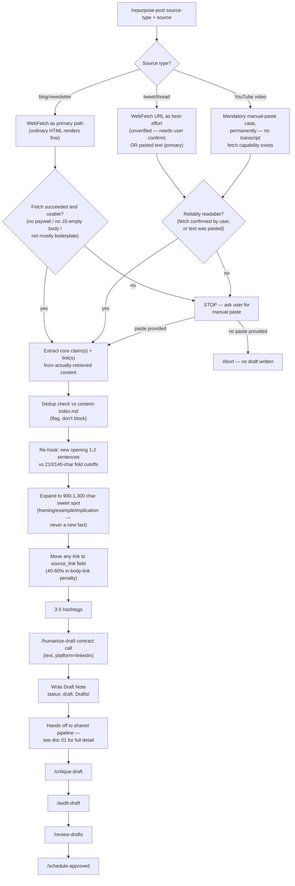

# Repurposing (Cross-Platform → LinkedIn) — End-to-End Workflow

## 1. Overview

`/repurpose-post` (the **Repurposer**, Phase 20) turns content that
originated on another platform — a tweet/thread, a YouTube video, a blog
post, or a newsletter — into a genuinely native LinkedIn post. It is
explicitly **not** a copy-paste operation:

- The source's own opening line is discarded and replaced with a new hook
  written against LinkedIn's fold-truncation thresholds, not the source
  platform's attention pattern.
- The body is expanded with real, source-consistent context (an example,
  an unpacked implication, a personal-take framing) to reach LinkedIn's
  measured length sweet spot — expansion, never padding.
- Any link worth preserving is relocated out of the post body into the
  Draft Note's `source_link` field, to be posted manually as the first
  comment once the post is live.

It is the first skill in this repo that runs **other platform's content →
LinkedIn** — every other multi-platform writer (`write-draft-x`,
`write-draft-substack-article`/`-note`) runs the opposite direction,
LinkedIn-pipeline idea → another platform
([`.claude/skills/repurpose-post/SKILL.md`](../../.claude/skills/repurpose-post/SKILL.md)
lines 6–17). It adds a new **input path** into the vault; it never adds a
new approval path — its output is an ordinary `status: draft` Draft Note
that enters the exact same downstream pipeline as any other draft
(REQUIREMENTS.md §31, lines 797–808).

## 2. Top-Line Flow Chain

```
Trigger (/repurpose-post, source-type + source content pasted or URL given)
  → Source Type Detection (tweet/thread | YouTube video | blog post | newsletter)
  → Reliable-Read Check [decision]
      ├─ readable/confirmed → Extract Core Content (claims + links only, no fabrication)
      └─ not reliably readable → Ask User for Manual Paste (per REQUIREMENTS.md §27)
  → Dedup / Fatigue Check (content-index.md, flag-not-block)
  → Re-Hook for LinkedIn's Fold (new opening 1-2 sentences, not the source's)
  → Content Expansion (900-1,300 char sweet spot, ADDED context — never padding)
  → Link Relocation (any link moved OUT of body INTO source_link / first-comment field,
      citing the 40-60% in-body-link reach penalty)
  → Hashtags (3-5, topic-tied)
  → Humanizer Pass (/humanize-draft contract: text, platform="linkedin")
  → Draft Note Write (status: draft, Drafts/YYYY-MM-DD--kebab-slug.md)
  → Ready for /critique-draft (shared downstream pipeline, see doc 01)
```

## 3. Flowchart



The downstream chain from `/critique-draft` onward is **identical** to
every other LinkedIn draft's path (idea-sourced or spine-sourced) — it is
fully documented in
[01-LinkedIn-Post-Creation-and-Scheduling.md](01-LinkedIn-Post-Creation-and-Scheduling.md)
and is not re-documented here. Repurposer's only distinct contribution is
everything upstream of the Draft Note write.

## 4. Stage-by-Stage Breakdown

### Trigger

`/repurpose-post` with two required arguments:
- `source-type`: one of `tweet`, `thread`, `youtube`, `blog`, `newsletter`.
- `source`: a URL, pasted content (text/transcript excerpt/summary), or
  both together (URL for reference/dedup filing, pasted text as the actual
  drafting material) (SKILL.md lines 19–26).

### Input / Source Reading (per §27's shared convention)

REQUIREMENTS.md §27 ("Reading Third-Party Post Content," lines 537–571)
governs every skill in this repo that must read someone else's published
content, and Repurposer cross-references it rather than restating it:
**no official API exists anywhere in this repo for reading an arbitrary
third-party post/page/video from just a URL**; pasted text is the primary,
reliable input; a URL alone is best-effort metadata only; no skill scrapes,
uses session cookies, or bypasses login/ToS.

On top of that shared rule, each source type gets its own judgment call
(SKILL.md lines 28–63; REQUIREMENTS.md §31 lines 810–829):

| Source type | Read mechanism | Reliability stance |
|---|---|---|
| Tweet/thread | `WebFetch` on the URL attempted as best-effort; pasted text is primary | Any fetch result is treated as **unverified** — X/Twitter typically requires login for full content server-side. The user must confirm the fetched text matches what they actually see, or paste it directly, before extraction proceeds. |
| YouTube video | **No fetch attempted for content.** `WebFetch` on a YouTube URL returns only the page shell (title/description/metadata), never the transcript. | **Mandatory, permanent manual-paste case.** Always ask for a pasted transcript excerpt or a written summary of the key point(s). Never claim to have "watched" or reliably retrieved the video's content — this is a deliberate permanent design stance, not a gap to be filled later. |
| Blog/newsletter | `WebFetch` attempted as the **primary** path — ordinary HTML renders fine | Falls back to asking for pasted text only if the fetch fails outright or returns unusable content (paywall, JS-rendered empty/garbled body, or a result that's mostly navigation/boilerplate rather than the article itself). |

If nothing usable is obtained through any of the above — fetch failed,
fetch returned unverified/unusable content with no user confirmation or
alternative paste, or no source was given at all — the skill **stops and
asks for a manual paste**. It never proceeds to extraction or drafting on a
guess (SKILL.md lines 60–63).

### Processing

1. **Extract core claim(s) and link(s)** — identify the argument(s) the
   source actually makes and any link(s) worth preserving. Never carries
   over a statistic, quote, or claim not literally present in the
   fetched-and-confirmed or pasted content (SKILL.md lines 71–77, citing
   REQUIREMENTS.md §21's never-fabricate discipline).
2. **Dedup/fatigue check** — checks `Content-Learnings/content-index.md`
   for topic/hook/argument overlap with existing drafts or published posts
   (falling back to scanning `Drafts/` and `Published-Posts/` directly if
   the index doesn't exist or is too thin). A hit is **flagged, not
   blocked** — it must be surfaced plainly in the report back, same
   discipline as `/write-draft`/`/generate-ideas` (SKILL.md lines 79–87;
   REQUIREMENTS.md §15/§25.4).
3. **Read the voice guide fresh** — `Content-Learnings/voice-guide.md`,
   never a cached memory, before drafting (SKILL.md lines 89–91).
4. **Re-hook for the fold** — writes a genuinely new first 1-2 sentences
   stating the concrete claim/tension on their own, against the
   **210-character (desktop) / 140-character (mobile)** hook-truncation
   cutoffs (REQUIREMENTS.md §30, Verified Numeric Threshold). This is a
   rewrite of the opening, not a trim of the source's own hook — a tweet's
   first line assumes a different reader-attention pattern than a LinkedIn
   feed scroll (SKILL.md lines 93–102).
5. **Expand to the length sweet spot** — expands into **900–1,300
   characters** (REQUIREMENTS.md §30, Verified Numeric Threshold — cited,
   not re-derived) via: (a) a concrete example or analogy consistent with
   but not present in the source, (b) unpacking an implication the source
   stated tersely, or (c) personal-take framing ("here's what I'd
   add...", "the part I keep coming back to..."). **Expansion never adds a
   new factual claim, statistic, or quote beyond what the source actually
   said** — framing/elaboration only (SKILL.md lines 104–115).
6. **Link relocation** — any link worth preserving is moved out of
   `## Post Text` entirely and stored in the Draft Note's `source_link`
   frontmatter field, citing REQUIREMENTS.md §30's documented **40-60%
   external-link-in-body reach penalty** (Verified Numeric Threshold — the
   same figure `/audit-draft` checks drafts against). The report back must
   explicitly note that posting it as the actual first LinkedIn comment is
   a **manual step** after the post goes live — this repo has no
   auto-comment mechanism (SKILL.md lines 116–125; REQUIREMENTS.md §31
   lines 848–856).
7. **Hashtags** — 3-5, directly tied to topic/category, no stuffing, same
   convention as `/write-draft` (SKILL.md lines 126–128).

### Tools

- `WebFetch` — attempted for tweet/thread URLs (best-effort, always
  unverified) and for blog/newsletter URLs (primary path, genuinely
  plausible since ordinary HTML renders). **Never** attempted expecting
  transcript content for YouTube — the skill is explicit that this would
  only return the page shell.
- No tool in this repo's toolset retrieves YouTube captions/transcripts —
  that source type operates purely on human-pasted text, permanently.
- No plagiarism/detection API, no third-party post-reading API — consistent
  with §27's system-wide stance that no official read API exists for
  arbitrary third-party content.
- `/humanize-draft`'s Input/Output Contract, called directly (see below).

### LLM vs. Tool-Call vs. Human-Input Label

| Stage | Mechanism |
|---|---|
| Source reading (tweet/thread, blog/newsletter) | Tool-call (`WebFetch`), always subject to human confirmation before use |
| Source reading (YouTube) | Human-input only (pasted transcript/summary) — no tool call attempted |
| Reliable-read fallback | Human-input (manual paste requested) |
| Claim/link extraction, re-hook, expansion, link relocation, hashtags | LLM (the skill's own drafting logic) |
| Dedup check | Tool-call (file read against `content-index.md` / `Drafts/` / `Published-Posts/`) + LLM judgment |
| Humanizer pass | Tool-call to another skill's documented contract (`/humanize-draft`) |
| Draft Note write | Tool-call (file write to `Drafts/`) |

### Output

A single Draft Note at `Drafts/YYYY-MM-DD--kebab-slug.md` (today's date —
a repurposed post has no `target_date` to inherit from an Idea Note),
`status: draft`, `platform: linkedin`. See §8 below for its distinguishing
frontmatter fields.

### Handoff to the Standard Pipeline

Once the Draft Note is written, Repurposer's job is done. The draft flows
through the **exact same** `/critique-draft` → `/audit-draft` →
`/review-drafts` → `/schedule-approved` sequence as any idea-sourced or
spine-sourced draft (SKILL.md lines 211–214; REQUIREMENTS.md §31 lines
806–808). That shared pipeline — viral-score critique, algorithm/AI-tell/
plagiarism audit, human approval, Buffer scheduling — is fully documented
in
[01-LinkedIn-Post-Creation-and-Scheduling.md](01-LinkedIn-Post-Creation-and-Scheduling.md)
and is not repeated here.

## 5. Agents & Skills Involved

| Skill | Role in this workflow |
|---|---|
| `repurpose-post` (Repurposer) | Owns the entire upstream path: source reading, extraction, dedup check, re-hook, expansion, link relocation, hashtags, and the Draft Note write. |
| `humanize-draft` (Humanizer) | Called as the mandatory final styling pass via its documented Input/Output Contract before the draft is written to `Drafts/`. Repurposer does not re-implement any of its vocabulary/em-dash/pattern-density detection logic — it calls the contract and uses `revised_text` as-is. Full documentation of Humanizer itself lives in doc 10; only the handoff contract is described here. |
| `critique-draft`, `audit-draft`, `review-drafts`, `schedule-approved` | Standard downstream pipeline the resulting Draft Note enters unchanged — documented in doc 01, not here. |

### Humanizer Handoff Contract (as consumed by Repurposer)

Per `.claude/skills/humanize-draft/SKILL.md` lines 29–64:

**Input Repurposer sends:** `text` = the drafted body from the re-hook/
expansion/link-relocation/hashtag steps; `platform` = `"linkedin"`;
`draft_id` left unset (the Draft Note doesn't exist yet at this point in
the process — it's created immediately after, in the same skill run).

**Output Repurposer consumes:** `revised_text` (used verbatim as the final
`## Post Text`), `score_report`, `changes_made`, and `caveats` (a string
that is *always* present and must be surfaced verbatim in Repurposer's own
report back — it states plainly that no detector-proof or
guaranteed-undetectable claim is being made).

## 6. Tools/APIs Used

| Source type | Read tool | Notes |
|---|---|---|
| Tweet/thread | `WebFetch` (best-effort) or pasted text (primary) | Fetch result always unverified — X/Twitter typically requires login server-side; needs explicit user confirmation before use. |
| YouTube video | None — pasted text only | No transcript-fetch capability exists anywhere in this repo's toolset; `WebFetch` on a YouTube URL yields only page-shell metadata, never used to infer content. |
| Blog/newsletter | `WebFetch` (primary) | Genuinely plausible since ordinary HTML renders; falls back to pasted text on paywall/JS-empty/boilerplate results. |
| Dedup check | File read (`Content-Learnings/content-index.md`, or `Drafts/`/`Published-Posts/` as fallback) | Same discipline as `/write-draft` and `/generate-ideas`. |
| Style pass | `/humanize-draft` skill contract (in-repo skill call, not an external API) | No AI-detector API keys exist in this repo; Humanizer's `detector_spread` output stays `{status: "not_run"}` unless the user manually supplies results. |
| Output | File write (`Drafts/YYYY-MM-DD--kebab-slug.md`) | Standard vault write, no external API. |

No official API exists anywhere in this repo for reading an arbitrary
third-party post/page/video from just a URL (REQUIREMENTS.md §27) — this is
precisely why Repurposer exists as a skill with explicit per-source-type
fallback logic rather than assuming a fetch will simply work.

## 7. Validation & Quality Gates

- **Never fabricates what a source said.** If a fetch fails, returns
  unverified/unusable content, or no source is given at all, the skill
  stops and asks for a manual paste rather than guessing or paraphrasing
  from a title/preview alone (SKILL.md lines 199–205, 211).
- **Unconfirmed WebFetch results are never treated as ground truth**
  (tweet/thread case) — explicit user confirmation, or a direct paste, is
  required before proceeding (SKILL.md lines 209–210).
- **YouTube transcripts are never claimed to have been "watched."** This
  is stated as a permanent design stance, not a temporary limitation
  (SKILL.md lines 206–208).
- **900–1,300 character sweet spot** — REQUIREMENTS.md §30's Verified
  Numeric Threshold (cited, not re-derived by this skill), cross-checked
  against README.md's Repurposing table entry (lines 311–315). The report
  back must confirm the final draft lands in this range, or state by how
  much it doesn't and why (SKILL.md lines 185–186).
- **Expansion is never padding.** Step 6 (SKILL.md lines 104–115) permits
  only framing, examples, and elaboration consistent with the source —
  never a new unverifiable fact, statistic, or quote. This is restated as
  a hard rule (SKILL.md lines 215–217).
- **40-60% in-body-link reach penalty** — also REQUIREMENTS.md §30,
  Verified Numeric Threshold; a link is never left in `## Post Text` once
  one exists worth preserving (SKILL.md lines 116–125, 218–219).
- **Mandatory Humanizer pass before the draft is considered finished.**
  Repurposer's own hard rules and REQUIREMENTS.md §31 both frame this as a
  required step before the Draft Note write, not an optional polish —
  `revised_text` becomes the actual `## Post Text` (SKILL.md lines
  130–140; REQUIREMENTS.md §31 lines 858–865).
- **Dedup check is mandatory to run and report, even when clean.** The
  skill must never silently draft a near-duplicate of a recent post
  (SKILL.md lines 220–222).
- **No new approval path.** Output is always `status: draft`; the skill
  never marks anything `approved`, `scheduled`, or `published`, and never
  auto-posts the first comment (SKILL.md lines 211–214; REQUIREMENTS.md
  §31 lines 880–883).

## 8. Data Stored in Memory/Vault

The Draft Note (`_Templates/Draft-Note.md`) carries two fields specific to
this workflow, added as optional/empty-by-default so every pre-existing
draft keeps validating unchanged (Draft-Note.md lines 13–14;
REQUIREMENTS.md §31 lines 874–878):

- **`source_type`** — `tweet | thread | youtube | blog | newsletter |
  none`. Set by `/repurpose-post` to the `source-type` argument; blank/
  `none` on every other draft (idea-sourced or spine-sourced), including
  all pre-Phase-20 drafts. This is the field that distinguishes repurposed
  content from originally-researched content.
- **`source_link`** — the source's URL, to be posted as a first LinkedIn
  comment (manual step) once the post itself goes live. Blank if the
  source had no link or none was worth preserving.

Other fields set distinctly on a repurposed draft (SKILL.md lines
142–181):
- **`idea_id`** and **`spine_id`** are both left empty — a repurposed
  draft has neither an Idea Note nor a Story Bank Post Spine as its
  origin. `scripts/validate_vault.py` treats a non-empty, non-"none"
  `source_type` as a **third valid grounding** for the vault schema's
  idea/spine check, so this validates cleanly rather than erroring.
- **`sources`** (list, required non-empty by vault schema on every Draft
  Note) is populated with the source reference itself — the URL if one
  exists, or a short descriptive string (e.g. `"pasted tweet, no URL
  given"`, `"pasted YouTube transcript excerpt, no URL given"`) if none
  does — preserving REQUIREMENTS.md §17's citation-retention discipline
  even though the grounding is external content, not an internal Research
  Note.
- **`hook_formula`, `engagement_goal`, `founders_angle`** are left blank —
  this skill doesn't select from the canonical hook-formula taxonomy or
  founders-angle library; its hook comes from the re-hook step, not the
  shared formula system.
- **`history`** gets a `created` entry noting it was "Repurposed via
  `/repurpose-post` from `<source_type>`: `<one-line description or URL of
  the actual source>`".
- **`## Sources (internal — not part of the post)`** — the source
  content's own reference, for traceability only, never for publication.
- **`viral_score`** stays `0` and **`visual_ids`** stay empty — scoring
  and visuals are `/critique-draft` and `/generate-visual`'s jobs, not
  this skill's.

## 9. Failure Modes & Recovery

| Failure | Recovery |
|---|---|
| Source URL not reliably readable (fetch failed, login-walled, unconfirmed by user, paywalled, JS-empty, mostly boilerplate) | Skill **stops and asks the user for a manual paste** — never proceeds to extraction or drafting on a guess (SKILL.md lines 60–63, 203–205). |
| User cannot or will not provide a manual paste after being asked | The skill has no defined fallback beyond asking — per its hard rules it must never fabricate or paraphrase from a title/preview alone, so with no usable content it cannot proceed to extraction, re-hooking, expansion, or the Draft Note write. No draft is created; the run effectively aborts at the input stage rather than producing a low-confidence guess. |
| YouTube source given with only a URL, no transcript/summary | Always treated as the mandatory manual-paste case regardless of what URL is given — the skill never attempts a transcript fetch in the first place, so this isn't a fallback path, it's the only path (SKILL.md lines 45–52, 206–208). |
| Tweet/thread `WebFetch` succeeds but content is unverified | Treated as **not** ground truth by default — the user must explicitly confirm it matches what they see, or the skill falls back to requesting a direct paste (SKILL.md lines 39–44, 209–210). |
| Dedup check finds a near-duplicate recent post/draft | Not a hard block — the skill still drafts, but must flag the overlap plainly in the report back rather than silently proceeding (SKILL.md lines 85–87, 220–222). |
| Draft lands outside the 900-1,300 character sweet spot after expansion | Reported explicitly in the "Report back" step — by how much it misses and why — rather than silently shipping an out-of-range draft (SKILL.md lines 185–186). |
| `content-index.md` doesn't exist yet or is too thin to trust | Falls back to scanning `Drafts/` and `Published-Posts/` directly rather than skipping the dedup check entirely (SKILL.md lines 83–85). |

## Sources

- [`.claude/skills/repurpose-post/SKILL.md`](../../.claude/skills/repurpose-post/SKILL.md) — full skill definition (222 lines).
- [`.claude/skills/humanize-draft/SKILL.md`](../../.claude/skills/humanize-draft/SKILL.md) — Input/Output Contract (lines 29–64), consumed by Repurposer's step 9.
- `REQUIREMENTS.md` §27 "Reading Third-Party Post Content (Shared Convention)" (lines 537–571).
- `REQUIREMENTS.md` §30 "Pre-Publish Algorithm & Authenticity Audit" (lines 723–795) — source of the 900-1,300 char sweet spot, 210/140-char hook cutoffs, and 40-60% in-body-link penalty as Verified Numeric Thresholds.
- `REQUIREMENTS.md` §31 "Repurposing (Cross-Platform → LinkedIn)" (lines 797–885) — full section.
- [`_Templates/Draft-Note.md`](../../_Templates/Draft-Note.md) — output schema, including `source_type`/`source_link` fields.
- `README.md` lines 311–315 — Repurposing & Cross-Platform table entry, cross-checked against SKILL.md/REQUIREMENTS.md figures.
