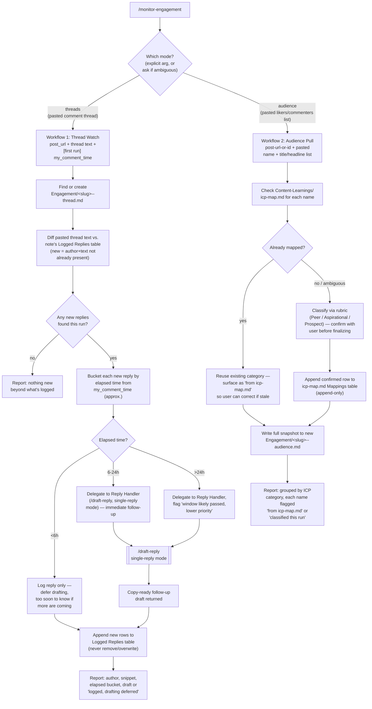

# Engagement & Community Tools — End-to-End Workflow

## 1. Overview

This document traces three related, manual-input engagement skills:
**Comment Drafter** (`/draft-comment`), **Reply Handler** (`/draft-reply`),
and **Engagement Monitor** (`/monitor-engagement`, which delegates one of
its two workflows to Reply Handler). All three are read-side or
copy-ready-output-side utilities outside the Research → Draft → Approve →
Schedule pipeline documented elsewhere in this folder.

**The central constraint, stated once here and true everywhere below:**
LinkedIn exposes no API in this pipeline for reading an arbitrary
third-party post's or comment thread's content, and no API for posting a
comment or reply. Buffer, this system's only platform integration, is
scoped to the user's own scheduling/publishing/analytics
([REQUIREMENTS.md §9](../../REQUIREMENTS.md)) — never someone else's
content, and never an outbound comment/reply. As the README puts it
([README.md, "Engagement & Community Tools"](../../README.md)):

> None of these post anything automatically — LinkedIn exposes no API for
> reading arbitrary posts/comments or posting comments/replies in this
> pipeline, so every input here is a manual paste and every output is
> copy-ready text for you to post by hand.

This rule is codified once, for all three skills, in
[REQUIREMENTS.md §27 "Reading Third-Party Post Content (Shared
Convention)"](../../REQUIREMENTS.md): the primary, reliable input is
always the user pasting text directly; a post URL is optional metadata
only, and a `WebFetch` attempt on a gated URL is best-effort convenience,
never ground truth without the user's explicit confirmation. No skill in
this trio scrapes, uses session cookies, or bypasses login/ToS to read
third-party content — the same precedent §27 draws from §25.3's rejection
of an unofficial Substack API for this system's own publishing.

Three skills implement this:

- [`draft-comment`](../../.claude/skills/draft-comment/SKILL.md) —
  Comment Drafter, [REQUIREMENTS.md §33](../../REQUIREMENTS.md).
- [`draft-reply`](../../.claude/skills/draft-reply/SKILL.md) — Reply
  Handler, [REQUIREMENTS.md §34](../../REQUIREMENTS.md).
- [`monitor-engagement`](../../.claude/skills/monitor-engagement/SKILL.md)
  — Engagement Monitor, [REQUIREMENTS.md §35](../../REQUIREMENTS.md).

---

## Part A: Comment Drafter (`/draft-comment`)

### A.1 Top-line flow chain

```
Trigger (/draft-comment, pasted post text + optional context)
  → Post Content Parse (pasted text as ground truth; URL is optional,
      best-effort-only metadata per §27)
  → Voice-Guide Application (Content-Learnings/voice-guide.md, read fresh
      every run)
  → 1-2 Comment Options Generation (short, specific, angle-aware)
  → Avoid-List Check (throat-clearing openers, decorative emoji, generic
      CTAs, hedging — checked against every option before output)
  → Copy-Ready Output (plain text in the response — no file write)
```

### A.2 Stage-by-stage

**Trigger.** `/draft-comment`, or any request to comment on someone
else's LinkedIn post. Arguments: the post's pasted text (primary), an
optional URL (best-effort only), optional author/relationship context
(shapes tone, never facts), and an optional desired angle (agree /
add-on / counterpoint / question — if omitted, the skill picks whichever
angle actually fits the post's content).

**Input.** Per §27's convention: pasted text is used directly as ground
truth. If only a URL is given, the skill attempts a `WebFetch`; if that
result looks gated, truncated, or otherwise unreliable — described in the
SKILL.md as "a common outcome, not an edge case" — it says so explicitly
and asks the user to paste/confirm the full text rather than drafting off
an unconfirmed partial fetch. If neither is given, it asks the user to
paste the post.

**Processing.** Two steps, in order:
1. Read `Content-Learnings/voice-guide.md` in full, fresh, every run —
   never from cached memory. This is the same source of truth
   `/write-draft` and every other drafting skill in the repo uses for
   tone and the avoid-list.
2. Draft 1-2 comment options, each: 1-3 sentences (the LinkedIn-comment
   length norm, not a mini-post); a specific reaction to something
   actually in the post, a related point tied to a detail the post
   actually contains, or a real question — never a generic "Great post!"
   or "So true!" (the SKILL.md cites Van der Blom's 2026 analysis in
   `Content-Learnings/algorithm-rules.md`: semantic quality and thread
   depth outweigh raw comment counts, which is the reasoning behind
   requiring specificity); grounded only in what's actually in the post
   or what the user actually told the skill — never a fabricated stat,
   credential, anecdote, or agreement; and, if the comment states a view
   rather than a fact, phrased as a view ("I'd push back on...", "what
   stood out to me...") rather than in a fact's declarative register —
   the same opinion/fact discipline as REQUIREMENTS.md §21.

Before presenting, every option is checked against the voice guide's
avoid-list explicitly: no throat-clearing opener, no stacked/decorative
emoji, no generic CTA, no hedging every sentence. A comment that reads
like every other comment on the post has failed this check.

**Tools used.** None — pure LLM reasoning over the pasted text and the
voice guide. No WebSearch, no vault write, no API call (a `WebFetch` may
occur upstream at the input stage only, and only against a URL, never as
part of drafting itself).

**Output.** Plain copy-paste text in the chat response — 1-2 comment
options. No Draft Note, no vault schema, no file write; this never
touches the `Drafts/` approval pipeline.

**What the user does with it manually.** Copies the chosen option and
pastes it into LinkedIn's own comment box on the third-party post
themselves. The skill never claims to have posted it — there is no
comment-posting API anywhere in this repo.

---

## Part B: Reply Handler (`/draft-reply`)

### B.1 Top-line flow chains

**Single-reply mode:**

```
Trigger (/draft-reply, pasted single comment + optional post context)
  → Reply Draft (voice-guide-fresh, short, specific to what the comment
      actually said)
  → Copy-Ready Output
```

**Sweep mode (full-thread export):**

```
Trigger (/draft-reply, pasted full thread export)
  → Thread Parse (ingest the pasted export)
  → Top-Level/Reply Flattening Reconstruction (rebuild {author, text,
      replied_to} per top-level comment, per LinkedIn's 2-level
      flattening)
  → Low-Value Filter (skip + log pure-emoji, generic praise, spam,
      near-duplicates, contentless tags — sweep mode only)
  → Per-Comment Attribution (confirm/assign replied_to for every
      surviving reply)
  → Voice-Guide Application (fresh read)
  → Batch Reply Drafting (one reply per surviving comment/reply, each
      carrying an explicit addressee label)
  → Copy-Ready Output Set (grouped by top-level thread; skipped-comment
      log; parsed/filtered/drafted counts)
```

If the mode is ambiguous — e.g. a short paste with no visible reply
structure — the skill asks, or defaults to single-reply for one comment
and sweep for anything with multiple comments.

### B.2 The 2-level-flattening attribution logic (precise)

This is the trickiest piece of logic in this document, so it is worth
stating exactly as the SKILL.md and [REQUIREMENTS.md
§34](../../REQUIREMENTS.md) specify it, not paraphrased loosely.

**Why it's needed.** LinkedIn's comment UI nests only one level deep. A
reply to someone else's reply does not get its own nested slot — it gets
flattened into the same flat reply list under the original top-level
comment, and LinkedIn auto-inserts an "@Name" prefix on that reply's text
to indicate who it was actually meant for. This is a display convention,
not real nesting, and the thread export the user pastes preserves that
same flattened, one-level shape (i.e., the pasted text itself already
carries whatever "@Name" markers LinkedIn inserted — the skill does not
need to reconstruct nesting from indentation or any other visual cue that
doesn't survive a paste).

**The reconstruction rule.** On parse, the skill builds a flat list **per
top-level comment** of records shaped `{author, text, replied_to}`:

- `replied_to` is inferred from an explicit "@Name" mention at the
  *start* of a reply's text — this is LinkedIn's own flattening marker,
  and the skill treats it as authoritative when present.
- If no such leading "@Name" mention is present, `replied_to` **defaults
  to the top-level comment's author** — the assumption is that an
  unmarked reply addresses the thread starter, not some other repliers
  further down the same flattened list.
- The skill is instructed never to guess beyond these two rules. If the
  text is ambiguous even applying the "@Name" convention (for example, a
  reply that names no one and doesn't obviously read as addressed to the
  top-level author either), it says so rather than silently picking a
  guess.

**Labeling the output.** Every drafted reply is labeled:

> **Reply to [Author] (responding to [X] in this thread)**

and the drafted reply text itself is written to open by naming or
otherwise clearly addressing that specific person's point — never a
generic reply that could float under any comment in the thread. When two
different people replied to two different targets within the same
top-level thread, their drafted outputs stay visually grouped under that
thread for one scan-through, but each still carries its own explicit
target label, so nothing is misattributed when the user copies replies
back into LinkedIn individually and out of the batch's original order.

### B.3 Low-value filter (sweep mode only)

Single-reply mode always drafts what's asked; the filter runs only in
sweep mode, to avoid spending a drafted reply on a comment not worth
answering. Skipped — and logged as skipped, with a stated reason, never
silently dropped:

- Pure emoji/reaction-only comments ("🔥🔥", "👏", no words).
- Generic praise with zero specific reference to post content ("Great
  post!", "So true", "Well said" and nothing else).
- Off-topic self-promotion/spam (an unrelated link drop, "check out my
  profile/product").
- A near-duplicate of a comment already answered earlier in the same
  thread — same point, no new angle.
- A tag/mention with no added content ("@friend check this out" and
  nothing else).

Everything else is kept — including a short-but-substantive
disagreement, a real question, a correction, or a personal anecdote tied
to the post, even if brief. The rule when in doubt is to keep rather than
skip. The skipped-comment log (which comment, and why) is a required part
of every sweep report — never omitted.

### B.4 Stage-by-stage detail

**Trigger.** `/draft-reply`, either a single pasted comment (optionally
with the original post's text/topic for context) or a full pasted thread
export.

**Input.** Per §27: pasted comment/thread text is the primary, reliable
input; a post URL is optional, best-effort-only metadata, never relied on
to reconstruct thread content that wasn't actually pasted.

**Processing.** Single-reply mode: read the voice guide fresh, draft one
short reply specific to what the comment actually said, no throat-
clearing, no generic filler. Sweep mode: parse into the
`{author, text, replied_to}` structure per B.2, apply the low-value
filter per B.3 (logging skips), read the voice guide fresh, draft a
labeled reply for each survivor, and present the batch grouped by
original top-level thread so the user can scan one thread at a time,
plus a final count of parsed / filtered-out / drafted.

**Tools used.** None — pure LLM reasoning over pasted text (plus, at the
input stage only, an optional best-effort `WebFetch` on a URL, same
caveats as Comment Drafter).

**Output.** Copy-ready reply text — one reply in single-reply mode, a
labeled batch in sweep mode. No Draft Note, no `Drafts/` entry, no
approval-pipeline lifecycle, for either mode.

**What the user does with it manually.** Copies each reply and pastes it
into LinkedIn's own reply box under the correct comment (guided by the
addressee label). The skill never posts anything and never implies a
reply was posted.

---

## Part C: Engagement Monitor (`/monitor-engagement`)

Two manual-input, read-side workflows for tracking engagement the user
already has, rather than producing new outbound content. Confirmed
against `pull-analytics`'s Buffer-scoped-to-own-posts limitation
([REQUIREMENTS.md §9](../../REQUIREMENTS.md)): there is no live data
source anywhere in this repo for (a) detecting a reply to the user's
comment on someone else's post, or (b) pulling a likers/commenters list
for an arbitrary post. Both workflows are manual-input only,
**permanently** — this is stated as a design position, not a gap to be
closed later; no live polling or scraping capability is ever added.

### C.1 Top-line flow chains

**Workflow 1 — thread watch (`/monitor-engagement threads`):**

```
Trigger (/monitor-engagement threads, pasted post URL + thread's current
    visible text + [first run only] the user's own comment timestamp)
  → Find-or-Create Tracking Note (Engagement/<post-slug>--thread.md)
  → Diff Against Logged Replies (new = not already in the note's table,
      matched by author + text)
  → Elapsed-Time Bucketing (from my_comment_time to the diff run's date —
      stated explicitly as an approximation, not a measured reply time)
      <6h  → log only, defer drafting
      6-24h → delegate to Reply Handler (single-reply mode)
      >24h  → delegate to Reply Handler, flagged "window likely passed,
               lower priority"
  → [delegates to] Reply Handler (/draft-reply single-reply mode)
  → Follow-Up Draft Output (copy-ready text) + Logged Replies table
      appended back to the tracking note
```

**Workflow 2 — audience pull (`/monitor-engagement audience
<post-url-or-id>`):**

```
Trigger (/monitor-engagement audience, pasted likers/commenters list —
    name + title/headline)
  → Name/Profile Parse
  → icp-map.md Lookup (reuse an existing confirmed category if the name
      is already mapped; surface it for the user to correct if stale)
  → ICP Classification (Peer / Aspirational / Prospect, via the rubric —
      ambiguous or new names confirmed with the user before finalizing)
  → Grouped Output (by ICP category, each entry flagged "from icp-map.md"
      or "classified this run") + write-back to icp-map.md and a new
      Engagement/<post-slug>--audience.md snapshot note
```

If the mode is ambiguous (bare `/monitor-engagement`, no argument, no
clear context), the skill asks rather than guessing.

### C.2 Mode-selection flowchart



### C.3 Stage-by-stage: Workflow 1 (Thread Watch)

**Trigger.** `/monitor-engagement threads`.

**Input.** Post URL, the thread's current full visible text (pasted), and
— on the first run for that thread only — the user's own comment's
timestamp (`my_comment_time`, user-supplied since no API confirms it).

**Processing.** Finds or creates
`Engagement/<post-slug>--thread.md` from
[`_Templates/Engagement-Thread-Note.md`](../../_Templates/Engagement-Thread-Note.md).
Diffs the freshly pasted text against the note's `## Logged Replies`
table (matched by author + text); anything not already present is
treated as new. Note the skill diffs the *entire pasted thread text*
against what's logged — it is not scoped to identifying the post
author specifically among repliers, though the workflow's practical use
case (watching a thread the user seeded with their own comment) is
waiting for the original author to respond. For each new reply, elapsed
time is computed from `my_comment_time` to the run's own date — the
SKILL.md states plainly this is "an approximation, not a guaranteed
reply-time measurement," never an exact figure. Under 6h elapsed: log
only, defer drafting (too soon to know if more replies are still coming
in). 6-24h: delegate to `/draft-reply`'s single-reply mode, passing the
reply's text and any available post context, for an immediate follow-up
draft. Over 24h: still delegate to `/draft-reply`, but flag the result
"window likely passed, lower priority." The skill never reimplements
drafting logic itself for this step.

**Tools used.** None beyond the delegated call to `/draft-reply` (itself
pure LLM reasoning, no external API) and a vault file read/write.

**Output.** For each new reply: author, text snippet, elapsed-time
bucket, and either the delegated draft or "logged, drafting deferred."
If nothing new is found, the skill states that plainly rather than
inventing something to report. The `## Logged Replies` table is updated
in place — new rows appended, existing rows never removed or overwritten
— so the next run only reports genuinely new activity.

**What the user does with it manually.** Reads the thread on LinkedIn
themselves each run and pastes its current visible text in (there is no
notification or polling mechanism that does this automatically); copies
any delegated follow-up draft and posts it themselves.

### C.4 Stage-by-stage: Workflow 2 (Audience Pull)

**Trigger.** `/monitor-engagement audience <post-url-or-id>`.

**Input.** A post URL/id plus the pasted likers/commenters list — name
and whatever title/headline text is actually visible on the post. Per
§27, this list is never fetched live.

**Processing.** Classifies each person against the ICP rubric:

- **Peer** — an individual-contributor/similar-seniority title in
  AI/ML/data/engineering, doing comparable work.
- **Aspirational** — a senior/leadership title (Director, VP, Head of,
  Principal, Founder) or a recognizable figure the user doesn't already
  have a peer relationship with.
- **Prospect** — a title with hiring/buying power relevant to the user
  (recruiter, hiring/engineering manager, founder hiring).

Before finalizing each classification, the skill checks
[`Content-Learnings/icp-map.md`](../../Content-Learnings/icp-map.md)'s
`## Mappings` table for that name. As read for this document, the file
currently ships empty — header, description, and an empty `| name |
category | last_confirmed_date |` table with no data rows yet, since it
"accumulates only from real `/monitor-engagement audience` runs, never
seeded with invented names." If a name is found, its existing category is
reused rather than re-guessed, but it is still surfaced in the report so
the user can correct a stale classification if the person's role has
changed. If the name isn't there, or the classification is genuinely
ambiguous (a title that could plausibly be Peer or Aspirational), the
skill asks the user to confirm before finalizing it.

**Tools used.** None external — a vault file read (`icp-map.md`) plus
writes described below.

**Output.** The classified list grouped by ICP category (Peer /
Aspirational / Prospect), each name flagged either "from icp-map.md"
(reused) or "classified this run" (fresh).

**What the user does with it manually.** Uses the grouped list to decide
who to engage with, follow up on, or prioritize outreach to — this
workflow produces a snapshot and a classification, not an action.

---

## Closing Section

### Agents & Skills Involved

| Skill | Role | Delegation |
|---|---|---|
| [`draft-comment`](../../.claude/skills/draft-comment/SKILL.md) | Comment Drafter — 1-2 copy-ready comment options for someone else's post, in the user's voice | none |
| [`draft-reply`](../../.claude/skills/draft-reply/SKILL.md) | Reply Handler — single-comment reply or full-thread sweep with 2-level-flattening attribution and low-value filtering | none |
| [`monitor-engagement`](../../.claude/skills/monitor-engagement/SKILL.md) | Engagement Monitor — thread-watch (new-reply detection) and audience-pull (ICP grouping) | Workflow 1 (thread watch) delegates its actual follow-up drafting to `draft-reply`'s single-reply mode rather than reimplementing it; Workflow 2 (audience pull) does not delegate — it classifies directly |

### Tools/APIs Used

**None.** No LinkedIn read API (for arbitrary third-party posts, comments,
threads, likers, or commenters) and no LinkedIn write API (for posting a
comment or reply) exists anywhere in this pipeline. Buffer, the only
platform integration in this repo, is scoped to the user's own
scheduling/publishing/analytics ([REQUIREMENTS.md
§9](../../REQUIREMENTS.md)) and is never called by any of these three
skills. This is why every input across all three skills is a manual paste
and every output is copy-ready text — codified once, for all of them, in
[REQUIREMENTS.md §27](../../REQUIREMENTS.md), which all three SKILL.md
files cross-reference rather than restate. The only tool call that ever
occurs in this trio is an optional, best-effort `WebFetch` against a
user-supplied post URL (Comment Drafter, Reply Handler) — never treated
as reliable on its own, and never a substitute for a paste the user hasn't
confirmed matches what they see.

### Validation & Quality Gates

- **Voice-guide adherence (Comment Drafter, and Reply Handler's drafting
  steps).** Both skills read `Content-Learnings/voice-guide.md` in full,
  fresh, every run — never from cached memory — and check every drafted
  option against its avoid-list (throat-clearing openers, stacked/
  decorative emoji, generic CTAs, hedging) before presenting it. Comment
  Drafter additionally enforces the opinion/fact discipline of
  REQUIREMENTS.md §21 whenever a comment states a view rather than a
  fact.
- **Low-value-comment filtering (Reply Handler, sweep mode only).**
  Described in full in §B.3 above — skips pure-emoji/reaction-only
  comments, generic praise with no specific post reference, off-topic
  self-promotion/spam, near-duplicate points already answered earlier in
  the thread, and contentless tags/mentions. A short but substantive
  disagreement, a real question, a correction, or a brief personal
  anecdote is always kept. Every skip is logged with a reason — the
  SKILL.md treats silently dropping a comment from the report as a hard-
  rule violation, not a minor omission.
- **ICP classification accuracy (Engagement Monitor, audience pull).**
  Accuracy depends directly on `Content-Learnings/icp-map.md` being kept
  current: a reused mapping is surfaced to the user precisely so a stale
  classification (a person's role changed since it was last confirmed)
  can be corrected rather than silently trusted forever. Every
  classification — reused or fresh — is stated as a suggestion pending
  the user's confirmation, never asserted as settled fact. The map ships
  empty and grows only from real, user-confirmed runs; it is never seeded
  with invented names.
- **Elapsed-time bucketing is an approximation (Engagement Monitor,
  thread watch).** The SKILL.md states this explicitly: elapsed time is
  measured from a user-supplied `my_comment_time` to the diff run's own
  date, not to when a reply actually posted, and every report states this
  plainly rather than presenting it as a precise reply-time measurement.

### Data Stored in Memory/Vault

This is **not uniform across the three skills** — worth stating precisely
rather than assuming "manual-input, copy-ready-output" implies nothing is
ever persisted:

- **Comment Drafter (`draft-comment`) — nothing persisted.** Output is
  ephemeral copy-paste text in the chat response only. No Draft Note, no
  vault schema, no file write, for a single ad-hoc comment. Confirmed in
  both the SKILL.md ("no vault artifact... no Draft Note, no new file,
  nothing added to the approval pipeline") and
  [REQUIREMENTS.md §33](../../REQUIREMENTS.md).
- **Reply Handler (`draft-reply`) — nothing persisted, either mode.**
  Same ephemeral shape — no Draft Note, no `Drafts/` entry, no approval-
  pipeline lifecycle, confirmed in the SKILL.md's hard rules and
  [REQUIREMENTS.md §34](../../REQUIREMENTS.md): "No vault artifact: no
  Draft Note, no `Drafts/` entry, no approval-pipeline lifecycle, for
  either mode."
- **Engagement Monitor (`monitor-engagement`) — this one DOES persist to
  the vault, in both workflows.** This is the one place in this trio
  where "manual paste in, copy-ready text out" is not the whole picture:
  - Workflow 1 (thread watch) writes and maintains one note per tracked
    thread at `Engagement/<post-slug>--thread.md`
    ([template](../../_Templates/Engagement-Thread-Note.md)), frontmatter
    `id`, `type: engagement-thread`, `post_url`, `my_comment_text`,
    `my_comment_time`, `status: watching|closed`, with a `## Logged
    Replies` table (`author | text_snippet | seen_date`) appended to
    (never overwritten) on every run.
  - Workflow 2 (audience pull) writes a one-time snapshot note per run at
    `Engagement/<post-slug>--audience.md`
    ([template](../../_Templates/Engagement-Audience-Note.md)),
    frontmatter `id`, `type: engagement-audience`, `post_url`,
    `captured_date`, with one table per ICP category (Peer / Aspirational
    / Prospect), columns `name | title_or_headline | notes`, **and**
    appends confirmed classifications into
    [`Content-Learnings/icp-map.md`](../../Content-Learnings/icp-map.md)'s
    `## Mappings` table (append-only — a new row for a first-time name,
    an updated `last_confirmed_date` for a re-confirmed one, never a
    deletion).
  - Per [REQUIREMENTS.md §35](../../REQUIREMENTS.md), `Engagement/` is a
    new top-level folder, `permissive_folder=True` in
    `scripts/validate_vault.py` (holding two note types,
    `engagement-thread` and `engagement-audience`, from day one — the
    same pattern `Content-Learnings/` uses). It is also listed in
    [`.gitignore`](../../.gitignore) as generated content, alongside the
    repo's other runtime-generated folders — as of this read, no files
    exist in it yet, consistent with `icp-map.md` still being an empty
    scaffold with zero data rows.
  - This persistence is narrower than the Drafts/Scheduled pipeline in
    every sense that matters for the "copy-ready output" framing: none of
    it is a Draft Note, none of it enters `status: draft/in_review/
    approved`, and none of it is ever scheduled or published. It exists
    purely so a *repeat* run of either workflow can diff against or reuse
    prior state (new replies only; a name not re-classified from
    scratch) — it is bookkeeping for the monitor itself, not new outbound
    content awaiting approval.

### Failure Modes & Recovery

- **Comment Drafter / Reply Handler: only a URL given, and `WebFetch`
  returns a gated/partial/unreliable result.** Both skills state this
  plainly rather than drafting on a guess, and ask the user to paste or
  confirm the full text before proceeding. Neither ever treats an
  unconfirmed fetch as ground truth.
- **Reply Handler, sweep mode: malformed or incomplete thread export.**
  The skill is instructed to never fabricate a comment's content, author,
  or thread structure beyond what was actually pasted — if the pasted
  thread is ambiguous or incomplete, it says so rather than inventing the
  missing shape. This applies directly to attribution too: if a reply's
  `replied_to` target can't be determined even applying the "@Name"
  convention, the skill states the ambiguity rather than silently
  guessing (§B.2 above).
- **Reply Handler, sweep mode: ambiguous mode selection.** A short paste
  with no visible reply structure is asked about explicitly rather than
  assumed; absent clarification, the skill defaults to single-reply for
  one comment and sweep for anything with multiple comments.
- **Engagement Monitor, thread watch: no new replies found this run.**
  The skill states this plainly ("nothing new beyond what's logged")
  rather than inventing something to report — this is an explicit hard
  rule, not just a fallback behavior: "never claim 'no new replies'
  beyond what was actually pasted this run."
- **Engagement Monitor, thread watch: elapsed time can't be measured
  precisely.** Since `my_comment_time` is user-supplied and elapsed time
  is computed against the diff run's own date (not the reply's actual
  post time), every bucketed report states this is an approximation, not
  a guaranteed reply-time measurement — this is a stated limitation, not
  a failure state requiring recovery.
- **Engagement Monitor, audience pull: an ambiguous or unrecognized
  title/headline.** Rather than force a Peer/Aspirational/Prospect
  guess, the skill asks the user to confirm before finalizing and before
  writing anything to `icp-map.md`. A name/title that's genuinely
  unclear from the pasted text stays unresolved until the user weighs in
  — nothing is written provisionally.
- **Engagement Monitor, either workflow: ambiguous or missing mode
  argument.** A bare `/monitor-engagement` with no argument and no clear
  surrounding context is met with a clarifying question rather than a
  guessed mode.
