# Employee Advocacy — End-to-End Workflow

## 1. Overview

This document traces the complete workflow of `/plan-advocacy`, the
**Employee Advocacy Agent** — a standalone **program-planning** tool for
launching a team LinkedIn advocacy initiative. It is not an autonomous
posting system for anyone else's account, and it has no access to any
LinkedIn or Buffer account other than the primary user's own.

Per the skill's own framing (`.claude/skills/plan-advocacy/SKILL.md`):

> This is the most standalone skill in this repo: it plans a program for
> a **team of other people**, most of whom aren't using this tool
> themselves.

Same precedent as `optimize-profile`
([REQUIREMENTS.md §36](../../REQUIREMENTS.md)): a **one-off/periodic
program plan with a quarterly review cadence**, not part of the
recurring daily content pipeline (research/plan/write/critique/audit/
schedule) and not one of this repo's sequential, numbered Phases.

The deliverable in every run is a planning document — a launch schedule,
per-person cadence suggestions, brand dos/don'ts, and an approval/
escalation chain — plus a shared, empty metrics template team members
fill in by hand. `/plan-advocacy` never posts, schedules, fetches, or
scrapes anything on behalf of a team member; it never claims automated
tracking of anyone's individual account performance. This repo's Buffer
access is scoped to the primary user's own channel only
([REQUIREMENTS.md §12](../../REQUIREMENTS.md)) — a **permanent
architectural constraint**, confirmed against `pull-analytics/SKILL.md`,
not a gap to be fixed later. Any team member's post performance can only
ever be self-reported by that person, from their own screenshots.

---

## 2. Top-Line Flow Chain

```
Trigger (/plan-advocacy)
  → Team/Program Input Gathering (company name, roster, program goal —
      hard-stop-and-ask if company name or roster is missing)
  → Draft or Import Brand Dos-and-Don'ts (sourced from an intake doc if
      supplied, else drafted from scratch and flagged
      [DRAFTED — CONFIRM WITH LEGAL/COMMS])
  → 14-Day Launch Plan Construction (day-by-day onboarding + per-person
      first-post prompts, angles drawn from the pillar menu)
  → Per-Person Posting Cadence Suggestion (stated explicitly as a
      suggestion — no enforcement mechanism exists)
  → Approval Chain and Escalation Path Definition (spot-check pattern +
      named point-of-contact + 2-step private-flag/takedown process)
  → Aggregate Metrics Log (re-run only — rollup of whatever self-reports
      already exist; skipped with "no entries yet" on a first run)
  → Program Plan Note + Metrics Log Write (Employee-Advocacy/ folder)
  → Report Back (file paths, confirmed goal, 3-5 open decisions needing
      sign-off)
```

The self-reported metrics loop that follows is a **separate, disconnected
process** — see §3's flowchart and §4's "What happens after" — that this
skill does not execute or monitor; it only creates the empty template and,
on a later re-run, rolls up whatever a team member has manually entered.

---

## 3. Flowchart

```mermaid
flowchart TD
    A["/plan-advocacy"] --> B{"Company name AND<br/>roster both supplied?"}
    B -- "no" --> B1["STOP — ask for the<br/>missing item(s)<br/>(hard input contract)"]
    B1 --> A
    B -- yes --> C["Confirm single program goal:<br/>brand-awareness / hiring /<br/>thought-leadership /<br/>sales-pipeline<br/>(reject a blended goal)"]

    C --> D{"Brand-voice/guidelines<br/>doc supplied?"}
    D -- yes --> E["Draft dos/don'ts sourced<br/>from that doc"]
    D -- no --> F["Draft dos/don'ts from scratch;<br/>every item flagged<br/>[DRAFTED — CONFIRM WITH<br/>LEGAL/COMMS]"]
    E --> G
    F --> G["Cover minimum topics:<br/>confidentiality, tone alignment,<br/>disclosure, no engaging trolls,<br/>no political/controversial takes"]

    G --> H["Build 14-day launch plan:<br/>day-by-day onboarding +<br/>per-person first-post prompts,<br/>angles from pillar menu<br/>(REQUIREMENTS.md §2's 15 pillars<br/>or team's narrowed list)"]
    H --> I["Define ongoing cadence —<br/>stated explicitly as a<br/>SUGGESTION only<br/>(e.g. 1-2 posts/week/person)"]
    I --> J["Define approval chain:<br/>spot-check pattern —<br/>drafts shared in a channel/doc<br/>for first 14 days, tapering<br/>to self-serve after"]
    J --> K["Define escalation path:<br/>named point-of-contact +<br/>2-step private-flag →<br/>takedown-request process<br/>(human-triggered only)"]

    K --> L{"Re-run against an<br/>existing program?"}
    L -- "no (first run)" --> M["Rollup section ships:<br/>'no entries yet'"]
    L -- "yes" --> N["Read existing metrics-log rows;<br/>compute rollup: most-active<br/>contributor, most-engaged post,<br/>participation rate<br/>(never invent a missing number)"]

    M --> O["Write Program Plan Note<br/>(Employee-Advocacy/YYYY-MM-DD--<br/>company-slug-program.md)"]
    N --> O
    O --> P["Write/update shared Metrics Log<br/>(Employee-Advocacy/YYYY-MM-DD--<br/>company-slug-metrics-log.md)<br/>— empty table on first run"]
    P --> Q["Report back: 2 file paths,<br/>confirmed program goal,<br/>3-5 open sign-off decisions"]

    Q --> R["[HUMAN STEP]<br/>User/comms distributes the<br/>plan to the real team manually"]
    R --> S["[HUMAN STEP]<br/>Team members post on their<br/>own LinkedIn accounts —<br/>outside this pipeline entirely"]

    subgraph SELFREPORT ["Self-Reported Metrics Loop — DISCONNECTED from Buffer, no automated pull"]
        S --> T["[HUMAN STEP]<br/>Team member screenshots their<br/>own post's impressions/<br/>reactions/comments"]
        T --> U["[HUMAN STEP]<br/>Team member manually appends<br/>a row to the shared<br/>Metrics Log table"]
        U --> V{"Did they report?"}
        V -- "no" --> W["Row stays absent —<br/>NEVER recorded as zero"]
        V -- yes --> X["Row recorded exactly<br/>as self-reported"]
    end

    X -.->|"next /plan-advocacy<br/>re-run reads these rows"| N
    W -.->|"absence is itself<br/>the signal"| N
```



---

## 4. Stage-by-Stage Breakdown

### Stage: Trigger and hard input contract

- **Trigger:** `/plan-advocacy`, invoked manually — there is no scheduled
  or recurring trigger for this skill anywhere in the repo.
- **Responsible skill:** [`plan-advocacy`](../../.claude/skills/plan-advocacy/SKILL.md).
- **Input required (hard-stop if missing):**
  - **Company/team name.**
  - **Roster** — name, role, and LinkedIn profile URL per person,
    stored exactly as supplied. Never fetched or scraped — per
    REQUIREMENTS.md §27's discipline against unofficial access to a
    third party's profile, which applies to a team member's profile the
    same as any other person's.
  - **Program goal** — exactly one of `brand-awareness` / `hiring` /
    `thought-leadership` / `sales-pipeline`. A blended goal is rejected;
    the skill asks which one is primary.
- **Input optional:**
  - **Existing brand-voice/guidelines doc** (path or pasted text).
  - **Target content pillars** — defaults to offering REQUIREMENTS.md
    §2's 15-pillar menu (AI, Tech Career, Developer Tools, GenAI,
    Machine Learning, Deep Learning, Interview Prep, Data Analytics,
    Data Engineering, Maths Related to Data, Problem Solving,
    Algorithms, Research, Psychology + AI, AI in Healthcare) as a
    starting point the team can narrow, rather than inventing a new
    pillar set.
  - **Launch date** — asked for if absent, or defaulted to "TBD —
    confirm before distributing."
- **Processing:** the skill will not proceed past intake with a missing
  company name or roster — everything downstream (the launch plan, the
  metrics log) depends on having real people and a real program identity
  to plan around.
- **Output:** confirmed intake values carried into every later step.

### Stage: Brand dos-and-don'ts

- **Trigger:** continuation of the same run, step 2.
- **Input:** the intake brand-voice/guidelines doc, if supplied.
- **Processing:** every dos/don'ts item sourced from a supplied doc is
  written as-is; every item without a real source is labeled
  `[DRAFTED — CONFIRM WITH LEGAL/COMMS]`. Minimum coverage, regardless of
  source: confidentiality (no unannounced product/financial
  information), tone alignment with the company's public voice,
  disclosure (mention affiliation when discussing the employer), no
  personally engaging with trolls/negative press on the company's
  behalf, and no political/controversial takes under the company's
  halo.
- **Tools used:** none — pure LLM reasoning over supplied text.
- **Output:** the `## Brand Dos and Don'ts` section of the Program Plan
  Note.

### Stage: 14-day launch plan construction

- **Trigger:** continuation of the same run, step 3.
- **Input:** the confirmed pillar menu/list and roster.
- **Processing:** builds a day-by-day (Day 1–14) onboarding plan with a
  focus and a per-person posting prompt/angle for each day, drawn from
  the pillar menu. The skill explicitly instructs never to fabricate
  specifics about what any real named person will actually post — these
  are prompts/angles offered to them, not claims about content that
  exists.
- **Tools used:** none — pure LLM reasoning; the skill's process section
  documents no WebSearch call at this or any other stage.
- **Output:** the `## 14-Day Launch Plan` table (Day / Focus /
  Per-person prompt-angle).

### Stage: Ongoing cadence suggestion

- **Trigger:** continuation of the same run, step 4.
- **Input:** program goal and roster size.
- **Processing:** states a recommended cadence (e.g. 1-2 posts/week/
  person), framed explicitly as a suggestion — the skill is required to
  state plainly that it has no mechanism to enforce, schedule, or verify
  posting for anyone but the primary user's own channel.
- **Tools used:** none.
- **Output:** the `## Ongoing Cadence (Suggestion, Not Enforced)`
  section.

### Stage: Approval chain and escalation path

- **Trigger:** continuation of the same run, step 5.
- **Input:** none beyond the program context already gathered.
- **Processing:** because the tool cannot access or approve another
  person's draft, the realistic default is a **spot-check pattern** —
  advocates share drafts in a shared channel/doc during the first 14
  days, tapering to self-serve after. Escalation is a named
  point-of-contact (comms/manager) plus a 2-step process for anything
  off-brand that goes live: (1) private flag, (2) takedown request. The
  skill states plainly that it cannot itself detect or monitor a team
  member's feed for off-brand content — escalation is human-triggered
  only, always, the same class of gap the README documents for
  third-party engagement monitoring.
- **Tools used:** none.
- **Output:** the `## Approval Chain` and `## Escalation Path` sections.

### Stage: Metrics log aggregation (re-run only)

- **Trigger:** continuation of the same run, step 6 — only when the run
  is against a company/team that already has a program note.
- **Input:** whatever rows already exist in the shared Metrics Log.
- **Processing:** computes a simple rollup — most-active contributor
  (most self-reported entries), most-engaged post (highest self-reported
  numbers), and participation rate (# roster members with ≥1 entry /
  roster size). The skill is explicit that participation rate is a
  **completion-rate statistic**, never to be called "engagement" or
  "performance" — it measures who submitted a report, not how any post
  actually performed. It never invents a number for someone who didn't
  submit one. On a first run (no existing log), this step is skipped and
  the Rollup section ships saying "no entries yet."
- **Tools used:** none — reads an existing vault note only.
- **Output:** the `## Rollup` section of the Metrics Log.

### Stage: File write and report back

- **Trigger:** final step of the same run.
- **Processing:** writes (or, on a re-run, updates) both files under a
  new top-level `Employee-Advocacy/` folder — same precedent as
  `Profile-Optimization/`: a periodic, re-runnable artifact accumulating
  history across runs. On a re-run, the program note gets a new
  `history` entry rather than being replaced, and the metrics log keeps
  accumulating rather than being overwritten; a duplicate file set for
  the same program is never created unless the user explicitly wants a
  fresh relaunch.
- **Tools used:** deterministic file write (Write tool), no external
  API.
- **Output:**
  1. `Employee-Advocacy/YYYY-MM-DD--<company-slug>-program.md`, from
     [`_Templates/Employee-Advocacy-Note.md`](../../_Templates/Employee-Advocacy-Note.md).
  2. `Employee-Advocacy/YYYY-MM-DD--<company-slug>-metrics-log.md`, one
     **shared** log for the whole team (never per-person files), from
     [`_Templates/Advocacy-Metrics-Log.md`](../../_Templates/Advocacy-Metrics-Log.md).
     Its `program_id` field cross-references the program note's `id`.
- **Report back:** the two file paths, the confirmed program goal, and
  **3-5 open decisions** genuinely needing sign-off from the user or
  comms team (e.g. an unconfirmed `[DRAFTED — CONFIRM WITH LEGAL/
  COMMS]` item, the launch date, the named escalation point-of-contact).
  The skill does not restate the full plan in chat — it points at the
  files.

### What happens after generation

This is where the workflow leaves the pipeline entirely:

1. **Human distributes the plan.** The user (or comms) manually shares
   the Program Plan Note's content with the real team — no distribution
   mechanism (email, Slack, etc.) exists in this repo.
2. **Team members post on their own accounts,** using the launch-plan
   prompts as inspiration, entirely outside this system's reach.
3. **Team members self-report metrics manually.** Per §3's flowchart,
   each team member screenshots their own post's impressions/reactions/
   comments and appends a row to the shared Metrics Log table by hand.
   This is a fully disconnected data path — nothing in this repo polls,
   scrapes, or pulls it automatically.
4. **A later `/plan-advocacy` re-run** reads whatever rows have
   accumulated and computes the rollup described above — the only point
   at which this skill touches the metrics data again.

---

## 5. Agents & Skills Involved

| Skill | Role | Platforms |
|---|---|---|
| [`plan-advocacy`](../../.claude/skills/plan-advocacy/SKILL.md) | Employee Advocacy Agent — intake, brand dos/don'ts, 14-day launch plan, cadence suggestion, approval/escalation chain, metrics rollup | Team LinkedIn advocacy program (not the primary user's own posting pipeline) |

No other skill in the repo calls or is called by `plan-advocacy` — per
REQUIREMENTS.md §36, it is "the most standalone" of the skills added in
its batch, sharing no dependency with any other skill.

---

## 6. Tools/APIs Used

- **None.** The entire workflow is LLM reasoning plus deterministic file
  reads/writes. `SKILL.md`'s process section documents no `WebSearch`
  call and no external API call at any step — unlike, for example,
  `generate-visual`'s conditional design-trend `WebSearch`, this skill
  has no equivalent research step.
- **Buffer is never called.** Buffer access in this repo is scoped to
  the primary user's own single channel (REQUIREMENTS.md §12), which is
  a credentials-level restriction: the configured Buffer integration has
  no grant to query any other person's channel or account, and no plan,
  upgrade path, or unofficial workaround (session cookies, scraping) is
  ever adopted for this — confirmed against `pull-analytics/SKILL.md`
  §9/§12 and restated as a **permanent architectural constraint** in
  both `REQUIREMENTS.md` §36 and the skill's own hard rules. Concretely:
  even if every team member's LinkedIn handle is known from the roster,
  there is no API credential anywhere in this repo that could pull their
  post metrics — Buffer's API only ever returns metrics for the
  authenticated channel's own scheduled/published posts.
- **No team-member profile fetch.** Roster URLs are stored exactly as
  given and never used as a basis for fetching or scraping that person's
  real profile or activity — the same REQUIREMENTS.md §27 discipline
  applied to any third-party profile.

---

## 7. Validation & Quality Gates

- **Hard-stop intake gate:** the skill will not proceed past intake with
  a missing company name or roster — there is no "plan around a
  placeholder team" fallback.
- **Single-goal enforcement:** a blended program goal (e.g. "hiring and
  brand-awareness") is rejected; the skill asks which one is primary
  rather than guessing or splitting the plan.
- **Brand-safety sourcing discipline:** every dos/don'ts item is either
  traceable to a real supplied intake doc or explicitly labeled
  `[DRAFTED — CONFIRM WITH LEGAL/COMMS]` — never presented as settled
  policy. This is the closest thing this workflow has to a
  brand-safety guardrail: it forces a downstream human legal/comms
  review of anything the model itself originated.
- **Cadence-realism framing:** the ongoing cadence recommendation is
  stated explicitly as a suggestion, never a commitment the tool can
  keep or enforce — this is asserted as a hard rule, not left to the
  model's judgment on a given run.
- **No fabricated content claims:** launch-plan angles/prompts are
  never presented as claims about what a real named person will
  actually post — they are offered prompts only.
- **No fabricated metrics:** a self-reported metric is never invented on
  a team member's behalf, and a missing self-report is never treated as
  a zero — same null-handling discipline as `pull-analytics`.
- **Participation-rate labeling discipline:** the rollup's participation
  rate must never be called an "engagement" or "performance" metric —
  it is a completion-rate statistic about who submitted a report.
- **No re-fetch/re-scrape of roster profiles:** the roster URL is stored
  as given, never dereferenced.
- **No duplicate program files:** a re-run against an existing
  company/team updates the existing pair (new `history` entry; metrics
  log keeps accumulating) rather than creating a second set of files,
  unless the user explicitly asks for a fresh relaunch.
- **No PII beyond name/role/URL:** the skill never stores a team
  member's personal contact information beyond what the user already
  supplied for the roster.

---

## 8. Data Stored in Memory/Vault

Two notes per program run, both under a dedicated `Employee-Advocacy/`
folder (new top-level folder, same precedent as `Profile-Optimization/`).

### Program Plan Note — `Employee-Advocacy/YYYY-MM-DD--<company-slug>-program.md`

From [`_Templates/Employee-Advocacy-Note.md`](../../_Templates/Employee-Advocacy-Note.md).
Frontmatter schema:

| Field | Meaning |
|---|---|
| `id` | `YYYY-MM-DD--company-slug-program`, matches the filename |
| `type` | always `employee-advocacy` |
| `status` | `draft` \| `active` \| `placeholder` (`placeholder` = hand-written schema example, never treated as real input by any skill) |
| `company` | company/team name |
| `launch_date` | `YYYY-MM-DD`, or a stated TBD if not yet confirmed |
| `roster_size` | integer, number of people on the roster |
| `primary_goal` | exactly one of `brand-awareness` \| `hiring` \| `thought-leadership` \| `sales-pipeline` |
| `history` | list of `{action: created \| relaunched \| reviewed, date, note}` entries |

Body sections: `## Roster` (name / role / linkedin_profile_url table —
exactly as supplied, never fetched); `## Brand Dos and Don'ts` (sourced
or `[DRAFTED — CONFIRM WITH LEGAL/COMMS]`-labeled); `## 14-Day Launch
Plan` (Day / Focus / Per-person prompt-angle table); `## Ongoing Cadence
(Suggestion, Not Enforced)`; `## Approval Chain`; `## Escalation Path`.

Per [`REQUIREMENTS.md` §36's vault-schema note](../../REQUIREMENTS.md),
`scripts/validate_vault.py` carries a NoteSpec for `employee-advocacy`
(required `id`/`type`/`status`/`company`/`launch_date`/`roster_size`/
`primary_goal`/`history`, `status` checked against the 3-value enum,
`primary_goal` checked against the closed 4-value list). Unlike
`Content-Learnings/` and `Engagement/`, the `Employee-Advocacy/` folder
is **`permissive_folder=False`** — it starts clean with only two
intended types from day one, so an unmatched `type` here is treated as a
real schema error, the same posture already applied to `Drafts/` and
`Published-Posts/`.

### Advocacy Metrics Log — `Employee-Advocacy/YYYY-MM-DD--<company-slug>-metrics-log.md`

From [`_Templates/Advocacy-Metrics-Log.md`](../../_Templates/Advocacy-Metrics-Log.md).
Frontmatter schema:

| Field | Meaning |
|---|---|
| `id` | `YYYY-MM-DD--company-slug-metrics-log`, matches the filename |
| `type` | always `advocacy-metrics-log` |
| `program_id` | cross-references the Program Plan Note's `id` |
| `last_updated` | `YYYY-MM-DD` |

Body: `## Self-Reported Entries` — a single, shared table (name /
post_url / date / impressions / reactions / comments / note), append-only
across the program's lifetime, ships empty on creation and is filled in
only by real self-reports; `## Rollup` — most-active contributor,
most-engaged post, participation rate, computed only from whatever rows
actually exist, populated on a re-run.

**Relationship between the two notes:** one-directional cross-reference
— the Metrics Log's `program_id` points to the Program Plan Note's `id`.
Unlike the Draft Note ↔ Visual Brief Note pairing elsewhere in this
repo, there is no reverse field on the Program Plan Note listing the
Metrics Log id; the pairing is implied by the shared `YYYY-MM-DD--
<company-slug>-*` filename prefix.

---

## 9. Failure Modes & Recovery

- **Company name or roster missing at intake:** hard stop — the skill
  asks for the missing item(s) rather than guessing or planning around a
  placeholder team. No files are written until both are supplied.
- **Blended program goal given:** the skill asks which one is primary
  rather than accepting a compound goal or picking one unilaterally.
- **No brand-voice/guidelines doc supplied:** not a failure — the skill
  drafts dos/don'ts from scratch and flags every item `[DRAFTED —
  CONFIRM WITH LEGAL/COMMS]`, explicitly telling the user this
  up front rather than silently presenting drafted guidance as settled
  policy.
- **Launch date not given:** not a failure — asked for once, or defaulted
  to "TBD — confirm before distributing," never invented.
- **A team member never self-reports metrics:** the corresponding row in
  the Metrics Log simply stays **absent** — it is never estimated,
  interpolated, or recorded as a zero. This mirrors `pull-analytics`'s
  own null-handling discipline elsewhere in the repo: absence means
  absence, not zero-performance. A low or zero participation rate on a
  later rollup is reported plainly as a completion-rate fact, not
  reinterpreted as low engagement.
- **Re-run against an existing program with zero new metrics rows:** the
  rollup section is still recomputed (or, on the very first re-run after
  creation, may still show "no entries yet") — this is a valid, expected
  outcome, not an error.
- **User tries to re-run for the same company expecting a fresh set of
  files:** the skill instead treats it as an update to the existing pair
  (new `history` entry, metrics log keeps accumulating) unless the user
  explicitly asks for a fresh relaunch — this prevents silent
  duplication of program files for the same team.
- **Off-brand content actually goes live from a team member's account:**
  this skill has no visibility into that happening at all — no access
  exists anywhere in this repo to any team member's LinkedIn feed. The
  escalation path it defines (private flag, then takedown request) is
  entirely human-triggered; the skill cannot detect, monitor, or alert
  on this class of event.
- **User expects automated analytics for a team member:** this is not a
  bug to be fixed — the skill and its templates state the Buffer-scoping
  limitation plainly, every time it's relevant, as a permanent
  architectural constraint (REQUIREMENTS.md §12), never softened into
  "not yet built."

---

## 10. Relationship to the Rest of the System

`/plan-advocacy` is **disconnected from the main content-posting
pipeline** — it shares no note type, no folder, and no dependency with
`research-topic` → `generate-ideas` → `plan-week` → `write-draft` →
`critique-draft` → `audit-draft` → `review-drafts` → `schedule-approved`
→ `pull-analytics` → `update-playbook`. It does not consume Idea Notes,
Draft Notes, or Research Notes, and nothing it produces feeds back into
that pipeline. Per REQUIREMENTS.md §36, it is explicitly **out of scope
for the personal content pipeline's automated analytics (§12)** —
everything it produces is a planning-only deliverable, never a
live-tracked metric pulled from an API.

Its only sibling in framing is
[`optimize-profile`](../../.claude/skills/optimize-profile/SKILL.md),
which the skill's own `SKILL.md` cites as the "same framing precedent":
both are one-off/periodic modules that produce a deliverable for a human
to execute manually, rather than a recurring automated pipeline stage.

Per the README's Employee Advocacy entry and REQUIREMENTS.md §36, this
module runs on a **quarterly review cadence** — a re-run every quarter
(or whenever a program needs revisiting) to aggregate self-reported
metrics and reassess the plan, not a daily or weekly trigger like the
rest of the pipeline.
