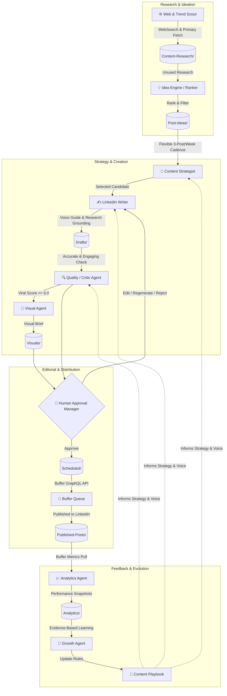

# ⚡ LinkedIn Agentic AI
### *A Human-Approved, Evidence-Gated LinkedIn Content Pipeline*

[](LICENSE)
[](https://obsidian.md/)
[](https://buffer.com/)
[](#-system-architecture)
[](#)

---

**LinkedIn Agentic AI** is an open-source content pipeline that automates the heavy lifting of creator workflows across LinkedIn, X (Twitter), and Substack — continuous trend discovery, primary-source fact verification, viral-potential scoring, visual briefing, scheduling/publishing, and closed-loop analytics learning — while keeping a human in charge of every publishing decision.

**What it actually is, precisely:** a set of single-responsibility [Claude Code skills](.claude/skills/) (prompt-driven instruction files, not independent processes) that a human triggers manually via slash commands, in sequence, within one session (or bundled through a per-platform `generate-week*` orchestrator). One shared research/idea pool feeds three platform-specific pipelines — LinkedIn (the original, most-verified pipeline), X (posts and threads via Buffer), and Substack (long-form Articles and short-form Notes, published manually since Substack has no scheduling API) — so a trending topic can become a LinkedIn post, an X thread, and a Substack article without being re-researched three times. There is no scheduler or daemon running unattended yet (see the [roadmap](#️-project-roadmap), Phase 14) — every run happens because someone typed a command. What it *is* strong on: it enforces **strict human-in-the-loop editorial gates**, **primary-source fact validation**, **anti-hallucination guardrails** (verify-or-drop sourcing, no fabricated metrics, no playbook rule written without real supporting evidence), and **pure Markdown/Obsidian long-term memory** — no vendor lock-in database. It evolves over time, using real engagement metrics to update per-platform **Content Playbooks**, once there's enough published-post data to do so honestly for that platform.

---

## 📑 Table of Contents

- [🎬 Demo](#-demo)
- [⚡ System Architecture](#-system-architecture)
- [✨ Core Capabilities](#-core-capabilities)
- [🛡️ Quality, Safety & Anti-Hallucination Guardrails](#️-quality-safety--anti-hallucination-guardrails)
- [📂 Repository & Vault Structure](#-repository--vault-structure)
- [🤖 Multi-Agent Skills Matrix](#-multi-agent-skills-matrix)
- [🎯 Personalization & User Preferences](#-personalization--user-preferences)
- [🚀 Quickstart & Setup](#-quickstart--setup)
- [🖥️ Connecting to Claude Desktop](#️-connecting-to-claude-desktop)
- [🧭 Connecting to Codex (CLI / IDE)](#-connecting-to-codex-cli--ide)
- [🔄 End-to-End Workflow Walkthrough](#-end-to-end-workflow-walkthrough)
- [📝 Knowledge Base & Note Schemas](#-knowledge-base--note-schemas)
- [📊 Scoring Rubrics](#-scoring-rubrics)
- [⚙️ Configuration & Customization](#️-configuration--customization)
- [🗺️ Project Roadmap](#️-project-roadmap)
- [🤝 Contributing](#-contributing)
- [📄 License & Authors](#-license--authors)

---

## 🎬 Demo

> **Video not recorded yet.** A complete, ready-to-record shot list and
> narration script lives at
> [`Documentation/Demo-Script.md`](Documentation/Demo-Script.md) — it walks
> through a real research → draft → critique → visual → human-approval run,
> deliberately stopping before the one step that makes a live external call
> (`/schedule-approved`). Once recorded, replace this block with the actual
> embed:
>
> ```markdown
> https://github.com/priyanshu-arya/LinkedIn_Automation/assets/<id>/<file>.mp4
> ```
>
> (uploading the file to a GitHub issue/PR comment on this repo gives you
> that stable asset URL — see the script's "After recording" section for the
> full option list, including a GIF cut and external hosting.)

---

## ⚡ System Architecture

The engine operates on a closed feedback loop across two distinct cycles:
1. **The Production Pipeline (Outer Loop):** Discovers trends, verifies primary sources, plans weekly editorial calendars, drafts posts according to human-like voice guides, scores viral potential, creates visual briefs, requires human approval, and schedules to Buffer.
2. **The Growth & Learning Loop (Inner Loop):** Ingests post-publishing analytics from Buffer, detects performance patterns, and updates a centralized `playbook.md` that guides future generations.



---

## ✨ Core Capabilities

- **🕵️ Primary-Source Grounding:** Queries live sources, fetches documentation and repository data directly, and verifies claims before saving research. Hallucinated benchmarks, invented statistics, and unsourced quotes are explicitly rejected. Fetched web content is always treated as data to extract facts from, never as instructions to follow.
- **🧠 37 Single-Responsibility Skills:** Modularity through separate, manually-triggered prompt skills, grouped into the core production pipeline (Trend Scout, Idea Ranker, Content Strategist, Writer, Critic, Visual Designer, Approval Manager, Scheduler, Analytics, Growth Agent — repeated per platform, plus `generate-week*` weekly orchestrators that chain them through isolated per-post subagents), quality/safety tools (Humanizer, Post Audit, Plagiarism/Originality Check), engagement tools (Comment Drafter, Reply Handler, Engagement Monitor), and standalone modules (Profile Optimizer, Story Bank Interviewer, Hook Extractor, Repurposer, Employee Advocacy). See the full [Multi-Agent Skills Matrix](#-multi-agent-skills-matrix) — not independent autonomous agents; one session runs them sequentially on command.
- **🗃️ Obsidian-Native Vault:** Stored entirely in clean, readable Markdown with structured YAML frontmatter and bi-directional `[[wikilinks]]`. No vendor lock-in database.
- **🛡️ 100% Human Editorial Control:** Zero automatic publishing. Every single draft must pass through an interactive terminal/IDE approval interface supporting 7 decision paths (*Approve, Edit, Regenerate, Change Hook, Change Image, Change Time, Reject*).
- **📈 Self-Improving Playbook:** Learns from real audience data. The system extracts winning hook formats, optimal word lengths, high-resonance topics, and posting times into a versioned playbook.
- **🚫 Anti-AI Slop Voice Engine:** Built-in negative constraints preventing common LLM clichés ("*In today's fast-paced world...*", "*Let's dive in!*", emoji bullet stuffing, and generic rhetorical questions).
- **📡 Modern Buffer GraphQL Integration:** Directly integrates with Buffer's current GraphQL endpoints to maintain a rolling 2-day scheduling queue.

---

## 🛡️ Quality, Safety & Anti-Hallucination Guardrails

| Requirement | Guardrail Mechanism | Enforced By |
| :--- | :--- | :--- |
| **No Hallucinated Data** | Compulsory `WebFetch` verification against primary sources (docs, repos, papers). Unverifiable claims are stripped. | `research-topic`, `critique-draft` |
| **No Unapproved Posts** | `status: approved` can *only* be set by the human approval skill. Downstream schedulers abort if unapproved. | `review-drafts`, `schedule-approved` |
| **Opinion vs. Fact Separation** | Subjective viewpoints and analyses are explicitly framed as opinions; technical specifications must cite sources. | `write-draft`, `COST-AND-SAFETY.md` |
| **Anti-Fatigue / Dedup** | Compares candidate ideas against all published and drafted notes across 90 days before generating new assets. | `generate-ideas`, `critique-draft` |
| **No Spurious Metrics** | Missing or lagging Buffer analytics are marked `null`/`unavailable`, never defaulted to 0 or estimated. | `pull-analytics` |
| **Evidence-Based Playbook** | Requires $\ge 3$ verified post samples before writing any performance rule to `playbook.md`. | `update-playbook` |

---

## 📂 Repository & Vault Structure

```text
LinkedIn_Automation/
├── CLAUDE.md                         # Auto-loaded Claude Code project instructions —
│                                      #   makes following Documentation/Workflows/ mandatory
├── AGENTS.md                         # Same rules, mirrored for Codex CLI/IDE auto-loading
├── Documentation/
│   └── Workflows/                    # Full execution-order documentation, one file per
│                                      #   feature — start at 00-Overview.md
├── .claude/
│   └── skills/                       # Executable Multi-Agent Skills
│       ├── research-topic/           # Trend discovery & deep verification (shared, all platforms)
│       ├── generate-ideas/           # Candidate generation & ranking (shared, all platforms)
│       ├── plan-week/                # LinkedIn: flexible, quality-gated weekly calendar
│       ├── write-draft/              # LinkedIn: human-like post drafting
│       ├── critique-draft/           # LinkedIn: fact check & 8-factor viral scoring
│       ├── generate-visual/          # Visual brief generator (LinkedIn/X/Substack Notes)
│       ├── review-drafts/            # Interactive approval CLI (shared, all platforms)
│       ├── schedule-approved/        # LinkedIn: Buffer GraphQL queue manager
│       ├── pull-analytics/           # LinkedIn: post metrics collector
│       ├── update-playbook/          # Self-improving playbook engine (platform-scoped)
│       ├── generate-week/            # LinkedIn weekly orchestrator (per-post subagents)
│       ├── plan-week-x/              # X: weekly calendar (~5/week, singles + threads)
│       ├── write-draft-x/            # X: post/thread drafting
│       ├── critique-draft-x/         # X: fact check & viral scoring
│       ├── schedule-approved-x/      # X: Buffer GraphQL queue manager
│       ├── pull-analytics-x/         # X: post metrics collector
│       ├── generate-week-x/          # X weekly orchestrator
│       ├── plan-week-substack-article/    # Substack Articles: weekly calendar (1/week)
│       ├── write-draft-substack-article/  # Substack: long-form article drafting
│       ├── critique-draft-substack-article/ # Substack: depth/structure/SEO scoring
│       ├── generate-visual-substack-article/ # Substack: multi-image brief generator
│       ├── plan-week-substack-note/       # Substack Notes: weekly calendar (~3/week)
│       ├── write-draft-substack-note/     # Substack: short-form Note drafting
│       ├── critique-draft-substack-note/  # Substack: fact check & viral scoring
│       ├── publish-substack/         # Substack: manual publish handoff (no API)
│       ├── generate-week-substack/   # Substack weekly orchestrator (article + Notes)
│       │
│       ├── interviewer/              # Story Bank onboarding/topic interview → Post Spines
│       ├── extract-hook/             # Reverse-engineers hook formulas from pasted viral posts
│       ├── humanize-draft/           # De-AI-ifies a draft's surface style, scores AI-tell density
│       ├── audit-draft/              # Algorithm-compliance + AI-detection + plagiarism pre-publish audit
│       ├── check-plagiarism/         # Internal patchwriting check + external-checker handoff
│       ├── repurpose-post/           # Turns tweets/videos/blogs/newsletters into native LinkedIn posts
│       ├── draft-comment/            # Drafts comments for other people's LinkedIn posts
│       ├── draft-reply/              # Drafts replies to comments (single or whole-thread sweep)
│       ├── monitor-engagement/       # Checks comment threads for author replies; groups likers by ICP
│       ├── plan-advocacy/            # Team employee-advocacy program plan + self-reported metrics
│       └── optimize-profile/         # Standalone profile rewrite + audit from a PDF export
│
├── Content-Research/                 # Long-Term Research Memory (15 pillars)
│   ├── AI/                           # Artificial Intelligence fundamentals
│   ├── GenAI/                        # LLMs, Diffusion, Prompting
│   ├── Machine-Learning/             # Classical ML
│   ├── Deep-Learning/                # Neural nets, architectures, training
│   ├── Mathematics/                  # Maths related to data (linear algebra, stats, calculus)
│   ├── Developer-Tools/              # Frameworks, SDKs, Dev productivity
│   ├── Data-Analytics/               # BI, analytics tooling, dashboards
│   ├── Data-Engineering/             # Pipelines, warehousing, streaming
│   ├── Problem-Solving/              # Problem-solving approaches & frameworks
│   ├── Algorithms/                   # DSA, complexity, algorithm design
│   ├── Psychology-AI/                # Human-AI interaction, cognition
│   ├── Research-Papers/              # ArXiv breakdowns & summaries
│   ├── Interview-Preparation/        # System design, coding, ML interviews
│   ├── Career/                       # Tech career growth, portfolio, leadership
│   ├── AI-Healthcare/                # AI applied to healthcare/medicine
│   └── Resources/                    # Curated lists, roadmaps, cheat sheets
│
├── Post-Ideas/                       # Scored & Ranked Idea Pipeline, all platforms  *(gitignored)*
├── Drafts/                           # Drafts awaiting critique/review — LinkedIn, X,
│                                      #   Substack Notes (Draft-Note), and Substack
│                                      #   Articles (Substack-Article-Note) share this
│                                      #   folder, routed by `type`               *(gitignored)*
├── Visuals/                          # High-context visual design briefs        *(gitignored)*
├── Scheduled/                        # Approved LinkedIn/X posts in Buffer queue *(gitignored)*
├── Substack-Ready/                   # Approved Substack items awaiting manual
│                                      #   publish — no Buffer, no API           *(gitignored)*
├── Published-Posts/                  # Live posts, all platforms                *(gitignored)*
├── Analytics/                        # Append-only engagement snapshots         *(gitignored)*
├── Content-Learnings/                # Living Strategy Vault, per platform
│   ├── playbook.md                   # LinkedIn: learned rules & audience insights
│   ├── playbook-x.md                 # X: learned rules (separate evidence trail)
│   ├── playbook-substack.md          # Substack: learned rules (Articles + Notes)
│   ├── voice-guide.md                # LinkedIn: writing tone, style & anti-patterns
│   ├── voice-guide-x.md              # X: terser, more opinionated voice
│   ├── voice-guide-substack.md       # Substack: essay-form (Articles) + casual (Notes)
│   └── content-index.md              # Fast dedup/fatigue index, all platforms *(gitignored)*
│
├── Profile-Optimization/             # Profile rewrite + audit reports (personal output) *(gitignored)*
│
├── _Templates/                       # Strict YAML frontmatter note templates
│   ├── Research-Note.md
│   ├── Idea-Note.md
│   ├── Draft-Note.md
│   ├── Visual-Brief-Note.md
│   ├── Scheduled-Published-Note.md
│   ├── Substack-Article-Note.md
│   ├── Substack-Ready-Note.md
│   ├── Analytics-Record.md
│   ├── Playbook-Note.md
│   └── Profile-Optimization-Note.md
│
├── REQUIREMENTS.md                   # Product specification & vision
├── Profile-Optimization-Spec.md      # Spec for the standalone Profile Optimization Agent
├── COST-AND-SAFETY.md                # Cost & safety hardening audit
├── LICENSE                           # MIT License
└── README.md                         # Project documentation
```

> **What's actually in git:** only code, skills, templates, and specs are tracked.
> Everything the pipeline *generates* at runtime (`Content-Research/`, `Post-Ideas/`,
> `Drafts/`, `Visuals/`, `Scheduled/`, `Substack-Ready/`, `Analytics/`,
> `Published-Posts/`, `Content-Learnings/content-index.md`,
> `Profile-Optimization/`) is real, working state on disk but is gitignored —
> it's personal content, not the codebase. Internal working logs
> (`DECISIONS.md`, `SKILLS.md`, `PROMPTS.md`) are likewise local-only and not
> part of the public repo.

---

## 🤖 Multi-Agent Skills Matrix

All skills are implemented as Claude Code / Antigravity Agent skills located in `.claude/skills/`:

| Command / Skill | Role | Description | Trigger |
| :--- | :--- | :--- | :--- |
| `/research-topic <domain> [count]` | **Trend Scout & Researcher** | Discovers trending tech, fetches primary sources, verifies claims, outputs scored research notes. | Manual / On Demand |
| `/generate-ideas [domain] [count]` | **Idea Engine** | Scans unused research, performs deduplication, generates structured angles and hooks, outputs ranked Idea Notes. | Weekly / On Demand |
| `/plan-week [YYYY-Www]` | **Content Strategist** | Assigns candidate ideas to specific days under a flexible, quality-gated cadence (default 3/week, Tue/Thu/Sat starting heuristic) — never pads the count to hit a quota. | Start of Week |
| `/generate-week [YYYY-Www] [count]` | **Weekly Orchestrator** | Runs the whole pipeline for the week in one invocation: plans angles, then generates each post through its own isolated subagent (independent research, draft, critique, visual prompt), checks each against the week's history, then one combined review + scheduling pass. | Weekly, one-shot |
| `/write-draft [idea-id]` | **LinkedIn Writer** | Converts selected ideas into high-engagement, scannable post copy grounded in research and adhering to `voice-guide.md`. | After Planning |
| `/critique-draft [draft-id]` | **Critic & Viral Gate** | Re-verifies facts, checks fatigue, scores 0–10 Viral Potential, auto-refines weak drafts, moves to `in_review`. | Post-Drafting |
| `/generate-visual [draft-id]` | **Visual Agent** | Formulates layout, color palette, visual hierarchy, and copy for accompanying diagram/infographic briefs. | Post-Critique |
| `/review-drafts [draft-id]` | **Approval Manager** | Presents draft + visual brief to the user for explicit decision (*Approve, Edit, Regenerate, Change Hook, Reject*). | User Review |
| `/schedule-approved [draft-id]` | **Scheduler Agent** | Verifies approval, validates date, pushes to Buffer via GraphQL API, manages rolling 2-day queue. | Post-Approval |
| `/pull-analytics` | **Analytics Agent** | Ingests impressions, reactions, comments, shares, and clicks from Buffer into append-only Markdown tables. | Daily / Weekly |
| `/update-playbook [platform]` | **Growth Agent** | Compares high vs. low performing posts, discovers statistical patterns, and updates the matching platform's playbook (`playbook.md` / `playbook-x.md` / `playbook-substack.md`; default `linkedin`). | Weekly / Monthly |

`/research-topic`, `/generate-ideas`, and `/review-drafts` are shared across
every platform below — one research/idea pool, one approval gate.

### X (Twitter) pipeline

| Command / Skill | Role | Description | Trigger |
| :--- | :--- | :--- | :--- |
| `/plan-week-x [YYYY-Www] [count]` | **Content Strategist (X)** | Assigns candidate ideas tagged for X to specific days, default ~5/week — quality gates the count, same as LinkedIn. | Start of Week |
| `/write-draft-x [idea-id]` | **X Writer** | Decides single-post vs. thread from the idea's depth, drafts in `voice-guide-x.md`'s terser voice. | After Planning |
| `/critique-draft-x [draft-id]` | **Critic & Viral Gate (X)** | Same rubric shape as LinkedIn's critic, plus a thread-cohesion factor for multi-tweet drafts. | Post-Drafting |
| `/schedule-approved-x [draft-id]` | **Scheduler Agent (X)** | Same proven Buffer GraphQL mutation, new X channel id; thread posting requires live schema confirmation before first use. | Post-Approval |
| `/pull-analytics-x` | **Analytics Agent (X)** | Same Buffer metrics pull, scoped to the X channel. | Daily / Weekly |
| `/generate-week-x [YYYY-Www] [count]` | **Weekly Orchestrator (X)** | Same per-post-subagent isolation pattern as `/generate-week`, ending in one shared review pass and `/schedule-approved-x`. | Weekly, one-shot |

### Substack pipeline (Articles + Notes)

Substack has no Buffer channel and no supported public posting API, so this
pipeline ends at a manual, human-confirmed publish step instead of an
automated schedule — see `/publish-substack` below.

| Command / Skill | Role | Description | Trigger |
| :--- | :--- | :--- | :--- |
| `/plan-week-substack-article [YYYY-Www]` | **Content Strategist (Articles)** | Picks at most one idea/week deep enough to earn full long-form treatment — an honest "nothing qualifies" is a valid outcome. | Start of Week |
| `/write-draft-substack-article [idea-id]` | **Substack Writer (Articles)** | Long-form writer: title/subtitle/sectioned body, no character ceiling, depth over hook-brevity, per `voice-guide-substack.md`. | After Planning |
| `/critique-draft-substack-article [draft-id]` | **Critic (Articles)** | Depth/structure/SEO-weighted rubric, not a scroll-stopping-hook gate. | Post-Drafting |
| `/generate-visual-substack-article [draft-id]` | **Visual Agent (Articles)** | Multi-image variant — one brief per `[IMAGE: ...]` marker in the article body. | Post-Critique |
| `/plan-week-substack-note [YYYY-Www] [count]` | **Content Strategist (Notes)** | Assigns candidate ideas tagged for Substack Notes, default ~3/week. | Start of Week |
| `/write-draft-substack-note [idea-id]` | **Substack Writer (Notes)** | Short-form, casual voice — reuses X's short-post shape, no hashtags. | After Planning |
| `/critique-draft-substack-note [draft-id]` | **Critic (Notes)** | Same rubric shape as `/critique-draft-x`, no thread concept. | Post-Drafting |
| `/publish-substack [note-id]` | **Manual Publish Handoff** | Produces a copy-ready `Substack-Ready/` note; only marks `published` once the user explicitly confirms they posted it themselves — never assumed. | Post-Approval |
| `/generate-week-substack [YYYY-Www]` | **Weekly Orchestrator (Substack)** | Plans + generates the week's article and Notes, one combined review pass, hands approved items to `/publish-substack`. | Weekly, one-shot |

### Profile Optimization Agent (separate module)

`/optimize-profile [pdf-path]` — not part of the posting pipeline above. Takes
a LinkedIn Profile PDF export plus **exactly two target job descriptions** and
produces a complete, evidence-only, keyword-optimized, copy-ready rewrite of
the entire profile (headline, About, experience, skills, projects, Featured,
etc.), plus a full audit (current vs. projected 100-point score,
role-alignment scores, keyword strategy, priority plan). The finished profile
leads the output note; the audit is a collapsed appendix underneath it, not
the headline deliverable. One-off/periodic trigger, not a recurring cadence.

Never silently drops an empty or thin section just because the PDF didn't
have anything for it — every gap and empty section is put to the user with a
real choice: supply the real content, ask the agent to draft 2-4 concrete
suggestions (clearly labeled unconfirmed until the user says they're actually
true), or explicitly skip it. Every resolution is logged in the note's Gap
Resolution Log, so nothing disappears quietly.

Full spec: [`Profile-Optimization-Spec.md`](Profile-Optimization-Spec.md).
Output written to `Profile-Optimization/` using
`_Templates/Profile-Optimization-Note.md`. Same anti-hallucination discipline
as the rest of this repo: every claim in the rewrite traces to an evidence
ledger built from the PDF, and a suggestion the agent drafts to fill a gap is
never treated as a fact until the user confirms it applies to them.

### Story Bank & Voice Grounding

| Command / Skill | Role | Description | Trigger |
| :--- | :--- | :--- | :--- |
| `/interviewer` | **Story Bank Interviewer** | Full onboarding interview that populates `Content-Learnings/story-bank.md` from scratch (or resumes it, skipping already-filled sections) with real roles, receipts with real numbers, turning points, scars, and defensible positions. Given a topic argument instead, runs a focused single-topic interview and turns it into a reusable Post Spine, handed off to `/write-draft --spine <id>`. Never invents an answer on the user's behalf. | Onboarding / Before first post |
| `/extract-hook` | **Hook Extractor** | Reverse-engineers the opening-hook formula behind an existing viral post (pasted text; a URL is best-effort only) against the shared taxonomy in `Content-Learnings/hook-formulas.md`, returning a blank fill-in-the-blank template. Proposes a new taxonomy entry if nothing matches, rather than forcing a bad fit. | On Demand |

### Quality, Safety & Originality Tools

| Command / Skill | Role | Description | Trigger |
| :--- | :--- | :--- | :--- |
| `/humanize-draft [draft-id]` | **Humanizer** | Rewrites a draft's surface style against the scored rule set in `Content-Learnings/humanizer-rules.md`, scoring AI-vocabulary/em-dash/pattern density and producing a before/after report. Never claims to guarantee beating any specific AI-detector. | Before Scheduling |
| `/audit-draft [draft-id]` | **Post Audit** | Runs on an `in_review` draft (after `/critique-draft`, before `/review-drafts`): checks platform-mechanics compliance against `Content-Learnings/algorithm-rules.md`, screens for AI-writing tells via the Humanizer's shared contract, and screens for plagiarism/originality risk via the Plagiarism Checker's shared contract. Annotates the note with a `## Post Audit Notes` section — never changes approval status itself. | Post-Critique, Pre-Review |
| `/check-plagiarism [draft-id]` | **Plagiarism / Originality Check** | Automated internal-overlap check for patchwriting against cited `Content-Research/` sources, plus an honest external-check layer (no plagiarism-detection API is configured) that hands you copy-ready text and instructions for Copyscape/Originality.ai/Turnitin/Grammarly, recording only results you actually supply. | On Demand / via `/audit-draft` |

### Repurposing & Cross-Platform

| Command / Skill | Role | Description | Trigger |
| :--- | :--- | :--- | :--- |
| `/repurpose-post` | **Repurposer** | Turns a tweet/thread, YouTube video, blog post, or newsletter into a native LinkedIn post: re-hooks it for LinkedIn's fold, expands into the 900–1,300 character sweet spot with real added context (never padding), moves any link to a first-comment field, and runs the result through `/humanize-draft` before writing it to `Drafts/`. Asks for a manual paste rather than guessing if the source can't be reliably read. | On Demand |

### Engagement & Community Tools

None of these post anything automatically — LinkedIn exposes no API for reading arbitrary posts/comments or posting comments/replies in this pipeline, so every input here is a manual paste and every output is copy-ready text for you to post by hand.

| Command / Skill | Role | Description | Trigger |
| :--- | :--- | :--- | :--- |
| `/draft-comment` | **Comment Drafter** | Given someone else's pasted LinkedIn post (+ optional context), writes 1–2 copy-paste-ready comment options in your own voice per `Content-Learnings/voice-guide.md`. | On Demand |
| `/draft-reply` | **Reply Handler** | Given a single pasted comment, drafts one reply. Given a full pasted thread export, sweeps every top-level comment and reply, filters out low-value ones, and drafts the rest in one batch — correctly attributing who each reply addresses across LinkedIn's 2-level thread flattening. | On Demand |
| `/monitor-engagement` | **Engagement Monitor** | Two manual-input workflows: (1) checks pasted comment threads for new replies from the post's author and drafts a follow-up via `/draft-reply`; (2) takes a pasted likers/commenters list and groups them by ICP fit (peer / aspirational / prospect) using `Content-Learnings/icp-map.md`. | On Demand |

### Employee Advocacy (separate module)

`/plan-advocacy` — a one-off/periodic program-planning tool, not part of the recurring posting pipeline. Produces a 14-day team launch plan (posting cadence per person, brand dos/don'ts, an approval chain) plus a self-reported metrics template for team members to fill in. Buffer access in this repo is scoped to your own channel only, so it cannot pull or automate analytics for anyone else's account — advocacy metrics are always self-reported.

---

## 🎯 Personalization & User Preferences

Everything below is Priyanshu's own configuration of the pipeline — not generic defaults. Full detail always lives in the linked source file; this section is the one-stop summary so nothing has to be re-derived from `DECISIONS.md`.

### Weekly cadence

- **Default 3 posts/week**, not 5 — deliberately dropped from an earlier 5/week Mon–Fri plan. Rationale (user's own words, [DECISIONS.md](DECISIONS.md#phase-13-decisions)): a daily-feeling Mon–Fri cadence risks looking like content produced "just to post," which undermines the goal of genuinely valuable posts.
- **Starting-heuristic days: Tue / Thu / Sat.** This is a provisional default, not a fixed schedule — it's replaced automatically once `Content-Learnings/playbook.md` has real evidence (≥3 published posts) on which days actually perform. Saturday is in scope; **Sunday is excluded by default.**
- **Quality gates the count — a hard rule.** Never generate or schedule a post just to hit 3/week. If the week only supports 1–2 genuinely distinct, valuable angles, ship that many and say so plainly. A manufactured/padded post is never preferred over an honest gap.
- Content-type variety must span **≥2 distinct categories** across the week's chosen angles, checked against the Playbook's evidenced patterns first, this rule second — not pinned to specific calendar days.
- Full spec: [REQUIREMENTS.md §5](REQUIREMENTS.md#5-weekly-cadence).

### Posting-time defaults

Research-backed generic LinkedIn best-times (aggregated from Buffer's and Sprout Social's 2026 studies), used only until this account's own analytics override them. All times are local (IST) — no timezone conversion needed.

| Day | Default time | Notes |
| :--- | :--- | :--- |
| Monday | 13:00 | |
| Tuesday | 16:00 | strong window 11:00–17:00 |
| Wednesday | 16:00 | single strongest slot across all studies |
| Thursday | 17:00 | strong window 11:00, 13:00–17:00 |
| Friday | 15:00 | |
| Saturday | 09:00 | weekend engagement is weak platform-wide; morning outperforms evening |
| Sunday | — | excluded from default cadence |

For the default Tue/Thu/Sat cadence this collapses to **Tue 16:00 / Thu 17:00 / Sat 09:00**. This table is an unvalidated starting heuristic, not derived from real account performance — `/schedule-approved` says so rather than presenting it as optimized — and is superseded automatically once the Playbook has ≥3 published posts' worth of day+time evidence. Full spec: [REQUIREMENTS.md §11](REQUIREMENTS.md#11-posting-time-optimization).

### Content pillars (closed set of 15)

AI, Tech Career, Developer Tools, GenAI, Machine Learning, Deep Learning, Interview Prep, Data Analytics, Data Engineering, Maths Related to Data, Problem Solving, Algorithms, Research (papers), Psychology + AI, AI in Healthcare — plus a cross-cutting Resources folder. This bounds *what the account is about*; it never supplies the specific topic — every research cycle starts from a live, real-time scan within a pillar, never a hardcoded or "Top 10 Trends"-style topic. Default `/research-topic` mode scans **across all pillars** rather than one at a time, so trend strength decides coverage, not the caller.

**Research pillar, specifically:** built from real, verified papers (arXiv, ACM/IEEE, lab publications) — the paper must actually be read, not just its press summary, then explained as the author's own plain-language take (what it found, why it matters, a real-life example). Linking the source paper is optional per post, used sometimes not every time; a paper/finding/citation is never fabricated.

### Voice & writing rules

Condensed from [Content-Learnings/voice-guide.md](Content-Learnings/voice-guide.md) — the living source of truth, updated once real approved/edited posts exist to learn from (currently still the default, unseeded guide):

- **Hook:** a specific, concrete claim or tension, never a generic "Ever wondered how X works?" question. No throat-clearing — the first line stands alone.
- **Structure:** hook → useful content in short scannable paragraphs/tight lists → a discussion question only when the content genuinely raises one.
- **Length:** default ~1,200–1,500 characters, comfortably under LinkedIn's ~3,000 limit, unless the material genuinely needs more (e.g. a step-by-step tutorial).
- **Tone:** conversational and direct, like explaining to a smart peer — not a press release, not a motivational poster. Technically accurate over impressive-sounding; states uncertainty plainly rather than asserting confidently.
- **Banned AI-writing tells:** "In today's fast-paced world...", "Let's dive in", "Imagine a world where...", rhetorical-question hooks, emoji stacked as bullet substitutes, generic CTAs with no real question attached, em-dash overuse, hedging every sentence.
- **Hashtags:** 3–5 per post, directly tied to topic/category — never stuffed or generic filler.
- **Emoji:** sparing — fine as one occasional visual anchor, not a formatting crutch throughout.

### Generation & orchestration preferences

- **Per-post isolation via real subagents**, not a shared session — `/generate-week` spawns one fresh `Agent`-tool subagent per post, sequentially (not in parallel, so each post can see what earlier posts this week already covered), each following the real skill files directly rather than duplicated logic.
- **Duplicate detection is two-tier:** a *genuine* duplicate (same underlying story/example/hook/conclusion) auto-rejects before reaching human review; a stylistically-similar-but-substantively-distinct post only lowers the Originality sub-score, left for the human to weigh at `/review-drafts`. Retry cap of 2 re-angling attempts per slot before it's reported honestly unfillable.
- **Visuals stay prompt-only.** The deliverable is a finished ChatGPT-Images prompt, never a rendered file or a live image-generation API call — this is a deliberate, twice-confirmed choice, not a missing feature.
- **Scheduling stays text-only** — Buffer's mutation carries no media field; images are pasted in manually after being generated from the prompt.

### X and Substack cadence (multi-platform expansion, 2026-09-14)

- **One shared research/idea pool feeds all three platforms** — an Idea Note's `platforms: []` field marks which platforms it's eligible for; each platform drafts its own version independently (never a copy-paste of another platform's draft), and a `platform_schedule: []` field lets one idea carry a different assigned date per platform without disturbing LinkedIn's own `target_week`/`target_date` fields.
- **X: ~5/week**, mix of single posts and threads decided per-idea by `/write-draft-x` from the idea's actual depth — not a fixed singles/threads split. Same quality-gates-the-count hard rule as LinkedIn.
- **Substack: 1 Article/week + ~3 Notes/week.** Articles are long-form (title/subtitle/sectioned body, no character ceiling) and only get written for ideas that genuinely earn the depth — an empty Article slot in a given week is a correct, honest outcome, not a shortfall.
- **Substack publishing is manual by design, not a missing feature.** Buffer has no Substack channel and Substack has no supported public posting API — an unofficial, session-cookie-based API was explicitly considered and rejected for the ToS/reliability risk. `/publish-substack` produces a copy-ready `Substack-Ready/` note and only marks something `published` once the user explicitly confirms they posted it themselves.
- **X's Buffer thread-posting mutation shape is explicitly unverified** until the first real thread is scheduled — `/schedule-approved-x` is written to confirm it live against Buffer's actual schema/error responses rather than guess, the same discipline that caught the original LinkedIn scheduler's `channelId` type correction.
- **Each platform earns its own playbook and voice guide** (`playbook-x.md`/`voice-guide-x.md`, `playbook-substack.md`/`voice-guide-substack.md`) — a pattern proven on LinkedIn is never assumed to transfer to X or Substack's different audiences and formats.
- Full rationale and the four architecture questions resolved with the user before any of this was built: [DECISIONS.md — Multi-Platform Expansion (X + Substack) decisions](DECISIONS.md#multi-platform-expansion-x--substack-decisions).

### Profile Optimization preferences (separate module)

`/optimize-profile` evolved through two rounds of direct user feedback — both now baked into [`.claude/skills/optimize-profile/SKILL.md`](.claude/skills/optimize-profile/SKILL.md) and [Profile-Optimization-Spec.md](Profile-Optimization-Spec.md) as permanent defaults, not one-off requests:

- **Profile-first output, not a diagnostic report.** The finished, copy-ready profile leads the note immediately after frontmatter, followed by a ≤10-line summary. The full audit still exists in full, just collapsed under an "Appendix: Full Diagnostic Report" heading underneath.
- **Never silently drop a thin/empty section.** Every gap is put to the user as a real choice — supply the real content, ask the agent to draft 2–4 concrete labeled-unconfirmed suggestions, or explicitly skip it. Every resolution is logged in the note's Gap Resolution Log.
- **Seniority-calibrated language.** Compute years of experience from the evidence ledger and match scope/language to the correct rung — not a senior-profile ceiling applied to an early/mid-career profile.
- **Anti-clutter caps:** headline ≤3–4 segments, Skills led by ~10–20 core items, `[CONFIRM]`/`[ADD EVIDENCE]` brackets minimized in the copy-ready block (extended explanation moves to Gaps instead).
- **Coherence pass:** Headline → About → Experience → Skills → Projects must reinforce one identity/keyword set, not read as independently-optimized fragments.
- **SEO rule:** 2–3 natural mentions per primary keyword across assigned sections — precise, not vague "don't stuff" guidance.
- **Research current best practice live**, not solely the originally-supplied research document — e.g. LinkedIn's official 100-skills cap and field-truncation lengths were confirmed directly against LinkedIn's own Help pages, kept in a separate provenance-tracked section ([Profile-Optimization-Spec.md §16.1](Profile-Optimization-Spec.md)) from industry-aggregated (non-LinkedIn-confirmed) claims.
- Same anti-hallucination discipline as the rest of the repo applies here too: every claim traces to the evidence ledger, and any agent-drafted suggestion stays unconfirmed until the user says it's true.

---

## 🚀 Quickstart & Setup

### 1. Clone & Open Workspace
```bash
git clone https://github.com/priyanshu-arya/LinkedIn_Automation.git
cd LinkedIn_Automation
```

### 2. Environment Configuration
Copy [`.env.example`](.env.example) to `.env` and fill in real values:
```bash
cp .env.example .env
```

```env
# Buffer GraphQL API Credentials
BUFFER_ACCESS_TOKEN=your_buffer_access_token_here
BUFFER_CHANNEL_ID=your_linkedin_channel_id_here

# Optional — only needed for the X (Twitter) pipeline
BUFFER_CHANNEL_ID_X=your_x_channel_id_here

# Optional: Push Notification webhooks
NOTIFICATION_WEBHOOK_URL=https://your-webhook-endpoint.com
```

`.env` is gitignored — never commit real credentials.

> **How to obtain Buffer credentials:**
> 1. Head to [Buffer Developer Portal](https://buffer.com/developers).
> 2. Create an Access Token.
> 3. Use `/schedule-approved` or Buffer's GraphQL Explorer (`query { account { organizations { channels { id name service } } } }`) to retrieve your target LinkedIn channel ID.

### 3. Open in Obsidian (Optional but Recommended)
Open the `LinkedIn_Automation` directory as an Obsidian Vault to enjoy graphical relationship visualizers, backlink panels, and Kanban-style pipeline tracking.

### 4. Project instructions are already wired in — nothing to configure

[`CLAUDE.md`](CLAUDE.md) and [`AGENTS.md`](AGENTS.md) sit at the repo root and are auto-loaded as project instructions the moment you open this folder in Claude Code or Codex — no setup step, no copy-paste. Both make one rule mandatory: for any task, read [`Documentation/Workflows/00-Overview.md`](Documentation/Workflows/00-Overview.md) first, find the matching feature document, and follow its documented stage order and skills rather than improvising. This is what makes the system behave the same way for anyone who clones this repo, regardless of which client they connect with — see [Connecting to Claude Desktop](#️-connecting-to-claude-desktop) and [Connecting to Codex](#-connecting-to-codex-cli--ide) below for the remaining per-client setup (MCP server registration, Buffer credentials).

---

## 🖥️ Connecting to Claude Desktop

This project was built and is designed to run as a **Claude Code** project — the
skills lean on Claude Code's native `Bash`, `WebSearch`/`WebFetch`, and
whole-directory file read/write to operate on the vault, run
`scripts/validate_vault.py`, and call Buffer's GraphQL API. Claude Desktop
doesn't have those tools by default, so this repo ships a real, working bridge
for it in [`mcp-server/`](mcp-server/) — a small Node MCP server that exposes
vault file access *and* real Buffer scheduling/metrics calls as tools Desktop
can call directly. Two ways to connect Desktop, pick one:

### Option A — the bundled `linkedin-vault` MCP server (recommended, does everything)

This is the only option that gives Desktop real Buffer scheduling and
analytics, not just vault read/write.

1. **Install its dependencies once:**
   ```bash
   cd mcp-server
   npm install
   ```
2. **Register it in Claude Desktop's config** — `~/Library/Application
   Support/Claude/claude_desktop_config.json` on macOS (`%APPDATA%\Claude\`
   on Windows):
   ```json
   {
     "mcpServers": {
       "linkedin-vault": {
         "command": "node",
         "args": ["/absolute/path/to/LinkedIn_Automation/mcp-server/index.js"],
         "env": { "VAULT_ROOT": "/absolute/path/to/LinkedIn_Automation" }
       }
     }
   }
   ```
   **Restart Claude Desktop** after saving — it only reads this file at startup.
3. **Create a Claude Desktop Project** for this vault, then paste the contents
   of [`mcp-server/DESKTOP-PROJECT-INSTRUCTIONS.md`](mcp-server/DESKTOP-PROJECT-INSTRUCTIONS.md)
   into that Project's **custom instructions**. This gives Desktop the same
   scheduling/analytics rules `/schedule-approved` and `/pull-analytics`
   follow in Claude Code, adapted to the `list_notes`/`read_note`/`write_note`/
   `buffer_create_post`/`buffer_get_post_metrics`/`buffer_discover_channels`
   tools this server exposes.
4. **Enable the server for that conversation.** Desktop will prompt to allow
   each tool the first time it's called.
5. **Chat normally:** *"schedule this week's approved posts"*, *"how did last
   week's posts perform"*, *"what's still waiting in review"*. Credentials
   (`BUFFER_ACCESS_TOKEN`, `BUFFER_CHANNEL_ID`) are read from this vault's own
   `.env` at call time by the server process — they are never duplicated into
   the Desktop config.

`buffer_create_post` makes a **real, live** scheduling call (same mutation
`/schedule-approved` uses) — there's no dry-run mode, and nothing here
auto-approves drafts; scheduling only ever acts on notes already `status:
approved`. Full detail: [`mcp-server/README.md`](mcp-server/README.md).

### Option B — filesystem-only (read/ideate, no scheduling)

Lighter-weight if you only want Desktop to read/discuss the vault, not
schedule anything:

1. **Enable Skills.** In Claude Desktop, go to **Settings → Capabilities**
   and turn on **Skills**. Skills are uploaded as `.zip` files, one per skill —
   zip each folder under [`.claude/skills/`](.claude/skills/) (each one must
   contain its `SKILL.md` at the zip root) and add it via **Add skill**. This
   gives Desktop the same prompt-level instructions Claude Code loads
   automatically as slash commands.
2. **Give Desktop filesystem access to the vault** via the official
   filesystem MCP server (**Settings → Developer/Connectors → Add custom
   connector**, running
   `npx -y @modelcontextprotocol/server-filesystem "/path/to/LinkedIn_Automation"`).
3. **Enable Web Search** in the same Settings page — `/research-topic` and
   `/generate-visual` depend on live web search/fetch to verify primary sources.
4. Buffer scheduling isn't available this way — use Option A, or keep running
   `/schedule-approved` / `/pull-analytics` from Claude Code.

Menu names and the exact Skills upload flow may shift as Anthropic ships
Desktop updates — check **Settings → Capabilities** for the current wording
if a step above doesn't match what you see.

---

## 🧭 Connecting to Codex (CLI / IDE)

[OpenAI Codex](https://github.com/openai/codex) doesn't have Claude Code's
`.claude/skills/` slash-command mechanism, but its CLI supports two things
this repo can reuse directly: **MCP servers** and a project-level
**`AGENTS.md`** instructions file.

1. **Point Codex at the same MCP server used for Claude Desktop.** Codex CLI
   reads MCP server config from `~/.codex/config.toml`:
   ```toml
   [mcp_servers.linkedin-vault]
   command = "node"
   args = ["/absolute/path/to/LinkedIn_Automation/mcp-server/index.js"]
   env = { VAULT_ROOT = "/absolute/path/to/LinkedIn_Automation" }
   ```
   This is the exact same server described above — it doesn't care which
   client calls it, so vault file access and real Buffer scheduling/metrics
   work identically from Codex.
2. **Nothing to configure for skill instructions — [`AGENTS.md`](AGENTS.md)
   already ships at the repo root.** Codex reads it automatically as
   always-on project instructions (the same mechanism Desktop's per-Project
   custom-instructions box and Claude Code's `CLAUDE.md` serve). It makes one
   rule mandatory: for any task, read
   [`Documentation/Workflows/00-Overview.md`](Documentation/Workflows/00-Overview.md)
   first, find the matching feature document, and follow its documented
   stage order rather than improvising. It also tells Codex explicitly:
   - When a workflow stage calls for a skill, open the relevant
     `.claude/skills/<name>/SKILL.md` directly and follow it — Codex can
     read the file once it has filesystem access to the repo, it just won't
     auto-trigger on a bare `/write-draft` the way Claude Code does.
   - If this session only has the `linkedin-vault` MCP tools (no direct
     skill file access), follow
     [`mcp-server/DESKTOP-PROJECT-INSTRUCTIONS.md`](mcp-server/DESKTOP-PROJECT-INSTRUCTIONS.md)
     for the scheduling/analytics tool-call rules instead — it's already
     Claude-agnostic, no copying needed.
3. **Run Codex from inside the repo** (`codex` in this directory, or open it
   as the workspace root in the Codex IDE extension) so its sandboxed
   file/shell access is scoped to the vault, the same way Claude Code's is.

Codex's own config format and `AGENTS.md` support have changed across
releases — if `config.toml`'s exact schema doesn't match what's above, check
`codex --help` / the current [Codex docs](https://github.com/openai/codex)
for the current MCP-server config syntax. The pipeline itself (skills,
templates, validation script) was authored against and is verified in Claude
Code; Codex support here is a same-effort bridge, not a separately-tested
integration.

---

## 🔄 End-to-End Workflow Walkthrough

Follow this standard weekly lifecycle:

```bash
# Step 1: Discover & verify 3 topics in Developer Tools
/research-topic Developer-Tools 3

# Step 2: Generate ranked content ideas from verified research
/generate-ideas Developer-Tools 5

# Step 3: Plan this week's slots (default 3/week: Tue/Thu/Sat starting heuristic)
/plan-week 2026-W38

# — or skip steps 1-3 (and most of 4-8) and run the whole week in one go:
# /generate-week 2026-W38

# Step 4: Write draft for a selected idea
/write-draft 2026-09-16--crewai-crews-vs-flows

# Step 5: Critique accuracy & evaluate viral potential score
/critique-draft 2026-09-16--crewai-crews-vs-flows

# Step 6: Generate supporting infographic / visual brief
/generate-visual 2026-09-16--crewai-crews-vs-flows

# Step 7: Review draft and approve
/review-drafts 2026-09-16--crewai-crews-vs-flows

# Step 8: Push approved post to Buffer queue
/schedule-approved 2026-09-16--crewai-crews-vs-flows

# Step 9: Pull performance analytics (run post-publishing)
/pull-analytics

# Step 10: Update the strategy playbook based on audience data
/update-playbook
```

---

## 📝 Knowledge Base & Note Schemas

Every asset in the vault follows a deterministic schema. All cross-note links use dual-indexing: plain string IDs in YAML for machine parsing, and `[[wikilinks]]` in the markdown body for Obsidian graphs.

### Example Note Types

```yaml
# 1. Research Note (Content-Research/.../*.md)
---
id: 2026-09-09--crewai-multi-agent-orchestration
type: research
category: Developer-Tools
trend_score: 8.5
status: used # new | used | archived
sources:
  - title: CrewAI Official Documentation
    url: https://docs.crewai.com
    type: official-docs
    confidence: high
---
```

```yaml
# 2. Idea Note (Post-Ideas/*.md)
---
id: 2026-09-09--crewai-crews-vs-flows
type: idea
category: Developer-Tools
rank_score: 8.0
status: drafted # candidate | selected | drafted | rejected
research_ids:
  - 2026-09-09--crewai-multi-agent-orchestration
---
```

```yaml
# 3. Draft Note (Drafts/*.md)
---
id: 2026-09-16--crewai-crews-vs-flows
type: draft
category: Developer-Tools
status: approved # drafted | in_review | approved | rejected
viral_potential_score: 7.25
char_count: 1451
target_date: 2026-09-16
preferred_time: "08:30"
---
```

---

## 📊 Scoring Rubrics

### Research Scoring (0–10 Rubric)
Every researched topic is evaluated on 7 weighted criteria:
1. **Trend Velocity:** Is search and discussion momentum accelerating?
2. **Relevance:** Does it directly impact engineers, data scientists, and technical leaders?
3. **Freshness:** Is there a recent release, milestone, or discovery?
4. **Authority:** Can assertions be verified with primary sources?
5. **Engagement Potential:** Does it spark professional discussion or debate?
6. **Originality:** Can we offer a novel angle rather than repeating common commentary?
7. **Educational Value:** Will the reader learn a concrete, actionable concept?

### Viral Potential Score (Pre-Publishing Quality Gate)
The `/critique-draft` agent scores drafts across 8 dimensions. Drafts scoring **< 6.0/10** are automatically refined before human presentation:
- **Hook Strength (0–10):** Stops the feed scroll in the first 2 lines; avoids throat-clearing.
- **Scannability (0–10):** Short paragraphs, white space, clean list formatting.
- **Novelty / Insight (0–10):** Delivers fresh insights beyond basic regurgitation.
- **Discussion Catalysis (0–10):** Compelling, non-generic CTA that invites practitioner thoughts.
- **Technical Accuracy (0–10):** Flawless consistency with linked primary research.
- **Emotional / Professional Resonance (0–10):** Addresses real workplace challenges and curiosity.
- **Visual Alignment (0–10):** Visual brief complements rather than duplicates the text.
- **Historical Playbook Alignment (0–10):** Complies with proven rules in `playbook.md`.

---

## ⚙️ Configuration & Customization

### Adapting Personal Voice
Edit [Content-Learnings/voice-guide.md](Content-Learnings/voice-guide.md) to customize:
- **Tone Boundaries:** Set preferred formality, technical depth, and cadence.
- **Banned Phrases:** Expand the anti-AI cliché list.
- **Formatting Rules:** Configure standard post length (e.g., 1,200–1,600 characters) and hashtag limits (3–5 tags).

### Modifying Topic Domains
Add or remove research categories by creating directories under `Content-Research/` and updating the domain list in `REQUIREMENTS.md`.

### Validating the Vault
Run `python3 scripts/validate_vault.py` to check every note in `Content-Research/`, `Post-Ideas/`, `Drafts/`, `Visuals/`, `Scheduled/`, `Substack-Ready/`, `Published-Posts/`, and `Analytics/` against its template's required frontmatter fields. `Drafts/` and `Published-Posts/` each hold more than one note shape (e.g. plain drafts vs. Substack Articles) and are routed by the note's own `type` field rather than assumed from the folder. Flags missing/empty required fields, malformed `id`/date formats, invalid `platform`/`category` values, and placeholder notes that leaked a real (non-`placeholder`) status. No dependencies beyond Python 3's standard library. Not wired into a git hook yet — run it manually after bulk edits or before trusting a large batch of new notes.

Run `python3 scripts/test_validate_vault.py` to unit-test the validator itself (frontmatter parsing, per-field checks, and the multi-spec folder routing) against temp-file fixtures — safe to run anytime, never touches real vault notes.

### Adding or Modifying a Skill

Every skill is a plain Markdown file — no build step, no compiled code:

1. **New skill:** create `.claude/skills/<name>/SKILL.md` with YAML frontmatter (`name`, `description`) followed by the instruction body. The `description` is what Claude Code uses to decide when the skill should trigger, so be specific about *when* to use it, not just *what* it does — copy the phrasing style of an existing skill like [`.claude/skills/write-draft/SKILL.md`](.claude/skills/write-draft/SKILL.md). Claude Code picks it up automatically as a `/name` slash command — no registration step, no restart required.
2. **Modify an existing skill:** edit its `SKILL.md` directly. If it reads/writes a note schema, check [`_Templates/`](_Templates/) for the matching template and [`REQUIREMENTS.md`](REQUIREMENTS.md) for the section documenting its intended behavior — update both if the schema changes.
3. **Shared conventions** (voice, hook formulas, humanizer rules, algorithm rules, ICP mapping) live in [`Content-Learnings/`](Content-Learnings/) and are meant to be read by multiple skills — edit the shared file rather than duplicating a rule inside one skill's prompt.
4. **Validate after schema changes:** run `python3 scripts/validate_vault.py` (and `test_validate_vault.py` if you touched the validator itself).
5. **Document it:** add a row to the relevant table in the [Multi-Agent Skills Matrix](#-multi-agent-skills-matrix) above and, if it's a new folder under `.claude/skills/`, to the [Repository & Vault Structure](#-repository--vault-structure) tree — this README is the map new contributors (and future-you) use to find things.

See [Contributing](#-contributing) below for the ground rules that apply to any change (anti-hallucination guardrails, gitignored personal content, etc.).

---

## 🗺️ Project Roadmap

- [x] **Phase 1:** Obsidian Knowledge Vault Schema & Templates
- [x] **Phase 2:** Trend Scout & Fact-Grounded Research Pipeline
- [x] **Phase 3:** Idea Generation & Multi-Factor Ranking Engine
- [x] **Phase 4:** Content Strategy Calendar & Voice-Grounded Post Writer
- [x] **Phase 5:** Critic Agent & Viral Potential Scoring Gate
- [x] **Phase 6:** Visual Design & Infographic Brief Generator
- [x] **Phase 7:** Interactive Human Approval CLI
- [x] **Phase 8:** Buffer GraphQL Scheduler & Queue Manager — *verified against a real, live Buffer account on 2026-09-09; one real API-shape correction made and documented*
- [~] **Phase 9:** Analytics Ingestion & Performance Tracking — *built against Buffer's documented API shape, not yet exercised against a live account*
- [x] **Phase 10:** Closed-Loop Growth Agent & Content Playbook Evolution
- [x] **Phase 11:** Proactive Event Notifications (Queue depth, viral posts)
- [x] **Phase 12:** Cost & Safety Hardening Audit (`COST-AND-SAFETY.md`)
- [~] **Phase 13:** Multi-Platform Derivative Content Engine — *X (Twitter) posts/threads and Substack Articles/Notes built 2026-09-14, sharing one research/idea pool with LinkedIn; X's Buffer scheduling and thread-mutation shape not yet exercised against a live account, Substack publishing is manual by design (no API). Carousels and PDF slidedecks still not started.*
- [ ] **Phase 14:** Automated Cron / Daemon Mode for Headless Research & Queue Monitoring
- [x] **Phase 15:** Story Bank Interviewer (`interviewer`) — onboarding + focused topic interviews producing reusable Post Spines
- [x] **Phase 16:** Hook Extractor (`extract-hook`) & shared `hook-formulas.md` taxonomy
- [x] **Phase 17:** Post Writer rework (`write-draft`) — hook formulas, founders-angle library, Story Bank spine support
- [x] **Phase 18:** Humanizer (`humanize-draft`) — scored AI-writing-tell rule set & before/after reports
- [x] **Phase 19:** Post Audit (`audit-draft`) — algorithm-compliance + AI-detection pre-publish gate
- [x] **Phase 20:** Repurposer (`repurpose-post`) — cross-platform content → native LinkedIn posts
- [x] **Phase 21:** Content Planner rework (`plan-week`) — calendar view + comment-target suggestions
- [x] **Phase 22:** Comment Drafter (`draft-comment`)
- [x] **Phase 23:** Reply Handler (`draft-reply`) — single-comment and whole-thread sweep modes
- [x] **Phase 24:** Engagement Monitor (`monitor-engagement`) — author-reply checks + ICP-fit grouping
- [x] **Phase 25:** Plagiarism / Originality Check (`check-plagiarism`) — wired into `audit-draft`
- [x] **Employee Advocacy module (`plan-advocacy`):** team launch-plan generator with self-reported metrics — the 11th and final skill of this expansion batch (Phases 15–25 + this one)
- [ ] **MCP bridge maturity:** the [`mcp-server/`](mcp-server/) bridge covers vault access + Buffer scheduling/analytics for Claude Desktop and Codex; it doesn't yet expose the newer engagement/quality skills (audit, humanize, comment/reply drafting) as MCP tools — those still require running from Claude Code or pasting the relevant `SKILL.md` into a Desktop/Codex session.

---

## 🤝 Contributing

Contributions are welcome — new research source providers (arXiv, GitHub Trending,
Hacker News), refined agent prompts, additional skills, or improvements to the
scoring/validation logic.

### Ground rules

- **Read [REQUIREMENTS.md](REQUIREMENTS.md) first.** It's the source of truth for
  intended behavior — architectural context that isn't obvious from the code alone.
- **No fabricated content, ever.** This project's core value is anti-hallucination
  guardrails (verify-or-drop sourcing, no invented metrics, no playbook rule
  without real supporting evidence). Any change that weakens those guardrails
  (in a skill prompt, a scoring rubric, or validation logic) will be rejected.
- **Skills are plain Markdown, not code you compile.** Each skill lives at
  `.claude/skills/<name>/SKILL.md`. Keep the frontmatter (`name`, `description`)
  accurate — the description is what the agent uses to decide when to trigger
  the skill, so vague descriptions cause misfires.
- **Never commit generated or personal content.** `Content-Research/`, `Drafts/`,
  `Post-Ideas/`, `Visuals/`, `Scheduled/`, `Analytics/`, `Published-Posts/`, and
  `Profile-Optimization/` are gitignored on purpose (see [Repository & Vault
  Structure](#-repository--vault-structure)) — don't force-add them, and don't
  commit real API tokens (`.env` is gitignored; use `.env.example`-style
  placeholders in docs).
- **Validate before you open a PR.** Run `python3 scripts/validate_vault.py`
  if your change touches note schemas/templates.

### Workflow

1. **Fork the repository.**
2. **Create a feature branch:** `git checkout -b feature/amazing-feature`
3. **Make focused commits** with clear messages (`feat: add arxiv research
   provider`, `fix: correct viral-score weighting`).
4. **Push to your branch:** `git push origin feature/amazing-feature`
5. **Open a pull request** describing *what* changed and *why*, and which
   skill(s)/section(s) it touches. Link any related issue.

### Reporting issues

Open a GitHub issue with: what you expected, what happened instead, and
(if relevant) which skill/command triggered it. For anything that could be a
security issue (credential handling, prompt injection via fetched web
content), please don't open a public issue — contact the maintainer directly.

### Code of conduct

Be respectful and constructive in issues, PRs, and reviews. Disagree on
substance, not people.

---

## 📄 License & Authors

Distributed under the **MIT License**. See [LICENSE](LICENSE) for more details.

**Author:** [Priyanshu Arya](https://github.com/priyanshu-arya)

*Crafted with precision for technical creators, engineers, and AI researchers.*
