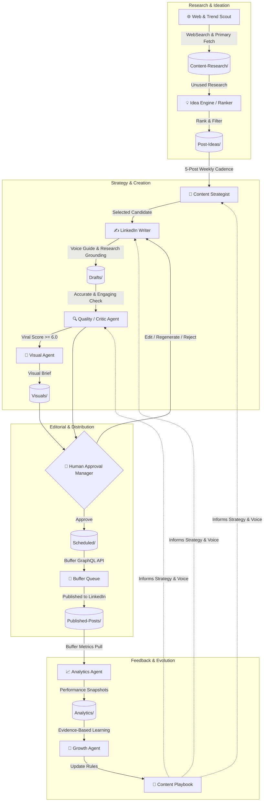

# ⚡ LinkedIn Agentic AI
### *A Human-Approved, Evidence-Gated LinkedIn Content Pipeline*

[](LICENSE)
[](https://obsidian.md/)
[](https://buffer.com/)
[](#-system-architecture)
[](#)

---

**LinkedIn Agentic AI** is an open-source content pipeline that automates the heavy lifting of LinkedIn creator workflows — continuous trend discovery, primary-source fact verification, viral-potential scoring, visual briefing, scheduling, and closed-loop analytics learning — while keeping a human in charge of every publishing decision.

**What it actually is, precisely:** ten single-responsibility [Claude Code skills](.claude/skills/) (prompt-driven instruction files, not independent processes) that a human triggers manually via slash commands, in sequence, within one session. There is no scheduler or daemon running unattended yet (see the [roadmap](#️-project-roadmap), Phase 14) — every run happens because someone typed a command. What it *is* strong on: it enforces **strict human-in-the-loop editorial gates**, **primary-source fact validation**, **anti-hallucination guardrails** (verify-or-drop sourcing, no fabricated metrics, no playbook rule written without real supporting evidence), and **pure Markdown/Obsidian long-term memory** — no vendor lock-in database. It evolves over time, using real engagement metrics to update its internal **Content Playbook**, once there's enough published-post data to do so honestly.

---

## 📑 Table of Contents

- [⚡ System Architecture](#-system-architecture)
- [✨ Core Capabilities](#-core-capabilities)
- [🛡️ Quality, Safety & Anti-Hallucination Guardrails](#️-quality-safety--anti-hallucination-guardrails)
- [📂 Repository & Vault Structure](#-repository--vault-structure)
- [🤖 Multi-Agent Skills Matrix](#-multi-agent-skills-matrix)
- [🚀 Quickstart & Setup](#-quickstart--setup)
- [🔄 End-to-End Workflow Walkthrough](#-end-to-end-workflow-walkthrough)
- [📝 Knowledge Base & Note Schemas](#-knowledge-base--note-schemas)
- [📊 Scoring Rubrics](#-scoring-rubrics)
- [⚙️ Configuration & Customization](#️-configuration--customization)
- [🗺️ Project Roadmap](#️-project-roadmap)
- [🤝 Contributing](#-contributing)
- [📄 License & Authors](#-license--authors)

---

## ⚡ System Architecture

The engine operates on a closed feedback loop across two distinct cycles:
1. **The Production Pipeline (Outer Loop):** Discovers trends, verifies primary sources, plans weekly editorial calendars, drafts posts according to human-like voice guides, scores viral potential, creates visual briefs, requires human approval, and schedules to Buffer.
2. **The Growth & Learning Loop (Inner Loop):** Ingests post-publishing analytics from Buffer, detects performance patterns, and updates a centralized `playbook.md` that guides future generations.



---

## ✨ Core Capabilities

- **🕵️ Primary-Source Grounding:** Queries live sources, fetches documentation and repository data directly, and verifies claims before saving research. Hallucinated benchmarks, invented statistics, and unsourced quotes are explicitly rejected. Fetched web content is always treated as data to extract facts from, never as instructions to follow.
- **🧠 10 Single-Responsibility Skills:** Modularity through separate, manually-triggered prompt skills (Trend Scout, Research Agent, Idea Ranker, Content Strategist, LinkedIn Writer, Visual Designer, Quality Critic, Approval Manager, Scheduler, Growth Agent) — not independent autonomous agents; one session runs them sequentially on command.
- **🗃️ Obsidian-Native Vault:** Stored entirely in clean, readable Markdown with structured YAML frontmatter and bi-directional `[[wikilinks]]`. No vendor lock-in database.
- **🛡️ 100% Human Editorial Control:** Zero automatic publishing. Every single draft must pass through an interactive terminal/IDE approval interface supporting 7 decision paths (*Approve, Edit, Regenerate, Change Hook, Change Image, Change Time, Reject*).
- **📈 Self-Improving Playbook:** Learns from real audience data. The system extracts winning hook formats, optimal word lengths, high-resonance topics, and posting times into a versioned playbook.
- **🚫 Anti-AI Slop Voice Engine:** Built-in negative constraints preventing common LLM clichés ("*In today's fast-paced world...*", "*Let's dive in!*", emoji bullet stuffing, and generic rhetorical questions).
- **📡 Modern Buffer GraphQL Integration:** Directly integrates with Buffer's current GraphQL endpoints to maintain a rolling 2-day scheduling queue.

---

## 🛡️ Quality, Safety & Anti-Hallucination Guardrails

| Requirement | Guardrail Mechanism | Enforced By |
| :--- | :--- | :--- |
| **No Hallucinated Data** | Compulsory `WebFetch` verification against primary sources (docs, repos, papers). Unverifiable claims are stripped. | `research-topic`, `critique-draft` |
| **No Unapproved Posts** | `status: approved` can *only* be set by the human approval skill. Downstream schedulers abort if unapproved. | `review-drafts`, `schedule-approved` |
| **Opinion vs. Fact Separation** | Subjective viewpoints and analyses are explicitly framed as opinions; technical specifications must cite sources. | `write-draft`, `COST-AND-SAFETY.md` |
| **Anti-Fatigue / Dedup** | Compares candidate ideas against all published and drafted notes across 90 days before generating new assets. | `generate-ideas`, `critique-draft` |
| **No Spurious Metrics** | Missing or lagging Buffer analytics are marked `null`/`unavailable`, never defaulted to 0 or estimated. | `pull-analytics` |
| **Evidence-Based Playbook** | Requires $\ge 3$ verified post samples before writing any performance rule to `playbook.md`. | `update-playbook` |

---

## 📂 Repository & Vault Structure

```text
LinkedIn_Automation/
├── .claude/
│   └── skills/                       # Executable Multi-Agent Skills
│       ├── research-topic/           # Trend discovery & deep verification
│       ├── generate-ideas/           # Candidate generation & ranking
│       ├── plan-week/                # 5-post weekly calendar distribution
│       ├── write-draft/              # Human-like post drafting
│       ├── critique-draft/           # Fact check & 8-factor viral scoring
│       ├── generate-visual/          # Visual design brief generator
│       ├── review-drafts/            # Interactive approval CLI
│       ├── schedule-approved/        # Buffer GraphQL queue manager
│       ├── pull-analytics/           # Post metrics collector
│       └── update-playbook/          # Self-improving playbook engine
│
├── Content-Research/                 # Long-Term Research Memory (15 pillars)
│   ├── AI/                           # Artificial Intelligence fundamentals
│   ├── GenAI/                        # LLMs, Diffusion, Prompting
│   ├── Machine-Learning/             # Classical ML
│   ├── Deep-Learning/                # Neural nets, architectures, training
│   ├── Mathematics/                  # Maths related to data (linear algebra, stats, calculus)
│   ├── Developer-Tools/              # Frameworks, SDKs, Dev productivity
│   ├── Data-Analytics/               # BI, analytics tooling, dashboards
│   ├── Data-Engineering/             # Pipelines, warehousing, streaming
│   ├── Problem-Solving/              # Problem-solving approaches & frameworks
│   ├── Algorithms/                   # DSA, complexity, algorithm design
│   ├── Psychology-AI/                # Human-AI interaction, cognition
│   ├── Research-Papers/              # ArXiv breakdowns & summaries
│   ├── Interview-Preparation/        # System design, coding, ML interviews
│   ├── Career/                       # Tech career growth, portfolio, leadership
│   ├── AI-Healthcare/                # AI applied to healthcare/medicine
│   └── Resources/                    # Curated lists, roadmaps, cheat sheets
│
├── Post-Ideas/                       # Scored & Ranked Idea Pipeline
├── Drafts/                           # Generated Drafts (awaiting critique/review)
├── Visuals/                          # High-context visual design briefs
├── Scheduled/                        # Approved posts in Buffer queue
├── Published-Posts/                  # Live posts on LinkedIn
├── Analytics/                        # Append-only engagement snapshots
├── Content-Learnings/                # Living Strategy Vault
│   ├── playbook.md                   # Learned rules & audience insights
│   └── voice-guide.md                # Writing tone, style & anti-patterns
│
├── _Templates/                       # Strict YAML frontmatter note templates
│   ├── Research-Note.md
│   ├── Idea-Note.md
│   ├── Draft-Note.md
│   ├── Visual-Brief-Note.md
│   ├── Scheduled-Published-Note.md
│   ├── Analytics-Record.md
│   └── Playbook-Note.md
│
├── DECISIONS.md                      # Complete architectural decision log
├── REQUIREMENTS.md                   # Product specification & vision
├── SKILLS.md                         # Capability tracking & phase log
├── LICENSE                           # MIT License
└── README.md                         # Project documentation
```

---

## 🤖 Multi-Agent Skills Matrix

All skills are implemented as Claude Code / Antigravity Agent skills located in `.claude/skills/`:

| Command / Skill | Role | Description | Trigger |
| :--- | :--- | :--- | :--- |
| `/research-topic <domain> [count]` | **Trend Scout & Researcher** | Discovers trending tech, fetches primary sources, verifies claims, outputs scored research notes. | Manual / On Demand |
| `/generate-ideas [domain] [count]` | **Idea Engine** | Scans unused research, performs deduplication, generates structured angles and hooks, outputs ranked Idea Notes. | Weekly / On Demand |
| `/plan-week [YYYY-Www]` | **Content Strategist** | Maps candidate ideas onto a 5-day Mon–Fri balanced content mix (Educational, Tool, Cheat Sheet, Opinion, Resources). | Start of Week |
| `/write-draft [idea-id]` | **LinkedIn Writer** | Converts selected ideas into high-engagement, scannable post copy grounded in research and adhering to `voice-guide.md`. | After Planning |
| `/critique-draft [draft-id]` | **Critic & Viral Gate** | Re-verifies facts, checks fatigue, scores 0–10 Viral Potential, auto-refines weak drafts, moves to `in_review`. | Post-Drafting |
| `/generate-visual [draft-id]` | **Visual Agent** | Formulates layout, color palette, visual hierarchy, and copy for accompanying diagram/infographic briefs. | Post-Critique |
| `/review-drafts [draft-id]` | **Approval Manager** | Presents draft + visual brief to the user for explicit decision (*Approve, Edit, Regenerate, Change Hook, Reject*). | User Review |
| `/schedule-approved [draft-id]` | **Scheduler Agent** | Verifies approval, validates date, pushes to Buffer via GraphQL API, manages rolling 2-day queue. | Post-Approval |
| `/pull-analytics` | **Analytics Agent** | Ingests impressions, reactions, comments, shares, and clicks from Buffer into append-only Markdown tables. | Daily / Weekly |
| `/update-playbook` | **Growth Agent** | Compares high vs. low performing posts, discovers statistical patterns, and updates `Content-Learnings/playbook.md`. | Weekly / Monthly |

---

## 🚀 Quickstart & Setup

### 1. Clone & Open Workspace
```bash
git clone https://github.com/priyanshu-arya/LinkedIn_Automation.git
cd LinkedIn_Automation
```

### 2. Environment Configuration
Create a `.env` file in the root directory:
```env
# Buffer GraphQL API Credentials
BUFFER_ACCESS_TOKEN=your_buffer_access_token_here
BUFFER_CHANNEL_ID=your_linkedin_channel_id_here

# Optional: Push Notification webhooks
NOTIFICATION_WEBHOOK_URL=https://your-webhook-endpoint.com
```

> **How to obtain Buffer credentials:**
> 1. Head to [Buffer Developer Portal](https://buffer.com/developers).
> 2. Create an Access Token.
> 3. Use `/schedule-approved` or Buffer's GraphQL Explorer (`query { account { organizations { channels { id name service } } } }`) to retrieve your target LinkedIn channel ID.

### 3. Open in Obsidian (Optional but Recommended)
Open the `LinkedIn_Automation` directory as an Obsidian Vault to enjoy graphical relationship visualizers, backlink panels, and Kanban-style pipeline tracking.

---

## 🔄 End-to-End Workflow Walkthrough

Follow this standard weekly lifecycle:

```bash
# Step 1: Discover & verify 3 topics in Developer Tools
/research-topic Developer-Tools 3

# Step 2: Generate ranked content ideas from verified research
/generate-ideas Developer-Tools 5

# Step 3: Plan the Mon-Fri schedule for the upcoming week
/plan-week 2026-W38

# Step 4: Write draft for a selected idea
/write-draft 2026-09-16--crewai-crews-vs-flows

# Step 5: Critique accuracy & evaluate viral potential score
/critique-draft 2026-09-16--crewai-crews-vs-flows

# Step 6: Generate supporting infographic / visual brief
/generate-visual 2026-09-16--crewai-crews-vs-flows

# Step 7: Review draft and approve
/review-drafts 2026-09-16--crewai-crews-vs-flows

# Step 8: Push approved post to Buffer queue
/schedule-approved 2026-09-16--crewai-crews-vs-flows

# Step 9: Pull performance analytics (run post-publishing)
/pull-analytics

# Step 10: Update the strategy playbook based on audience data
/update-playbook
```

---

## 📝 Knowledge Base & Note Schemas

Every asset in the vault follows a deterministic schema. All cross-note links use dual-indexing: plain string IDs in YAML for machine parsing, and `[[wikilinks]]` in the markdown body for Obsidian graphs.

### Example Note Types

```yaml
# 1. Research Note (Content-Research/.../*.md)
---
id: 2026-09-09--crewai-multi-agent-orchestration
type: research
category: Developer-Tools
trend_score: 8.5
status: used # new | used | archived
sources:
  - title: CrewAI Official Documentation
    url: https://docs.crewai.com
    type: official-docs
    confidence: high
---
```

```yaml
# 2. Idea Note (Post-Ideas/*.md)
---
id: 2026-09-09--crewai-crews-vs-flows
type: idea
category: Developer-Tools
rank_score: 8.0
status: drafted # candidate | selected | drafted | rejected
research_ids:
  - 2026-09-09--crewai-multi-agent-orchestration
---
```

```yaml
# 3. Draft Note (Drafts/*.md)
---
id: 2026-09-16--crewai-crews-vs-flows
type: draft
category: Developer-Tools
status: approved # drafted | in_review | approved | rejected
viral_potential_score: 7.25
char_count: 1451
target_date: 2026-09-16
preferred_time: "08:30"
---
```

---

## 📊 Scoring Rubrics

### Research Scoring (0–10 Rubric)
Every researched topic is evaluated on 7 weighted criteria:
1. **Trend Velocity:** Is search and discussion momentum accelerating?
2. **Relevance:** Does it directly impact engineers, data scientists, and technical leaders?
3. **Freshness:** Is there a recent release, milestone, or discovery?
4. **Authority:** Can assertions be verified with primary sources?
5. **Engagement Potential:** Does it spark professional discussion or debate?
6. **Originality:** Can we offer a novel angle rather than repeating common commentary?
7. **Educational Value:** Will the reader learn a concrete, actionable concept?

### Viral Potential Score (Pre-Publishing Quality Gate)
The `/critique-draft` agent scores drafts across 8 dimensions. Drafts scoring **< 6.0/10** are automatically refined before human presentation:
- **Hook Strength (0–10):** Stops the feed scroll in the first 2 lines; avoids throat-clearing.
- **Scannability (0–10):** Short paragraphs, white space, clean list formatting.
- **Novelty / Insight (0–10):** Delivers fresh insights beyond basic regurgitation.
- **Discussion Catalysis (0–10):** Compelling, non-generic CTA that invites practitioner thoughts.
- **Technical Accuracy (0–10):** Flawless consistency with linked primary research.
- **Emotional / Professional Resonance (0–10):** Addresses real workplace challenges and curiosity.
- **Visual Alignment (0–10):** Visual brief complements rather than duplicates the text.
- **Historical Playbook Alignment (0–10):** Complies with proven rules in `playbook.md`.

---

## ⚙️ Configuration & Customization

### Adapting Personal Voice
Edit [Content-Learnings/voice-guide.md](file:///Volumes/Working/LinkedIn%20Agentic%20AI/Content-Learnings/voice-guide.md) to customize:
- **Tone Boundaries:** Set preferred formality, technical depth, and cadence.
- **Banned Phrases:** Expand the anti-AI cliché list.
- **Formatting Rules:** Configure standard post length (e.g., 1,200–1,600 characters) and hashtag limits (3–5 tags).

### Modifying Topic Domains
Add or remove research categories by creating directories under `Content-Research/` and updating the domain list in `REQUIREMENTS.md`.

### Validating the Vault
Run `python3 scripts/validate_vault.py` to check every note in `Content-Research/`, `Post-Ideas/`, `Drafts/`, `Visuals/`, `Scheduled/`, and `Analytics/` against its template's required frontmatter fields. Flags missing/empty required fields, malformed `id`/date formats, and placeholder notes that leaked a real (non-`placeholder`) status. No dependencies beyond Python 3's standard library. Not wired into a git hook yet — run it manually after bulk edits or before trusting a large batch of new notes.

---

## 🗺️ Project Roadmap

- [x] **Phase 1:** Obsidian Knowledge Vault Schema & Templates
- [x] **Phase 2:** Trend Scout & Fact-Grounded Research Pipeline
- [x] **Phase 3:** Idea Generation & Multi-Factor Ranking Engine
- [x] **Phase 4:** Content Strategy Calendar & Voice-Grounded Post Writer
- [x] **Phase 5:** Critic Agent & Viral Potential Scoring Gate
- [x] **Phase 6:** Visual Design & Infographic Brief Generator
- [x] **Phase 7:** Interactive Human Approval CLI
- [x] **Phase 8:** Buffer GraphQL Scheduler & Queue Manager — *verified against a real, live Buffer account on 2026-09-09; one real API-shape correction made and documented*
- [~] **Phase 9:** Analytics Ingestion & Performance Tracking — *built against Buffer's documented API shape, not yet exercised against a live account*
- [x] **Phase 10:** Closed-Loop Growth Agent & Content Playbook Evolution
- [x] **Phase 11:** Proactive Event Notifications (Queue depth, viral posts)
- [x] **Phase 12:** Cost & Safety Hardening Audit (`COST-AND-SAFETY.md`)
- [ ] **Phase 13:** Multi-Format Derivative Content Engine (Carousels, PDF Slidedecks, X/Threads, Substack Newsletters)
- [ ] **Phase 14:** Automated Cron / Daemon Mode for Headless Research & Queue Monitoring

---

## 🤝 Contributing

Contributions are welcome! Whether you are adding new research source providers (arXiv, GitHub Trending, HackerNews), refining agent prompts, or improving analytical models:

1. **Fork the Repository**
2. **Create a Feature Branch:** `git checkout -b feature/amazing-feature`
3. **Commit Your Changes:** `git commit -m "feat: add arxiv research provider"`
4. **Push to the Branch:** `git push origin feature/amazing-feature`
5. **Open a Pull Request**

Please review [DECISIONS.md](file:///Volumes/Working/LinkedIn%20Agentic%20AI/DECISIONS.md) to understand existing architectural choices before submitting substantial changes.

---

## 📄 License & Authors

Distributed under the **MIT License**. See [LICENSE](file:///Volumes/Working/LinkedIn%20Agentic%20AI/LICENSE) for more details.

**Author:** [Priyanshu Arya](https://github.com/priyanshu-arya)

*Crafted with precision for technical creators, engineers, and AI researchers.*
